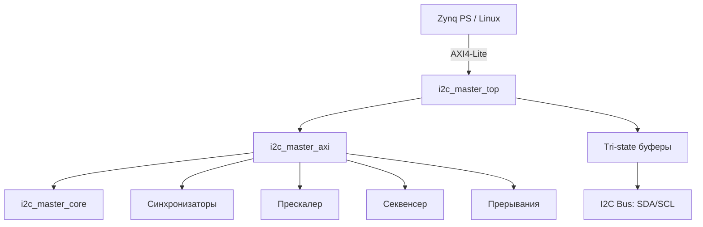

# I2C Master Controller

Production-ready I2C мастер-контроллер с интерфейсом AXI4-Lite для интеграции в FPGA-часть Xilinx Zynq SoC.
Включает модуль пакетной записи (`i2c_burst_writer`) для эффективной передачи длинных последовательностей байт (страницы EEPROM, фреймбуфер дисплея и т.д.).

## Возможности

- Полная поддержка I2C Master: START, STOP, RESTART, 7-bit адресация
- Запись и чтение байтов с ACK/NACK обработкой
- Clock stretching (ожидание slave)
- Обнаружение потери арбитража (Arbitration Lost)
- Настраиваемая частота SCL через прескалер (Standard / Fast / Fast Mode Plus)
- AXI4-Lite slave интерфейс (7 регистров)
- Прерывания: завершение транзакции (DONE) и потеря арбитража (AL)
- 2-stage синхронизаторы на входах SDA/SCL
- Составные команды (STA+WR, RD+NACK+STO) через секвенсер
- **Пакетная запись** (`i2c_burst_writer`): автоматическая передача N байт одной командой
- **Аппаратные демо-проекты** для Cyclone IV: EEPROM тест и SSD1306 OLED с анимацией

## Архитектура



## Структура проекта

```
I2C_Master_Controller/
├── rtl/
│   ├── i2c_master_core.v        # Низкоуровневое I2C ядро (FSM)
│   ├── i2c_master_axi.v         # AXI4-Lite обёртка (регистры, прескалер, прерывания)
│   ├── i2c_master_top.v         # Top-level с tri-state буферами
│   └── i2c_burst_writer.v      # Модуль пакетной I2C записи (START+addr+N bytes+STOP)
├── tb/
│   ├── i2c_slave_model.sv       # Модель I2C slave (EEPROM 256 байт)
│   ├── axi_lite_master_bfm.sv   # AXI4-Lite master BFM
│   └── i2c_master_tb.sv         # Основной тестбенч (10 сценариев)
├── driver/
│   ├── i2c-zynq-master.c        # Linux I2C adapter driver
│   ├── Makefile                  # Out-of-tree сборка модуля
│   ├── Kconfig                   # Для in-tree интеграции
│   ├── custom,i2c-master.yaml   # DT binding документация
│   └── zynq-i2c-master-overlay.dts # Пример Device Tree overlay
├── quartus/                     # Quartus-проект: тест EEPROM 24LC04 на Cyclone IV
│   └── src/                     # RTL (i2c_test_top, i2c_test_ctrl, seg_scan, ax_debounce)
├── quartus_ssd1306/             # Quartus-проект: тест SSD1306 OLED на Cyclone IV
│   ├── src/
│   │   ├── ssd1306_test_top.v   # Top-level (2 кнопки, LED, 7-сег)
│   │   ├── ssd1306_ctrl.v       # Контроллер SSD1306 (init + static + animation)
│   │   ├── seg_scan.v           # 7-сегментный сканер
│   │   └── ax_debounce.v        # Антидребезг кнопок
│   ├── ssd1306_test.qpf         # Quartus project
│   ├── ssd1306_test_top.qsf     # Настройки и пины (ALINX AX301)
│   ├── ssd1306_test_top.sdc     # Тайминг-ограничения
│   └── README.md
├── sim/
│   └── questa/                  # Скрипты Questa / ModelSim
│       ├── compile.do           # Компиляция RTL + TB
│       ├── run_batch.do         # Batch-симуляция
│       ├── run_gui.do           # GUI-симуляция с волнами
│       └── wave.do              # Конфигурация Waveform Viewer
├── doc/
│   ├── DESIGN.md                 # Архитектура и FSM
│   ├── REGISTERS.md              # Карта регистров
│   ├── TESTPLAN.md               # План тестирования
│   ├── INTEGRATION.md            # Интеграция в Zynq
│   ├── DRIVER.md                 # Документация Linux-драйвера
│   ├── GUIDE_I2C_MASTER_CORE.md # Подробный гайд по проектированию ядра
│   ├── GUIDE_TESTING.md         # Руководство по тестированию (8 сценариев)
│   ├── GUIDE_TESTING_CORE.md   # Руководство по тестированию ядра напрямую
│   └── GUIDE_SSD1306_PROJECT.md # Подробный гайд по проекту SSD1306 OLED
├── Makefile
├── .gitignore
└── README.md
```

## Быстрый старт

### Предварительные требования

- [Icarus Verilog](http://iverilog.icarus.com/) >= 12.0
- [Verilator](https://www.veripool.org/verilator/) >= 5.0 (для lint)
- [Questa / ModelSim](https://eda.sw.siemens.com/en-US/ic/questa/) (опционально)

### Сборка и запуск тестов (Icarus Verilog)

```bash
make sim        # Компиляция + симуляция (iverilog + vvp)
make lint       # Lint-проверка RTL через Verilator
make wave       # Генерация VCD для просмотра в GTKWave
make clean      # Очистка всех артефактов
```

### Симуляция в Questa / ModelSim

```bash
make questa       # Batch-режим (без GUI) — компиляция + прогон всех тестов
make questa-gui   # GUI-режим — с автоматической загрузкой wave.do
make questa-clean # Очистка артефактов Questa
```

Скрипты находятся в `sim/questa/`:

| Файл | Назначение |
|------|------------|
| `compile.do` | Компиляция RTL + TB в библиотеку `work` |
| `run_batch.do` | Batch-симуляция (compile → run → quit) |
| `run_gui.do` | GUI-симуляция (compile → load waves → run) |
| `wave.do` | Конфигурация Waveform Viewer: 8 групп сигналов |

Группы сигналов в `wave.do`:

- **System** — clk, rst_n, irq
- **I2C Bus** — SDA, SCL
- **AXI Write** / **AXI Read** — все каналы AXI4-Lite
- **Core FSM** — state, phase, bit_cnt, shift-регистры
- **Core I/O** — cmd_valid, cmd, din, dout, ready, rx_ack, scl/sda_oen
- **Slave Model** — FSM slave-модели, shift-регистр, mem_ptr
- **AXI Regs** — ctrl, prescale, tx_data, isr, tip
- **Sequencer** — seq_state, core_cmd, sub_cmd_sent

### Результат

```
=== TEST 0: Register read-back ===
  PASS: PRESCALE read-back OK
=== TEST 1: Single byte write + read-back ===
  PASS: read 0xa5 == expected 0xA5
...
  TEST SUMMARY:  PASS=10  FAIL=0
All tests PASSED
```

## Карта регистров (кратко)

| Смещение | Имя | Доступ | Описание |
|----------|-----|--------|----------|
| 0x00 | CTRL | R/W | {IEN, EN} |
| 0x04 | STATUS | R | {AL, BUSY, RXACK, TIP} |
| 0x08 | CMD | W | {NACK, WR, RD, STO, STA} |
| 0x0C | TX_DATA | R/W | Данные для передачи |
| 0x10 | RX_DATA | R | Принятые данные |
| 0x14 | PRESCALE | R/W | SCL = clk / (4×(PRESCALE+1)) |
| 0x18 | ISR | R/W1C | {AL_IRQ, DONE_IRQ} |

Подробнее: [doc/REGISTERS.md](doc/REGISTERS.md)

## Аппаратные демо-проекты (Cyclone IV)

Оба проекта предназначены для платы **ALINX AX301** (EP4CE6F17C8, 50 МГц).

### EEPROM 24LC04 (`quartus/`)

Тест записи/чтения I2C EEPROM по нажатию кнопки. Результат на светодиодах и 7-сегментном дисплее.

### SSD1306 OLED (`quartus_ssd1306/`)

Два режима работы:

| Кнопка | Пин | Функция |
|--------|-----|---------|
| KEY2 | M15 | Статическая тестовая картинка (4 квадранта с рамкой) |
| KEY3 | M16 | Анимация «прожектор» — полоса света скользит по экрану (повторное нажатие — стоп) |

Анимация генерируется аппаратно со скоростью ~10 FPS (ограничена пропускной способностью I2C 100 кГц). Светодиод LED[3] индицирует активную анимацию.

Подробнее: [quartus_ssd1306/README.md](quartus_ssd1306/README.md)

## Linux-драйвер

В каталоге `driver/` — полноценный Linux I2C adapter driver (`i2c-zynq-master`):

```bash
cd driver/
make KERNEL_SRC=/path/to/linux-xlnx ARCH=arm CROSS_COMPILE=arm-linux-gnueabihf-
```

После загрузки модуля контроллер становится доступен через стандартные интерфейсы:

```bash
i2cdetect -y 0       # Сканирование шины
i2cget -y 0 0x50 0   # Чтение из EEPROM
```

Подробнее: [doc/DRIVER.md](doc/DRIVER.md)

## Интеграция в Vivado / Zynq

Контроллер подключается к PS через AXI Interconnect. Прерывание `irq_o` — к GIC через `IRQ_F2P`.

Подробнее: [doc/INTEGRATION.md](doc/INTEGRATION.md)

## Документация

| Документ | Описание |
|----------|----------|
| [DESIGN.md](doc/DESIGN.md) | Архитектура, FSM-диаграммы, проектные решения |
| [REGISTERS.md](doc/REGISTERS.md) | Полная карта регистров с битовыми полями |
| [TESTPLAN.md](doc/TESTPLAN.md) | Тестовые сценарии и план верификации |
| [INTEGRATION.md](doc/INTEGRATION.md) | Интеграция в Zynq, Device Tree, Linux-драйвер |
| [DRIVER.md](doc/DRIVER.md) | Linux I2C adapter driver: сборка, DT, использование |
| [GUIDE_I2C_MASTER_CORE.md](doc/GUIDE_I2C_MASTER_CORE.md) | Пошаговый гайд по проектированию I2C ядра |
| [GUIDE_TESTING.md](doc/GUIDE_TESTING.md) | Подробное руководство по тестированию (8 сценариев) |
| [GUIDE_TESTING_CORE.md](doc/GUIDE_TESTING_CORE.md) | Тестирование ядра i2c_master_core напрямую (без AXI) |
| [GUIDE_SSD1306_PROJECT.md](doc/GUIDE_SSD1306_PROJECT.md) | Подробный гайд по проекту SSD1306 OLED |
| [EEPROM test README](quartus/README.md) | Тест EEPROM 24LC04 на Cyclone IV |
| [SSD1306 test README](quartus_ssd1306/README.md) | Тест SSD1306 OLED + анимация на Cyclone IV |

## Лицензия

MIT
