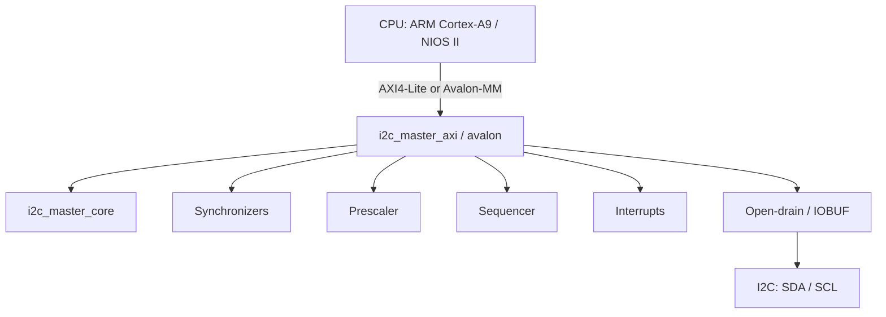

# I2C Master Controller

**English** · [Русский](README-RU.md)

Production-ready I2C master controller for FPGAs with two bus-interface flavors:

- **AXI4-Lite** — Xilinx Zynq-7000 (PS + PL), **ZYNQ MINI Rev B** board, OLED over I²C in the PL
- **Avalon-MM** — Intel Cyclone IV / NIOS II (demo on ALINX AX301)

The `i2c_master_core` is identical across both; only the bus wrapper changes (`i2c_master_axi` / `i2c_master_avalon`). The repo also ships a burst-write module `i2c_burst_writer` (long byte sequences — EEPROM, display framebuffer, etc.).

## Where to start

| Goal | First step | Main document |
|------|------------|---------------|
| Understand the RTL and run tests without Vivado | `make sim-axi` | [GUIDE_TESTING.md](doc/GUIDE_TESTING.md), [TESTPLAN.md](doc/TESTPLAN.md) |
| Build the Vivado/Vitis project for Zynq from scratch | follow the guide step by step | **[GUIDE_VIVADO_VITIS_FROM_SCRATCH.md](doc/GUIDE_VIVADO_VITIS_FROM_SCRATCH.md)** |
| Automated bitstream + ELF build | `make vivado-build` | [GUIDE_PS_PL_BUILD.md](doc/GUIDE_PS_PL_BUILD.md) |
| Linux + console on the OLED (after Vivado §18) | [GUIDE_LINUX_ZYNQ_MINI_OLED.md](doc/GUIDE_LINUX_ZYNQ_MINI_OLED.md) | FSBL, Buildroot from scratch (DTS/driver by hand), BOOT.BIN, fbcon |
| Buildroot (short make recipe) | `make buildroot-init` | [GUIDE_BUILDROOT.md](doc/GUIDE_BUILDROOT.md) |
| Cyclone IV demos (EEPROM / OLED) | open `quartus/*.qpf` | [quartus/README.md](quartus/README.md), [GUIDE_SSD1306_PROJECT.md](doc/GUIDE_SSD1306_PROJECT.md) |

The full **register map** of the AXI wrapper (bits, CMD, PRESCALE, ISR) is in **§1.4** of [GUIDE_VIVADO_VITIS_FROM_SCRATCH.md](doc/GUIDE_VIVADO_VITIS_FROM_SCRATCH.md). A short summary and its link to the RTL is in [DESIGN.md](doc/DESIGN.md).

## Features

- Full I2C master support: START, STOP, RESTART, 7-bit addressing
- Byte read/write with ACK/NACK
- Clock stretching, arbitration-loss detection
- Configurable SCL frequency (Standard / Fast / Fast Mode Plus) via **PRESCALE**
- AXI4-Lite slave: 7 registers; DONE / AL interrupts
- 2-stage synchronizers on SDA/SCL; compound commands (STA+WR, RD+NACK+STO) via the sequencer
- **Burst write** (`i2c_burst_writer`)
- **Simulation:** self-checking testbench (AXI BFM + slave model), 8 scenarios TEST 0…7
- **Zynq:** Vivado Block Design, bare-metal (Vitis), Linux driver, Buildroot, userspace `oled-clock`
- **Cyclone IV:** EEPROM and SSD1306 OLED hardware demos

## Architecture



## Project layout

```
I2C_Master_Controller/
├── rtl/
│   ├── i2c_master_core.v        # I2C core (FSM) — shared
│   ├── i2c_master_axi.v         # AXI4-Lite wrapper (Zynq)
│   ├── i2c_master_top.v         # Top with inout SDA/SCL (sim / example)
│   ├── i2c_master_avalon.v      # Avalon-MM (Cyclone IV)
│   ├── i2c_master_top_c4.v
│   ├── i2c_burst_writer.v       # Burst write of N bytes
│   └── ax_debounce.v            # Debounce (shared by the Quartus projects)
├── tb/
│   ├── i2c_master_tb.sv         # AXI testbench (TEST 0…7)
│   ├── axi_lite_master_bfm.sv
│   ├── i2c_slave_model.sv
│   ├── i2c_master_c4_tb.sv      # Avalon testbench
│   ├── avalon_mm_master_bfm.sv
│   ├── i2c_core_tb.sv
│   └── i2c_test_top_tb.sv      # Quartus EEPROM shell simulation
├── vivado/                      # Zynq: Tcl build, XDC, BD
│   ├── build.tcl                # Project + BD + synth (or project only)
│   ├── create_bd.tcl            # Block Design creation
│   ├── program.tcl
│   └── pins.xdc
├── vitis/                       # Bare-metal: platform + oled_demo
│   ├── build.py
│   └── run.tcl
├── linux/                       # Linux: DTS, in-tree driver, userspace
│   ├── dts/zynq-mini-revb.dts
│   ├── drivers/i2c-master-axi/
│   └── userspace/oled-clock/
├── driver/                      # Out-of-tree i2c-zynq-master module (alt.)
├── buildroot/                   # BR2 external for ZYNQ MINI Rev B
├── boot/                        # JTAG boot (FSBL + bitstream)
├── quartus/                     # EEPROM 24LC04 on Cyclone IV
├── quartus_ssd1306/             # SSD1306 OLED on Cyclone IV
├── sim/questa/                  # Questa: compile.do, wave.do
├── doc/                         # Guides and specs (see table below)
├── Makefile
└── README.md
```

## Quick start: simulation

### Requirements

- [Icarus Verilog](http://iverilog.icarus.com/) ≥ 12.0 (`iverilog`, `vvp`)
- [Verilator](https://www.veripool.org/verilator/) ≥ 5.0 (lint)
- [Questa / ModelSim](https://eda.sw.siemens.com/en-US/ic/questa/) (optional)

### Commands

```bash
make sim-axi      # Zynq: i2c_master_axi + top + TB → sim/i2c_master_tb.vcd
make sim-c4       # Cyclone IV: Avalon variant
make sim-core     # i2c_master_core only
make sim-hw       # Quartus EEPROM test shell (i2c_test_top)
make lint-axi     # Verilator lint of the AXI stack
make clean
```

Before integrating into Vivado it's worth confirming that **`make sim-axi`** ends with `All tests PASSED` — see **§5.7** in [GUIDE_VIVADO_VITIS_FROM_SCRATCH.md](doc/GUIDE_VIVADO_VITIS_FROM_SCRATCH.md).

### Questa / ModelSim

```bash
make questa       # batch
make questa-gui   # GUI + wave.do (groups: AXI, I2C, Core FSM, Sequencer, Slave)
```

### Expected output

```
=== TEST 0: Register read-back ===
  PASS: PRESCALE read-back OK
...
  TEST SUMMARY:  PASS=10  FAIL=0
All tests PASSED
```

## Quick start: Zynq MINI Rev B

You need **Vivado** and (for the ELF) **Vitis** 2025.x, with the `XILINX_ROOT` variable set or the toolchain installed in `/tools/Xilinx`.

```bash
# Project + Block Design only (skip the long synth) — edit in the GUI
make vivado-project
make vivado-open          # vivado/proj/zynq_mini_oled.xpr

# Full bitstream + XSA build
make vivado-build
make vivado-build PART=xc7z020clg400-1   # different speedgrade if needed

make vivado-program       # JTAG
make vitis-build          # bare-metal oled_demo.elf
make vitis-run
```

Step by step "from scratch" (Add Sources, BD, XDC, Vitis, Linux) — **[GUIDE_VIVADO_VITIS_FROM_SCRATCH.md](doc/GUIDE_VIVADO_VITIS_FROM_SCRATCH.md)**. The short automated flow — **[GUIDE_PS_PL_BUILD.md](doc/GUIDE_PS_PL_BUILD.md)**.

## Register map (short)

| Offset | Name | Access | Description |
|--------|------|--------|-------------|
| 0x00 | CTRL | R/W | {IEN, EN} |
| 0x04 | STATUS | R | {AL, BUSY, RXACK, TIP} |
| 0x08 | CMD | W | {NACK, WR, RD, STO, STA} |
| 0x0C | TX_DATA | R/W | Data to transmit |
| 0x10 | RX_DATA | R | Received data |
| 0x14 | PRESCALE | R/W | SCL = clk / (4×(PRESCALE+1)) |
| 0x18 | ISR | R/W1C | {AL_IRQ, DONE_IRQ} |

Details, typical **CMD** combinations, and C examples — **§1.4** of [GUIDE_VIVADO_VITIS_FROM_SCRATCH.md](doc/GUIDE_VIVADO_VITIS_FROM_SCRATCH.md).

## Hardware demos (Cyclone IV, ALINX AX301)

### EEPROM 24LC04 — `quartus/`

Write/read an I²C EEPROM on a button press; status shown on LEDs and the 7-segment display. [quartus/README.md](quartus/README.md), [GUIDE_QUARTUS_EEPROM_TEST.md](doc/GUIDE_QUARTUS_EEPROM_TEST.md).

### SSD1306 OLED — `quartus_ssd1306/`

| Button | Function |
|--------|----------|
| KEY2 | Static test image |
| KEY3 | "Spotlight" animation (~10 FPS at 100 kHz I²C) |

[quartus_ssd1306/README.md](quartus_ssd1306/README.md), [GUIDE_SSD1306_PROJECT.md](doc/GUIDE_SSD1306_PROJECT.md).

## Linux

The full step-by-step Linux path (only after the [Vivado manual](doc/GUIDE_VIVADO_VITIS_FROM_SCRATCH.md) §18): **[GUIDE_LINUX_ZYNQ_MINI_OLED.md](doc/GUIDE_LINUX_ZYNQ_MINI_OLED.md)** — FSBL, Buildroot, `bootgen`, and the OLED console are built step by step, without `make vitis-build` / `deploy.sh`.

- **Device Tree:** `linux/dts/zynq-mini-revb.dts` — custom I²C master node in the PL, SSD1306 @ `0x3c`, `fbcon=font:MINI4x6`
- **Driver (in-tree package):** `linux/drivers/i2c-master-axi/` — `i2c_adapter`, IRQ/poll, runtime bus speed via the `bus_hz` sysfs attribute
- **Out-of-tree (alternative):** `driver/i2c-zynq-master.c` — [DRIVER.md](doc/DRIVER.md)
- **Userspace:** `linux/userspace/oled-clock/` — clock and switching between clock ↔ **system console** on `/dev/fb0` (`oled-console.sh`)
- **Buildroot:** `buildroot/` + `make buildroot-*` — [GUIDE_BUILDROOT.md](doc/GUIDE_BUILDROOT.md)

```bash
cd driver/
make KERNEL_SRC=/path/to/linux ARCH=arm CROSS_COMPILE=arm-linux-gnueabihf-
# on the target:
i2cdetect -y 0
```

## Integration

| Platform | Bus | Document |
|----------|-----|----------|
| **Zynq-7000** | AXI4-Lite → GP0, `irq_o` → IRQ_F2P | [GUIDE_VIVADO_VITIS_FROM_SCRATCH.md](doc/GUIDE_VIVADO_VITIS_FROM_SCRATCH.md), [INTEGRATION.md](doc/INTEGRATION.md) |
| **Cyclone IV + Nios** | Avalon-MM | [INTEGRATION_CYCLONE4.md](doc/INTEGRATION_CYCLONE4.md) |

## Documentation

### Zynq (Vivado, Vitis, Linux)

| Document | Description |
|----------|-------------|
| **[GUIDE_VIVADO_VITIS_FROM_SCRATCH.md](doc/GUIDE_VIVADO_VITIS_FROM_SCRATCH.md)** | Main step-by-step guide: AXI4-Lite, RTL, BD, simulation §5.7, Vitis bare-metal |
| **[GUIDE_LINUX_ZYNQ_MINI_OLED.md](doc/GUIDE_LINUX_ZYNQ_MINI_OLED.md)** | Linux after Vivado §18: FSBL, Buildroot, fbcon on the OLED (no prebuilt artifacts) |
| [GUIDE_PS_PL_BUILD.md](doc/GUIDE_PS_PL_BUILD.md) | Automated build via `make vivado-build` / `vitis-build` |
| [GUIDE_VIVADO_ZYNQ_MINI_OLED.md](doc/GUIDE_VIVADO_ZYNQ_MINI_OLED.md) | Vivado walkthrough for the board and OLED (schematic, pins) |
| [GUIDE_BUILDROOT.md](doc/GUIDE_BUILDROOT.md) | Buildroot, SD card, kernel |
| [INTEGRATION.md](doc/INTEGRATION.md) | Integration into Zynq, DT, driver |
| [DRIVER.md](doc/DRIVER.md) | Linux I2C adapter (`driver/`) |

### RTL, tests, Cyclone

| Document | Description |
|----------|-------------|
| [DESIGN.md](doc/DESIGN.md) | Architecture, FSM, register map (short) |
| [TESTPLAN.md](doc/TESTPLAN.md) | Simulation scenarios TEST 0…7 |
| [GUIDE_TESTING.md](doc/GUIDE_TESTING.md) | Testbench and BFM in detail |
| [GUIDE_TESTING_CORE.md](doc/GUIDE_TESTING_CORE.md) | Core test without the wrapper |
| [GUIDE_I2C_MASTER_CORE.md](doc/GUIDE_I2C_MASTER_CORE.md) | Core design |
| [INTEGRATION_CYCLONE4.md](doc/INTEGRATION_CYCLONE4.md) | Platform Designer / Qsys |
| [GUIDE_SSD1306_PROJECT.md](doc/GUIDE_SSD1306_PROJECT.md) | SSD1306 on Cyclone IV |
| [GUIDE_QUARTUS_EEPROM_TEST.md](doc/GUIDE_QUARTUS_EEPROM_TEST.md) | EEPROM test |
| [GUIDE_QUARTUS_BOARD_TEST.md](doc/GUIDE_QUARTUS_BOARD_TEST.md) | General guide for the AX301 board |

## License

MIT
