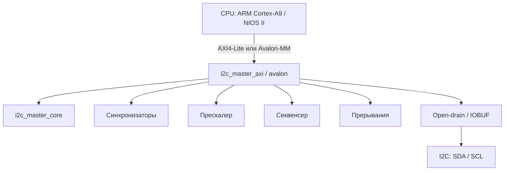

# I2C Master Controller

Production-ready I2C мастер-контроллер для FPGA с двумя вариантами шинного интерфейса:

- **AXI4-Lite** — Xilinx Zynq-7000 (PS + PL), плата **ZYNQ MINI Rev B**, OLED на I²C в PL
- **Avalon-MM** — Intel Cyclone IV / NIOS II (демо на ALINX AX301)

Общее ядро `i2c_master_core` одно и то же; меняется только шинная обёртка (`i2c_master_axi` / `i2c_master_avalon`). В репозитории также есть модуль пакетной записи `i2c_burst_writer` (длинные последовательности байт — EEPROM, фреймбуфер дисплея и т.д.).

## С чего начать

| Цель | Первый шаг | Основной документ |
|------|------------|-------------------|
| Понять RTL и прогнать тесты без Vivado | `make sim-axi` | [GUIDE_TESTING.md](doc/GUIDE_TESTING.md), [TESTPLAN.md](doc/TESTPLAN.md) |
| Собрать проект Vivado/Vitis для Zynq с нуля | читать гайд по шагам | **[GUIDE_VIVADO_VITIS_FROM_SCRATCH.md](doc/GUIDE_VIVADO_VITIS_FROM_SCRATCH.md)** |
| Автоматическая сборка bitstream + ELF | `make vivado-build` | [GUIDE_PS_PL_BUILD.md](doc/GUIDE_PS_PL_BUILD.md) |
| Linux + Buildroot на плате | `make buildroot-init` | [GUIDE_BUILDROOT.md](doc/GUIDE_BUILDROOT.md) |
| Демо на Cyclone IV (EEPROM / OLED) | открыть `quartus/*.qpf` | [quartus/README.md](quartus/README.md), [GUIDE_SSD1306_PROJECT.md](doc/GUIDE_SSD1306_PROJECT.md) |

Полная **карта регистров** AXI-обёртки (биты, CMD, PRESCALE, ISR) — в **§1.4** [GUIDE_VIVADO_VITIS_FROM_SCRATCH.md](doc/GUIDE_VIVADO_VITIS_FROM_SCRATCH.md). Краткая сводка и связь с RTL — в [DESIGN.md](doc/DESIGN.md).

## Возможности

- Полная поддержка I2C Master: START, STOP, RESTART, 7-bit адресация
- Запись и чтение байтов с ACK/NACK
- Clock stretching, обнаружение потери арбитража
- Настраиваемая частота SCL (Standard / Fast / Fast Mode Plus) через **PRESCALE**
- AXI4-Lite slave: 7 регистров; прерывания DONE / AL
- 2-stage синхронизаторы на SDA/SCL; составные команды (STA+WR, RD+NACK+STO) через секвенсер
- **Пакетная запись** (`i2c_burst_writer`)
- **Симуляция:** self-checking testbench (AXI BFM + модель slave), 8 сценариев TEST 0…7
- **Zynq:** Vivado Block Design, bare-metal (Vitis), Linux-драйвер, Buildroot, userspace `oled-clock`
- **Cyclone IV:** аппаратные демо EEPROM и SSD1306 OLED

## Архитектура



## Структура проекта

```
I2C_Master_Controller/
├── rtl/
│   ├── i2c_master_core.v        # I2C ядро (FSM) — общее
│   ├── i2c_master_axi.v         # AXI4-Lite обёртка (Zynq)
│   ├── i2c_master_top.v         # Top с inout SDA/SCL (симуляция / пример)
│   ├── i2c_master_avalon.v      # Avalon-MM (Cyclone IV)
│   ├── i2c_master_top_c4.v
│   ├── i2c_burst_writer.v       # Пакетная запись N байт
│   └── ax_debounce.v            # Антидребезг (общий для Quartus-проектов)
├── tb/
│   ├── i2c_master_tb.sv         # Тестбенч AXI (TEST 0…7)
│   ├── axi_lite_master_bfm.sv
│   ├── i2c_slave_model.sv
│   ├── i2c_master_c4_tb.sv      # Тестбенч Avalon
│   ├── avalon_mm_master_bfm.sv
│   ├── i2c_core_tb.sv
│   └── i2c_test_top_tb.sv      # Симуляция quartus EEPROM shell
├── vivado/                      # Zynq: Tcl-сборка, XDC, BD
│   ├── build.tcl                # Проект + BD + synth (или только проект)
│   ├── create_bd.tcl            # Создание Block Design
│   ├── program.tcl
│   └── pins.xdc
├── vitis/                       # Bare-metal: platform + oled_demo
│   ├── build.py
│   └── run.tcl
├── linux/                       # Linux: DTS, in-tree driver, userspace
│   ├── dts/zynq-mini-revb.dts
│   ├── drivers/i2c-master-axi/
│   └── userspace/oled-clock/
├── driver/                      # Out-of-tree модуль i2c-zynq-master (альт.)
├── buildroot/                   # BR2 external для ZYNQ MINI Rev B
├── boot/                        # JTAG boot (FSBL + bitstream)
├── quartus/                     # EEPROM 24LC04 на Cyclone IV
├── quartus_ssd1306/             # SSD1306 OLED на Cyclone IV
├── sim/questa/                  # Questa: compile.do, wave.do
├── doc/                         # Гайды и спецификации (см. таблицу ниже)
├── Makefile
└── README.md
```

## Быстрый старт: симуляция

### Требования

- [Icarus Verilog](http://iverilog.icarus.com/) ≥ 12.0 (`iverilog`, `vvp`)
- [Verilator](https://www.veripool.org/verilator/) ≥ 5.0 (lint)
- [Questa / ModelSim](https://eda.sw.siemens.com/en-US/ic/questa/) (опционально)

### Команды

```bash
make sim-axi      # Zynq: i2c_master_axi + top + TB → sim/i2c_master_tb.vcd
make sim-c4       # Cyclone IV: Avalon-вариант
make sim-core     # Только i2c_master_core
make sim-hw       # Quartus EEPROM test shell (i2c_test_top)
make lint-axi     # Verilator lint AXI-стека
make clean
```

Перед интеграцией в Vivado имеет смысл убедиться, что **`make sim-axi`** завершается с `All tests PASSED` — см. **§5.7** в [GUIDE_VIVADO_VITIS_FROM_SCRATCH.md](doc/GUIDE_VIVADO_VITIS_FROM_SCRATCH.md).

### Questa / ModelSim

```bash
make questa       # batch
make questa-gui   # GUI + wave.do (группы: AXI, I2C, Core FSM, Sequencer, Slave)
```

### Ожидаемый результат

```
=== TEST 0: Register read-back ===
  PASS: PRESCALE read-back OK
...
  TEST SUMMARY:  PASS=10  FAIL=0
All tests PASSED
```

## Быстрый старт: Zynq MINI Rev B

Нужны **Vivado** и (для ELF) **Vitis** 2025.x, переменная `XILINX_ROOT` или установка в `/tools/Xilinx`.

```bash
# Только проект + Block Design (без долгого synth) — правки в GUI
make vivado-project
make vivado-open          # vivado/proj/zynq_mini_oled.xpr

# Полная сборка bitstream + XSA
make vivado-build
make vivado-build PART=xc7z020clg400-1   # при необходимости другой speedgrade

make vivado-program       # JTAG
make vitis-build          # bare-metal oled_demo.elf
make vitis-run
```

Пошагово «с нуля» (Add Sources, BD, XDC, Vitis, Linux) — **[GUIDE_VIVADO_VITIS_FROM_SCRATCH.md](doc/GUIDE_VIVADO_VITIS_FROM_SCRATCH.md)**. Краткий автоматизированный поток — **[GUIDE_PS_PL_BUILD.md](doc/GUIDE_PS_PL_BUILD.md)**.

## Карта регистров (кратко)

| Смещение | Имя | Доступ | Описание |
|----------|-----|--------|----------|
| 0x00 | CTRL | R/W | {IEN, EN} |
| 0x04 | STATUS | R | {AL, BUSY, RXACK, TIP} |
| 0x08 | CMD | W | {NACK, WR, RD, STO, STA} |
| 0x0C | TX_DATA | R/W | Данные для передачи |
| 0x10 | RX_DATA | R | Принятые данные |
| 0x14 | PRESCALE | R/W | SCL = clk / (4×(PRESCALE+1)) |
| 0x18 | ISR | R/W1C | {AL_IRQ, DONE_IRQ} |

Подробности, типовые комбинации **CMD**, примеры на C — **§1.4** [GUIDE_VIVADO_VITIS_FROM_SCRATCH.md](doc/GUIDE_VIVADO_VITIS_FROM_SCRATCH.md).

## Аппаратные демо (Cyclone IV, ALINX AX301)

### EEPROM 24LC04 — `quartus/`

Запись/чтение I²C EEPROM по кнопке; индикация на LED и 7-сегментнике. [quartus/README.md](quartus/README.md), [GUIDE_QUARTUS_EEPROM_TEST.md](doc/GUIDE_QUARTUS_EEPROM_TEST.md).

### SSD1306 OLED — `quartus_ssd1306/`

| Кнопка | Функция |
|--------|---------|
| KEY2 | Статическая тестовая картинка |
| KEY3 | Анимация «прожектор» (~10 FPS при I²C 100 кГц) |

[quartus_ssd1306/README.md](quartus_ssd1306/README.md), [GUIDE_SSD1306_PROJECT.md](doc/GUIDE_SSD1306_PROJECT.md).

## Linux

- **Device Tree:** `linux/dts/zynq-mini-revb.dts` — узел custom I²C master в PL
- **Драйвер (in-tree пакет):** `linux/drivers/i2c-master-axi/`
- **Out-of-tree (альтернатива):** `driver/i2c-zynq-master.c` — [DRIVER.md](doc/DRIVER.md)
- **Userspace:** `linux/userspace/oled-clock/` — часы и переключение clock / fbcon на `/dev/fb0`
- **Buildroot:** `buildroot/` + `make buildroot-*` — [GUIDE_BUILDROOT.md](doc/GUIDE_BUILDROOT.md)

```bash
cd driver/
make KERNEL_SRC=/path/to/linux ARCH=arm CROSS_COMPILE=arm-linux-gnueabihf-
# на целевой системе:
i2cdetect -y 0
```

## Интеграция

| Платформа | Шина | Документ |
|-----------|------|----------|
| **Zynq-7000** | AXI4-Lite → GP0, `irq_o` → IRQ_F2P | [GUIDE_VIVADO_VITIS_FROM_SCRATCH.md](doc/GUIDE_VIVADO_VITIS_FROM_SCRATCH.md), [INTEGRATION.md](doc/INTEGRATION.md) |
| **Cyclone IV + Nios** | Avalon-MM | [INTEGRATION_CYCLONE4.md](doc/INTEGRATION_CYCLONE4.md) |

## Документация

### Zynq (Vivado, Vitis, Linux)

| Документ | Описание |
|----------|----------|
| **[GUIDE_VIVADO_VITIS_FROM_SCRATCH.md](doc/GUIDE_VIVADO_VITIS_FROM_SCRATCH.md)** | Главный пошаговый гайд: AXI4-Lite, RTL, BD, симуляция §5.7, Vitis, прошивка |
| [GUIDE_PS_PL_BUILD.md](doc/GUIDE_PS_PL_BUILD.md) | Автосборка через `make vivado-build` / `vitis-build` |
| [GUIDE_VIVADO_ZYNQ_MINI_OLED.md](doc/GUIDE_VIVADO_ZYNQ_MINI_OLED.md) | Разбор Vivado под плату и OLED (схема, пины) |
| [GUIDE_BUILDROOT.md](doc/GUIDE_BUILDROOT.md) | Buildroot, SD-карта, ядро |
| [INTEGRATION.md](doc/INTEGRATION.md) | Интеграция в Zynq, DT, драйвер |
| [DRIVER.md](doc/DRIVER.md) | Linux I2C adapter (`driver/`) |

### RTL, тесты, Cyclone

| Документ | Описание |
|----------|----------|
| [DESIGN.md](doc/DESIGN.md) | Архитектура, FSM, карта регистров (кратко) |
| [TESTPLAN.md](doc/TESTPLAN.md) | Сценарии симуляции TEST 0…7 |
| [GUIDE_TESTING.md](doc/GUIDE_TESTING.md) | Подробно про testbench и BFM |
| [GUIDE_TESTING_CORE.md](doc/GUIDE_TESTING_CORE.md) | Тест ядра без обёртки |
| [GUIDE_I2C_MASTER_CORE.md](doc/GUIDE_I2C_MASTER_CORE.md) | Проектирование ядра |
| [INTEGRATION_CYCLONE4.md](doc/INTEGRATION_CYCLONE4.md) | Platform Designer / Qsys |
| [GUIDE_SSD1306_PROJECT.md](doc/GUIDE_SSD1306_PROJECT.md) | SSD1306 на Cyclone IV |
| [GUIDE_QUARTUS_EEPROM_TEST.md](doc/GUIDE_QUARTUS_EEPROM_TEST.md) | EEPROM-тест |
| [GUIDE_QUARTUS_BOARD_TEST.md](doc/GUIDE_QUARTUS_BOARD_TEST.md) | Общий гайд по плате AX301 |

## Лицензия

MIT
