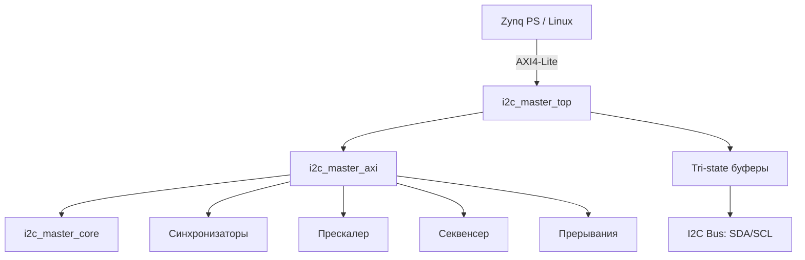

# I2C Master Controller

Production-ready I2C мастер-контроллер с интерфейсом AXI4-Lite для интеграции в FPGA-часть Xilinx Zynq SoC.

## Возможности

- Полная поддержка I2C Master: START, STOP, RESTART, 7-bit адресация
- Запись и чтение байтов с ACK/NACK обработкой
- Clock stretching (ожидание slave)
- Обнаружение потери арбитража (Arbitration Lost)
- Настраиваемая частота SCL через прескалер (Standard / Fast / Fast Mode Plus)
- AXI4-Lite slave интерфейс (7 регистров)
- Прерывания: завершение транзакции (DONE) и потеря арбитража (AL)
- 2-stage синхронизаторы на входах SDA/SCL
- Составные команды (STA+WR, RD+NACK+STO) через секвенсер

## Архитектура



## Структура проекта

```
I2C_Master_Controller/
├── rtl/
│   ├── i2c_master_core.v     # Низкоуровневое I2C ядро (FSM)
│   ├── i2c_master_axi.v      # AXI4-Lite обёртка (регистры, прескалер, прерывания)
│   └── i2c_master_top.v      # Top-level с tri-state буферами
├── tb/
│   ├── i2c_slave_model.sv    # Модель I2C slave (EEPROM 256 байт)
│   ├── axi_lite_master_bfm.sv# AXI4-Lite master BFM
│   └── i2c_master_tb.sv      # Основной тестбенч (10 сценариев)
├── sim/                       # Артефакты симуляции
├── doc/
│   ├── DESIGN.md              # Архитектура и FSM
│   ├── REGISTERS.md           # Карта регистров
│   ├── TESTPLAN.md            # План тестирования
│   └── INTEGRATION.md         # Интеграция в Zynq
├── Makefile
├── .gitignore
└── README.md
```

## Быстрый старт

### Предварительные требования

- [Icarus Verilog](http://iverilog.icarus.com/) >= 12.0
- [Verilator](https://www.veripool.org/verilator/) >= 5.0 (для lint)

### Сборка и запуск тестов

```bash
make sim        # Компиляция + симуляция
make lint       # Lint-проверка RTL через Verilator
make wave       # Генерация VCD для просмотра в GTKWave
make clean      # Очистка артефактов
```

### Результат

```
=== TEST 0: Register read-back ===
  PASS: PRESCALE read-back OK
=== TEST 1: Single byte write + read-back ===
  PASS: read 0xa5 == expected 0xA5
...
  TEST SUMMARY:  PASS=10  FAIL=0
All tests PASSED
```

## Карта регистров (кратко)

| Смещение | Имя | Доступ | Описание |
|----------|-----|--------|----------|
| 0x00 | CTRL | R/W | {IEN, EN} |
| 0x04 | STATUS | R | {AL, BUSY, RXACK, TIP} |
| 0x08 | CMD | W | {NACK, WR, RD, STO, STA} |
| 0x0C | TX_DATA | R/W | Данные для передачи |
| 0x10 | RX_DATA | R | Принятые данные |
| 0x14 | PRESCALE | R/W | SCL = clk / (4×(PRESCALE+1)) |
| 0x18 | ISR | R/W1C | {AL_IRQ, DONE_IRQ} |

Подробнее: [doc/REGISTERS.md](doc/REGISTERS.md)

## Интеграция в Vivado / Zynq

Контроллер подключается к PS через AXI Interconnect. Прерывание `irq_o` — к GIC через `IRQ_F2P`.

Подробнее: [doc/INTEGRATION.md](doc/INTEGRATION.md)

## Документация

| Документ | Описание |
|----------|----------|
| [DESIGN.md](doc/DESIGN.md) | Архитектура, FSM-диаграммы, проектные решения |
| [REGISTERS.md](doc/REGISTERS.md) | Полная карта регистров с битовыми полями |
| [TESTPLAN.md](doc/TESTPLAN.md) | Тестовые сценарии и план верификации |
| [INTEGRATION.md](doc/INTEGRATION.md) | Интеграция в Zynq, Device Tree, Linux-драйвер |

## Лицензия

MIT
