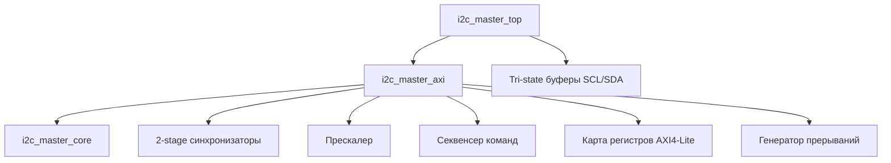
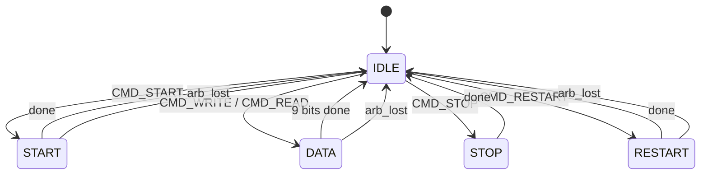

# Архитектура I2C Master Controller

## Обзор

I2C Master Controller — production-ready IP-ядро для интеграции в FPGA-часть (PL) Xilinx Zynq SoC. Предоставляет программный доступ к шине I2C через интерфейс AXI4-Lite, совместимый с адресным пространством ARM-процессора (PS).

## Иерархия модулей



### `i2c_master_top` (rtl/i2c_master_top.v)

Top-level обёртка. Содержит tri-state буферы для SDA и SCL (`inout`). Для Vivado block design может быть заменена прямым подключением `i2c_master_axi` к IOBUF-примитивам.

### `i2c_master_axi` (rtl/i2c_master_axi.v)

AXI4-Lite slave обёртка, содержащая:

- **Карту регистров** — 7 регистров (CTRL, STATUS, CMD, TX_DATA, RX_DATA, PRESCALE, ISR)
- **Прескалер** — генерация clock-enable для ядра: `SCL_freq = clk_freq / (4 × (PRESCALE + 1))`
- **Секвенсер команд** — трансляция составных команд (STA+WR, RD+NACK+STO) в атомарные команды ядра
- **2-stage синхронизаторы** — для входных сигналов SDA и SCL (защита от метастабильности)
- **Генератор прерываний** — флаги DONE (транзакция завершена) и AL (потеря арбитража)

### `i2c_master_core` (rtl/i2c_master_core.v)

Низкоуровневое ядро I2C: FSM на уровне битов/байтов.

## Конечный автомат ядра (i2c_master_core)

### Состояния



| Состояние | Описание |
|-----------|----------|
| `ST_IDLE` | Ожидание команды. SCL/SDA удерживаются если busy, отпускаются если нет |
| `ST_START` | Генерация START-условия: SDA 1→0 при SCL=1 |
| `ST_DATA` | Передача/приём 9 бит (8 данных + 1 ACK/NACK). 4 фазы на бит |
| `ST_STOP` | Генерация STOP-условия: SDA 0→1 при SCL=1 |
| `ST_RESTART` | Повторный START: SDA→1, SCL→1, затем SDA→0 при SCL=1 |

### Фазы бита (4-фазный протокол)

Каждый бит данных проходит через 4 фазы, тактируемые прескалером:

```
         Phase 0   Phase 1   Phase 2   Phase 3
SCL:     ____LOW   ‾‾‾HIGH   ‾‾‾HIGH   ____LOW
SDA:     SETUP     SAMPLE    HOLD      (held)
```

| Фаза | SCL | SDA (WRITE) | SDA (READ) |
|------|-----|-------------|------------|
| 0 | LOW (drive) | Setup data bit | Release (slave drives) |
| 1 | HIGH (release) | Hold | Sample sda_i (if SCL high) |
| 2 | HIGH (hold) | Hold | Hold |
| 3 | LOW (drive) | Held as-is | Held as-is |

**Важно:** SDA не меняется одновременно с SCL в фазе 3, чтобы не создавать ложные START/STOP условия на шине.

### Clock Stretching

Поддержка clock stretching в фазе 1: ядро проверяет `scl_i` (синхронизированный вход) и ждёт, пока SCL реально станет HIGH. Slave может удерживать SCL в LOW сколь угодно долго.

### Потеря арбитража (Arbitration Lost)

Обнаруживается когда мастер отпускает SDA (ожидает HIGH), но читает LOW при SCL=HIGH. Проверяется:
- В `ST_DATA` фаза 1 (при передаче данных)
- В `ST_START` / `ST_RESTART` при установке SDA=HIGH

При потере арбитража: FSM немедленно переходит в `IDLE`, все линии отпускаются, флаг `arb_lost_o` взводится (sticky, сбрасывается через `arb_lost_clear_i`).

### Open-Drain выходы

I2C — шина с открытым стоком. Логика управления:
- `oen = 1` → линия отпущена (high-Z, подтягивается внешним pull-up к VCC)
- `oen = 0` → линия притянута к GND

## Секвенсер команд

Регистр CMD позволяет задавать составные операции одной записью:

| Бит | Имя | Описание |
|-----|-----|----------|
| 0 | STA | Генерировать START (или RESTART если busy) |
| 1 | STO | Генерировать STOP после передачи |
| 2 | RD | Прочитать байт |
| 3 | WR | Записать байт из TX_DATA |
| 4 | NACK | Отправить NACK вместо ACK при чтении |

Секвенсер разбивает составную команду на последовательность атомарных:

```
CMD = STA + WR   →   [START/RESTART] → [WRITE byte]
CMD = RD + NACK + STO   →   [READ byte with NACK] → [STOP]
CMD = STA + WR + STO   →   [START] → [WRITE byte] → [STOP]
```

## Прескалер

Формула частоты SCL:

```
SCL_freq = clk_freq / (4 × (PRESCALE + 1))
```

Примеры при `clk_freq = 100 MHz`:

| PRESCALE | SCL_freq |
|----------|----------|
| 249 | 100 кГц (Standard Mode) |
| 24 | 1 МГц (Fast Mode Plus) |
| 4 | 5 МГц (симуляция) |

## Отслеживание состояния шины

Модуль отслеживает START и STOP условия на шине для определения busy-состояния:
- `busy_o = 1` после обнаружения START
- `busy_o = 0` после обнаружения STOP

Это используется для:
- Автоматической генерации RESTART вместо START если шина busy
- Удержания SCL/SDA в LOW между командами (предотвращение ложных STOP)
- Отпускания шины только после реального STOP или при power-up
