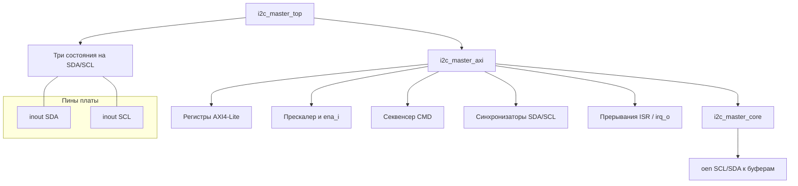
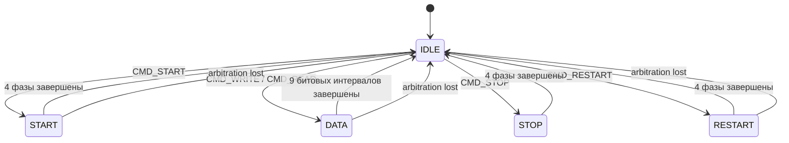

# Архитектура I2C Master Controller

## Для кого этот документ

Предполагается, что читатель знаком с **Verilog** на уровне: `module` / `always` / сброс, понимает, что такое **конечный автомат (FSM)** и **три состояния** на выводе (`inout`, high-Z). Здесь описано, **как устроен этот репозиторий**: какие файлы за что отвечают, как данные идут от шины до линий SDA/SCL, и как связаны тайминг, команды и статусы.

## Что это за проект

**I2C Master Controller** — набор **синтезируемых RTL-модулей** (Verilog), реализующих мастер I2C с программным интерфейсом. Ядро шины вынесено в отдельный модуль `i2c_master_core`; к нему подключаются обёртки под разные шины доступа процессора:

| Модуль | Файл | Назначение |
|--------|------|------------|
| `i2c_master_axi` | `rtl/i2c_master_axi.v` | Slave **AXI4-Lite** (типично Xilinx Zynq / MicroBlaze и др.) |
| `i2c_master_avalon` | `rtl/i2c_master_avalon.v` | Slave **Avalon-MM** (Intel/Altera, Nios II, Platform Designer) |
| `i2c_master_top` | `rtl/i2c_master_top.v` | Обёртка: AXI + **двунаправленные** пины SDA/SCL |
| `i2c_master_top_c4` | `rtl/i2c_master_top_c4.v` | Обёртка: Avalon + `inout` (вариант под Cyclone IV и т.п.) |
| `i2c_burst_writer` | `rtl/i2c_burst_writer.v` | **Вспомогательный** автомат многобайтовой записи **напрямую к ядру** (не через AXI) |

*Пояснение:* в FPGA «мастер I2C» почти никогда не подключают к процессору голым Verilog — нужна **карта регистров** и протокол шины (AXI/Avalon). Поэтому иерархия «обёртка → ядро» — стандартный приём: одно ядро, несколько способов доступа к нему.

## Иерархия (типичный случай AXI)

- **`i2c_master_top`** не содержит логики I2C: только **соединяет** выходы ядра с `inout` через условное присваивание (имитация открытого стока на уровне RTL-симуляции).
- В **Vivado** часто удобнее не использовать `inout` в RTL, а подключить **`i2c_master_axi`** к примитивам **IOBUF** — комментарии в `i2c_master_top.v` это прямо допускают.

## Физический уровень: открытый сток и сигналы `*_padoen_o`

I2C — **открытый сток** (open-drain): линия в «1» достигается **внешним подтягивающим резистором**, а устройство либо **отпускает** линию, либо **тянет к земле**.

В этом проекте на выход к буферу идут три сигнала на линию (пример SCL):

- `scl_pad_o` — в коде **всегда 0**; «единица» на шине не задаётся активным драйвом, а **отсутствием** драйва.
- `scl_padoen_o` — **разрешение выхода** в смысле «отпустить линию»: **`1` = high-Z (линия подтянута вверх)**, **`0` = выход ведёт низкий уровень** (через `scl_pad_o == 0`).

В `i2c_master_top` это стыкуется с `inout` так: при `padoen == 1` к пину подставляется `z` (в симуляции), иначе — принудительный `0`.

*Замечание для начинающих:* в даташитах иногда встречается обратная полярность «output enable»; здесь ориентируйтесь **только на комментарии в RTL** (`1=tristate, 0=drive low`).

## `i2c_master_axi`: что внутри обёртки

Модуль `rtl/i2c_master_axi.v` объединяет:

1. **Двухступенчатые синхронизаторы** для `scl_pad_i` и `sda_pad_i` — классический приём снижения **метастабильности**, когда асинхронный внешний сигнал впервые попадает в тактовый домен `s_axi_aclk`.
2. **Прескалер** — счётчик, который раз в `(PRESCALE + 1)` тактов системной частоты выдаёт **один такт** `ena_i` для ядра. Одна **четверть периода SCL** = один импульс `ena_i`, полный период SCL = **четыре** такта `ena_i`:

   \[
   f_{\mathrm{SCL}} = \frac{f_{\mathrm{clk}}}{4 \cdot (PRESCALE + 1)}
   \]

3. **Карту регистров** AXI4-Lite (32-битные слова, шаг адреса 4 байта).
4. **Секвенсер** — по записи в регистр `CMD` разворачивает **составную** команду в цепочку **атомарных** команд для `i2c_master_core` (`START`, `WRITE`, `READ`, `STOP`, `RESTART`).
5. **Логику прерывания** — флаги в `ISR`, линия `irq_o` при включённом `IEN` в `CTRL`.

Параметр **`DEFAULT_PRESCALE`** (например `249` при 100 МГц → ~100 кГц SCL) задаёт начальное значение регистра после сброса.

## Карта регистров (как в заголовке `i2c_master_axi.v`)

Адреса — **младшие биты** шины AXI; в коде заданы константы `5'h00` … `5'h18`.

| Смещение | Имя | Доступ | Смысл (используемые биты) |
|----------|-----|--------|---------------------------|
| `0x00` | CTRL | R/W | `[1:0] = {IEN, EN}` — включение ядра и разрешение IRQ |
| `0x04` | STATUS | R | `[3:0] = {AL, BUSY, RXACK, TIP}` |
| `0x08` | CMD | W | `[4:0] = {NACK, WR, RD, STO, STA}` — см. ниже |
| `0x0C` | TX_DATA | R/W | `[7:0]` — байт для записи на шину |
| `0x10` | RX_DATA | R | `[7:0]` — последний принятый байт из ядра |
| `0x14` | PRESCALE | R/W | `[15:0]` — делитель для `ena_i` |
| `0x18` | ISR | R / W1C | `[1:0] = {AL_IRQ, DONE_IRQ}` — латчированные события, сброс записью «1» в соответствующий бит |

**STATUS (подробнее):**

- **TIP** (*transfer in progress*) — поднят секвенсером, пока идёт разбор записи в `CMD`; сбрасывается по завершении последовательности. По **спаду** TIP выставляется событие **DONE** в `ISR` (если смотреть логику в `i2c_master_axi.v`).
- **RXACK** — бит ACK/NACK, принятый с шины при последней операции чтения/записи байта (как отражает ядро в `rx_ack_o`: в коде ядра `0` = ACK от слейва, `1` = NACK).
- **BUSY** — **глобальное** «шина занята»: ядро отслеживает условия START/STOP на линиях и ведёт `busy_o` (см. ниже).
- **AL** — «потерян арбитраж» (`arb_lost_o` ядра), **липкий** флаг до явного сброса (частично связан с записью в `CMD` — см. RTL).

**CMD (биты, как приходят в `w_data`):**

| Бит | Поле | Роль |
|-----|------|------|
| 0 | STA | Запрос START; если шина уже **BUSY**, секвенсер подаст ядру **RESTART** вместо START |
| 1 | STO | После передачи байта выполнить **STOP** |
| 2 | RD | Прочитать байт |
| 3 | WR | Записать байт из **TX_DATA** |
| 4 | NACK | При чтении ответить на 9-й бит **NACK** вместо ACK |

Одна запись в `CMD` может комбинировать поля (например STA+WR+STO); секвенсер сам выстроит порядок атомарных шагов.

**Примеры составных команд (как в комментариях секвенсера):**

- `STA + WR` → сначала `START` или `RESTART` (если BUSY), затем `WRITE` байта из TX_DATA.
- `RD + NACK + STO` → `READ` с выбором NACK на 9-м бите, затем `STOP`.
- `STA + WR + STO` → `START`/`RESTART` → `WRITE` → `STOP`.

## `i2c_master_core`: низкоуровневое ядро

Файл `rtl/i2c_master_core.v` — **чистый** контроллер I2C без AXI. Интерфейс к «верхнему уровню»:

- `ena_i` — **разрешение на один микрошаг** (четверть периода SCL); всё состояние FSM продвигается только при `ena_i == 1`.
- `cmd_valid_i` + `cmd_i` + `din_i` — команда удерживается, пока ядро не примет её (`ready_o` переходит в 0 при старте и обратно в 1 по завершении атомара).
- Атомарные коды `cmd_i`: `NOP`, `START`, `WRITE`, `READ`, `STOP`, `RESTART` (локпарамы в начале файла).
- К линиям — только **синхронизированные** `scl_i` / `sda_i` и выходы `scl_oen_o` / `sda_oen_o`.

### Состояния FSM (высокий уровень)

| Состояние | Смысл |
|-----------|--------|
| `ST_IDLE` | Ожидание команды; если шина **не** busy — линии отпускаются; если busy — удержание предыдущего уровня (чтобы не создать ложный STOP) |
| `ST_START` | Условие START на шине |
| `ST_DATA` | 9 слотов по 4 фазы: 8 бит данных + 1 бит ACK/NACK |
| `ST_STOP` | Условие STOP |
| `ST_RESTART` | Повторный START без предварительного STOP |

Комментарии в RTL для `ST_START` / `ST_STOP` / `ST_RESTART` описывают **порядок фаз 0…3** (какая фаза поднимает SCL, где меняется SDA) — это каноничнее любой схемы в документации.

### Четыре фазы на один битный интервал (в `ST_DATA`)

Идея: один период SCL разбит на **четыре** шага по `ena_i`. Упрощённо (см. код фазы `phase_r`):

- **Фаза 0:** SCL низкий; на **записи** мастер выставляет следующий бит в SDA; на **чтении** в слотах данных SDA **отпущена** слейвом.
- **Фаза 1:** SCL отпускается вверх; ядро **ждёт реальный высокий уровень** `scl_i` (**clock stretching**); при высоком SCL выполняется **сэмпл** SDA в сдвиговый регистр.
- **Фаза 2:** SCL ещё высокий, удержание.
- **Фаза 3:** SCL снова низкий; **SDA намеренно не меняют одновременно с переключением SCL**, чтобы не сформировать ложный START/STOP; переход к следующему биту обрабатывается началом следующей **фазы 0**.

### Направление SDA в `ST_DATA`

Сигнал `sda_input_mode` в ядре задаёт, когда слейв должен вести SDA:

- при **READ** — для битов 0…7 (данные от слейва);
- при **WRITE** — только на **9-м** слоте (ACK/NACK от слейва).

В остальных слотах мастер управляет SDA через `tx_shift_r[8]`.

### Отслеживание «шина занята» (`busy_o`)

Ядро детектирует **фронты SDA при высоком SCL**:

- падение SDA → **START** на шине → `busy_o <= 1`;
- рост SDA → **STOP** → `busy_o <= 0`.

Это **не только** «мы передаём», а наблюдение за **реальной** шиной (после синхронизации). Это нужно секвенсеру для выбора **START vs RESTART** и для безопасного удержания линий в `IDLE`, когда транзакция кого-то ещё ещё не завершена.

### Потеря арбитража

Условие: мастер **отпустил** SDA (`sda_oen_o == 1`, ожидая подтяжку вверх), но **читает низкий уровень** при **высоком SCL**.

В RTL проверки разделены:

- **`al_data`:** состояние `ST_DATA`, фаза **1**, мастер ведёт SDA (не режим ввода), SCL высокий.
- **`al_start`:** либо `ST_START` в фазе **0**, либо `ST_RESTART` в фазе **1** — в моменты, когда мастер ожидает «свободную» SDA при высоком SCL.

При событии арбитража FSM **сбрасывается в IDLE**, линии отпускаются, `arb_lost_o` становится **1** и держится, пока не будет снят входом `arb_lost_clear_i` (в AXI-обёртке это завязано на строб записи `CMD`).

## Прескалер: примеры чисел

Формула та же: \(f_{\mathrm{SCL}} = f_{\mathrm{clk}} / (4 \cdot (PRESCALE + 1))\).

Примеры при `f_clk = 100` МГц:

| PRESCALE | Примерная f_SCL |
|----------|-----------------|
| 249 | ~100 кГц (стандартный режим) |
| 24 | ~1 МГц (fast mode plus, ориентировочно) |
| 4 | ~5 МГц (удобно ускорить симуляцию) |

Точное значение всегда пересчитывайте под свою системную частоту.

## `i2c_master_avalon` и `i2c_master_top_c4`

`i2c_master_avalon` повторяет **ту же карту регистров** и ту же внутреннюю структуру (прескалер, секвенсер, ядро), но с интерфейсом **Avalon-MM** для интеграции в **Platform Designer / Qsys**.

`i2c_master_top_c4` — готовый top с `inout` и **другим значением по умолчанию** `DEFAULT_PRESCALE` (в файле указан пример под 50 МГц и 100 кГц) — это не «другая логика I2C», а **другая частота по умолчанию** под типичный кварц на плате.

## `i2c_burst_writer`

Отдельный модуль для сценария «много байт подряд» **без участия регистров AXI**: он подаёт на `i2c_master_core` последовательность `START` → `WRITE` (адрес) → `WRITE` (данные…) → `STOP`, запрашивая данные через `data_req_o` / `data_valid_i`. Полезен, если вы строите **свой** верхний уровень поверх ядра (DMA, потоковый контроллер, тест на FPGA).

## Симуляция и интеграция

В репозитории есть тестбенчи и примеры под **Questa** и проекты под **Quartus** — они не меняют описанную архитектуру ядра, а показывают **конкретное подключение** к плате (EEPROM, SSD1306 и т.д.). Для понимания протокола и таймингов опорным остаётся **`rtl/i2c_master_core.v`** и комментарии в **`rtl/i2c_master_axi.v`**.

---

*Итог:* проект — это **ядро битового I2C** (`i2c_master_core`) плюс **обёртки с регистрами** под AXI или Avalon, плюс опциональный **burst writer** и top-модули с **три состояниями** на пинах. Частота SCL задаётся прескалером; поведение на шине (START/STOP, stretching, arbitration) реализовано в ядре и отражено в исходных комментариях построчно точнее, чем в любой схеме.
