# Linux на ZYNQ MINI Rev B: от FSBL в Vitis до системной консоли на SSD1306

Пошаговая инструкция для платы **ZYNQ MINI Rev B**. Вы **продолжаете** работу после мануала [GUIDE_VIVADO_VITIS_FROM_SCRATCH.md](GUIDE_VIVADO_VITIS_FROM_SCRATCH.md): в PL уже собраны `i2c_master_axi`, PS7 настроен под DDR/UART/SD, экспортированы **XSA** и **bitstream**.

**Правило этого документа:** мы **не опираемся** на заранее собранные в репозитории образы, готовые `linux/dts/`, `buildroot/` из клона I2C_Master_Controller, workspace Vitis с `oled_demo`, `deploy.sh` или `make vivado-build` / `make buildroot-build`. Каждый артефакт (**FSBL**, DTS, драйвер, **uImage**, **BOOT.BIN**, **sdcard.img**) **создаётся вами по шагам ниже**. Исключение — только Vivado-мануал (шаги 1–18): **XSA** и **bitstream**.

| Документ | Роль |
|----------|------|
| [GUIDE_VIVADO_VITIS_FROM_SCRATCH.md](GUIDE_VIVADO_VITIS_FROM_SCRATCH.md) | **Обязательный пролог:** Vivado, BD, bitstream, **шаг 18 → XSA** |
| Этот файл | Linux: FSBL → Buildroot → SD → fbcon на OLED |
| [GUIDE_BUILDROOT.md](GUIDE_BUILDROOT.md) | Справочник по полям defconfig (не пошаговый мануал) |

---

## 0. Входные артефакты (только из Vivado-мануала)

Перед началом убедитесь, что вы **лично прошли** в [GUIDE_VIVADO_VITIS_FROM_SCRATCH.md](GUIDE_VIVADO_VITIS_FROM_SCRATCH.md) как минимум:

| Шаги мануала Vivado | Что должно существовать на диске |
|---------------------|----------------------------------|
| 1–6 | Проект `vivado/proj/zynq_mini_oled.xpr`, Block Design `system` |
| 7 | PS7 с **DDR**, UART1, SD0, FCLK, GP0 — см. §7.3 (критично для Linux) |
| 8–17 | `i2c_master_axi` в BD, адрес **0x43C00000**, XDC, синтез, implementation |
| **18** | Файл **`<repo>/vivado/zynq_mini_oled.xsa`** с галочкой **Include bitstream** |

Проверка (подставьте свой путь к репозиторию):

```bash
REPO=/path/to/I2C_Master_Controller
ls -l "$REPO/vivado/zynq_mini_oled.xsa"
ls -l "$REPO/vivado/proj/zynq_mini_oled.runs/impl_1/zynq_mini_oled_top.bit"
```

Оба файла должны существовать и иметь ненулевой размер. **Bitstream** понадобится при сборке `BOOT.BIN`; **XSA** — при создании Platform и FSBL в Vitis.

> Если вы останавливались на bare-metal (шаги 19–25 Vivado-мануала) — это не мешает Linux. Приложение `oled_demo` для Linux **не нужно**. Workspace Vitis можно **переиспользовать** или создать заново (часть A).

---

## 1. Что получится в конце

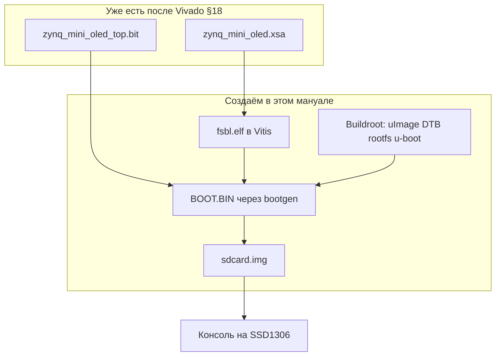
```mermaid
flowchart TB
    subgraph IN["Уже есть после Vivado §18"]
        XSA[zynq_mini_oled.xsa]
        BIT[zynq_mini_oled_top.bit]
    end
    subgraph NEW["Создаём в этом мануале"]
        FSBL[fsbl.elf в Vitis]
        BR[Buildroot: uImage DTB rootfs u-boot]
        BBIN[BOOT.BIN через bootgen]
        SD[sdcard.img]
    end
    XSA --> FSBL
    BIT --> BBIN
    FSBL --> BBIN
    BR --> BBIN
    BBIN --> SD
    SD --> OLED[Консоль на SSD1306]
```

| Канал | Интерфейс |
|-------|-----------|
| UART | `/dev/ttyUSB0`, 115200 — boot, U-Boot, запасной login |
| OLED | `/dev/fb0` + fbcon + `tty1` + **USB-клавиатура** |

---

## 2. Предварительные условия

### 2.1. Железо

| # | Требование |
|---|------------|
| 1 | Плата **ZYNQ MINI Rev B**, питание Type-C |
| 2 | **MicroSD** ≥ 4 ГБ |
| 3 | **OLED SSD1306** 128×64, I²C, адрес **0x3C** (иногда **0x3D**) |
| 4 | OLED на **CAM1**: SDA **T20**, SCL **P20**, 3.3 V, GND |
| 5 | **USB-клавиатура** в **USB host** платы (для ввода на OLED) |
| 6 | BOOT-перемычки: загрузка с **TF/SD** (см. схему платы) |

### 2.2. ПО на ПК

- **Vitis 2025.2** (тот же инсталлятор, что Vivado)
- Клон репозитория `I2C_Master_Controller` — нужен для **исходников** Buildroot (DTS, драйвер, рецепты), **не** для готового SD-образа
- Диск ~30 ГБ под сборку Buildroot

### 2.3. Пакеты на хосте (Debian/Ubuntu)

```bash
sudo apt install -y build-essential bc bison flex libssl-dev \
    libgnutls28-dev libncurses-dev pkg-config python3 rsync wget \
    cpio unzip device-tree-compiler gawk u-boot-tools git \
    mtools dosfstools picocom
```

`bootgen` входит в Vitis — понадобится `source .../Vitis/settings64.sh` перед вызовом.

---

## 3. Архитектура загрузки

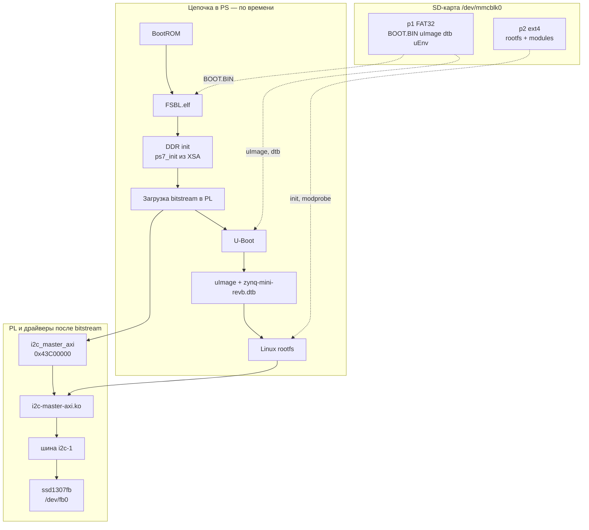
```mermaid
flowchart TB
    subgraph boot["Цепочка в PS — по времени"]
        direction TB
        BROM["BootROM"]
        FSBL["FSBL.elf"]
        DDR["DDR init<br/>ps7_init из XSA"]
        PCAP["Загрузка bitstream в PL"]
        UB["U-Boot"]
        KRN["uImage + zynq-mini-revb.dtb"]
        OS["Linux rootfs"]
        BROM --> FSBL
        FSBL --> DDR
        DDR --> PCAP
        PCAP --> UB
        UB --> KRN
        KRN --> OS
    end

    subgraph sd["SD-карта /dev/mmcblk0"]
        direction LR
        P1["p1 FAT32<br/>BOOT.BIN uImage dtb uEnv"]
        P2["p2 ext4<br/>rootfs + modules"]
    end

    subgraph pl["PL и драйверы после bitstream"]
        direction TB
        IP["i2c_master_axi<br/>0x43C00000"]
        MOD["i2c-master-axi.ko"]
        BUS["шина i2c-1"]
        FB["ssd1307fb<br/>/dev/fb0"]
        IP --> MOD
        MOD --> BUS
        BUS --> FB
    end

    P1 -.->|"BOOT.BIN"| FSBL
    P1 -.->|"uImage, dtb"| UB
    P2 -.->|"init, modprobe"| OS
    PCAP --> IP
    OS --> MOD
```

| Этап | Компонент | Где лежит / откуда |
|------|-----------|-------------------|
| 1 | BootROM | ROM в PS7 |
| 2 | FSBL | `BOOT.BIN` (часть A, Vitis) |
| 3 | bitstream | `BOOT.BIN` (Vivado §18) |
| 4 | U-Boot | `BOOT.BIN` + копия на FAT (часть B) |
| 5 | Ядро + DTB | FAT: `uImage`, `zynq-mini-revb.dtb` (часть B) |
| 6 | rootfs | ext4 p2 (часть B) |
| 7 | I²C + OLED | PL bitstream + модуль + `ssd1307fb` (DTS B.4) |

| Файл на SD (FAT) | Кто создаёт в этом мануале |
|------------------|----------------------------|
| `BOOT.BIN` | Часть C (`bootgen`) |
| `uImage`, `zynq-mini-revb.dtb`, `u-boot` | Часть B (Buildroot, ручная сборка) |
| `uEnv.txt` | Создаёте в B.12, копируется в FAT при B.16 |
| ext4 rootfs | Часть B |

### 3.1. Два «мира» до Linux: BootROM и FSBL

На Zynq-7000 загрузка — **цепочка программ в PS**, а не один монолитный «биос». Первые две ступени жёстко заданы архитектурой Xilinx:

| Ступень | Где код | Кто писал | Можно менять? |
|---------|---------|-----------|---------------|
| **BootROM** | Маскированное **ROM** в кристалле PS7 | Xilinx, навсегда в чипе | Нет |
| **FSBL** | **OCM** (SRAM в PS), потом DDR для образов | Вы собираете в Vitis из **XSA** | Да (пересборка `fsbl.elf`) |
| **U-Boot, ядро** | DDR, SD | Buildroot / вы | Да |

**BootROM** — это «нулевой загрузчик»: он знает, **откуда** взять следующий кусок кода (SD, QSPI, NAND, JTAG), но **не** знает вашу плату (какая DDR, какие MIO). Подробно — **§3.2**.  
**FSBL** — первый **ваш** (настраиваемый) код: он получает из Vivado/XSA таблицу `ps7_init` и поднимает **именно ваше** железо.

Без корректного FSBL из **того же XSA**, что и bitstream, цепочка обрывается **до** U-Boot — на UART будет тишина (если не включён `FSBL_DEBUG_INFO`, см. §A.4.1).

---

### 3.2. BootROM — что это и как работает

**BootROM** (Boot Read-Only Memory) — **постоянная программа Xilinx** внутри кристалла **PS7** на Zynq-7000. Её нельзя перепрошить из Vivado/Vitis: это не flash на плате и не файл в репозитории. Ваш единственный настраиваемый «следующий шаг» после BootROM — **FSBL** в `BOOT.BIN`.

| Свойство | BootROM | FSBL |
|----------|---------|------|
| Расположение | Маскированный **ROM** в die PS7 | `fsbl.elf` на SD / QSPI |
| Размер кода | Фиксирован Xilinx (~десятки KiB) | До ~сотен KiB (лимит OCM) |
| Знание вашей платы | **Нет** (универсальный Zynq) | **Да** (`ps7_init` из XSA) |
| Запускает | Только **CPU0** (Cortex-A9 #0) | CPU0, потом handoff на U-Boot |
| CPU1 | Остаётся в reset / WFE до FSBL/Linux | Позже будит ядро |

Документация Xilinx: **UG585** (*Zynq-7000 TRM*, глава Boot and Configuration), **UG821** (*Zynq-7000 Software Developers Guide*), **UG12800** (*Bootgen User Guide*).

---

#### 3.2.1. Физическая реализация и память при reset

После **power-on** или **системного reset**:

1. **Сбрасывается PS и PL** (логика PL не сконфигурирована, пока не придёт bitstream).
2. **CPU0** — единственное ядро, которое выполняет код; CPU1 ждёт.
3. Включается **ремап адресов** (подробно — ниже, §3.2.1.1).
4. Счётчик команд (**PC**) стартует с адреса **`0x0000_0000`** — это вектор reset ARM; из‑за ремапа по этому адресу читается код **BootROM**, а не содержимое DDR и не «пустая» OCM.

##### 3.2.1.1. Ремап адресов: что это значит для CPU0

Процессор **не подключён напрямую** к чипам DDR3, SPI flash или SD-карте. Он видит только **32-битные адреса** на внутренней шине PS. **Контроллер памяти / маршрутизатор** (в составе PS7) решает: запрос к адресу `0x0000_0100` пойдёт в **BootROM**, в **OCM (SRAM)**, в **DDR-контроллер** или в **регистры периферии**.

**Ремап (address remapping)** — аппаратная «подмена» цели для **низких адресов** сразу после reset. Это нужно, потому что:

- ARM по правилам после reset начинает с **`PC = 0x0000_0000`** (вектор сброса);
- физически **BootROM** — маскированная память в кристалле, она **не обязана** лежать в нуле карты памяти;
- на Zynq-7000 BootROM **размещён в верхней области** адресного пространства (в TRM UG585 — около **`0xFFFC_0000`**), но при старте **подставляется** под адрес `0x0`.

Упрощённая картина **сразу после power-on** (до FSBL):

```text
  CPU0 выдаёт адрес          Маршрутизатор PS7 (с ремапом ON)
  ─────────────────          ────────────────────────────────
  0x0000_0000  (reset)   →   BootROM  (инструкции Xilinx)
  0x0000_xxxx              →   всё ещё BootROM / служебно
  0x0010_0000 … DDR диап.  →   DDR контроллер (НЕ готов — см. ниже)
  0xFFFF_0000 …            →   верхняя OCM (64 KiB) и системные области
```

**Почему в тексте «низкая память → BootROM, а не DDR» — два разных основания:**

| Вопрос | Ответ |
|--------|--------|
| Почему CPU **не выполняет** код из DDR при `PC=0`? | Потому что **включён ремап**: `0x0` ведёт в **BootROM**, а не в SDRAM. |
| Мог бы ли CPU **вообще** пользоваться DDR сейчас? | **Нет**, даже без ремапа: контроллер DDR **не инициализирован** (нет `ps7_init`, нет training, PLL для DDR не настроены). Обращение к физическим адресам SDRAM дало бы **зависание, исключение или мусор** — не исполняемый код. |

То есть фраза объединяет **две** причины, почему «снизу» нет рабочей RAM при старте:

1. **Логическая (remap):** по адресу `0x0` CPU **должен** читать BootROM — так задумано Xilinx для загрузки.
2. **Электрическая (DDR off):** внешняя DDR3 на плате **ещё не является надёжной памятью** до вызова `ps7_init()` в FSBL.

**OCM** (внутренняя SRAM 256 KiB) **физически существует** с самого начала, но **сразу после reset** на `0x0` стоит не «ваш код в OCM», а **подмена на ROM**. BootROM позже **сам скопирует** FSBL **в** OCM и переключит режим так, что CPU пойдёт уже выполнять код **из SRAM**, а не из ROM.

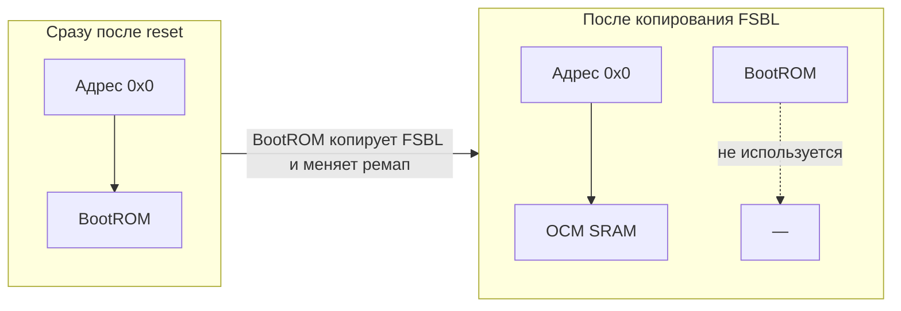
```mermaid
flowchart LR
    subgraph phase1["Сразу после reset"]
        A1["Адрес 0x0"] --> R1["BootROM"]
    end
    subgraph phase2["После копирования FSBL"]
        A2["Адрес 0x0"] --> O1["OCM SRAM"]
        R2["BootROM"] -.->|"не используется"| X["—"]
    end
    phase1 -->|"BootROM копирует FSBL и меняет ремап"| phase2
```

**Что меняется, когда стартует FSBL**

1. BootROM читает с SD образ **FSBL** и кладёт байты в **нижнюю OCM** (регион `0x0000_0000`, 192 KiB — см. таблицу ниже).
2. BootROM **снимает или перенастраивает ремап** (запись в регистры **SLCR** — System Level Control Registers), чтобы `0x0` указывал на **OCM**, а не на ROM.
3. Прыжок на **entry point** FSBL — дальше `PC` бегает по **SRAM**, в которой лежит ваш `fsbl.elf`.

Пока FSBL не вызовет **`ps7_init()`**, **DDR** остаётся недоступной как основная большая RAM; FSBL сам живёт в **OCM**. Только после инициализации DDR FSBL сможет копировать туда **U-Boot** (мегабайты — в OCM не поместятся).

**Аналогия:** reset — это лифт, который **принудительно** открывает только «этаж ROM» по кнопке «0». На «этаже DDR» ещё **не включили свет и не подали питание на контроллер**. BootROM — охранник, который **переписывает табличку на двери 0**: сначала «ROM», потом «OCM с FSBL»; включение DDR — уже задача FSBL.

**Практический вывод для отладки**

- Нельзя «положить Linux в DDR» и ожидать старт с `0x0` без FSBL — при reset туда **не попадёт CPU**.
- Bare-metal через JTAG с линкером в **OCM** ([§24.1](GUIDE_VIVADO_VITIS_FROM_SCRATCH.md)) работает в **другой** фазе: отладчик загружает ELF **после** того, как вы вручную или через FSBL подняли минимальную конфигурацию PS.
- Если после reset **нет даже баннера FSBL**, проблема **до** смены ремапа: BootROM не дошёл до копирования (SD, `BOOT.BIN`, boot mode) — см. §3.2.3.

**OCM (On-Chip Memory)** — 256 KiB SRAM в PS, разбитая на две зоны (как в `lscript.ld` bare-metal-мануала):

| Регион | Типичный адрес | Размер | Кто использует |
|--------|----------------|--------|----------------|
| `ps7_ram_0` | `0x0000_0000` | 192 KiB | Сюда BootROM **копирует FSBL**; здесь же стек/код FSBL |
| `ps7_ram_1` | `0xFFFF_0000` | 64 KiB | Стеки исключений, служебные нужды |

BootROM **не пишет** в внешнюю DDR3. Любая попытка «загрузить Linux сразу» без FSBL обречена: контроллер DDR ещё не обучен.

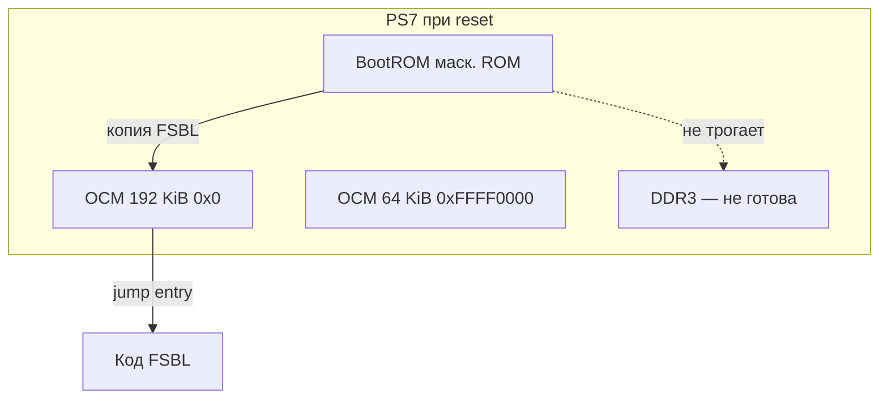
```mermaid
flowchart TB
    subgraph ps["PS7 при reset"]
        ROM["BootROM маск. ROM"]
        OCM0["OCM 192 KiB 0x0"]
        OCM1["OCM 64 KiB 0xFFFF0000"]
        DDR["DDR3 — не готова"]
    end
    ROM -->|"копия FSBL"| OCM0
    ROM -.->|"не трогает"| DDR
    OCM0 -->|"jump entry"| FSBL["Код FSBL"]
```

---

#### 3.2.2. Boot mode: откуда BootROM читает образ

Режим загрузки — **аппаратный**, считывается **один раз** при старте из выводов **MODE[2:0]** (имена на схеме: `BOOT_MODE`, перемычки, резисторы подтяжки). ПО на ПК этот выбор **не меняет** — только плата.

Типичные значения для Zynq-7000 (см. UG585, таблица Boot Mode):

| MODE[2:0] (пример) | Режим | Где BootROM ищет FSBL |
|--------------------|--------|------------------------|
| `001` | **SD / eMMC** | Файл **`BOOT.BIN`** на FAT (обычно 1-й раздел SD) |
| `010` | **QSPI** | Образ в SPI flash (смещение по дизайну платы) |
| `110` | **NAND** | Образ в NAND |
| `111` | **JTAG** | Образ подгружается отладчиком; BootROM минимален |

На **ZYNQ MINI Rev B** для этого мануала: перемычки **загрузка с TF/SD** (см. схему платы и §2.1). BootROM:

- инициализирует **SDIO0** (MIO 40..45 — те же, что потом в DTS `&sdhci0`);
- обращается к карте как к **блочному устройству**;
- ищет на разделе с **FAT12/FAT16/FAT32** файл с именем **`BOOT.BIN`** (регистр может иметь значение в зависимости от реализации — на практике используйте **именно это имя**).

BootROM **не**:

- монтирует **ext4** (второй раздел с rootfs он «не видит»);
- открывает **`uImage`**, **`*.dtb`**, **`uEnv.txt`**;
- запускает **U-Boot** или **Linux** — в `BOOT.BIN` для ROM важна только partition с атрибутом **bootloader** (= FSBL).

---

#### 3.2.3. Алгоритм BootROM по шагам (SD, наш сценарий)

Ниже — логическая последовательность; внутри ROM она реализована на ассемблере/C Xilinx без вашего исходника.

| # | Действие BootROM | Результат / смысл |
|---|------------------|-------------------|
| 1 | Деассерт reset, sample **MODE** pins | Выбран, например, SD |
| 2 | Минимальная инициизация **SLCR** / тактирования для доступа к SDIO | Можно читать сектора SD |
| 3 | Инициализация **SD host** (SDIO), поиск карты | Карта отвечает или boot stop |
| 4 | Чтение **MBR/GPT** или суперблока FAT | Находится 1-й раздел FAT32 (p1) |
| 5 | Поиск файла **`BOOT.BIN`** в корне FAT | Получен начальный LBA файла |
| 6 | Чтение **Boot Image Header** / Image Header Table | Проверка магии, версии формата |
| 7 | Поиск partition с флагом **CPU load / bootloader** | Это образ **FSBL**, не bitstream |
| 8 | Проверка **checksum** (и RSA, если включён secure boot eFuse) | Битый образ → останов |
| 9 | **DMA/копирование** образа FSBL в **OCM** (`0x0` region) | В OCM лежит исполняемый код |
| 10 | Установка **стека**, очистка/flush кэшей по правилам ROM | Подготовка C-окружения |
| 11 | **Прыжок** на **entry point** FSBL (из partition header) | BootROM завершил работу |

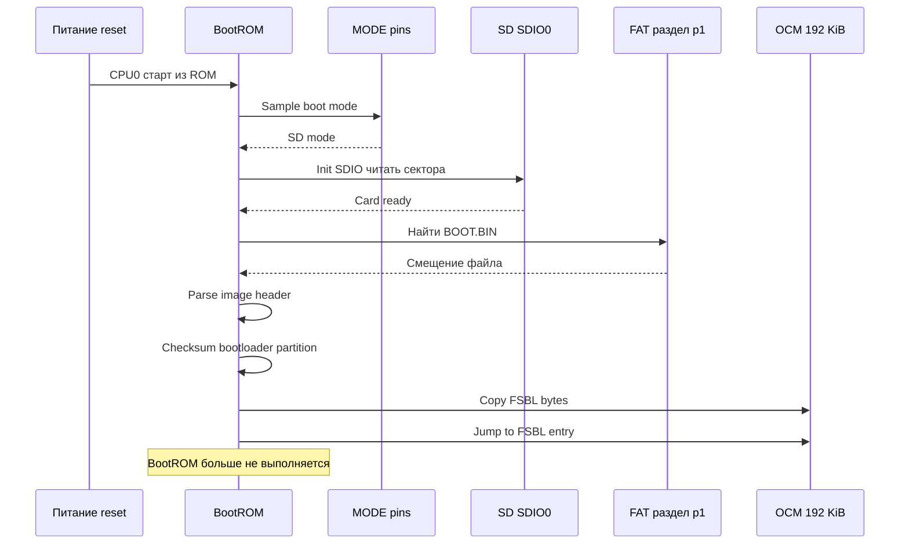
```mermaid
sequenceDiagram
    participant PWR as Питание reset
    participant ROM as BootROM
    participant STR as MODE pins
    participant SD as SD SDIO0
    participant FAT as FAT раздел p1
    participant OCM as OCM 192 KiB

    PWR->>ROM: CPU0 старт из ROM
    ROM->>STR: Sample boot mode
    STR-->>ROM: SD mode
    ROM->>SD: Init SDIO читать сектора
    SD-->>ROM: Card ready
    ROM->>FAT: Найти BOOT.BIN
    FAT-->>ROM: Смещение файла
    ROM->>ROM: Parse image header
    ROM->>ROM: Checksum bootloader partition
    ROM->>OCM: Copy FSBL bytes
    ROM->>OCM: Jump to FSBL entry
    Note over ROM: BootROM больше не выполняется
```

**Если шаг 5–8 падает** (нет файла, не FAT32, битый заголовок):

- CPU может уйти в **бесконечный цикл** в ROM;
- на UART **тишина** (BootROM почти не печатает);
- **DONE LED** PL не загорится (bitstream ещё не грузили).

Поэтому «мёртвая» плата без UART часто означает: неверный **boot mode**, битая SD, **не тот** `BOOT.BIN`, или FAT не **FAT32** (см. genimage `-F 32` в части B).

---

#### 3.2.4. Формат образа: что BootROM понимает в `BOOT.BIN`

`BOOT.BIN` — это **не** сырой `fsbl.elf`. **bootgen** упаковывает ELF в **Boot Image** с таблицами (UG12800):

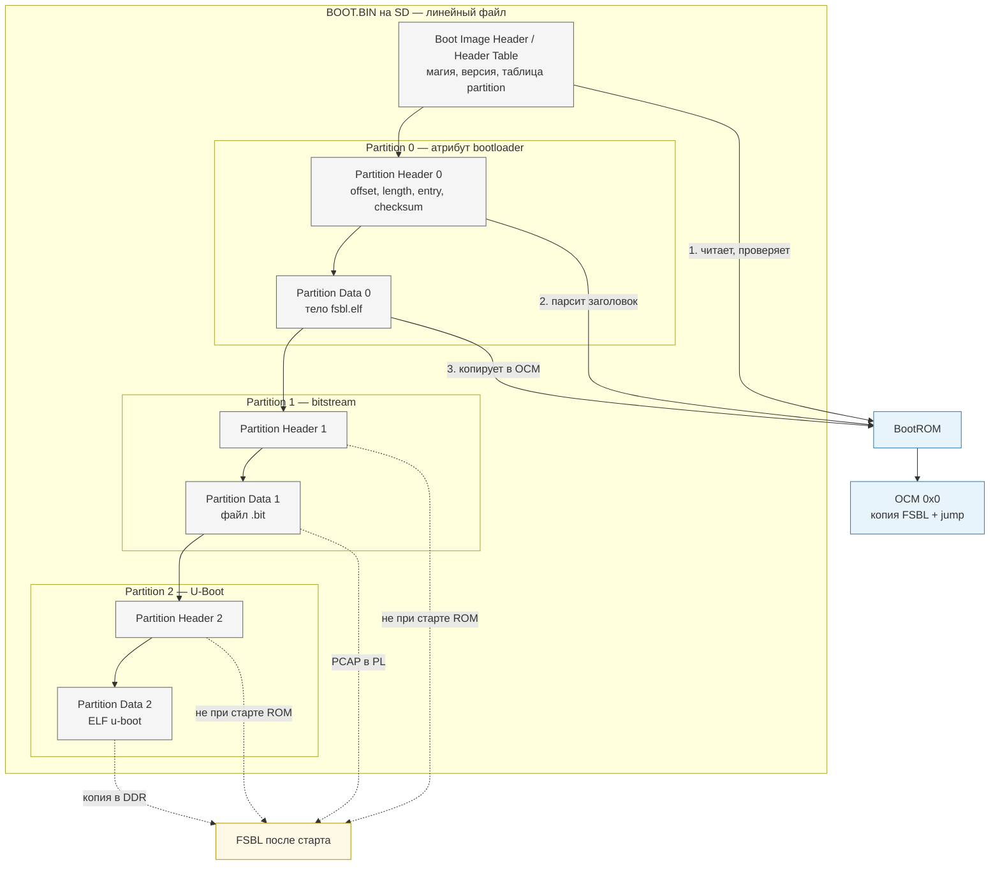
```mermaid
flowchart TB
    subgraph file["BOOT.BIN на SD — линейный файл"]
        direction TB
        HDR["Boot Image Header / Header Table<br/>магия, версия, таблица partition"]
        subgraph P0["Partition 0 — атрибут bootloader"]
            PH0["Partition Header 0<br/>offset, length, entry, checksum"]
            PD0["Partition Data 0<br/>тело fsbl.elf"]
        end
        subgraph P1["Partition 1 — bitstream"]
            PH1["Partition Header 1"]
            PD1["Partition Data 1<br/>файл .bit"]
        end
        subgraph P2["Partition 2 — U-Boot"]
            PH2["Partition Header 2"]
            PD2["Partition Data 2<br/>ELF u-boot"]
        end
        HDR --> PH0 --> PD0 --> PH1 --> PD1 --> PH2 --> PD2
    end

    ROM["BootROM"]
    FSB["FSBL после старта"]
    OCM["OCM 0x0<br/>копия FSBL + jump"]

    HDR -->|"1. читает, проверяет"| ROM
    PH0 -->|"2. парсит заголовок"| ROM
    PD0 -->|"3. копирует в OCM"| ROM
    ROM --> OCM

    PH1 -.->|"не при старте ROM"| FSB
    PD1 -.->|"PCAP в PL"| FSB
    PH2 -.->|"не при старте ROM"| FSB
    PD2 -.->|"копия в DDR"| FSB

    classDef rom fill:#e8f4fc,stroke:#2980b9
    classDef fsbl fill:#fef9e7,stroke:#b7950b
    classDef data fill:#f5f5f5,stroke:#666
    class ROM,OCM rom
    class FSB fsbl
    class HDR,PH0,PD0,PH1,PD1,PH2,PD2 data
```

| Элемент заголовка | Зачем BootROM |
|-------------------|---------------|
| Магическое поле / версия | Отличить Xilinx-образ от мусора |
| Offset и длина partition | Знать, сколько секторов читать с SD |
| Атрибут **bootloader** | Выбрать **единственную** partition для OCM |
| Execution address / entry point | Куда прыгнуть после копирования |
| Checksum | Целостность до запуска |

Partition с **bitstream** и **U-Boot** в файле `BOOT.BIN` **уже лежат на SD**, но BootROM их **не обрабатывает** — после старта FSBL читает тот же файл дальше (FSBL знает полный формат образа).

---

#### 3.2.5. Secure Boot и отладка (кратко)

| Функция | BootROM |
|---------|---------|
| **RSA-проверка** образа | Выполняется, если в eFuse включён secure boot (на учебной плате обычно **выкл.**) |
| **Печать на UART** | Практически **нет** (в отличие от FSBL с `FSBL_DEBUG_INFO`) |
| **JTAG mode** | Другой путь: образ может грузиться через Vitis/System Debugger, минуя SD |

Для отладки «видеть, жив ли BootROM» обычно смотрят: загорается ли питание, отвечает ли SD, появляется ли **баннер FSBL** на UART после успешного шага 11.

---

#### 3.2.6. ZYNQ MINI Rev B: что проверить на плате

| Проверка | Связь с BootROM |
|----------|-----------------|
| Перемычки **BOOT = SD** | Иначе ROM ищет QSPI/JTAG, а не `BOOT.BIN` на TF |
| Карта в **TF1**, FAT32 **p1** | ROM не читает ext4 **p2** |
| В корне p1 файл **`BOOT.BIN`** | Имя и порядок сборки bootgen |
| FAT32, не FAT16 | BootROM Zynq + MBR `0x0C` (см. genimage в части B) |
| `BOOT.BIN` не текст-заглушка | Placeholder не пройдёт checksum / execution |
| Питание, MIO 40..45 SD | Без SDIO init ROM не дойдёт до FAT |

---

#### 3.2.7. Граница ответственности BootROM → FSBL

| Задача | BootROM | FSBL |
|--------|---------|------|
| Sample **MODE**, выбор носителя | да | нет |
| SDIO + поиск **`BOOT.BIN`** на FAT | да | использует SD позже снова |
| Парсинг **bootloader partition** только | да | парсит **все** partition |
| Копирование **FSBL** в OCM | да | нет |
| **`ps7_init`**, DDR3 | **нет** | **да** |
| Загрузка **bitstream** в PL | **нет** | **да** (PCAP) |
| Копирование **U-Boot** в DDR | **нет** | **да** |
| **Handoff** на U-Boot | **нет** | **да** |
| UART-лог этапов | почти нет | `FSBL_DEBUG_INFO` (§A.4.1) |

После строки «передать управление FSBL» код в ROM **никогда не вызывается** до следующего reset. Вся дальнейшая загрузка — **FSBL → U-Boot → Linux** (§3.3–3.6).

---

### 3.3. Что такое FSBL (First Stage Boot Loader)

**FSBL** — это **обычная программа** на ARM (у вас — `fsbl.elf`), которую вы:

1. Генерируете в **Vitis** при сборке **Platform** из **XSA** (часть A).
2. Упаковываете в **`BOOT.BIN`** утилитой **bootgen** (часть C) **вместе** с bitstream и `u-boot`.

Исходники FSBL — шаблон Xilinx (`zynq_fsbl` в embeddedsw): `main.c`, `fsbl_hooks.c`, `ps7_init.c` / `ps7_init.h` (**из вашего XSA**), драйверы SD/QSPI/PCAP.

**Зачем FSBL существует отдельно от BootROM**

- BootROM **маленький и неизменный** — в него нельзя зашить параметры вашей DDR, MIO, частот PLL.
- FSBL **большой и настраиваемый** — Vivado при экспорте XSA генерирует **`ps7_init`** ровно под PS7 Block Design ([§7.3](GUIDE_VIVADO_VITIS_FROM_SCRATCH.md)).
- FSBL умеет работать с **PCAP** (конфигурация PL) и **partition image** формата Xilinx.

**Где выполняется код FSBL**

| Фаза | Память | Почему |
|------|--------|--------|
| Старт после BootROM | **OCM** | DDR ещё не обучена |
| После `ps7_init()` | DDR **доступна** | Можно грузить U-Boot, большие буферы |
| Сам код FSBL | Обычно линкуется в **OCM** | Не занимает DDR, ограничение ~256 KiB |

Если включить `FSBL_DEBUG_INFO`, почти весь этот путь виден на **UART1** (`ttyPS0`, 115200).

---

### 3.4. Формат `BOOT.BIN` и роль bootgen

На SD в FAT лежит один файл **`BOOT.BIN`** — это **не** просто склеенный ELF. Это **образ с разделами (partitions)**, каждый с заголовком: тип, смещение, длина, адрес загрузки, контрольная сумма.

Вы создаёте описание в **`boot.bif`** (часть C):

```text
the_ROM_image:
{
    [bootloader]  fsbl.elf
    design.bit
    u-boot
}
```

**bootgen** собирает `BOOT.BIN` так, что:

| Слот в BIF | Содержимое | Кто потребляет |
|------------|------------|----------------|
| `[bootloader]` | `fsbl.elf` | BootROM копирует **только эту** часть в OCM при старте |
| `*.bit` | Bitstream PL | **FSBL** шлёт в DevCfg → FPGA конфигурируется |
| `u-boot` | ELF второй стадии | **FSBL** копирует в DDR и делает **handoff** |

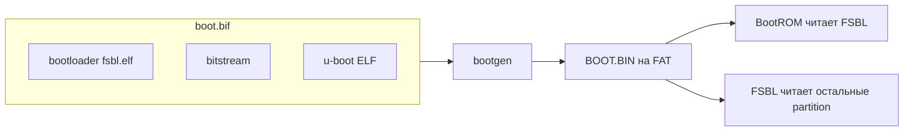
```mermaid
flowchart LR
    subgraph bif["boot.bif"]
        B1["bootloader fsbl.elf"]
        B2["bitstream"]
        B3["u-boot ELF"]
    end
    bif --> bootgen["bootgen"]
    bootgen --> BIN["BOOT.BIN на FAT"]
    BIN --> ROM["BootROM читает FSBL"]
    BIN --> FSBL2["FSBL читает остальные partition"]
```

**Важно для отладки**

- BootROM загружает из `BOOT.BIN` **только FSBL**. Остальные partition FSBL читает **сам** с того же носителя (SD), уже после инициализации SD-контроллера.
- Все три компонента в BIF должны быть от **одной** конфигурации железа: FSBL/`ps7_init` из XSA, bitstream из того же Vivado-проекта, U-Boot под Zynq-7000.

Файлы **`uImage`** и **`zynq-mini-revb.dtb`** в `BOOT.BIN` **не обязаны** входить — в нашем мануале U-Boot подхватывает их **с FAT** по `bootcmd` / `uEnv.txt` (часть B). В `BOOT.BIN` критичны **FSBL + bit + u-boot**.

---

### 3.5. FSBL по шагам (наш проект, загрузка с SD)

Ниже — логическая последовательность в `zynq_fsbl` (имена этапов как в логе `FSBL_DEBUG_INFO`).

#### Шаг 1. Точка входа после BootROM

- CPU выполняет код FSBL в **OCM**.
- Инициализация стека, базовые настройки из `ps7_init` **или** вызов полного `ps7_init()` — в зависимости от версии/хуков.
- Печать баннера (если DEBUG): `Xilinx First Stage Boot Loader`, версия.

#### Шаг 2. Определение boot mode

FSBL сверяет, как BootROM стартовал систему. Для SD:

```text
Boot mode is SD
```

Если видите `ILLEGAL_BOOT_MODE` — перемычки BOOT не те.

#### Шаг 3. Инициализация носителя

- Драйвер **SDIO** (PS7 `sdhci0`, MIO 40..45 в XSA).
- `SD Init Done` — карта отвечает, можно читать сектора FAT или сырой образ.

Сбой → `SD_INIT_FAIL` (контакты, питание, неверный MIO в XSA, битая карта).

#### Шаг 4. Инициализация PS — `ps7_init()`

**Ключевой момент всего мануала.**

Vivado при экспорте XSA сгенерировал **`ps7_init.c`**: таблицы записей в регистры SLCR, DDR controller, PLL, MIO. FSBL вызывает `ps7_init()`:

- настраивает **PLL** и тактирование;
- обучает **DDR3** (512 MiB, MT41J256M16 — [§7.3.4](GUIDE_VIVADO_VITIS_FROM_SCRATCH.md));
- включает периферию, нужную для дальнейшей загрузки.

Ошибка → `PS7_INIT_FAIL` / `DDR_INIT_FAIL` — Linux **никогда** не стартует; UART может молчать без DEBUG.

После успеха память по адресам DDR (с `0x00000000` или как в вашей карте памяти) **доступна** для записи U-Boot.

#### Шаг 5. DevCfg / PCAP — загрузка bitstream в PL

FSBL открывает **DevCfg** и через **PCAP** передаёт bitstream из partition `BOOT.BIN` в конфигурационную логику **PL**:

- в PL появляется ваш **`i2c_master_axi`** по адресу **0x43C00000**;
- активны **FCLK0** (50 MHz), **IRQ_F2P[0]** и т.д. — всё, что было в synthesized design.

Типичные сообщения DEBUG: `Devcfg driver initialized`, включение **level shifters** PS↔PL, `AXI Interface enabled`.

Сбой → `PCAP_INIT_FAIL` — неверный/битый `.bit`, несовпадение с кристаллом (z010 vs z020).

> До этого шага запись в `0x43C00000` из Linux/тестов **бессмысленна** — IP в PL ещё нет.

#### Шаг 6. Разбор partition и загрузка U-Boot

FSBL обходит **partition headers** в `BOOT.BIN`:

- находит образ **U-Boot** (ELF);
- копирует его в **DDR** по **load address** из заголовка (для Zynq обычно высокая область DDR, задаётся при линковке U-Boot);
- при необходимости выполняет **аутентификацию** (если secure boot — у нас обычно нет).

DEBUG: `Handoff Address: 0x________`.

#### Шаг 7. Handoff — передача управления U-Boot

**Handoff** — это **не** «возврат в BootROM», а **осознанный переход** CPU на entry point следующей стадии.

Упрощённо FSBL:

1. Завершает свои драйверы (SD, PCAP) или оставляет то, что ожидает U-Boot.
2. Приводит кэши/MMU в состояние, совместимое с U-Boot (зависит от версии FSBL).
3. **Прыгает** на адрес входа U-Boot (из partition header) — часто это `_start` ELF в DDR.
4. На UART (DEBUG): `SUCCESSFUL_HANDOFF`.

После прыжка **код FSBL больше не выполняется**. Память OCM может быть перезаписана позже — FSBL не «висит в фоне».

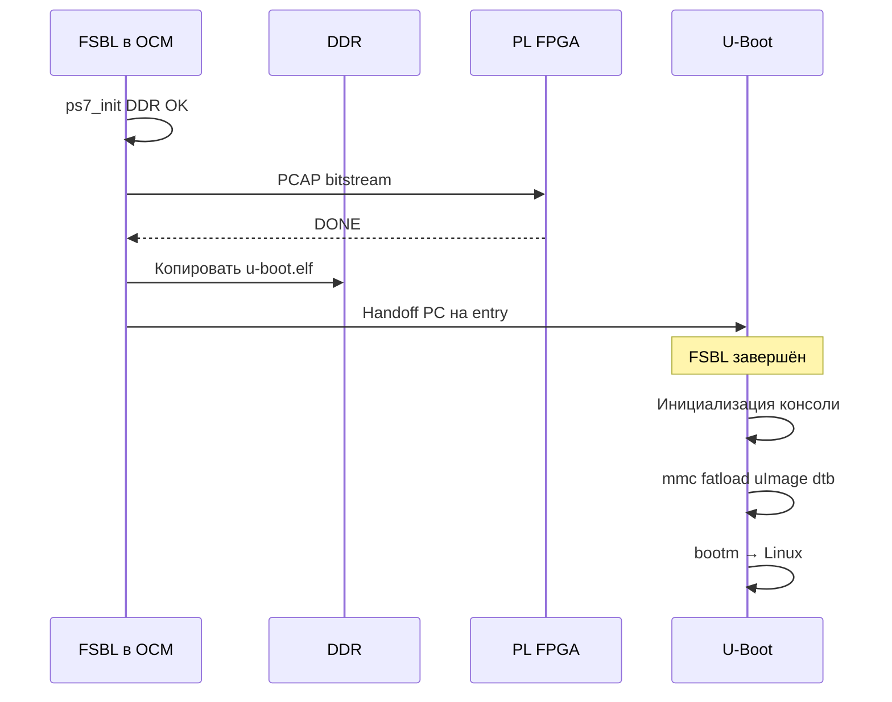
```mermaid
sequenceDiagram
    participant FSBL as FSBL в OCM
    participant DDR as DDR
    participant PL as PL FPGA
    participant UB as U-Boot

    FSBL->>FSBL: ps7_init DDR OK
    FSBL->>PL: PCAP bitstream
    PL-->>FSBL: DONE
    FSBL->>DDR: Копировать u-boot.elf
    FSBL->>UB: Handoff PC на entry
    Note over UB: FSBL завершён
    UB->>UB: Инициализация консоли
    UB->>UB: mmc fatload uImage dtb
    UB->>UB: bootm → Linux
```

#### 3.5.1. Handoff, регистр `r2`, DTB и `uboot.fragment` — подробно

Короткий абзац выше про «регистры при handoff» опирается на несколько **разных понятий**. Ниже — с нуля, в порядке «железо → софт → наш мануал».

##### Что такое handoff в этом месте

**Handoff** = FSBL делает **прыжок** на фиксированный адрес в DDR, где лежит начало кода U-Boot (`_start` из `u-boot.elf`). Это обычный переход CPU: меняется **PC** (Program Counter), стек и регистры могут быть в **произвольном** состоянии, если FSBL явно их не подготовил.

Важно: **нет единого стандарта**, что именно должно лежать в `r0`…`r3` при переходе FSBL → U-Boot на Zynq. Xilinx FSBL для U-Boot в типичной SD-схеме передаёт **минимум** — по сути «запусти код по этому адресу».

##### Что такое регистр `r2`

На **Cortex-A9** (ядро в PS7) есть регистры общего назначения **`r0` … `r12`**, плюс `sp`, `lr`, `pc`.

| Регистр | Роль в boot-контексте |
|---------|------------------------|
| **`pc`** | Адрес **следующей инструкции** — куда «прыгнули» при handoff |
| **`sp`** | Указатель стека — без валидного стека C-код U-Boot не заработает |
| **`r0`–`r3`** | По соглашению ARM могут передавать **аргументы** при вызове функции / передаче управления |

В **экосистеме Linux** для старых схем загрузки zImage иногда договаривались: **`r2` = указатель на Device Tree (DTB)** в памяти, чтобы ядро сразу знало, какое железо описывать. Отсюда привычка «DTB в `r2`».

На **Zynq-7000** при цепочке **BootROM → FSBL → U-Boot (SD)**:

- FSBL **не обязан** класть в `r2` адрес DTB;
- на практике после handoff **`r2` часто мусор** (0, случайное значение);
- U-Boot, если **ожидает** DTB именно в `r2`, попытается разобрать память по неверному адресу и **зависнет ещё до строки `U-Boot` на UART**.

```text
  Ожидание U-Boot с CONFIG_OF_BOARD=y          Реальность после FSBL (SD)
  ─────────────────────────────────────        ─────────────────────────────
  «В r2 лежит указатель на DTB»                r2 = ??? (FSBL не договорился)
         │                                              │
         ▼                                              ▼
  board_init_f() читает DTB                      hang / нет UART banner
```

##### Два разных DTB — не путать

В нашем проекте фигурируют **два** Device Tree с **разным** назначением:

| DTB | Файл | Кто использует | Когда |
|-----|------|----------------|--------|
| **DTB для самого U-Boot** | Вшит в `u-boot.elf` или отдельный blob | Код **U-Boot** при старте (драйверы MMC, UART в U-Boot) | Сразу после handoff |
| **DTB для Linux** | `zynq-mini-revb.dtb` на FAT | **Ядро Linux** после команды `bootm` | Позже, U-Boot явно грузит с SD |

**`zynq-mini-revb.dts`** (часть B.4) — это описание платы для **Linux** (`i2c` в PL, OLED, DDR…). Оно **не** подменяет автоматически DTB внутри U-Boot.

Путаница «FSBL должен передать DTB» обычно смешивает эти два уровня: FSBL не передаёт в `r2` ни тот, ни другой — **U-Boot** должен сам знать, где взять **свой** DTB при старте.

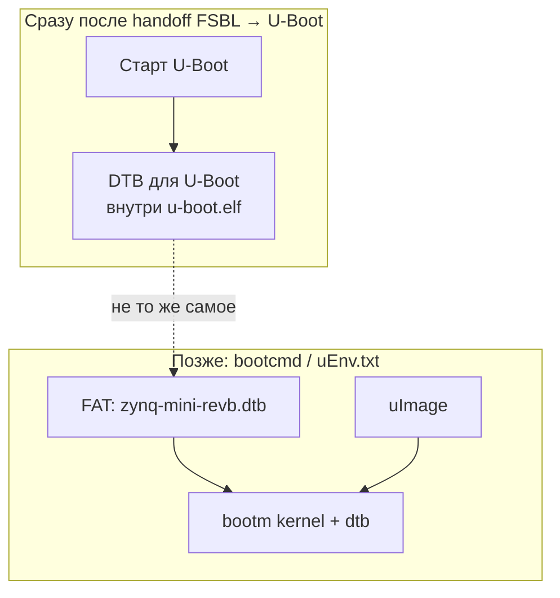
```mermaid
flowchart TB
    subgraph early["Сразу после handoff FSBL → U-Boot"]
        UBSTART["Старт U-Boot"]
        DTB_UB["DTB для U-Boot<br/>внутри u-boot.elf"]
        UBSTART --> DTB_UB
    end

    subgraph later["Позже: bootcmd / uEnv.txt"]
        FAT["FAT: zynq-mini-revb.dtb"]
        KRN["uImage"]
        BOOTM["bootm kernel + dtb"]
        FAT --> BOOTM
        KRN --> BOOTM
    end

    DTB_UB -.->|"не то же самое"| FAT
```

##### Что такое Kconfig и `CONFIG_*`

**U-Boot**, как и ядро Linux, собирается с системой **Kconfig**: каждая опция — `CONFIG_ИМЯ=y` или `# CONFIG_ИМЯ is not set`.

Примеры:

- `CONFIG_CMD_MMC=y` — включить команду `mmc` в консоли U-Boot;
- `CONFIG_OF_EMBED=y` — вшить DTB **для U-Boot** внутрь `u-boot.elf`.

Вы **не** правите эти строки в исходниках U-Boot вручную на каждой сборке — их задают **defconfig** + **фрагменты**.

##### Что такое `uboot.fragment`

**`uboot.fragment`** — текстовый файл, который вы создаёте в части **B.6** по пути:

```text
$BR_EXT/board/zynq_mini_revb/uboot.fragment
```

При сборке Buildroot:

1. Берётся база **`xilinx_zynq_virt_defconfig`** (универсальная конфигурация Xilinx для Zynq).
2. Поверх неё **накладывается** ваш `uboot.fragment` (строки `CONFIG_…`).
3. Получается итоговый `.config` U-Boot → компиляция → `buildroot-build/images/u-boot`.

Это тот же приём, что **`linux.fragment`** для ядра (часть B.5): маленький файл с нужными правками вместо тысяч кликов в `menuconfig`.

| Файл | База | Что добавляет |
|------|------|----------------|
| `linux.fragment` | `multi_v7_defconfig` | `CONFIG_FB_SSD1307`, шрифты fbcon, … |
| **`uboot.fragment`** | `xilinx_zynq_virt_defconfig` | SD-boot, `CONFIG_OF_EMBED`, `bootcmd`, … |

##### `CONFIG_OF_EMBED`, `CONFIG_OF_BOARD`, `CONFIG_OF_SEPARATE`

Три способа, **откуда U-Boot берёт свой DTB** при первом запуске (не DTB Linux):

| Опция Kconfig | Смысл | Кто задаёт адрес DTB |
|---------------|--------|----------------------|
| **`CONFIG_OF_EMBED=y`** | DTB **вкомпилирован** в `u-boot.elf` (секция `.dtb` в ELF) | Сам U-Boot знает символ внутри образа — **регистры не нужны** |
| **`CONFIG_OF_SEPARATE`** | DTB лежит **рядом** с U-Boot отдельным файлом | U-Boot ищет по фиксированному offset/имени |
| **`CONFIG_OF_BOARD=y`** | DTB передаёт **доска / предыдущая стадия** — часто указатель в **`r2`** при входе | Ожидается FSBL/JTAG/другой загрузчик |

В **нашем** `uboot.fragment` (часть B.6):

```text
CONFIG_OF_EMBED=y
# CONFIG_OF_SEPARATE is not set
# CONFIG_OF_BOARD is not set
```

**Почему так для SD + FSBL:**

1. FSBL прыгает на U-Boot **без** корректного DTB в `r2`.
2. **`CONFIG_OF_EMBED`** — U-Boot при старте использует **встроенный** минимальный DTB (из дерева Xilinx / сгенерированный при сборке), достаточный для MMC, UART, DRAM.
3. **`CONFIG_OF_BOARD` выключен** — U-Boot **не ждёт** «волшебный указатель» в `r2` от FSBL.

Если оставить дефолт многих Xilinx-сборок `CONFIG_OF_BOARD=y` без передачи `r2`, типичный симптом: **плата молчит на UART** после `SUCCESSFUL_HANDOFF` в логе FSBL.

##### Откуда тогда Linux получает DTB

Это **отдельный** шаг — в **`CONFIG_BOOTCOMMAND`** / `uEnv.txt`:

```text
fatload mmc 0 0x2A00000 zynq-mini-revb.dtb
fatload mmc 0 0x3000000 uImage
bootm 0x3000000 - 0x2A00000
```

| Команда | Что делает |
|---------|------------|
| `fatload … zynq-mini-revb.dtb` | Копирует **ваш** DTB с FAT в DDR по адресу `0x02A0_0000` |
| `fatload … uImage` | Копирует ядро |
| `bootm` | Передаёт **ядру** адреса kernel + DTB (уже по правилам Linux/U-Boot, не через FSBL `r2`) |

То есть: **встроенный DTB** (`OF_EMBED`) — чтобы **U-Boot сам завёлся**; **`zynq-mini-revb.dtb`** — чтобы **Linux увидел PL I²C и OLED**.

##### Сводка одной фразой

| Вопрос | Ответ |
|--------|--------|
| Что такое `r2`? | Регистр ARM; в некоторых boot-протоколах — указатель на DTB; **FSBL на SD его не заполняет** |
| Что такое `uboot.fragment`? | Файл опций Kconfig для сборки U-Boot в части B |
| `CONFIG_OF_EMBED`? | DTB **внутри** `u-boot.elf` для раннего старта U-Boot |
| `CONFIG_OF_BOARD`? | Ждать DTB от «доски»/FSBL, часто через **`r2`** — **отключаем** |
| Связь с FSBL handoff? | FSBL только прыгает на entry; **не** передаёт Linux-DTB; U-Boot сам встроил свой DTB и сам грузит `zynq-mini-revb.dtb` с SD |

Подробная настройка строк в файле — **§B.6**; полный текст фрагмента с комментариями — в `buildroot/board/zynq_mini_revb/uboot.fragment` репозитория (эталон) или в вашем `$BR_EXT/.../uboot.fragment` при сборке с нуля.

---

### 3.6. Что происходит после FSBL (контекст цепочки)

| Стадия | Кто | Откуда данные |
|--------|-----|----------------|
| U-Boot | Следует после handoff | Уже в DDR из `BOOT.BIN`; **uImage/dtb** — с FAT (`uEnv.txt`) |
| Linux | `bootm` в U-Boot | `uImage` + `zynq-mini-revb.dtb` |
| `i2c-master-axi.ko` | init/modprobe | rootfs ext4 |
| `/dev/fb0` | `ssd1307fb` + DTS | Узел `oled 0x3c` на шине PL |

FSBL **не** загружает ядро Linux и **не** читает Device Tree с SD — это сознательно делегировано U-Boot.

---

### 3.7. Типичные точки отказа (связь BootROM ↔ FSBL ↔ U-Boot)

| Симптом | Стадия | Что проверить |
|---------|--------|----------------|
| Полная тишина на UART | BootROM / `BOOT.BIN` | FAT32 p1, имя `BOOT.BIN`, boot mode SD, FSBL_DEBUG |
| Есть баннер FSBL, нет U-Boot | Handoff / U-Boot в BIF | Слот `u-boot` в `boot.bif`, пересборка bootgen |
| `DDR_INIT_FAIL` | FSBL / ps7_init | XSA §7.3 DDR, новый export → platform |
| U-Boot есть, нет Linux | U-Boot / FAT | `uImage`, `.dtb` на p1, `uEnv.txt` |
| Linux есть, нет `i2c-1` | PL / DTS | bitstream в `BOOT.BIN` = актуальный, DTS `0x43C00000` |

---

### 3.8. Краткий словарь

| Термин | Значение |
|--------|----------|
| **BootROM** | Маскированный ROM в PS7; после reset грузит **только FSBL** в OCM (§3.2) |
| **MODE[2:0]** | Аппаратные пины boot mode (SD / QSPI / JTAG …) |
| **Boot Image Header** | Заголовок `BOOT.BIN`; проверяется BootROM и FSBL |
| **bootloader partition** | Слот в BIF с `[bootloader]` — единственный, кого копирует BootROM |
| **FSBL** | Настраиваемый 1-й этап; DDR, bitstream, загрузка U-Boot, handoff |
| **OCM** | 256 KiB SRAM в PS (192+64 KiB); FSBL выполняется здесь до DDR |
| **BOOT.BIN** | Образ Xilinx с partition: FSBL + bit + (u-boot) |
| **bootgen** | Утилита сборки `BOOT.BIN` из `.bif` |
| **PCAP / DevCfg** | Канал конфигурации PL (bitstream) |
| **Handoff** | Прыжок CPU на entry point U-Boot в DDR |
| **ps7_init** | Машинный код инициализации PS из XSA |

Дальше по мануалу: **часть A** — как собрать `fsbl.elf`; **часть C** — как упаковать его в `BOOT.BIN`.

---

# Часть A. FSBL в Vitis (из вашего XSA)

**FSBL** инициализирует PS (включая **DDR** по таблице `ps7_init` из XSA), загружает **bitstream** в PL и передаёт управление U-Boot (подробная теория — **§3.1–3.8** выше).

### A.1. Окружение

```bash
source /opt/xilinx/2025.2/Vitis/settings64.sh
which vitis bootgen
```

### A.2. Workspace (шаг 19 Vivado-мануала — повторяем для Linux)

Если вы **уже** открывали workspace в шаге 19 [GUIDE_VIVADO_VITIS_FROM_SCRATCH.md](GUIDE_VIVADO_VITIS_FROM_SCRATCH.md) — можно использовать тот же каталог. Иначе:

1. Запустите **Vitis Unified IDE** (`vitis &`).
2. **File → Switch Workspace…** (или **Open Workspace** на стартовой странице).
3. Укажите **новую** папку, например:

   ```
   <repo>/vitis/workspace_linux
   ```

   (имя может быть любым; главное — не полагаться на чужой собранный workspace без вашего XSA).

4. **Open**.

### A.3. Platform Component из **вашего** XSA (шаг 20)

1. **File → New Component → Platform**.
2. **Component name:** `zynq_mini_oled_platform`.
3. **Next**.
4. **Create platform from hardware specification (XSA)**.
5. **Browse** → выберите файл, созданный **вами** на шаге 18 Vivado-мануала:

   ```
   <repo>/vivado/zynq_mini_oled.xsa
   ```

   Не используйте XSA из другого проекта или чужой машины.

6. **Next**:
   - **OS:** `standalone`
   - **CPU:** `ps7_cortexa9_0`
   - **Domain:** `standalone_ps7_cortexa9_0`
7. **Finish**.

Vitis создаст platform и вложенный компонент **`zynq_fsbl`** (шаблон Xilinx). **Приложение `oled_demo` создавать не нужно** — для Linux достаточно platform + FSBL.

### A.4. Сборка Platform → `fsbl.elf`

1. **Components** → правый клик **`zynq_mini_oled_platform`** → **Build**.
2. Дождитесь **BUILD SUCCESS** (обычно 30–90 с).

Запишите путь к FSBL (подставьте свой workspace):

```bash
find <repo>/vitis/workspace_linux -name fsbl.elf 2>/dev/null
```

Типичный результат:

```
.../vitis/workspace_linux/zynq_mini_oled_platform/zynq_fsbl/build/fsbl.elf
```

Сохраните этот путь — он понадобится в части C как **`FSBL_ELF`**.

### A.4.1. DEBUG-режим FSBL: зачем, как включить, как читать UART

По умолчанию FSBL из Vitis собирается **без** отладочных макросов: на UART **ничего не печатается**, пока не стартует U-Boot. Если плата «молчит» между включением питания и строкой `U-Boot`, включите **DEBUG FSBL** — это самый быстрый способ понять, на каком этапе загрузка остановилась.

#### Что такое DEBUG FSBL

FSBL Xilinx для Zynq-7000 выводит диагностику через макрос **`fsbl_printf()`** (файл `fsbl_debug.h` в исходниках FSBL). Внутри, при включённом уровне, вызывается **`xil_printf()`** → драйвер **UART PS** (у нас **UART1**, `ttyPS0`, 115200 — тот же порт, что в §2.3 и в DTS `console=ttyPS0`).

| Режим | Макрос при сборке | Что появляется на UART |
|-------|-------------------|-------------------------|
| **По умолчанию** | *(ничего)* | Полная тишина от FSBL (ошибки тоже не печатаются через `fsbl_printf`) |
| **Уровень 1** | `FSBL_DEBUG` | Баннер, режим загрузки, **коды ошибок** (`DDR_INIT_FAIL`, `SD_INIT_FAIL`, …), handoff |
| **Уровень 2** (рекомендуется) | `FSBL_DEBUG_INFO` | Всё из уровня 1 + детали: инициализация SD/DevCfg, адрес handoff, level shifters PL↔PS |

> **Важно:** если задать **оба** макроса (`FSBL_DEBUG` и `FSBL_DEBUG_INFO`), в коде Xilinx действует только **`FSBL_DEBUG`** (уровень 2 отключается). Для отладки достаточно **только** `FSBL_DEBUG_INFO`.

**Что DEBUG даёт на практике:**

- видно, дошёл ли FSBL до **инициализации DDR** (`ps7_init` из вашего XSA);
- какой **boot mode** выбрал BootROM (SD, JTAG, QSPI, …);
- успешна ли **инициализация SD** и чтение разделов с карты;
- загружается ли **bitstream** в PL (через DevCfg/PCAP);
- какой **адрес handoff** передаётся следующей стадии (U-Boot в `BOOT.BIN`).

**Чего DEBUG не делает:** не заменяет отладчик JTAG и не печатает сообщения U-Boot/Linux — только этап **BootROM → FSBL → handoff**.

#### Предусловия

| # | Требование |
|---|------------|
| 1 | В XSA настроен **UART1** (MIO 48/49), 115200 — [§7.3.5](GUIDE_VIVADO_VITIS_FROM_SCRATCH.md) |
| 2 | USB-UART подключён, на ПК: `picocom -b 115200 /dev/ttyUSB0` (или аналог) |
| 3 | Загрузка с **SD** и корректный **`BOOT.BIN`** (часть C) — иначе FSBL может не дойти до ваших логов |
| 4 | После смены макросов — **пересборка platform** и новый **`BOOT.BIN`** |

#### Как включить в Vitis Unified IDE (2025.2) — рабочий способ

FSBL — **дочерний компонент** platform (`zynq_fsbl`), не отдельное Application вроде `oled_demo`.

> **Частая проблема:** пункт **Compiler → Symbols → Add `FSBL_DEBUG`** в GUI **сохраняется**, platform **Build SUCCESS**, а на UART **по-прежнему тишина**. Причины: (1) символ **не попал** в реальную команду `gcc`; (2) в `BOOT.BIN` остался **старый** `fsbl.elf`; (3) на плате грузится **не тот** SD-образ. Ниже — способ, который можно **проверить на диске**.

##### Способ A (рекомендуется): правка `UserConfig.cmake` вручную

1. В **Explorer / Components** откройте:

   ```text
   <workspace>/zynq_mini_oled_platform/zynq_fsbl/UserConfig.cmake
   ```

   Путь от workspace, например:  
   `vitis/workspace_linux/zynq_mini_oled_platform/zynq_fsbl/UserConfig.cmake`

2. Найдите блок **`USER_COMPILE_DEFINITIONS`** (в начале файла, секция *USER SETTINGS*).

3. Замените пустую строку на **один** макрос (для полного лога — **`FSBL_DEBUG_INFO`**, не `FSBL_DEBUG`):

   ```cmake
   set(USER_COMPILE_DEFINITIONS
   "FSBL_DEBUG_INFO"
   )
   ```

   > Если нужен только уровень 1 (баннер + ошибки, без `SD Init Done`), можно `"FSBL_DEBUG"`.  
   > **Не задавайте оба** сразу — при `FSBL_DEBUG` + `FSBL_DEBUG_INFO` в коде Xilinx остаётся только уровень 1.

4. **Сохраните файл** (`Ctrl+S`). Откройте `UserConfig.cmake` снова и убедитесь, что строка **записана на диск**.

5. **Clean + Build** (важно именно пересобрать FSBL, не полагаться на «ничего не изменилось»):
   - правый клик **`zynq_fsbl`** → **Clean** (если есть);
   - затем правый клик **`zynq_mini_oled_platform`** → **Build**  
     *(или Build на `zynq_fsbl`, если IDE даёт отдельную цель)*.

6. **Обязательно** заново соберите **`BOOT.BIN`** (часть **C) и перезапишите SD** — BootROM грузит FSBL **из `BOOT.BIN`**, а не из workspace.

##### Способ B: GUI *Compiler Settings → Symbols* (только с проверкой)

Если удобнее через UI:

1. **Components** → **`zynq_mini_oled_platform`** → **`zynq_fsbl`** (иногда под **Boot** / **Sources**).
2. Откройте **`UserConfig.cmake`** (двойной клик) **или** *Settings → Compiler → Symbols*.
3. **Add** → `FSBL_DEBUG_INFO` (без `=` и без значения).
4. **Apply** → **OK** → **Build** platform.

**Сразу после этого** откройте `UserConfig.cmake` текстовым редактором. В `USER_COMPILE_DEFINITIONS` **должна** появиться строка `"FSBL_DEBUG_INFO"`.  
Если блок **пустой** — GUI **не применил** символ к FSBL; используйте **способ A**.

##### Проверка 1: макрос в командной строке компилятора

После **успешного** Build:

```bash
WORK=vitis/workspace_linux   # ваш workspace
grep -h FSBL_DEBUG "${WORK}/zynq_mini_oled_platform/zynq_fsbl/build/compile_commands.json" | head -3
```

Ожидание: в флагах есть **`-DFSBL_DEBUG_INFO`** (или `-DFSBL_DEBUG`).

Если `compile_commands.json` нет — ищите в логе сборки Vitis строку `Building fsbl` и флаги `arm-none-eabi-gcc ... -D...`.

##### Проверка 2: строки внутри `fsbl.elf`

```bash
ELF="${WORK}/zynq_mini_oled_platform/zynq_fsbl/build/fsbl.elf"
ls -l "$ELF"
strings "$ELF" | grep -E 'Boot mode|First Stage Boot Loader|SD Init'
```

| Результат `strings` | Вывод |
|---------------------|--------|
| Есть `Xilinx First Stage Boot Loader`, `Boot mode is` | Макрос **попал**, FSBL с DEBUG собран |
| **Нет** таких строк | Собран **без** DEBUG — повторить Clean + Build, проверить `UserConfig.cmake` |
| Строки есть, на UART тишина | В `BOOT.BIN` **старый** ELF, неверный UART, или BootROM **не дошёл** до FSBL |

Сравните **время модификации**:

```bash
stat "$ELF"
stat boot/BOOT.BIN    # после bootgen
```

`BOOT.BIN` должен быть **новее** `fsbl.elf`.

##### Проверка 3: какой `fsbl.elf` попал в `bootgen`

В **`boot.bif`** (часть C) путь **`[bootloader]`** должен указывать на **тот же** файл:

```text
.../zynq_mini_oled_platform/zynq_fsbl/build/fsbl.elf
```

Не путать с копией в `export/.../sw/boot/fsbl.elf` — иногда она **устаревает**. Надёжнее всегда брать **`build/fsbl.elf`** с актуальным `mtime`.

##### Почему `FSBL_DEBUG` в GUI «не даёт» сообщений

| Причина | Что сделать |
|---------|-------------|
| Символ не в `USER_COMPILE_DEFINITIONS` | Способ A, перечитать файл на диске |
| Platform build **инкрементальный**, FSBL не пересобрался | **Clean** `zynq_fsbl` / platform |
| **`BOOT.BIN` / SD не обновлены** | `bootgen` → `cp` в `images/` → `dd` / `genimage` |
| Смотрите **не тот** UART / не 115200 | `ttyUSB0`, §2.3 |
| BootROM **не запускает** FSBL (нет даже баннера) | §3.2.3, `BOOT.BIN`, boot mode, FAT32 |
| В BSP нет **`STDOUT_BASEADDRESS`** (UART не в XSA) | В Vivado PS7 включён **UART1** → export XSA → пересоздать platform |
| Ожидаете лог **уровня 2** при одном `FSBL_DEBUG` | Поставьте **`FSBL_DEBUG_INFO`** |

Даже с одним **`FSBL_DEBUG`** (без `_INFO`) на UART **должны** появиться минимум:

```text
Xilinx First Stage Boot Loader
Boot mode is SD
```

Если **этого нет** — дело **не в уровне** DEBUG, а в том, что на плату попал FSBL **без любого** `-DFSBL_*` или FSBL **не выполняется**.

##### Скрипт пересборки (опционально, из репозитория)

Если workspace лежит в `vitis/workspace` репозитория:

```bash
source /opt/xilinx/2025.2/Vitis/settings64.sh
vitis -s vitis/rebuild_fsbl.py
```

Скрипт вызывает `platform.build()`; **после него** всё равно нужны **`bootgen`** и обновление SD.

#### Типичный вывод на UART (SD-загрузка, `FSBL_DEBUG_INFO`)

Порядок строк может слегка отличаться по версии embeddedsw, но логика одна:

```text
Xilinx First Stage Boot Loader
Release 2024.x ...
Boot mode is SD
SD Init Done
Devcfg driver initialized
...
Handoff Address: 0x........ 
SUCCESSFUL_HANDOFF
```

Сразу после этого обычно идёт **U-Boot** (`U-Boot 2024.xx ...`), затем **Linux**.

Фрагменты **уровня 1** (`FSBL_DEBUG` без INFO) — в основном баннер, `Boot mode is …` и строки вида `DDR_INIT_FAIL`, `SD_INIT_FAIL`, `PCAP_INIT_FAIL`, `SUCCESSFUL_HANDOFF`.

Фрагменты **уровня 2** (`FSBL_DEBUG_INFO`) — например `SD Init Done`, `Devcfg driver initialized`, `Handoff Address: 0x…`, `Enabling Level Shifters PL to PS`, `AXI Interface enabled`.

#### Как работать с логом при отладке

1. Откройте UART **до** подачи питания или reset.
2. Включите питание / вставьте SD / нажмите reset.
3. **Сохраните полный лог** в файл: в `picocom` — *Ctrl+A*, *Ctrl+L*; или `script boot.log`.
4. Сопоставьте **последнюю напечатанную строку** с таблицей ниже.
5. Исправьте причину (XSA, SD, `BOOT.BIN`, bitstream), **пересоберите** platform + `BOOT.BIN`, повторите.

| Последнее сообщение / ошибка | Вероятная причина | Действие |
|----------------------------|-------------------|----------|
| *(тишина, нет даже баннера FSBL)* | Неверный `BOOT.BIN`, BootROM не стартует, или UART не тот порт | Проверить `BOOT.BIN` на FAT, BOOT-перемычки SD, 115200, `ttyUSB0` |
| `PS7_INIT_FAIL` | DDR в PS7 не совпадает с платой | [§7.3.4](GUIDE_VIVADO_VITIS_FROM_SCRATCH.md) → export XSA → пересборка FSBL |
| `DDR_INIT_FAIL` | То же / training DDR | Проверить MT41J256M16, питание DDR |
| `Boot mode is SD` + `SD_INIT_FAIL` | SD, разводка, питание, FAT | Карта, `dd` образа, MIO 40..45 |
| Останов после SD, нет handoff | Повреждён `BOOT.BIN`, неверные слоты bootgen | Часть C: FSBL + bit + `u-boot` из **того же** XSA |
| `PCAP_INIT_FAIL` / ошибки bitstream | `.bit` не совпадает с XSA или повреждён | Vivado impl_1 → новый bit → `bootgen` |
| `Handoff Address: 0x…` без `SUCCESSFUL_HANDOFF` | Сбой перед переходом в U-Boot | Версия/сборка `u-boot.elf` в `BOOT.BIN` |
| `SUCCESSFUL_HANDOFF`, но нет U-Boot | U-Boot не стартует или другой UART | Проверить слот `u-boot` в `.bif`, образ SD |

#### Отключение DEBUG для «боевой» SD-карты

Перед финальной прошивкой можно **убрать** символ `FSBL_DEBUG_INFO`, пересобрать platform и `BOOT.BIN`: загрузка чуть быстрее, UART не забивается служебным текстом. Для поиска неисправностей оставляйте DEBUG включённым.

#### DEBUG FSBL и отладчик JTAG — разные вещи

| Способ | Инструмент | Когда |
|--------|------------|--------|
| **DEBUG-макросы** | UART + пересборка `fsbl.elf` | Пошаговая загрузка с SD/QSPI в полевых условиях |
| **Run/Debug FSBL в Vitis** | JTAG, breakpoints | Изменяете исходники FSBL, нужен останов на строке C |

Подробный сценарий JTAG для FSBL — в [Embedded Design Tutorials: Debuggable FSBL](https://xilinx.github.io/Embedded-Design-Tutorials/docs/2023.1/build/html/docs/Feature_Tutorials/debuggable-fsbl/debuggable-fsbl.html) (для Zynq-7000 макросы те же: `FSBL_DEBUG` / `FSBL_DEBUG_INFO` в `fsbl_debug.h`).

### A.5. Проверка FSBL на UART (с DEBUG)

1. Включите **`FSBL_DEBUG_INFO`** (§A.4.1), пересоберите platform и **`BOOT.BIN`**.
2. Терминал: `picocom -b 115200 /dev/ttyUSB0`.
3. Загрузка с SD (часть D).

Ожидайте баннер **Xilinx First Stage Boot Loader**, строку **`Boot mode is SD`**, затем **U-Boot**. Если FSBL падает — последняя строка из §A.4.1 укажет этап.

Без SD (только JTAG) FSBL печатает `Boot mode is JTAG` — полезно проверить, что UART и `fsbl.elf` живы, даже если `BOOT.BIN` ещё не готов.

### A.6. Ошибки FSBL

| Симптом | Действие |
|---------|----------|
| XSA not found | Вернитесь к **шагу 18** Vivado-мануала |
| Тишина на UART до U-Boot | Включите **`FSBL_DEBUG_INFO`** (§A.4.1), пересоберите `fsbl.elf` и `BOOT.BIN` |
| Linux зависает на старте ядра | В XSA нет DDR — переделайте **§7.3** Vivado-мануала, заново synthesis + export XSA + пересоберите platform |
| `fsbl.elf` не появился | **Clean** platform → **Build**; проверьте Console на ERROR |

---

# Часть B. Сборка Linux с нуля (Buildroot без готовых файлов проекта)

**Цель части B:** получить **`uImage`**, **`zynq-mini-revb.dtb`**, **`u-boot`** (ELF для bootgen) и заготовку **`sdcard.img`**. Вы **не** используете каталоги `buildroot/`, `linux/dts/`, `linux/drivers/` и **не** вызываете `make buildroot-*` из репозитория I2C_Master_Controller. Каждый конфигурационный файл, DTS, драйвер и скрипт **создаёте вручную** в своём рабочем каталоге.

**Откуда берутся цифры в DTS:** только из [GUIDE_VIVADO_VITIS_FROM_SCRATCH.md](GUIDE_VIVADO_VITIS_FROM_SCRATCH.md) — адрес IP **0x43C00000**, FCLK0 **50 MHz**, IRQ **29**, схема платы (DDR 512 MiB, UART1, SD0, USB host, GEM0).

### Соглашения

| Переменная | Пример | Смысл |
|------------|--------|--------|
| `WORK` | `~/zynq-mini-linux` | Ваш корень (любой путь) |
| `BR_SRC` | `$WORK/buildroot-2024.02.7` | Исходники upstream Buildroot |
| `BR_EXT` | `$WORK/board-support` | Ваш **BR2_EXTERNAL** |
| `BR_OUT` | `$WORK/br-output` | Каталог сборки (`O=`) |

Далее в командах подставляйте свой `WORK`.

---

## B.0. Что вы построите

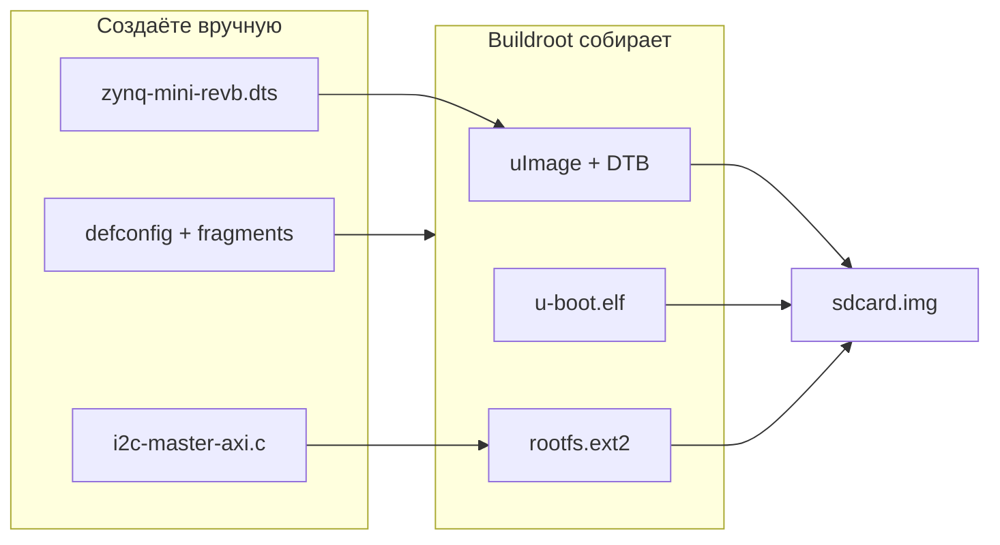
```mermaid
flowchart LR
    subgraph create["Создаёте вручную"]
        DTS[zynq-mini-revb.dts]
        DRV[i2c-master-axi.c]
        CFG[defconfig + fragments]
    end
    subgraph br["Buildroot собирает"]
        K[uImage + DTB]
        U[u-boot.elf]
        R[rootfs.ext2]
    end
    DTS --> K
    DRV --> R
    CFG --> br
    K --> IMG[sdcard.img]
    U --> IMG
    R --> IMG
```

| Артефакт | Назначение |
|----------|------------|
| `uImage` | Ядро Linux для U-Boot `bootm` |
| `zynq-mini-revb.dtb` | Описание железа для ядра |
| `u-boot` | ELF второй стадии загрузки (в `BOOT.BIN`) |
| `sdcard.img` | MBR: FAT32 (boot) + ext4 (root) |

---

## B.1. Рабочий каталог и зависимости

```bash
export WORK=~/zynq-mini-linux
mkdir -p "$WORK"
cd "$WORK"
```

Пакеты на хосте (Debian/Ubuntu) — те же, что в §2.3 этого мануала: `build-essential`, `bc`, `bison`, `flex`, `libssl-dev`, `git`, `rsync`, `wget`, `cpio`, `unzip`, `device-tree-compiler`, `gawk`, `u-boot-tools`, `python3`, `mtools`, `dosfstools`.

---

## B.2. Клон upstream Buildroot

```bash
cd "$WORK"
git clone --branch 2024.02.7 --depth 1 \
    https://gitlab.com/buildroot.org/buildroot.git buildroot-2024.02.7
export BR_SRC="$WORK/buildroot-2024.02.7"
export BR_OUT="$WORK/br-output"
mkdir -p "$BR_OUT"
```

**Почему 2024.02.7:** LTS-ветка с предсказуемыми версиями Linux 6.6.x и U-Boot 2024.01, проверенными на Zynq-7000.

---

## B.3. Каркас BR2_EXTERNAL

Buildroot позволяет вынести «плату» в отдельное дерево **`BR2_EXTERNAL`**. Создайте структуру:

```bash
export BR_EXT="$WORK/board-support"
mkdir -p "$BR_EXT"/{configs,board/zynq_mini_revb,dts,package/i2c-master-axi}
```

### B.3.1. `external.desc`, `external.mk`, `Config.in` — зачем три файла

Это **паспорт** вашего каталога `board-support/` для Buildroot: без них `make BR2_EXTERNAL=... defconfig` не подхватит рецепты платы и пакет `i2c-master-axi`.

| Файл | Когда читается | Роль одной фразой |
|------|----------------|-------------------|
| **`external.desc`** | При старте Buildroot, до сборки | **Имя** дерева → переменная `BR2_EXTERNAL_ZYNQ_MINI_I2C_PATH` |
| **`external.mk`** | Фаза make (подключение рецептов) | **Сборка:** подключает все `package/*/*.mk` |
| **`Config.in`** | `menuconfig` / `defconfig` | **Конфигурация:** пункты в меню `make menuconfig` |

```text
  BR2_EXTERNAL=board-support/
        │
        ├── external.desc     →  name: ZYNQ_MINI_I2C
        │                        BR2_EXTERNAL_ZYNQ_MINI_I2C_PATH
        ├── external.mk       →  include package/i2c-master-axi/*.mk
        └── Config.in         →  menuconfig: [ ] i2c-master-axi
```

#### `external.desc` — регистрация дерева

Две строки в формате Buildroot. Поле **`name:`** критично: из него Buildroot делает имя переменной  
`BR2_EXTERNAL_<NAME>_PATH` → у нас **`BR2_EXTERNAL_ZYNQ_MINI_I2C_PATH`** (верхний регистр, подчёркивания).  
Эту переменную дальше используют `defconfig`, `i2c-master-axi.mk` и пути к `board/`, `dts/`.

```bash
cat > "$BR_EXT/external.desc" << 'EOF'
name: ZYNQ_MINI_I2C
desc: ZYNQ MINI Rev B + custom AXI I2C (manual BR2_EXTERNAL)
EOF
```

| Поле | Смысл |
|------|--------|
| `name` | Идентификатор дерева (только латиница/цифры/`_`) |
| `desc` | Комментарий для человека в логах Buildroot |

#### `external.mk` — подключение makefile-рецептов

Одна строка: «возьми все `*.mk` из подкаталогов `package/`».  
Без неё файл `package/i2c-master-axi/i2c-master-axi.mk` **не участвует** в сборке, даже если лежит на диске.

```bash
cat > "$BR_EXT/external.mk" << 'EOF'
include $(sort $(wildcard $(BR2_EXTERNAL_ZYNQ_MINI_I2C_PATH)/package/*/*.mk))
EOF
```

#### `Config.in` — пункты в меню конфигурации

Корневое меню Kconfig для ваших пакетов. Строка `source .../i2c-master-axi/Config.in` добавляет в `menuconfig` опцию **`BR2_PACKAGE_I2C_MASTER_AXI`** (включить модуль `i2c-master-axi` в rootfs).  
В `zynq_mini_revb_defconfig` позже ставят `BR2_PACKAGE_I2C_MASTER_AXI=y`.

```bash
cat > "$BR_EXT/Config.in" << 'EOF'
menu "ZYNQ MINI Rev B (manual)"
source "$BR2_EXTERNAL_ZYNQ_MINI_I2C_PATH/package/i2c-master-axi/Config.in"
endmenu
EOF
```

> **Не путать** с `package/i2c-master-axi/Config.in` (B.8) — тот описывает **один** пакет; корневой `Config.in` только **подключает** его в общее меню.

---

## B.4. Device Tree — подробное руководство по составлению DTS

Этот раздел — **самостоятельный учебник** по Device Tree для ZYNQ MINI Rev B. Вы пишете файл `zynq-mini-revb.dts` **с нуля**; каждое число должно быть **обосновано** схемой платы, настройками PS7 в Vivado или даташитом OLED.

### B.4.0. Зачем ядру нужен Device Tree

На классическом ПК «железо» описывает BIOS/UEFI. На встраиваемых ARM (и на Zynq) роль **карты железа** выполняет **Device Tree**:

| Понятие | Файл | Кто читает |
|---------|------|------------|
| **DTS** | `zynq-mini-revb.dts` | Вы (текст, правки) |
| **DTB** | `zynq-mini-revb.dtb` | Ядро Linux при старте |
| **Binding** | документация в `Documentation/devicetree/bindings/` | Автор DTS + драйвер |

**Цепочка сборки** (Buildroot делает это автоматически, но смысл тот же):

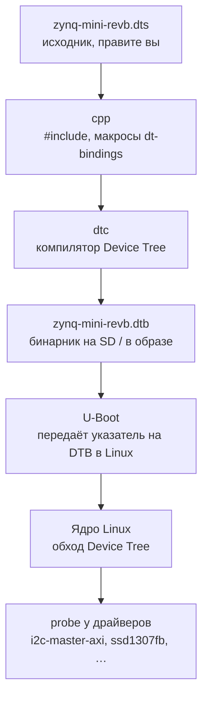
```mermaid
flowchart TB
    DTS["zynq-mini-revb.dts<br/>исходник, правите вы"]
    CPP["cpp<br/>#include, макросы dt-bindings"]
    DTC["dtc<br/>компилятор Device Tree"]
    DTB["zynq-mini-revb.dtb<br/>бинарник на SD / в образе"]
    UB["U-Boot<br/>передаёт указатель на DTB в Linux"]
    KRN["Ядро Linux<br/>обход Device Tree"]
    PRB["probe у драйверов<br/>i2c-master-axi, ssd1307fb, …"]

    DTS --> CPP --> DTC --> DTB --> UB --> KRN --> PRB
```

**Что происходит на плате без правильного DTS:**

- неверный `memory` → kernel panic ещё до `init`;
- нет узла `i2c@43c00000` → модуль `i2c-master-axi` **не вызывается** → нет `/dev/i2c-1`;
- нет `oled@3c` → нет `/dev/fb0`;
- неверный `bootargs` → root не смонтируется с SD.

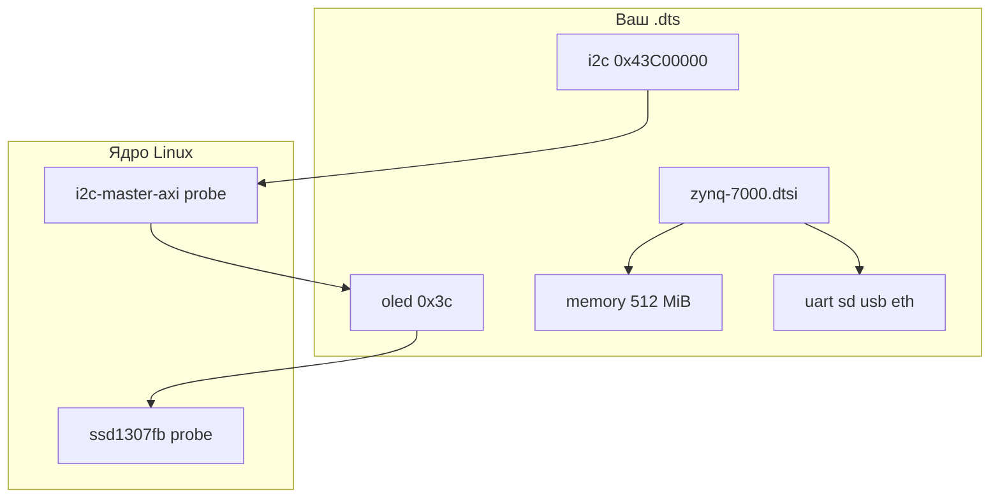
```mermaid
flowchart TB
    subgraph dts["Ваш .dts"]
        INC["zynq-7000.dtsi"]
        MEM["memory 512 MiB"]
        PS["uart sd usb eth"]
        PL["i2c 0x43C00000"]
        OLED["oled 0x3c"]
    end
    subgraph kernel["Ядро Linux"]
        PROBE1["i2c-master-axi probe"]
        PROBE2["ssd1307fb probe"]
    end
    INC --> MEM
    INC --> PS
    PL --> PROBE1
    PROBE1 --> OLED
    OLED --> PROBE2
```

---

### B.4.1. Синтаксис: узлы, свойства, метки

Device Tree — **не C** и **не JSON**. Это дерево **узлов** (devices) со **свойствами** (key = value).

| Конструкция | Пример | Смысл |
|-------------|--------|--------|
| **Узел** | `uart1: serial@e0001000 { ... };` | Один «чип» или логический блок |
| **Имя узла** | `serial@e0001000` | Человекочитаемое имя + **адрес** после `@` (не всегда физический!) |
| **Метка (label)** | `uart1:` перед узлом | Имя для ссылок `&uart1` из других мест файла |
| **Свойство** | `status = "okay";` | Пара ключ–значение |
| **Строка** | `"okay"` | В кавычках |
| **Число** | `<115200>` | Одно 32-битное значение в угловых скобках |
| **Массив** | `<0x43c00000 0x1000>` | Несколько 32-битных ячеек подряд |
| **Пустое свойство** | `broken-cd;` | Флаг «истина» без значения |
| **Phandle** | `serial0 = &uart1;` | Указатель на другой узел (для ссылок) |
| **Include** | `#include "xilinx/zynq-7000.dtsi"` | Вставка чужого файла (из дерева ядра) |
| **Overlay / patch** | `&uart1 { status = "okay"; };` | **Дописать** свойства к узлу из `.dtsi` |

**`#address-cells` и `#size-cells`** — сколько 32-битных чисел в каждой «ячейке» свойства `reg`:

- у корня Zynq часто `#address-cells = <1>;` `#size-cells = <1>;` → `reg = <адрес размер>;`
- у I²C-шины **дети** — только адрес устройства: `#size-cells = <0>;` → `reg = <0x3c>;`

**`compatible`** — **самое важное** свойство для драйвера. Ядро ищет драйвер по списку строк **слева направо** (от специфичного к общему):

```text
compatible = "user,i2c-master-axi-1.0";
              └─ должна совпасть с of_match_table[] в i2c-master-axi.c
```

Если строка не совпала — **probe не вызовется**, даже если `reg` правильный.

---

### B.4.2. Откуда брать значения (сводная таблица)

| Параметр в DTS | Значение | Источник |
|----------------|----------|----------|
| Базовый адрес IP | `0x43C00000` | Vivado **Address Editor** → шаг 10, [§12](GUIDE_VIVADO_VITIS_FROM_SCRATCH.md) |
| Размер окна `reg` | `0x1000` (4 KiB) | Vivado Address Editor → **Range**; хватает для регистров `0x00…0x18` |
| FCLK0 частота | 50 MHz | PS7 → **FCLK_CLK0** → [§7.3.6](GUIDE_VIVADO_VITIS_FROM_SCRATCH.md) |
| `clocks = <&clkc 15>` | индекс **15** | Binding clock Zynq: FCLK0 = 15-й выход CCU |
| `input-clock-frequency` | `50000000` | То же, что FCLK0 (Гц) |
| `clock-frequency` (I²C) | `100000` | Желаемая частота SCL (100 kHz standard mode) |
| IRQ в DTS | `<0 29 4>` | Три ячейки свойства `interrupts` для GIC — см. расшифровку ниже |
| DDR размер | `0x20000000` (512 MiB) | Чип **MT41J256M16** × 16-bit → [§7.3.4](GUIDE_VIVADO_VITIS_FROM_SCRATCH.md), схема U1 |
| UART | `&uart1` | MIO 48/49 → `ttyPS0` → [§7.3.5](GUIDE_VIVADO_VITIS_FROM_SCRATCH.md) |
| SD | `&sdhci0` | MIO 40..45 → [§7.3.5](GUIDE_VIVADO_VITIS_FROM_SCRATCH.md) |
| Ethernet PHY | `reg = <1>` | RTL8211E на MDIO адресе **1** (схема) |
| QSPI flash | `winbond,w25q128` | Чип **W25Q128** 16 MiB, PS QSPI MIO 1..6 ([§7.3.5](GUIDE_VIVADO_VITIS_FROM_SCRATCH.md)); для SD-boot не нужен для **загрузки**, нужен для **/dev/mtd*** |
| OLED I²C addr | `0x3c` | Даташит SSD1306 (7-bit; иногда `0x3d`) |
| OLED размер | 128×64 | Модуль / даташит |
| `root=/dev/mmcblk0p2` | 2-й раздел SD | Ваша разметка `genimage` (FAT=p1, ext4=p2) |
| Пины OLED | T20/P20 | `vivado/pins.xdc`, схема **CAM1** — в DTS **не** указываются (это XDC/bitstream) |

**`<0 29 4>` — откуда три числа** (цепочка `IRQ_F2P[0]` → GIC → DTS):

| Ячейка | Число | Источник |
|--------|-------|----------|
| 0 | **`0`** | Binding **ARM GIC**: первая ячейка = тип линии; **`0`** = SPI (Shared Peripheral), не PPI |
| 1 | **`29`** | **Vivado:** `irq_o` → `ps7/IRQ_F2P[0]` → **UG585 / [§1.6](GUIDE_VIVADO_VITIS_FROM_SCRATCH.md):** fabric IRQ №0 = GIC SPI **61** → в DT пишут **61 − 32** (ячейки 0…31 зарезервированы под SGI/PPI внутри CPU) |
| 2 | **`4`** | **`#include <dt-bindings/interrupt-controller/irq.h>`** → `IRQ_TYPE_LEVEL_HIGH` = **4** (прерывание по уровню, активный HIGH — как `irq_o` в `i2c_master_axi`) |

`IRQ_F2P[1]` дало бы **`<0 30 4>`** (SPI 62). Подробнее — **B.4.10**.

> **Важно:** пины PL (T20, P20) описывает **только bitstream + XDC**, не Device Tree. DTS говорит ядру: «по адресу 0x43C00000 есть I²C-контроллер»; **куда** выведены провода — ответственность FPGA-конфигурации.

---

### B.4.3. Заголовок файла: `/dts-v1/`, `#include`, dt-bindings

```dts
/dts-v1/;
```

Обязательная «магическая» строка версии формата DT.

```dts
#include "xilinx/zynq-7000.dtsi"
```

| Что даёт `zynq-7000.dtsi` | Зачем вам |
|---------------------------|-----------|
| Описание **PS7**: CPU, GIC (`intc`), `clkc`, шаблоны `uart1`, `sdhci0`, `gem0`, `usb0`, `qspi` | Не переписывать тысячи строк |
| Узлы по умолчанию `status = "disabled"` | Вы **включаете** только нужное через `&uart1 { status = "okay"; }` |

**Путь include:** в Linux ≥ 6.5 файл лежит в `arch/arm/boot/dts/xilinx/zynq-7000.dtsi`. Buildroot копирует ваш `.dts` в корень `dts/`, поэтому пишем `"xilinx/zynq-7000.dtsi"`.

```dts
#include <dt-bindings/interrupt-controller/irq.h>
```

Подключает константы вроде **`IRQ_TYPE_LEVEL_HIGH`** (тип прерывания для GIC). Без этого пришлось бы писать «голое» число `4`.

---

### B.4.4. Корневой узел `/`

```dts
/ {
	model = "ZYNQ MINI Rev B (manual Linux port)";
	compatible = "user,zynq-mini-revb", "xlnx,zynq-7000";
```

| Свойство | Назначение |
|----------|------------|
| `model` | Строка для человека (`/proc/device-tree/model`) |
| `compatible` | Первая строка — **ваша** плата; вторая — **семейство** чипа. Драйверы платформы могут искать `xlnx,zynq-7000` |

Здесь же позже добавляются `aliases`, `chosen`, `memory@0`.

---

### B.4.5. `aliases` — короткие имена

```dts
aliases {
	ethernet0 = &gem0;
	i2c0      = &i2c_pl;
	serial0   = &uart1;
	spi0      = &qspi;
};
```

| Alias | Указывает на | Зачем |
|-------|--------------|--------|
| `serial0` | `&uart1` | `stdout-path = "serial0:115200n8"` в `chosen` |
| `i2c0` | `&i2c_pl` | Удобная ссылка; номер **`i2c-1`** в Linux всё равно назначает ядро по порядку регистрации |
| `ethernet0` | `&gem0` | DHCP в Buildroot (`eth0`) |

**Метка `i2c_pl:`** вы задаёте сами при объявлении узла `i2c_pl: i2c@43c00000` — без неё `&i2c_pl` не сработает.

---

### B.4.6. `chosen` — параметры командной строки ядра

```dts
chosen {
	bootargs = "console=ttyPS0,115200 earlycon fbcon=font:MINI4x6 root=/dev/mmcblk0p2 rootwait rw";
	stdout-path = "serial0:115200n8";
};
```

Разбор **каждого** аргумента `bootargs`:

| Токен | Значение | Откуда |
|-------|----------|--------|
| `console=ttyPS0,115200` | Консоль ядра на **UART1** PS | MIO 48/49 → драйвер `ttyPS0`, 115200 из PS7 config |
| `earlycon` | Ранний вывод до полной инициализации UART | Удобно при отладке boot |
| `fbcon=font:MINI4x6` | Шрифт виртуальной консоли на framebuffer | Нужен `CONFIG_FONT_MINI_4x6` в `linux.fragment` |
| `root=/dev/mmcblk0p2` | Корневая ФС на **2-м разделе** SD | `genimage.cfg`: partition 1 = FAT, 2 = ext4 |
| `rootwait` | Ждать появления root-устройства | SD может инициализироваться с задержкой |
| `rw` | Монтировать root read-write | Для разработки |

`stdout-path` связывает ранний вывод с alias **`serial0`** → `&uart1`.

---

### B.4.7. `memory@0` — описание DDR

```dts
memory@0 {
	device_type = "memory";
	reg = <0x0 0x20000000>;
};
```

| Поле | Смысл |
|------|--------|
| `reg = <0x0 0x20000000>` | Начало **0**, размер **0x20000000** байт = **536 870 912** = **512 MiB** |
| `device_type = "memory"` | Устаревшее, но некоторые парсеры ещё ожидают |

**Откуда 512 MiB:** на плате один чип DDR3 **MT41J256M16RE-125** (256 Mbit × 16 bit = 512 MB). В Vivado PS7 → DDR → **Device Capacity 4096 MBits** ([§7.3.4](GUIDE_VIVADO_VITIS_FROM_SCRATCH.md)). Если поставить меньший размер — ядро увидит не всю RAM или упадёт при обращении за предел.

**Проверка на работающей системе:** `grep MemTotal /proc/meminfo` ≈ 512000 kB.

---

### B.4.8. Патчи периферии PS: `&uart1`, `&sdhci0`, …

Синтаксис **`&имя_метки { ... };`** **не создаёт** новый узел — он **дополняет** узел из `zynq-7000.dtsi`.

#### `&uart1`

```dts
&uart1 { status = "okay"; };
```

В `.dtsi` UART1 по умолчанию **disabled**. `status = "okay"` включает драйвер → устройство **`/dev/ttyPS0`**.

#### `&sdhci0` (SD-карта)

```dts
&sdhci0 {
	status = "okay";
	bus-width = <4>;
	broken-cd;
	disable-wp;
};
```

| Свойство | Зачем на ZYNQ MINI |
|----------|-------------------|
| `bus-width = <4>` | 4-битная SD (не 1-bit) |
| `broken-cd` | Нет линии Card Detect на разъёме TF ([§7.3.5](GUIDE_VIVADO_VITIS_FROM_SCRATCH.md)) |
| `disable-wp` | Нет Write Protect |

Без `broken-cd` драйвер может считать, что карты нет, и не монтировать.

#### `&gem0` (Ethernet)

```dts
&gem0 {
	status = "okay";
	local-mac-address = [00 0a 35 01 02 03];
	phy-mode = "rgmii-id";
	phy-handle = <&ethernet_phy>;
	ethernet_phy: ethernet-phy@1 {
		reg = <1>;
		device_type = "ethernet-phy";
	};
};
```

| Свойство | Источник |
|----------|----------|
| `local-mac-address` | **Фиксированный MAC** GEM0 — не меняется после reboot (см. **B.10.6**, **`/etc/eth0-mac`**) |
| `phy-mode = "rgmii-id"` | RTL8211E + RGMII с задержками на плате |
| `phy-handle = <&ethernet_phy>` | Ссылка на **внешний PHY** (см. ниже) — без неё драйвер MAC не знает, с каким чипом говорить по MDIO |
| `ethernet_phy: ethernet-phy@1` | Дочерний узел: чип **RTL8211E** на шине MDIO |
| `reg = <1>` на PHY | Адрес MDIO **1** (схема, не произвольное число) |

**Почему MAC «прыгает» без `local-mac-address`:** драйвер **`xilinx_gem`** при отсутствии адреса в DT/U-Boot может назначить **случайный** locally-administered MAC — DHCP и **SSH** по IP «работают», но после каждой перезагрузки роутер видит «новое» устройство. Строка **`local-mac-address`** в DT — основной способ закрепить адрес (пересборка **DTB**, **B.14** `linux-rebuild`).

**Зачем `phy-handle`:** на плате Ethernet — это **два** устройства: **GEM** (MAC в PS, узел `&gem0`) и **PHY** (отдельная микросхема за разъёмом RJ45). Между ними — линии **RGMII** (данные) и **MDIO/MDC** (управление: link up/down, autonegotiation, скорость). Узел `ethernet-phy@1` описывает PHY; метка `ethernet_phy:` даёт имя для ссылки. Строка `phy-handle = <&ethernet_phy>` говорит драйверу `xilinx_gem`: «мой PHY — вот этот узел» — он регистрирует PHY через `of_phy_connect()` и настраивает линк. Это **не** IP-адрес и не адрес регистров AXI; только связь MAC↔PHY в дереве устройств.

#### `&usb0`

```dts
&usb0 {
	status = "okay";
	dr_mode = "host";
	usb-phy = <&usb_phy0>;
};
```

`dr_mode = "host"` — USB3320C как **host** (клавиатура). Дочерний `usb_phy0` с `compatible = "usb-nop-xceiv"` — заглушка PHY (на Zynq часто так).

#### `&qspi` (SPI NOR flash на плате)

На ZYNQ MINI Rev B стоит **Winbond W25Q128** (128 Mbit = **16 MiB** NOR) на выводах **PS QSPI** (MIO 1..6, feedback MIO 8 — [§7.3.5](GUIDE_VIVADO_VITIS_FROM_SCRATCH.md)). Узел в DTS нужен, чтобы ядро знало **какой чип** висит на контроллере и как к нему обращаться.

**Связь с загрузкой SD-boot:** для сценария «`BOOT.BIN` с TF-карты» QSPI **не обязателен** — BootROM в режиме SD его не читает. Но без описания `&qspi` в Linux **не появится** `/dev/mtd*` и нельзя будет смонтировать/прошить flash из ОС (резервный образ, factory data, эксперимент с boot mode `010` = QSPI). Поэтому узел оставляют включённым — это «опционально для **загрузки**», но полезно для **работы** с flash после старта.

```dts
&qspi {
	status = "okay";
	is-dual = <0>;
	num-cs = <1>;
	flash@0 {
		compatible = "winbond,w25q128", "jedec,spi-nor";
		reg = <0>;
		spi-max-frequency = <100000000>;
		spi-tx-bus-width = <1>;
		spi-rx-bus-width = <4>;
		#address-cells = <1>;
		#size-cells = <1>;

		partition@0 {
			label = "boot";
			reg = <0x0 0x100000>;
		};
		partition@100000 {
			label = "user";
			reg = <0x100000 0xf00000>;
		};
	};
};
```

| Свойство | Значение | Смысл |
|----------|----------|--------|
| `status = "okay"` | включить | Базовый узел `qspi` уже есть в `zynq-7000.dtsi` — патч **активирует** его |
| `is-dual = <0>` | один чип | На плате **один** W25Q128, не два flash в dual-stack |
| `num-cs = <1>` | один CS | Один chip-select (single-SS в Vivado) |
| `flash@0` / `reg = <0>` | CS0 | Первый (и единственный) slave на QSPI |
| `compatible` | `winbond,w25q128` + `jedec,spi-nor` | Драйвер **`spi-nor`** в ядре распознаёт чип по JEDEC ID |
| `spi-max-frequency` | 100 MHz | Верхняя частота шины (реальная ниже из-за делителя QSPI) |
| `spi-tx-bus-width = <1>` | 1 линия TX | Команды/адрес — обычный SPI |
| `spi-rx-bus-width = <4>` | 4 линии RX | Чтение данных — **Quad** (быстрее) |
| `partition@0` `boot` | 1 MiB с 0 | Пример разметки: зона под FSBL/образ (если грузитесь с QSPI) |
| `partition@100000` `user` | 15 MiB | Остаток 16 MiB flash под данные |

**`aliases { spi0 = &qspi; }`** — старое имя шины SPI в userspace/документации; на Zynq QSPI часто фигурирует как `spi0`, хотя физически это **Quad SPI** контроллер PS.

**В Linux после загрузки** (если в defconfig есть `CONFIG_MTD`, `CONFIG_SPI_ZYNQ_QSPI`, `CONFIG_MTD_SPI_NOR`):

```text
/proc/mtd          →  mtd0: boot, mtd1: user  (если заданы partition@)
/dev/mtdblock0     →  блочное устройство на раздел boot
```

Проверка: `cat /proc/mtd`, `dmesg | grep -i spi`. Если разделы не нужны — блок `partition@…` можно убрать: останется один MTD на весь чип (~16 MiB).

> **Минимальный DTS:** достаточно `status`, `compatible`, `reg`, `spi-max-frequency` — как в урезанном фрагменте B.4.12; разделы и `spi-*-bus-width` — уточнение под реальную плату и удобную разметку.

#### `&clkc` (тактирование PS/PL)

```dts
&clkc {
	ps-clk-frequency = <33333333>;
	fclk-enable = <0xf>;
};
```

| Свойство | Смысл |
|----------|--------|
| `ps-clk-frequency` | Вход PS PLL **33.333 MHz** (кварц на плате) |
| `fclk-enable = <0xf>` | Битовая маска: включены FCLK0..3 (бит 0 = FCLK0). Достаточно `0x1`, если включён только FCLK0 |

---

### B.4.9. Шина PL: `amba_pl` и `simple-bus`

```dts
amba_pl: amba_pl@0 {
	compatible = "simple-bus";
	#address-cells = <1>;
	#size-cells = <1>;
	ranges;
	/* дочерние узлы PL */
};
```

| Элемент | Зачем |
|---------|--------|
| `compatible = "simple-bus"` | Стандартный «пассивный» контейнер; ядро **не** имеет отдельного драйвера — только пробегает детей |
| `ranges;` (пустое) | Дочерние адреса **1:1** совпадают с адресным пространством CPU (типично для Zynq GP0) |
| `#address-cells` / `#size-cells` | Формат `reg` у детей: адрес + размер |

**Почему отдельный корень `/ { amba_pl... }`:** исторически PL на Zynq описывают как AMBA bus. Можно было бы повесить `i2c@43c00000` прямо под `/`, но контейнер `simple-bus` — принятая практика Xilinx.

---

### B.4.10. Узел `i2c_pl: i2c@43c00000` — ваш IP в PL

```dts
i2c_pl: i2c@43c00000 {
	compatible = "user,i2c-master-axi-1.0";
	reg = <0x43c00000 0x1000>;
	interrupt-parent = <&intc>;
	interrupts = <0 29 IRQ_TYPE_LEVEL_HIGH>;
	clocks = <&clkc 15>;
	clock-names = "axi";
	clock-frequency = <100000>;
	input-clock-frequency = <50000000>;
	#address-cells = <1>;
	#size-cells = <0>;
	/* oled@3c */
};
```

Построчно:

#### Имя узла `i2c@43c00000`

Число после `@` **должно совпадать** с физическим базовым адресом в `reg` (соглашение Devicetree, не требование железа).

#### `compatible = "user,i2c-master-axi-1.0"`

| Кто читает | Действие |
|------------|----------|
| Модуль `i2c-master-axi.ko` | `of_match_table` → вызов `probe()` |
| Человек | Префикс `user,` — ваш vendor binding |

Строка **должна буквально совпадать** с C-кодом драйвера. Опечатка → модуль загружен, но устройство не создано.

#### `reg = <0x43c00000 0x1000>`

| Ячейка | Значение | Источник |
|--------|----------|----------|
| 1 | `0x43C00000` | Vivado Address Editor, шаг 10 |
| 2 | `0x1000` | Range **4K** в Address Editor |

Драйвер делает `devm_platform_ioremap_resource()` → доступ к регистрам **CTRL, STATUS, …** по смещениям из §1.4 Vivado-мануала.

Если адрес в DTS ≠ адрес в Vivado → чтение регистров попадёт в «чужую» память → зависание или bus fault.

#### Прерывания

```dts
interrupt-parent = <&intc>;
interrupts = <0 29 IRQ_TYPE_LEVEL_HIGH>;
```

Формат для **ARM GIC** (см. `interrupts-extended` / GIC binding):

| Ячейка | Значение | Объяснение |
|--------|----------|------------|
| 0 | `0` | **0** = SPI (Shared Peripheral Interrupt), **1** = PPI |
| 1 | `29` | Номер SPI **в пространстве DT** = аппаратный ID **минус 32** |
| 2 | `IRQ_TYPE_LEVEL_HIGH` | Активный уровень HIGH |

**Расчёт для `IRQ_F2P[0]`:**

```text
Vivado: irq_o → ps7 IRQ_F2P[0]
UG585 / §1.6: первый fabric IRQ = GIC interrupt ID 61
Device Tree SPI number = 61 - 32 = 29
```

Если в BD подключили **`IRQ_F2P[1]`** → было бы **30**. Если прерывание не подключали — свойство `interrupts` можно опустить (драйвер работает в polled mode).

#### Часы

```dts
clocks = <&clkc 15>;
clock-names = "axi";
```

| Элемент | Источник |
|---------|----------|
| `&clkc` | Узел clock controller из `zynq-7000.dtsi` |
| `15` | Индекс выхода **FCLK_CLK0** в binding Xilinx Zynq clock |
| `clock-names = "axi"` | Имя для `devm_clk_get(dev, "axi")` или `NULL` в упрощённом драйвере |

Частота FCLK0 задаётся в **PS7 Clock Configuration → 50 MHz** ([§7.3.6](GUIDE_VIVADO_VITIS_FROM_SCRATCH.md)).

#### Частоты I²C

```dts
clock-frequency = <100000>;
input-clock-frequency = <50000000>;
```

| Свойство | Кто читает | Формула |
|----------|------------|---------|
| `input-clock-frequency` | `i2c-master-axi.c` | PRESCALE от **тактов AXI** (50 MHz) |
| `clock-frequency` | тот же драйвер | Целевая **SCL** (100 kHz) |

\( \text{PRESCALE} = \frac{f_{\text{input}}}{4 \cdot f_{\text{SCL}}} - 1 = \frac{50\,000\,000}{400\,000} - 1 = 124 \)

Совпадает с **`DEFAULT_PRESCALE = 124`** в Vivado ([шаг 8.1](GUIDE_VIVADO_VITIS_FROM_SCRATCH.md)).

#### `#address-cells = <1>;` / `#size-cells = <0>;` — формат адресов **детей** I²C

Эти две строки стоят **внутри** `i2c_pl`, но описывают **не** сам контроллер, а **дочерние** узлы (`oled@3c`). В Device Tree родитель объявляет: «у моих детей свойство `reg` разбирается так-то».

```text
amba_pl                    i2c_pl (I²C-адаптер)           oled@3c (slave)
#address-cells = <1>       #address-cells = <1>          reg = <0x3c>
#size-cells = <1>          #size-cells = <0>                  ↑
       │                          │                    одна ячейка = 7-bit
       ▼                          ▼                    I²C-адрес, без «размера»
reg = <0x43C00000 0x1000>   (MMIO контроллера)        (не адрес DDR/AXI!)
```

| Уровень | `#address-cells` | `#size-cells` | Пример `reg` | Что означает |
|---------|------------------|---------------|--------------|--------------|
| **`amba_pl`** (шина PL) | 1 | 1 | `<0x43c00000 0x1000>` | **База + размер** окна AXI (MMIO) |
| **`i2c_pl`** (I²C host) | 1 | **0** | — у самого узла `reg` по-прежнему от **родителя** `amba_pl` | Детям нужен только **номер на шине I²C** |
| **`oled@3c`** (slave) | — | — | `<0x3c>` | **7-bit адрес** SSD1306 на SDA/SCL |

Почему **`#size-cells = <0>`:** у I²C-устройства нет «блока памяти» в карте CPU — только адрес слейва (0x3C). Размер не указывают (binding `i2c-bus`). Если бы поставили `<1>` по ошибке, ядро ожидало бы `reg = <адрес размер>` у OLED и не сопоставило бы узел.

Почему **`#address-cells = <1>`:** одна 32-битная ячейка — стандарт для I²C в DT (`reg = <0x3c>`). Имя узла `oled@3c` должно совпадать с этой цифрой (соглашение, как у `i2c@43c00000`).

**Свойства контроллера** (`compatible`, `reg` MMIO, `interrupts`, `clocks`, `clock-frequency`, …) от `#address-cells` на I²C-узле **не зависят** — они описывают **ваш IP**; пара `#address-cells` / `#size-cells` здесь нужна только чтобы корректно разобрать **детей** и чтобы `ssd1306fb` нашёл OLED по `reg = <0x3c>`.

---

### B.4.11. Дочерний узел `ssd1306: oled@3c`

```dts
ssd1306: oled@3c {
	compatible = "solomon,ssd1306fb-i2c";
	reg = <0x3c>;
	solomon,height = <64>;
	solomon,width  = <128>;
	solomon,page-offset = <0>;
	solomon,com-invdir;
	solomon,prechargep1 = <2>;
	solomon,prechargep2 = <2>;
};
```

| Свойство | Источник / смысл |
|----------|------------------|
| `reg = <0x3c>` | **7-bit** I²C адрес OLED (даташит SSD1306; SA0=0 → 0x3C, SA0=1 → 0x3D) |
| `compatible = "solomon,ssd1306fb-i2c"` | Встроенный драйвер ядра `ssd1307fb.c` (FB_SSD1307) |
| `solomon,width/height` | Разрешение панели 128×64 |
| `solomon,com-invdir` | Команда COM scan direction — верх экрана совпадает с (0,0) |
| `solomon,prechargep*` | Тайминг pre-charge из даташита / подбор под модуль |

**Порядок инициализации на плате:**

1. `i2c-master-axi` регистрирует адаптер → **`i2c-1`** (номер может отличаться, смотрите `/sys/bus/i2c/devices/`).
2. Ядро сканирует детей DT на этой шине → находит `0x3c` → `ssd1307fb` probe → **`/dev/fb0`**.

**Проводка CAM1 (T20/P20)** в DTS **не описывается** — только в **XDC** и bitstream. Если `i2cdetect` не видит `3c` — сначала проверьте bitstream и пины, потом DTS.

---

### B.4.12. Полный файл DTS для копирования

После того как понятен смысл каждого блока, создайте файл:

```bash
cat > "$BR_EXT/dts/zynq-mini-revb.dts" << 'EOF'
```

и вставьте содержимое (то же, что в прежнем B.4.2, с вашими комментариями при желании):

```dts
/dts-v1/;

#include "xilinx/zynq-7000.dtsi"
#include <dt-bindings/gpio/gpio.h>
#include <dt-bindings/interrupt-controller/irq.h>

/ {
	model = "ZYNQ MINI Rev B (manual Linux port)";
	compatible = "user,zynq-mini-revb", "xlnx,zynq-7000";

	aliases {
		ethernet0 = &gem0;
		i2c0      = &i2c_pl;
		serial0   = &uart1;
		spi0      = &qspi;
	};

	chosen {
		bootargs = "console=ttyPS0,115200 earlycon fbcon=font:MINI4x6 root=/dev/mmcblk0p2 rootwait rw";
		stdout-path = "serial0:115200n8";
	};

	memory@0 {
		device_type = "memory";
		reg = <0x0 0x20000000>;
	};
};

&uart1 { status = "okay"; };

&sdhci0 {
	status = "okay";
	bus-width = <4>;
	broken-cd;
	disable-wp;
};

&gem0 {
	status = "okay";
	local-mac-address = [00 0a 35 01 02 03];
	phy-mode = "rgmii-id";
	phy-handle = <&ethernet_phy>;
	ethernet_phy: ethernet-phy@1 {
		reg = <1>;
		device_type = "ethernet-phy";
	};
};

&usb0 {
	status = "okay";
	dr_mode = "host";
	usb-phy = <&usb_phy0>;
};

&qspi {
	status = "okay";
	is-dual = <0>;
	num-cs = <1>;
	flash@0 {
		compatible = "winbond,w25q128", "jedec,spi-nor";
		reg = <0>;
		spi-max-frequency = <100000000>;
		spi-tx-bus-width = <1>;
		spi-rx-bus-width = <4>;
		#address-cells = <1>;
		#size-cells = <1>;

		partition@0 {
			label = "boot";
			reg = <0x0 0x100000>;
		};
		partition@100000 {
			label = "user";
			reg = <0x100000 0xf00000>;
		};
	};
};

&clkc {
	ps-clk-frequency = <33333333>;
	fclk-enable = <0xf>;
};

/ {
	usb_phy0: usb-phy {
		compatible = "usb-nop-xceiv";
		#phy-cells = <0>;
	};

	amba_pl: amba_pl@0 {
		compatible = "simple-bus";
		#address-cells = <1>;
		#size-cells = <1>;
		ranges;

		i2c_pl: i2c@43c00000 {
			compatible = "user,i2c-master-axi-1.0";
			reg = <0x43c00000 0x1000>;
			interrupt-parent = <&intc>;
			interrupts = <0 29 IRQ_TYPE_LEVEL_HIGH>;
			clocks = <&clkc 15>;
			clock-names = "axi";
			clock-frequency = <100000>;
			input-clock-frequency = <50000000>;
			#address-cells = <1>;
			#size-cells = <0>;

			ssd1306: oled@3c {
				compatible = "solomon,ssd1306fb-i2c";
				reg = <0x3c>;
				solomon,height = <64>;
				solomon,width  = <128>;
				solomon,page-offset = <0>;
				solomon,com-invdir;
				solomon,prechargep1 = <2>;
				solomon,prechargep2 = <2>;
			};
		};
	};
};
EOF
```

---

### B.4.13. Проверка DTS и отладка на плате

**После первой сборки ядра** (когда есть `$BR_OUT/build/linux-*`):

```bash
LINUX=$(ls -d "$BR_OUT"/build/linux-* | head -1)
cpp -nostdinc \
  -I "$LINUX/arch/arm/boot/dts" \
  -I "$LINUX/arch/arm/boot/dts/include" \
  -I "$LINUX/include" \
  -undef -x assembler-with-cpp \
  "$BR_EXT/dts/zynq-mini-revb.dts" | \
  dtc -I dts -O dtb -o /tmp/zynq-mini-revb.dtb -
```

Ошибок быть не должно. Типичные сообщения `dtc`:

| Ошибка | Причина |
|--------|---------|
| `Unable to resolve symbol intc` | Нет `#include "xilinx/zynq-7000.dtsi"` |
| `syntax error` | Пропущена `;` или лишняя запятая |
| `Warning (reg_format)` | Несовпадение `@адреса` в имени и в `reg` |

**На загруженной плате:**

```bash
# Дерево в sysfs
ls /proc/device-tree/amba_pl/i2c@43c00000/

# Совпадение compatible
cat /proc/device-tree/amba_pl/i2c@43c00000/compatible
# user,i2c-master-axi-1.0

# Декомпиляция всего дерева
dtc -I fs -O dts /proc/device-tree > /tmp/live.dts
```

| Симптом | Что проверить в DTS / Vivado |
|---------|------------------------------|
| Нет `i2c-1` | `compatible`, `reg`, модуль в rootfs |
| `i2cdetect` пустой, но шина есть | bitstream, XDC T20/P20, питание OLED |
| Нет `/dev/fb0` | `oled@3c`, `CONFIG_FB_SSD1307`, адрес 0x3c vs 0x3d |
| Kernel panic: memory | `reg` в `memory@0` vs реальный DDR |
| Зависание до UART | часто **BOOT.BIN**/FSBL, не DTS |

---

### B.4.14. Частые ошибки при составлении DTS

1. **Скопировали DTS с другой платы** — неверный `memory` или MIO.
2. **Адрес PL из Address Editor не совпал** с `reg` (опечатка `0x43C0000`).
3. **IRQ 61 вместо 29** — в DT для GIC SPI нужно **минус 32**.
4. **Забыли `status = "okay"`** — узел остаётся disabled из `.dtsi`.
5. **Путают I²C 7-bit и 8-bit адрес** — в `reg` всегда **7-bit** (`0x3c`, не `0x78`).
6. **Ждут описания пинов T20/P20 в DTS** — они только в **XDC** + bitstream.
7. **`compatible` не совпадает с драйвером** — тихий провал без probe.

---

## B.5. Фрагмент конфигурации ядра (`linux.fragment`)

### Как работает эта механика

Ядро Linux собирается не «на глаз», а по файлу **`.config`**: десятки тысяч строк `CONFIG_*=y/n/m` — что встроить в `vmlinux`, что модулем, что выключить. Полный `.config` для Zynq+периферия вручную не пишут: берут **готовую базу** и **донакладывают** только нужное.

| Понятие | Что это |
|---------|---------|
| **`multi_v7_defconfig`** | Официальный «скелет» ядра для ARM multiplatform (в т.ч. Zynq-7000) — уже в исходниках Linux |
| **`linux.fragment`** | Ваш короткий список **дополнений** (`CONFIG_FB_SSD1307=y`, …) |
| **`zynq_mini_revb_defconfig`** (B.9) | Говорит Buildroot: *какую* базу взять и *где* лежит фрагмент (`BR2_LINUX_KERNEL_CONFIG_FRAGMENT_FILES`) |

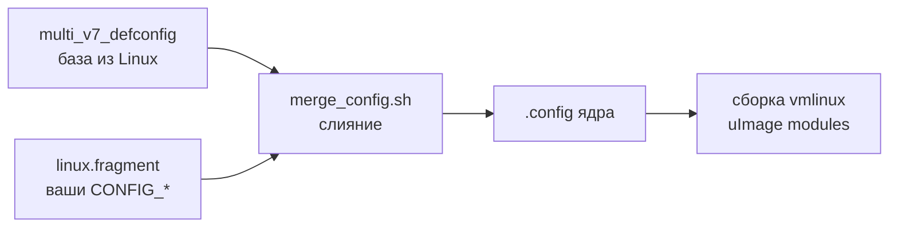
```mermaid
flowchart LR
    BASE["multi_v7_defconfig<br/>база из Linux"]
    FRAG["linux.fragment<br/>ваши CONFIG_*"]
    MERGE["merge_config.sh<br/>слияние"]
    CFG[".config ядра"]
    BUILD["сборка vmlinux<br/>uImage modules"]

    BASE --> MERGE
    FRAG --> MERGE
    MERGE --> CFG --> BUILD
```

**Порядок при `make` в Buildroot** (упрощённо):

1. Распаковка исходников Linux в `$BR_OUT/build/linux-*`.
2. Копирование **`arch/arm/configs/multi_v7_defconfig`** → стартовый `.config`.
3. **Слияние** фрагментов из `BR2_LINUX_KERNEL_CONFIG_FRAGMENT_FILES` (ваш `board/zynq_mini_revb/linux.fragment`) поверх базы — утилита **`scripts/kconfig/merge_config.sh`** из дерева ядра.
4. Правила слияния: строка `CONFIG_FOO=y` в фрагменте **включает** опцию; `# CONFIG_FOO is not set` — **выключает**; опции, которых нет во фрагменте, остаются как в `multi_v7`.
5. Сборка: `uImage`, модули, DTB (DTS задаётся отдельно — `BR2_LINUX_KERNEL_CUSTOM_DTS_PATH`, часть B.4).

**Зачем фрагмент, а не `make linux-menuconfig` на весь kernel:** в репозитории/BR2_EXTERNAL хранится **маленький** переносимый diff (~30 строк), а не гигантский `.config`. Повторяемая сборка на другой машине даёт тот же результат. Аналогия — **`uboot.fragment`** (B.6, §3.5.1).

**Что в фрагменте, а что нет:**

| В `linux.fragment` | Не в фрагменте (другой механизм) |
|--------------------|----------------------------------|
| Встроенные драйверы ядра: `CONFIG_FB_SSD1307`, `CONFIG_SPI_ZYNQ_QSPI`, PHY, USB host | **`i2c-master-axi`** — out-of-tree **модуль** из пакета Buildroot (B.7), в Kconfig ядра его нет |
| Шрифты fbcon для `fbcon=font:MINI4x6` | **Device Tree** — адреса, IRQ, OLED (B.4) |
| Подсистемы: `CONFIG_I2C`, `CONFIG_FB`, `CONFIG_MTD` | Версия ядра — `BR2_LINUX_KERNEL_LATEST_VERSION` в defconfig |

**Связь с defconfig (B.9)** — одна строка связывает файл с сборкой:

```text
BR2_LINUX_KERNEL_DEFCONFIG="multi_v7"
BR2_LINUX_KERNEL_CONFIG_FRAGMENT_FILES="$(BR2_EXTERNAL_...)/board/zynq_mini_revb/linux.fragment"
```

Пока defconfig не создан, фрагмент можно положить на диск «заранее»; Buildroot начнёт его применять после первого `make zynq_mini_revb_defconfig`.

**После правки `linux.fragment`:** пересборка ядра, не всего Buildroot:

```bash
make BR2_EXTERNAL="$BR_EXT" O="$BR_OUT" linux-rebuild all
```

Проверка, что опция попала в итоговый `.config`:

```bash
grep CONFIG_FB_SSD1307 "$BR_OUT/build/linux-"*/.config
```

**Типичные ошибки:** опечатка в имени `CONFIG_*` (молча игнорируется merge); забыли `=y` (опция остаётся выключенной); нужен `CONFIG_FONTS=y` перед отдельными `CONFIG_FONT_*`; изменили фрагмент, но не сделали `linux-rebuild` — на SD старый `uImage`.

---

### B.5.1. Содержимое фрагмента для ZYNQ MINI

Buildroot возьмёт базу **`multi_v7_defconfig`** и **добавит** ваши опции из файла:

```bash
cat > "$BR_EXT/board/zynq_mini_revb/linux.fragment" << 'EOF'
CONFIG_ARCH_ZYNQ=y
CONFIG_SOC_ZYNQ7000=y
CONFIG_DEVTMPFS=y
CONFIG_DEVTMPFS_MOUNT=y
CONFIG_I2C=y
CONFIG_I2C_CHARDEV=y
CONFIG_FB=y
CONFIG_FB_SSD1307=y
CONFIG_FONTS=y
CONFIG_FONT_8x8=y
CONFIG_FONT_8x16=y
CONFIG_FONT_MINI_4x6=y
CONFIG_FONT_6x10=y
CONFIG_REALTEK_PHY=y
CONFIG_USB=y
CONFIG_USB_CHIPIDEA=y
CONFIG_USB_CHIPIDEA_HOST=y
CONFIG_USB_ULPI=y
CONFIG_MTD=y
CONFIG_MTD_SPI_NOR=y
CONFIG_SPI_ZYNQ_QSPI=y
CONFIG_OVERLAY_FS=y
CONFIG_TMPFS=y
EOF
```

| Опция | Зачем |
|-------|--------|
| `CONFIG_FB_SSD1307` | Встроенный драйвер framebuffer для SSD1306 по I²C |
| `CONFIG_FONT_MINI_4x6` | Шрифт для `fbcon=font:MINI4x6` (~32×10 символов на 128×64) |
| `CONFIG_USB_CHIPIDEA_HOST` | USB host для клавиатуры |
| `CONFIG_I2C` | Подсистема I²C (шина появится после загрузки **модуля**) |
| `CONFIG_MTD` + `CONFIG_SPI_ZYNQ_QSPI` | Доступ к QSPI flash из Linux (см. `&qspi` в B.4.8) |

> Полный пример с комментариями — в репозитории `buildroot/board/zynq_mini_revb/linux.fragment` (для справки; в мануале собираете свой файл в `$BR_EXT`).

---

## B.6. Фрагмент U-Boot (`uboot.fragment`)

U-Boot на SD должен **сам** загрузить `uImage` и DTB с FAT, без JTAG и без DTB в регистре `r2`. Теория: **§3.5.1** (`r2`, `CONFIG_OF_EMBED`, `CONFIG_OF_BOARD`, два разных DTB).

```bash
cat > "$BR_EXT/board/zynq_mini_revb/uboot.fragment" << 'EOF'
CONFIG_TOOLS_LIBCRYPTO=y
CONFIG_OF_EMBED=y
CONFIG_USE_BOOTCOMMAND=y
CONFIG_BOOTDELAY=1
CONFIG_BOOTCOMMAND="mmc rescan; mmc dev 0; if fatload mmc 0 0x100000 uEnv.txt 10000; then env import -t 0x100000 10000; if test -n \"$uenvcmd\"; then run uenvcmd; fi; fi; fatload mmc 0 0x3000000 uImage; fatload mmc 0 0x2A00000 zynq-mini-revb.dtb; bootm 0x3000000 - 0x2A00000"
CONFIG_FS_FAT=y
CONFIG_CMD_FAT=y
CONFIG_FS_EXT4=y
CONFIG_CMD_EXT4=y
CONFIG_LEGACY_IMAGE_FORMAT=y
CONFIG_CMD_BOOTM=y
CONFIG_CMD_MMC=y
CONFIG_SYS_PROMPT="zynq-mini> "
EOF
```

| Опция | Зачем |
|-------|--------|
| `CONFIG_OF_EMBED` | DTB **для U-Boot** вшит в ELF — FSBL не передаёт указатель в `r2` (§3.5.1) |
| `# CONFIG_OF_BOARD is not set` | Не ждать DTB в `r2` от FSBL (иначе hang до banner) |
| `CONFIG_BOOTCOMMAND` | Явно: FAT → `uImage` + `zynq-mini-revb.dtb` → `bootm` (DTB **для Linux**) |

### B.6.1. `uEnv.txt` (на FAT разделе)

```bash
cat > "$BR_EXT/board/zynq_mini_revb/uEnv.txt" << 'EOF'
bootargs=console=ttyPS0,115200 earlycon fbcon=font:MINI4x6 root=/dev/mmcblk0p2 rootwait rw
ethaddr=00:0a:35:01:02:03
load_dtb_addr=0x2A00000
load_kernel_addr=0x3000000
uenvcmd=mmc rescan; fatload mmc 0 ${load_kernel_addr} uImage; fatload mmc 0 ${load_dtb_addr} zynq-mini-revb.dtb; bootm ${load_kernel_addr} - ${load_dtb_addr}
EOF
```

Параметр **`fbcon=font:MINI4x6`** должен совпадать с **`chosen/bootargs`** в DTS (B.4): U-Boot подставляет **`bootargs`** из этого файла и они перекрывают DTB (см. **E.2**). **`ethaddr`** — MAC GEM0, тот же что **`local-mac-address`** в **`&gem0`** (**B.10.6**, **E.9.1**).

---

## B.7. Out-of-tree модуль `i2c-master-axi`

Ядро Linux **не знает** про ваш IP, пока не появится драйвер, связывающий `compatible = "user,i2c-master-axi-1.0"` с регистрами AXI (см. карту регистров в Vivado-мануале **§1.4**).

### B.7.1. Что делает драйвер

1. **Probe** по DT: `ioremap` на `0x43C00000`, чтение `clock-frequency` / `input-clock-frequency`.
2. Вычисление **PRESCALE**: \( f_{SCL} = f_{input} / (4 \cdot (PRESCALE+1)) \).
3. Регистрация **`i2c_adapter`** — в userspace появится **`/dev/i2c-1`**, `i2cdetect -y 1`.
4. Дочерний узел **`oled@3c`** подхватит встроенный **`ssd1307fb`** → **`/dev/fb0`**.

### B.7.2. Пошаговая структура `i2c-master-axi.c`

Создайте файл **`$BR_EXT/package/i2c-master-axi/i2c-master-axi.c`**. Карта регистров — в **§1.4** [GUIDE_VIVADO_VITIS_FROM_SCRATCH.md](GUIDE_VIVADO_VITIS_FROM_SCRATCH.md). Логика по слоям:

| Шаг | Функции / блок | Назначение |
|-----|----------------|------------|
| 1 | `#define I2C_REG_*`, `struct i2c_master_axi` | Смещения MMIO, состояние адаптера |
| 2 | `axi_read` / `axi_write`, `axi_wait_tip` | Ожидание конца транзакции (TIP=0) |
| 3 | `axi_send_cmd`, `axi_xfer_one` | Один байт адреса + данные READ/WRITE |
| 4 | `axi_master_xfer` | Интерфейс `i2c_algorithm` для ядра |
| 5 | `i2c_master_axi_hw_init` | PRESCALE из `input_hz` и `clock-frequency` |
| 6 | `probe` / `remove` | `devm_ioremap`, `i2c_add_adapter` |
| 7 | `module_platform_driver` + `of_match_table` | Привязка к `compatible` в DTS |

### B.7.3. Запись полного исходника на диск и разбор кода

Файл **`i2c-master-axi.c`** (~420 строк) — мост между **Device Tree** (`compatible`, `reg`, IRQ) и **регистрами IP** из [§1.4](GUIDE_VIVADO_VITIS_FROM_SCRATCH.md). Эталонный исходник в репозитории проекта: `linux/drivers/i2c-master-axi/i2c-master-axi.c`.

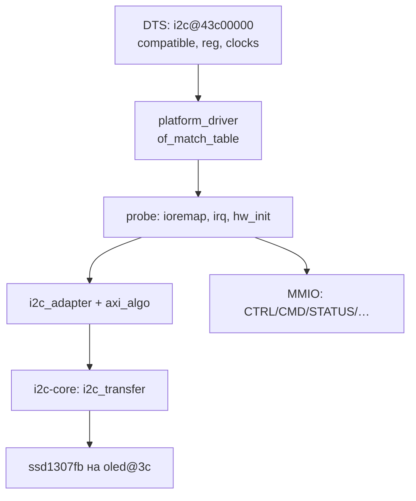
```mermaid
flowchart TB
    DT["DTS: i2c@43c00000<br/>compatible, reg, clocks"]
    PLAT["platform_driver<br/>of_match_table"]
    PROBE["probe: ioremap, irq, hw_init"]
    ADAP["i2c_adapter + axi_algo"]
    CORE["i2c-core: i2c_transfer"]
    CHILD["ssd1307fb на oled@3c"]

    DT --> PLAT --> PROBE --> ADAP --> CORE --> CHILD
    PROBE --> HW["MMIO: CTRL/CMD/STATUS/…"]
```

---

#### B.7.3.1. Запись файла на диск

```bash
mkdir -p "$BR_EXT/package/i2c-master-axi"

# Вариант A (рекомендуется): копия из репозитория проекта
export I2C_REPO="${I2C_REPO:-$HOME/sources/I2C_Master_Controller}"
cp "$I2C_REPO/linux/drivers/i2c-master-axi/i2c-master-axi.c" \
   "$BR_EXT/package/i2c-master-axi/i2c-master-axi.c"
wc -l "$BR_EXT/package/i2c-master-axi/i2c-master-axi.c"   # ожидается ~420

# Вариант B: редактор — переносите построчно после разбора ниже
# nano "$BR_EXT/package/i2c-master-axi/i2c-master-axi.c"
```

Сверьте заголовок: в комментарии вверху файла — карта регистров и пример узла DT; `SPDX-License-Identifier: GPL-2.0+`.

---

#### B.7.3.2. Слои файла (снизу вверх)

| Слой | Функции / данные | Контракт |
|------|------------------|----------|
| **Регистры** | `#define I2C_REG_*`, биты `CTRL_*`, `CMD_*`, … | 1:1 с RTL и §1.4 |
| **MMIO** | `axi_read`, `axi_write` | `ioread32` / `iowrite32` по смещению |
| **Секвенсер** | `axi_wait_tip`, `axi_send_cmd` | Ждать `TIP=0`, писать `CMD` |
| **Транзакция I²C** | `axi_xfer_one` | Один `struct i2c_msg` (адрес + данные) |
| **Адаптер** | `axi_master_xfer`, `axi_algo` | API подсистемы `i2c` |
| **Платформа** | `probe` / `remove`, `module_platform_driver` | DT + загрузка `.ko` |

---

#### B.7.3.3. Карта регистров и константы

Смещения и маски битов дублируют RTL (`rtl/i2c_master_axi.v`) и bare-metal заголовок из Vivado-мануала:

```57:88:linux/drivers/i2c-master-axi/i2c-master-axi.c
#define DRV_NAME			"i2c-master-axi"

#define I2C_REG_CTRL			0x00
#define I2C_REG_STATUS			0x04
#define I2C_REG_CMD			0x08
// ... TX_DATA, RX_DATA, PRESCALE, ISR ...
#define I2C_TIP_TIMEOUT_US		20000U
```

| Регистр | Драйвер использует для |
|---------|-------------------------|
| **CTRL** | `EN`, `IEN` — включение ядра и IRQ |
| **STATUS** | `TIP` (ждём 0), `RXACK` (NACK=1), `BUSY`, `AL` |
| **CMD** | `STA`/`STO`/`RD`/`WR`/`NACK` — одна запись = одна фаза |
| **TX_DATA / RX_DATA** | Байт адреса и payload |
| **PRESCALE** | Делитель SCL из `input_hz` и `clock-frequency` |
| **ISR** | W1C; в IRQ-режиме — `complete()` |

> **Важно про ACK:** в STATUS бит **`RXACK = 1` означает NACK** от слейва (как в §1.4). В коде проверка `if (status & STATUS_RXACK)` → ошибка `-ENXIO` / `-EIO`.

---

#### B.7.3.4. `struct i2c_master_axi` — состояние на экземпляр платы

На плате может быть ровно один экземпляр вашего IP; драйвер заводит под него одну структуру `i2c_master_axi` и хранит в ней всё, что нужно от момента `probe` до `remove`. Это не «описание железа в C», а рабочий контекст: указатель на MMIO, связь с подсистемой I²C, частоты и выбранный способ ждать конец транзакции.

```90:100:linux/drivers/i2c-master-axi/i2c-master-axi.c
struct i2c_master_axi {
	void __iomem		*regs;
	struct device		*dev;
	struct clk		*clk;
	struct i2c_adapter	adap;
	struct completion	cmd_done;
	int			irq;
	bool			use_irq;
	u32			input_hz;
	u32			bus_hz;
};
```

Поле **`regs`** появляется после `devm_platform_ioremap_resource`: ядро сопоставляет физический диапазон из `reg = <0x43c00000 0x1000>` с виртуальным адресом, и все `axi_read` / `axi_write` ходят уже в эту область. Без успешного `ioremap` драйвер дальше не стартует.

**`dev`** — обычный указатель на `struct device` платформенного узла; через него пишутся сообщения в `dmesg` (`dev_info`, `dev_err`) и цепочка `devm_*` освобождает память при отвязке устройства.

**`clk`** — опциональная ссылка на такт AXI (FCLK0 из `clocks = <&clkc 15>`). Если clock framework отдал частоту, она попадает в **`input_hz`**; иначе драйвер подставляет запасной **50 MHz** или значение из свойства DTS **`input-clock-frequency`**. От **`input_hz`** и желаемой скорости шины **`bus_hz`** (из **`clock-frequency`**, по умолчанию 100 kHz) в `hw_init` считается **PRESCALE**.

Самое заметное для userspace поле — вложенный **`adap`** (`struct i2c_adapter`). Его регистрирует `i2c_add_adapter`: ядро I²C узнаёт о новой шине, в sysfs появляется устройство вроде `i2c-1`, а дочерний узел **`oled@3c`** в Device Tree привязывается к встроенному **`ssd1307fb`**. Указатель на нашу структуру прячется в адаптере через `i2c_set_adapdata`, чтобы в `axi_master_xfer` снова получить `i2c_master_axi *`.

Для пути с прерываниями служат **`irq`** (номер линии из DTS), **`cmd_done`** (объект `completion`, на котором засыпает `axi_wait_tip`) и флаг **`use_irq`**. В `probe` драйвер пытается зарегистрировать обработчик; если получилось — **`use_irq`** остаётся истинным и в `hw_init` включается **IEN** в **CTRL**. Если IRQ нет или `request_irq` вернул ошибку, флаг сбрасывается: драйвер по-прежнему работает, но ждёт сброс **TIP** опросом регистра **STATUS**, как описано в B.7.3.5.

Итого: одна структура на один контроллер на плате; она связывает DT, MMIO, тактирование, опциональный IRQ и объект шины I²C, через который остальное ядро общается с OLED.

---

#### B.7.3.5. `axi_wait_tip` — конец микрокоманды

Когда драйвер пишет байт команды в регистр **CMD**, внутри IP начинается микрооперация на линиях SDA/SCL. В **STATUS** загорается бит **TIP** (*transfer in progress*): «секвенсер занят». Пока **TIP = 1**, следующую команду подавать нельзя — нужно дождаться, пока железо само опустит бит в ноль. Функция `axi_wait_tip` как раз и занимается этим ожиданием; по её возврату вызывающий код читает обновлённый **STATUS** (в том числе **RXACK** — был ли ACK от слейва).

```112:144:linux/drivers/i2c-master-axi/i2c-master-axi.c
static int axi_wait_tip(struct i2c_master_axi *i, u32 *status)
{
	// ...
	if (i->use_irq) {
		wait_for_completion_timeout(&i->cmd_done, ...);
		st = axi_read(i, I2C_REG_STATUS);
	} else {
		readl_poll_timeout(i->regs + I2C_REG_STATUS, st,
				   !(st & STATUS_TIP), 1, I2C_TIP_TIMEOUT_US);
	}
	if (st & STATUS_AL)
		return -EAGAIN;
	// ...
}
```

Два способа дождаться конца транзакции выбираются в `probe` и запоминаются в поле `use_irq`.

**Опрос (polled).** Если в Device Tree нет рабочей линии прерывания или `request_irq` не удался, драйвер не полагается на IRQ. В `axi_wait_tip` он в цикле читает **STATUS** через `readl_poll_timeout`: каждую микросекунду проверяет, сбросился ли **TIP**, и отпускает CPU не дольше чем на 20 ms (`I2C_TIP_TIMEOUT_US`). Для SSD1306 на 100 kHz этого с запасом хватает: обмен короткий, а код проще и устойчивее на этапе отладки платы.

**Прерывание (IRQ).** Если в DTS описан `interrupts`, линия `irq_o` подключена к **IRQ_F2P[0]** и регистрация обработчика прошла успешно, в `hw_init` дополнительно выставляется **CTRL.IEN**. Тогда после записи **CMD** CPU может уснуть: обработчик `i2c_master_axi_isr` читает **ISR**, сбрасывает флаги (W1C) и вызывает `complete(&cmd_done)`. Поток в `axi_wait_tip` просыпается из `wait_for_completion_timeout`, снова читает **STATUS** и идёт дальше. Так процессор не крутится в пустом poll, пока IP дотягивает биты на шине.

В обоих случаях, если за отведённое время **TIP** так и остался единицей, функция возвращает **`-ETIMEDOUT`** — на шине или в IP что-то зависло. Если в статусе поднялся **AL** (*arbitration lost*), возвращается **`-EAGAIN`**: конфликт на линии, повторить транзакцию может иметь смысл. При успехе актуальный **STATUS** передаётся вызывающему коду, чтобы тот проверил **RXACK** (помните: **1** в этом бите означает NACK от слейва).

---

#### B.7.3.6. `axi_send_cmd` — атомарная запись в CMD

Все обмены с шиной в драйвере сводятся к одному приёму: «записать слово в **CMD** и дождаться, пока секвенсер отработает». Именно это делает `axi_send_cmd` — тонкая обёртка над регистром **CMD** и функцией `axi_wait_tip` из предыдущего раздела. Вызывающий код (`axi_xfer_one`) уже положил нужный байт в **TX_DATA** (если это запись) и собрал маску битов **STA**, **STO**, **WR**, **RD**, **NACK**; `axi_send_cmd` только запускает эту фазу и возвращает код ошибки или свежий **STATUS**.

```146:154:linux/drivers/i2c-master-axi/i2c-master-axi.c
static int axi_send_cmd(struct i2c_master_axi *i, u32 cmd, u32 *status)
{
	if (i->use_irq) {
		reinit_completion(&i->cmd_done);
		axi_write(i, I2C_REG_ISR, ISR_DONE | ISR_AL);
	}
	axi_write(i, I2C_REG_CMD, cmd);
	return axi_wait_tip(i, status);
}
```

Если драйвер работает с прерываниями, перед новой командой он готовит синхронизацию. `reinit_completion` сбрасывает флаг «команда завершена», чтобы поток в `axi_wait_tip` не проснулся от старого события. Запись в **ISR** значений **DONE** и **AL** — это сброс флагов по правилу W1C (*write-1-to-clear*): в регистре не должно остаться «зависшего» прерывания от предыдущего такта, иначе ISR сразу вызовет `complete()`, а ожидание следующего **TIP** собьётся.

Затем в **CMD** уходит собранная маска. Одна запись может означать, например, «выдать байт из **TX_DATA** с **START**» (`CMD_WR | CMD_STA`) или «принять байт в **RX_DATA** и на последнем байте ответить **NACK** и **STOP**». Секвенсер в RTL разворачивает это в последовательность действий на **SDA/SCL**; с точки зрения CPU это одна атомарная операция.

Сразу после записи **CMD** вызывается `axi_wait_tip`: опрос **STATUS** или сон до IRQ, пока **TIP** не упадёт в ноль. Указатель `status` при успехе заполняется актуальным словом **STATUS** — вызывающий код по нему смотрит **RXACK** (был ли ACK). Так одна «микрокоманда» на шине I²C всегда проходит парой «запуск → ожидание»; `axi_xfer_one` вызывает `axi_send_cmd` много раз подряд (адресный байт, затем каждый байт данных), а ошибка на любой фазе прерывает всю транзакцию.

В режиме без IRQ блок `if (i->use_irq)` просто пропускается: остаются только запись **CMD** и `axi_wait_tip` с опросом — логика шины та же, меняется только способ ждать конец.

---

#### B.7.3.7. `axi_xfer_one` — один `i2c_msg`

Подсистема I²C в ядре не знает про ваши регистры **CMD** и **TX_DATA**. Она передаёт драйверу массив структур **`i2c_msg`**: в каждой — 7-битный адрес слейва, флаг «читать или писать», буфер и длина. Функция `axi_xfer_one` переводит **одно** такое сообщение в последовательность вызовов `axi_send_cmd`, то есть в реальные условия **START**, передачу адреса, байты данных и при необходимости **STOP** на проводах SDA/SCL.

Два булевых аргумента **`first`** и **`last`** связывают это сообщение с соседними в одном вызове `i2c_transfer` от верхнего уровня (например, от `ssd1307fb`). Если сообщение **первое** в пакете, к первой команде добавляется **STA** — на шине появляется **START** (или **повторный START**, если шина уже была занята внутри IP). Если сообщение **последнее**, на финальном байте данных добавляется **STO** — **STOP** отпускает шину. Средние сообщения в combined-транзакции идут без лишнего STOP между ними: OLED и другие чипы как раз часто ждут «write адрес + read данные» в одной связке.

Сначала всегда идёт **адресный байт**, и он всегда **записывается** мастером, даже когда дальше планируется чтение. Семибитный адрес из `m->addr` сдвигается влево, младший бит задаёт направление: 0 — запись, 1 — чтение. Это стандартное кодирование I²C; для OLED на `0x3c` при чтении framebuffer получится байт `0x79`, при записи команд — `0x78`.

```163:175:linux/drivers/i2c-master-axi/i2c-master-axi.c
	addr_byte = (m->addr << 1) | ((m->flags & I2C_M_RD) ? 1 : 0);
	axi_write(i, I2C_REG_TX_DATA, addr_byte);
	cmd = CMD_WR | (first ? CMD_STA : 0);
	ret = axi_send_cmd(i, cmd, &status);
```

Байт кладётся в **TX_DATA**, затем `axi_send_cmd` отправляет **CMD_WR** и при необходимости **CMD_STA**. Когда **TIP** опустится, драйвер смотрит **RXACK** в **STATUS**. Если слейв не ответил ACK (бит **RXACK** равен 1), на шине никого с таким адресом нет или устройство занято — функция шлёт **STOP**, чтобы не держать SCL, и возвращает **`-ENXIO`**. Типичная причина на плате: неверный bitstream, пины CAM1 или OLED не запитан.

Дальше путь расходится по флагу **`I2C_M_RD`**.

При **чтении** цикл идёт по `m->len` байтам буфера. Каждая итерация — команда **RD** через `axi_send_cmd`; принятый октет забирается из **RX_DATA**. На **последнем** байте сообщения мастер обязан ответить **NACK** (бит **CMD_NACK**), иначе слейв будет ждать ещё данных. Если это ещё и **последнее** сообщение в пакете (`last == true`), к той же команде добавляется **STO** — транзакция завершается **STOP**.

При **записи** перед каждым `axi_send_cmd` в **TX_DATA** кладётся очередной `m->buf[j]`, команда — **WR**. После каждого байта снова проверяется **RXACK**; отсутствие ACK даёт **`-EIO`**. **STOP** выставляется только на последнем байте **и** только если `last` истинно — то есть весь пакет `i2c_transfer` заканчивается на этом сообщении. Если запись оборвалась с ошибкой посередине combined-транзакции, драйвер всё равно пытается послать **STOP**, когда это уместно, чтобы не оставить шину в подвешенном состоянии.

```177:210:linux/drivers/i2c-master-axi/i2c-master-axi.c
	if (m->flags & I2C_M_RD) {
		for (j = 0; j < m->len; j++) {
			cmd = CMD_RD;
			if (j == m->len - 1) {
				cmd |= CMD_NACK;
				if (last)
					cmd |= CMD_STO;
			}
			// ...
		}
	} else {
		for (j = 0; j < m->len; j++) {
			axi_write(i, I2C_REG_TX_DATA, m->buf[j]);
			cmd = CMD_WR;
			if (j == m->len - 1 && last)
				cmd |= CMD_STO;
			// ...
		}
	}
```

Успешное завершение — возврат **0**; вызывающий `axi_master_xfer` переходит к следующему `i2c_msg` или сообщает ядру, что все сообщения выполнены. Так из абстрактного «передать три байта на адрес 0x3c» получается десяток коротких фаз, каждая из которых уже разобрана в B.7.3.5–3.6 как «запись **CMD** + ожидание **TIP**».

---

#### B.7.3.8. `axi_master_xfer` — точка входа из `i2c-core`

В `probe` драйвер регистрирует адаптер I²C и заполняет структуру **`i2c_algorithm`**: в ней указатель **`master_xfer`** ссылается на функцию `axi_master_xfer`. С этого момента подсистема **`i2c-core`** в ядре знает: «если кто-то хочет поговорить с устройством на этой шине, вызови этот callback». Пользовательские программы и другие драйверы (встроенный **`ssd1307fb`**, утилита **`i2cdetect`**) не вызывают `axi_master_xfer` напрямую — они идут через **`i2c_transfer()`** / **`i2c_master_send()`**, а ядро уже находит нужный адаптер и спускается в ваш код.

```243:250:linux/drivers/i2c-master-axi/i2c-master-axi.c
static const struct i2c_algorithm axi_algo = {
	.master_xfer	= axi_master_xfer,
	.functionality	= axi_functionality,
};

static const struct i2c_adapter_quirks axi_quirks = {
	.flags		= I2C_AQ_NO_ZERO_LEN,
};
```

Параллельно задаётся **`axi_functionality`**: драйвер заявляет поддержку обычного I²C (**`I2C_FUNC_I2C`**) и эмуляции SMBus (**`I2C_FUNC_SMBUS_EMUL`**), чтобы клиенты ядра не пытались строить транзакции, которые ваш IP физически не умеет. Флаг **`I2C_AQ_NO_ZERO_LEN`** в **quirks** говорит: сообщения с нулевой длиной буфера не поддерживаются — у контроллера каждая фаза привязана к байту в **TX_DATA** или **RX_DATA**.

Когда срабатывает `axi_master_xfer`, первым аргументом приходит **`struct i2c_adapter *`** — тот самый объект, который появился после `i2c_add_adapter`. Из него через `i2c_get_adapdata` достаётся указатель на **`i2c_master_axi`**, сохранённый в `probe`. Дальше в работу вступают MMIO и поля, разобранные в B.7.3.4.

```215:236:linux/drivers/i2c-master-axi/i2c-master-axi.c
static int axi_master_xfer(struct i2c_adapter *adap, struct i2c_msg *msgs,
			   int num)
{
	struct i2c_master_axi *i = i2c_get_adapdata(adap);
	// ...
	status = axi_read(i, I2C_REG_STATUS);
	if (status & STATUS_BUSY)
		return -EAGAIN;

	for (k = 0; k < num; k++) {
		ret = axi_xfer_one(i, &msgs[k], (k == 0), (k == num - 1));
		if (ret < 0)
			return ret;
	}
	return num;
}
```

Перед циклом драйвер один раз читает **STATUS**. Если поднят **BUSY**, шина ещё в незавершённой транзакции (редко, но возможно при гонке или сбое) — функция сразу возвращает **`-EAGAIN`**, не трогая слейвов.

Основная работа — цикл по **`num`** сообщениям в массиве **`msgs`**. Для каждого элемента вызывается `axi_xfer_one` с флагами «это первое сообщение в пакете» (`k == 0`) и «это последнее» (`k == num - 1`). Именно здесь склеиваются несколько `i2c_msg` в одну логическую транзакцию на проводе без лишнего **STOP** между ними, как описано в B.7.3.7. Любая ошибка из `axi_xfer_one` (таймаут, NACK, arbitration lost) прерывает весь пакет и уходит наверх отрицательным кодом.

Если все сообщения прошли успешно, `axi_master_xfer` возвращает не ноль, а **`num`** — так устроен контракт **`master_xfer`** в Linux: вызывающая сторона сравнивает возврат с запрошенным числом сообщений и понимает, что весь пакет выполнен. Тогда, например, **`ssd1307fb`** продолжает инициализацию дисплея, а в логе `i2cdetect` появляется **`3c`** на вашей шине.

Так **`i2c-core`** остаётся единой «витриной» для всего ядра, а весь разговор с вашим IP сосредоточен в `axi_xfer_one` и ниже — в записи **CMD** и ожидании **TIP**.

---

#### B.7.3.9. IRQ-обработчик

Прерывание — необязательное ускорение: драйвер полностью работает и без него (опрос **TIP** в B.7.3.5). Но если в Vivado линия **`irq_o`** IP подключена к **`IRQ_F2P[0]`**, в Device Tree описан узел `interrupts`, а в **`hw_init`** выставлен **CTRL.IEN**, завершение каждой микрокоманды может будить поток из сна, а не крутить `readl_poll_timeout`.

Цепочка на железе такая: RTL поднимает **`irq_o`** после события в регистре **ISR** контроллера (обычно флаг **DONE** — секвенсер закончил команду из **CMD**). В PS линия попадает в **IRQ_F2P[0]**, далее в GIC как SPI **61**, в DTS это записано как **`<0 29 4>`** (см. B.4). В `probe` вызываются `platform_get_irq_optional` и `devm_request_irq`; при успехе в `dev_id` передаётся указатель на **`i2c_master_axi`**, и в логе после инициализации будет `irq=yes` вместо `irq=polled`.

```252:263:linux/drivers/i2c-master-axi/i2c-master-axi.c
static irqreturn_t i2c_master_axi_isr(int irq, void *dev_id)
{
	struct i2c_master_axi *i = dev_id;
	u32 isr = axi_read(i, I2C_REG_ISR);

	if (!isr)
		return IRQ_NONE;

	axi_write(i, I2C_REG_ISR, isr);
	complete(&i->cmd_done);
	return IRQ_HANDLED;
}
```

Обработчик **`i2c_master_axi_isr`** читает не «номер IRQ из GIC», а **регистр ISR** вашего IP по смещению **0x18**. Младшие биты — **DONE** (операция завершена) и **AL** (arbitration lost). Если регистр пуст, ядро Linux получает **`IRQ_NONE`**: это ложное срабатывание или чужое прерывание на общей линии, дальше ничего не делаем.

Если флаги есть, их нужно **сбросить записью тех же единиц** (правило W1C из §1.4). После сброса вызывается **`complete(&i->cmd_done)`** — разблокируется поток, который в `axi_wait_tip` ждёт в `wait_for_completion_timeout` (B.7.3.5). Параллельно перед каждой новой командой `axi_send_cmd` уже делает `reinit_completion` и превентивно чистит **ISR**, чтобы не проснуться от старого **DONE** (B.7.3.6).

Возврат **`IRQ_HANDLED`** сообщает ядру, что событие обработано. С точки зрения I²C-транзакции ISR не разбирает адреса и буферы — он только сигнализирует: «**TIP** можно снова проверить, фаза на железе закончилась». Вся логика START/STOP и **RXACK** по-прежнему в `axi_xfer_one`.

Если в Block Design прерывание не провели, в DTS нет `interrupts`, или `request_irq` вернул ошибку, **`use_irq`** остаётся ложным, **IEN** не включается, и **`i2c_master_axi_isr`** вообще не вызывается — это нормальный и поддерживаемый режим для отладки и для сценария «сначала поднять шину опросом, IRQ добавить позже».

---

#### B.7.3.10. `i2c_master_axi_hw_init` — PRESCALE и включение

Функция `i2c_master_axi_hw_init` вызывается из `probe` уже после того, как известны частоты и решено, будет ли IRQ. Это момент, когда программное обеспечение впервые настраивает тактирование **SCL** и включает секвенсер IP — до регистрации адаптера I²C и до любого обмена с OLED.

На входе используются поля **`input_hz`** (такт AXI, обычно FCLK0 50 MHz из `clocks` / `input-clock-frequency` в DTS) и **`bus_hz`** (желаемая частота шины I²C, свойство **`clock-frequency`**, по умолчанию 100 kHz). Сначала идут проверки: нулевые частоты дают **`-EINVAL`**; если запрошенная скорость шины больше четверти такта AXI (`bus_hz * 4 > input_hz`), делитель физически не выйдет — снова отказ с сообщением в `dmesg`.

Делитель **PRESCALE** считается по той же формуле, что в RTL и в §1.4 Vivado-мануала:

\[
f_{SCL} = \frac{f_{input}}{4 \cdot (\mathrm{PRESCALE} + 1)}
\]

В коде сначала вычисляется промежуточное значение `input_hz / (4 * bus_hz)`, оно должно быть не меньше 1, затем из него вычитается единица — в регистр попадает именно **PRESCALE**, а не «делитель целиком». Для платы ZYNQ MINI с **50 MHz** на AXI и **100 kHz** на SCL получается `50_000_000 / 400_000 - 1 = **124**` — то же число, что **`DEFAULT_PRESCALE`** в параметрах IP в Vivado. Если результат не помещается в 16 бит регистра **PRESCALE**, инициализация прерывается.

```265:300:linux/drivers/i2c-master-axi/i2c-master-axi.c
static int i2c_master_axi_hw_init(struct i2c_master_axi *i)
{
	// ... проверки частот, расчёт prescale ...
	axi_write(i, I2C_REG_CTRL, 0);
	axi_write(i, I2C_REG_PRESCALE, prescale);
	axi_write(i, I2C_REG_ISR, ISR_DONE | ISR_AL);
	axi_write(i, I2C_REG_CTRL, CTRL_EN | (i->use_irq ? CTRL_IEN : 0));
	dev_info(i->dev, "input=%u Hz, bus=%u Hz, prescale=%u, irq=%s\n", ...);
	return 0;
}
```

Запись в железо идёт в строгом порядке, как требует документация IP. Сначала в **CTRL** пишется ноль: бит **EN** сброшен, контроллер остановлен — только в этом состоянии безопасно менять **PRESCALE** (иначе текущая транзакция на SDA/SCL может оборваться). В **PRESCALE** уходит рассчитанное значение. Затем в **ISR** записываются единицы в биты **DONE** и **AL**, чтобы сбросить возможные «висящие» флаги прерывания (W1C) перед стартом. Финальная запись в **CTRL** поднимает **EN** и, если `use_irq` истинно, **IEN** — секвенсер готов принимать **CMD**, а линия **`irq_o`** может сигнализировать о завершении фаз (B.7.3.9).

Строка **`dev_info`** в логе — удобная проверка после загрузки модуля: `dmesg | grep i2c-master` должен показать `input=50000000 Hz, bus=100000 Hz, prescale=124` и `irq=yes` или `irq=polled`. Если **prescale** не 124 при тех же свойствах DTS, ищите расхождение FCLK0 в Vivado, опечатку в **`input-clock-frequency`** или неверный **`clock-frequency`**.

После успешного `hw_init` `probe` регистрирует **`i2c_adapter`** — с этого момента верхний уровень ядра может вызывать `axi_master_xfer` и ходить на шину с реальной частотой SCL.

---

#### B.7.3.11. `probe` — привязка к Device Tree

Функция **`i2c_master_axi_probe`** вызывается ядром, когда на шине платформенных устройств появляется узел, чей **`compatible`** совпал с таблицей **`of_match_table`** (см. B.7.3.12). На практике это происходит после `modprobe i2c-master-axi` (или автозагрузки из `modules-load.d`), если в загруженном DTB есть ваш `i2c@43c00000` с строкой **`user,i2c-master-axi-1.0`**. Весь смысл `probe` — прочитать из Device Tree то, что вы описали в B.4, сопоставить с железом и зарегистрировать шину I²C, чтобы дочерний **`oled@3c`** смог привязаться к **`ssd1307fb`**.

```303:378:linux/drivers/i2c-master-axi/i2c-master-axi.c
static int i2c_master_axi_probe(struct platform_device *pdev)
{
	// devm_kzalloc, ioremap, clk, DT properties, irq, hw_init, i2c_add_adapter
}
```

Сначала выделяется структура **`i2c_master_axi`** через **`devm_kzalloc`**: префикс **`devm_`** значит, что память освободится автоматически при отвязке устройства, без ручного `kfree` в `remove`. Инициализируется **`completion`** для IRQ-пути, указатель сохраняется в **`platform_set_drvdata`** — так `remove` и ISR снова найдут тот же контекст.

Дальше **`devm_platform_ioremap_resource(pdev, 0)`** берёт первый (и единственный) диапазон из свойства **`reg`** в DTS — у вас **`0x43c00000`**, длина **`0x1000`**. Ошибка здесь обычно означает расхождение с Address Editor в Vivado или отсутствие узла в DTB на SD. Успешный `ioremap` заполняет **`i->regs`**, через который потом идут все `axi_read` / `axi_write`.

Тактирование: **`devm_clk_get_optional`** пытается получить clock из **`clocks = <&clkc 15>`** (FCLK0). Если clock есть, он включается и **`clk_get_rate`** записывает частоту в **`input_hz`**. Если framework ничего не вернул, остаётся запасной **50 MHz**; поверх всего **`of_property_read_u32(..., "input-clock-frequency")`** может переопределить значение из DTS — так вы явно фиксируете 50 MHz даже при нестандартной конфигурации PS. Аналогично **`bus_hz`**: сначала дефолт **100 kHz**, затем чтение **`clock-frequency`** из узла I²C — то, что вы задали для SSD1306.

Прерывание необязательно: **`platform_get_irq_optional`** читает первую ячейку **`interrupts`** (SPI 29 в пространстве DT). Если номер валиден, регистрируется **`i2c_master_axi_isr`**. Неудача **`request_irq`** не фатальна — в лог уходит **`dev_warn`**, **`use_irq`** сбрасывается, и драйвер продолжит с опросом **TIP**, как в B.7.3.5. Успех — **`use_irq = true`**, и в **`hw_init`** позже включится **IEN**.

Вызов **`i2c_master_axi_hw_init`** (B.7.3.10) настраивает **PRESCALE** и поднимает **EN**. Только после успешного возврата имеет смысл объявлять шину ядру.

Заполняется вложенный **`struct i2c_adapter`**: владелец модуля, указатель на **`axi_algo`**, **quirks**, родительский **`device`**, копия **`of_node`** (чтобы дочерние узлы в DT остались привязаны к тому же I²C-host). **`i2c_set_adapdata`** связывает адаптер с **`i2c_master_axi`** для обратного пути в **`axi_master_xfer`**. **`i2c_add_adapter`** — финальный шаг: в sysfs появляется шина (часто **`i2c-1`**, номер может отличаться), и подсистема I²C может искать детей с **`reg = <0x3c>`** под этим узлом.

Если **`i2c_add_adapter`** не удался, срабатывает **`err_disable`**: в **CTRL** пишется 0, контроллер глушится. На **`err_clk`** отключается clock, если он был включён. Любая ошибка из ранних шагов возвращается наверх — модуль загружен, но устройство не создано; в **`dmesg`** будет отказ probe, а **`i2cdetect`** не увидит шину.

Успешный **`probe`** возвращает 0. В логе — строка **`dev_info`** из **`hw_init`** с **prescale** и режимом IRQ. С этого момента цепочка из B.7.1 выполнима: **`ssd1307fb`** → **`i2c_transfer`** → **`axi_master_xfer`** → провода к OLED.

---

#### B.7.3.12. `remove`, `of_match_table`, загрузка модуля

В конце файла драйвера собраны три механизма, без которых модуль «лежит на диске», но не оживает: таблица совместимости с Device Tree, регистрация **platform_driver** и макрос загрузки/выгрузки модуля. Вместе они отвечают на вопросы «почему `probe` вызвался именно для моего узла» и «что происходит при `modprobe`».

**Привязка к `compatible`.** Массив **`i2c_master_axi_of_match`** — это список строк, которые драйвер готов обслуживать. Единственная запись — **`user,i2c-master-axi-1.0`**, та же, что в вашем DTS в узле `i2c@43c00000`. Пустой элемент `{ }` в конце — обязательный **sentinel** для ядра. Макрос **`MODULE_DEVICE_TABLE(of, ...)`** экспортирует таблицу наружу: утилиты вроде `modinfo` и сам загрузчик модулей видят, с какими DT-узлами связан этот `.ko`. Опечатка в одном символе — и **`probe` никогда не вызовется**, хотя `modprobe` завершится без ошибки.

```402:415:linux/drivers/i2c-master-axi/i2c-master-axi.c
static const struct of_device_id i2c_master_axi_of_match[] = {
	{ .compatible = "user,i2c-master-axi-1.0" },
	{ /* sentinel */ }
};
MODULE_DEVICE_TABLE(of, i2c_master_axi_of_match);

static struct platform_driver i2c_master_axi_driver = {
	.driver = {
		.name		= DRV_NAME,
		.of_match_table	= i2c_master_axi_of_match,
	},
	.probe		= i2c_master_axi_probe,
	.remove		= i2c_master_axi_remove,
};
```

Структура **`platform_driver`** связывает имя **`i2c-master-axi`**, таблицу совместимости и два callback: **`probe`** (B.7.3.11) при появлении устройства и **`remove`** при исчезновении. Это стандартный шаблон Linux для IP, описанного в DT, а не на шине PCI/USB.

**Загрузка модуля.** Строка **`module_platform_driver(i2c_master_axi_driver)`** разворачивается в `module_init` / `module_exit`: при **`insmod`** или **`modprobe i2c-master-axi`** регистрируется platform driver, ядро обходит дерево устройств и для каждого подходящего узла вызывает **`probe`**. В образе Buildroot модуль обычно кладут в rootfs как **`/lib/modules/.../i2c-master-axi.ko`** и добавляют имя в **`/etc/modules-load.d/i2c-master-axi.conf`** (post-build скрипт в B.9) — тогда загрузка идёт на раннем этапе boot без ручного `modprobe`. Пока модуль не загружен, узел в DT «молчит»: **`ssd1307fb`** не найдёт шину, даже если bitstream и DTS верны.

Метаданные **`MODULE_DESCRIPTION`**, **`MODULE_LICENSE("GPL v2")`** и **`MODULE_AUTHOR`** нужны для `modinfo` и соответствия лицензии GPL при распространении `.ko`.

**`remove` — разборка в обратном порядке.** Когда модуль выгружают (`rmmod`) или при отвязке устройства, ядро вызывает **`i2c_master_axi_remove`**. Из **`platform_get_drvdata`** достаётся тот же **`i2c_master_axi`**, что создали в `probe`. Сначала **`i2c_del_adapter`**: шина исчезает из подсистемы I²C, клиенты (OLED) отвязываются. Затем в **CTRL** пишется 0 — секвенсер останавливается, **SCL/SDA** отпускаются согласно логике IP. Если clock был включён, **`clk_disable_unprepare`** гасит FCLK на стороне драйвера. Память, выделенная через **`devm_*`**, освобождается автоматически при отвязке **`device`**.

```391:399:linux/drivers/i2c-master-axi/i2c-master-axi.c
static int i2c_master_axi_remove(struct platform_device *pdev)
{
	struct i2c_master_axi *i = platform_get_drvdata(pdev);

	i2c_del_adapter(&i->adap);
	axi_write(i, I2C_REG_CTRL, 0);
	if (i->clk)
		clk_disable_unprepare(i->clk);
	return 0;
}
```

В исходнике над **`remove`** есть комментарий про смену сигнатуры в ядрах **6.11+** (`void` вместо `int`). Для Buildroot 2024.02 с Linux **6.6** оставлен вариант **`int` с `return 0`** — он совместим и с более старыми, и с новыми ядрами, которые просто игнорируют возвращаемое значение.

Итого: **`of_match_table`** — мост **DTS → драйвер**; **`module_platform_driver`** — мост **`.ko` → probe/remove`**; **`remove`** — аккуратное выключение железа и снятие шины I²C, симметричное тому, что настроил **`probe`**.

---

#### B.7.3.13. Коды ошибок и проверка на плате

Когда что-то идёт не так, драйвер не «падает в printk на каждый байт» — он возвращает стандартные коды ошибки Linux наверх в **`i2c-core`**, а тот уже решает, повторить транзакцию или сообщить клиенту (например, **`ssd1307fb`**), что устройство не отвечает. Понимание этих кодов сокращает отладку: по одному сообщению в `dmesg` часто видно, проблема в железе, в DTS или в отсутствии слейва на SDA/SCL.

**`-ETIMEDOUT`** появляется в `axi_wait_tip`, если за **20 ms** бит **TIP** в **STATUS** так и не сбросился (B.7.3.5). Секвенсер завис, такт AXI не идёт, bitstream не загружен в PL или адрес **MMIO** в DTS не совпадает с Vivado — CPU пишет «в пустоту». Стоит проверить, что **`FPGA_CONFIG`** выполнен, в `reg` указан **`0x43c00000`**, и в логе вообще есть успешный **`probe`**.

**`-EAGAIN`** означает либо **arbitration lost** (**AL** в **STATUS**), либо попытку стартовать обмен, пока шина ещё **BUSY** (B.7.3.8). На одиночном мастере на плате **AL** редок; чаще это гонка или обрыв предыдущей транзакции без **STOP**. Повтор `i2c_transfer` иногда проходит; если нет — смотрите зависание SCL/SDA и питание pull-up.

**`-ENXIO`** приходит из `axi_xfer_one`, когда после адресного байта в **STATUS** виден **NACK** (**RXACK = 1**, B.7.3.7): на шине никто не ответил на адрес **0x3c** (в 8-битной записи — `0x78`/`0x79`). Типичные причины: OLED не запитан, неверные пины **T20/P20** в **XDC** (в DTS пинов нет), не тот bitstream, обрыв CAM1. Драйвер посылает **STOP** и освобождает шину.

**`-EIO`** — то же, но на байте **данных** при записи: слейв ACKнул адрес, но отверг очередной октет. Для дисплея бывает реже, чем **`-ENXIO`** на этапе «устройство не найдено».

**`-EINVAL`** возвращает **`i2c_master_axi_hw_init`**, ещё до появления шины в sysfs: нулевые **`input_hz`** / **`bus_hz`**, запрошенная **SCL** выше **`input/4`**, делитель **PRESCALE** вне диапазона (B.7.3.10). Ищите ошибки в свойствах DTS **`clock-frequency`** и **`input-clock-frequency`**, а не на проводах.

---

**Проверка на плате после сборки образа** — от модуля к OLED, слоями.

Сначала убедитесь, что **`.ko`** на rootfs и модуль реально загружен (B.7.3.12): в Buildroot — пакет **i2c-master-axi** и **`modules-load.d`**, на работающей системе — `lsmod | grep i2c_master_axi` или `modprobe i2c-master-axi`. Без загрузки модуля узел в DT есть, но **`probe`** не вызывался.

Затем журнал ядра:

```bash
dmesg | grep -i i2c-master
```

Ожидаемая строка после успешного **`probe`** и **`hw_init`**:

```text
i2c-master-axi 43c00000.i2c: input=50000000 Hz, bus=100000 Hz, prescale=124, irq=yes
```

(или `irq=polled`). Имя устройства **`43c00000.i2c`** совпадает с адресом в DTS. **prescale=124** при 50 MHz и 100 kHz подтверждает, что DT и расчёт делителя согласованы с Vivado. Если этой строки нет — возвращайтесь к **`compatible`**, **`reg`** и загрузке модуля (B.7.3.11–3.12), а не к OLED.

Появление шины в sysfs:

```bash
ls /sys/bus/i2c/devices/
```

Должны быть записи вида **`i2c-1`** (номер **может быть 0, 1, 2…** — зависит от порядка регистрации адаптеров PS и PL). Под узлом host обычно виден каталог клиента **`1-003c`** после того, как **`ssd1307fb`** успешно привязался; до framebuffer драйвер OLED может ещё не prob'иться, но **`i2cdetect`** уже полезен.

Сканирование шины (подставьте свой номер вместо **`1`**):

```bash
i2cdetect -y 1
```

В таблице на пересечении адреса **`3c`** ожидается **`3c`** (или **`UU`**, если адрес уже занят драйвером **`ssd1307fb`**). Пустая строка на **`3c`** при живом **`probe`** почти всегда означает проблему **PL/проводки/bitstream**, а не ошибку в C-коде драйвера.

Дальше по цепочке B.7.1: если I²C жив, подключается **`ssd1307fb`** → **`/dev/fb0`**, на консоли **`fbcon`** (если задано в **`bootargs`**). Команды вроде `cat /proc/device-tree/amba_pl/i2c@43c00000/compatible` на плате помогают убедиться, что загружен **тот же DTB**, что вы собирали в B.4 (см. также B.4.13).

Если нужны подробности по каждому NACK, в ядре с **`CONFIG_DYNAMIC_DEBUG`** можно включить сообщения **`dev_dbg`** для этого модуля; в учебном образе обычно хватает **`dmesg`** и **`i2cdetect`**.

---

#### B.7.3.14. Makefile модуля

Рядом с **`i2c-master-axi.c`** (B.7.3.1) в каталоге пакета нужен второй обязательный файл — **короткий Makefile** в формате **kbuild** (система сборки ядра Linux). Это не «проект на gcc вручную»: модуль собирается **вне дерева исходников ядра** (*out-of-tree*), но **тем же** компилятором, теми же заголовками и той же **`vermagic`**, что и образ **`uImage`**, который вы уже собрали через Buildroot. Иначе `insmod` на плате откажет с несовпадением версии ядра.

**Что положить на диск**

```bash
cat > "$BR_EXT/package/i2c-master-axi/Makefile" << 'EOF'
# SPDX-License-Identifier: GPL-2.0+
# Out-of-tree: собирается через дерево ядра (Buildroot или make KDIR=... modules)

obj-m += i2c-master-axi.o
EOF
```

Одна рабочая строка — **`obj-m += i2c-master-axi.o`**. Префикс **`obj-m`** говорит kbuild: «собери **модуля** (`.ko`), а не встрой в `vmlinux`». Имя **`i2c-master-axi.o`** — объектный файл из одноимённого **`i2c-master-axi.c`** (правило «`foo.o` из `foo.c`» ядро подставляет само). На выходе появится **`i2c-master-axi.ko`** — тот самый файл, который попадает в **`/lib/modules/<версия>/`** на rootfs и загружается **`modprobe`** (B.7.3.12).

Имя модуля в **`obj-m`** должно совпадать с базовым именем исходника **без `.c`**. Переименовали файл в `my-i2c.c` — меняйте и строку на **`my-i2c.o`**, иначе kbuild не найдёт исходник.

**Как Buildroot вызывает этот Makefile (связь с B.8)**

Сам по себе Makefile в `$BR_EXT/package/i2c-master-axi/` ничего не собирает, пока его не подхватит рецепт пакета **`i2c-master-axi.mk`** (часть **B.8.2**). Там две ключевые строки:

```makefile
$(eval $(kernel-module))
$(eval $(generic-package))
```

Макрос **`$(kernel-module)`** — инфраструктура Buildroot для out-of-tree модулей. Упрощённо цепочка такая:

1. Сначала в `$BR_OUT` собирается **ядро** из вашего `linux.fragment` и defconfig (B.5, B.9).
2. Пакет **`i2c-master-axi`** копирует каталог с **`i2c-master-axi.c`** и этим **Makefile** во временную директорию сборки.
3. Buildroot запускает эквивалент **`make -C $BR_OUT/build/linux-<ver> M=<путь_к_модулю> modules`**: **`KDIR`** — уже собранное дерево ядра, **`M=`** — папка с `obj-m`.
4. Готовый **`.ko`** устанавливается в **`$(TARGET_DIR)/lib/modules/.../`** и попадает на SD вместе с rootfs.

Поэтому порядок важен: **сначала** конфигурация и сборка ядра, **потом** модуль. Опция **`BR2_PACKAGE_I2C_MASTER_AXI`** в defconfig (B.9) как раз включает этот пакет.

**Отличие от «полного» Makefile в репозитории проекта**

В каталоге **`linux/drivers/i2c-master-axi/`** репозитория I2C_Master_Controller лежит **расширенный** Makefile с целями **`modules`**, **`clean`**, **`KDIR=...`** — для ручной сборки на PC против уже установленного или собранного дерева ядра. В **`$BR_EXT`** для мануала достаточно **минимального** файла только с **`obj-m`**: цели **`modules` / `clean`** Buildroot добавляет сам через **`kernel-module`**.

Пример ручной сборки вне Buildroot (для отладки на хосте с кросс-тулчейном), если уже есть собранное ядро:

```bash
export KDIR="$BR_OUT/build/linux-"*
export CROSS_COMPILE=...   # как у Buildroot для arm
make -C "$KDIR" M="$PWD" modules
```

В учебном сценарии SD-boot удобнее **`make i2c-master-axi-rebuild`** из Buildroot (B.14), а не собирать `.ko` руками.

**Проверка после сборки образа**

```bash
find "$BR_OUT/target" -name 'i2c-master-axi.ko'
# обычно: .../target/lib/modules/<release>/extra/i2c-master-axi.ko
```

На плате: **`modinfo i2c-master-axi`** должен показать **`vermagic`** той же строки, что у **`uname -r`** и у остальных модулей. Расхождение — признак, что пересобрали только модуль или только ядро, а не пару вместе.

**Типичные ошибки**

- **Нет Makefile** рядом с `.c` — пакет в Buildroot падает на шаге `kernel-module` с неясным kbuild-логом.
- **Опечатка в `obj-m`** — «No rule to make target».
- **Собрали `.ko` против другого `KDIR`** — на Zynq `insmod: invalid module format`.
- Правили только **`.c`**, забыли **`i2c-master-axi-rebuild`** — на SD старый модуль.

> **Практический совет:** держите в **`$BR_EXT/package/i2c-master-axi/`** пару **`i2c-master-axi.c` + Makefile**; после первой успешной сборки можно сохранить копию в `$WORK/backup/`. При смене адреса IP или `compatible` правьте **`.c` и DTS** (B.4), затем пересборку по B.14 — Makefile менять не нужно, пока имя модуля остаётся **`i2c-master-axi`**.

---

#### B.7.3.15. Runtime: sysfs `bus_hz` (частота I²C без пересборки DT)

В драйвере **`i2c-master-axi.c`** (эталон: `linux/drivers/i2c-master-axi/`) после **`probe`** на **platform device** появляется sysfs-атрибут **`bus_hz`** — желаемая частота **SCL** в герцах. Значение из DT **`clock-frequency`** используется только **при загрузке модуля**; дальше можно менять prescale **на лету**, пересобирая только **`.ko`** (**B.14.3**), без нового **DTB** и без полного Buildroot.

**Что делает запись в `bus_hz`**

1. Парсится число (например **`400000`**).
2. Под **mutex** сохраняется **`old_hz`**, затем обновляется **`i->bus_hz`**.
3. Вызывается **`i2c_master_axi_hw_init()`** — пересчёт **PRESCALE** и запись в регистр **0x14** (как при **`probe`**).
4. При ошибке (**слишком высокая частота** и т.п.) **`i->bus_hz`** откатывается к **`old_hz`**, и **`hw_init()`** вызывается снова — чтобы восстановить рабочий prescale в железе (не только в памяти драйвера).
5. При успехе в **`dmesg`** — новая строка `input=... bus=... prescale=...`; при ошибке userspace получает **errno**, sysfs **`show`** снова показывает старое значение.

Формула та же, что в **B.7.3.10**:

\[
\text{PRESCALE} = \frac{f_{input}}{4 \cdot f_{bus}} - 1
\]

При **50 MHz** AXI и **`bus_hz=400000`** → **prescale ≈ 30** (реальная SCL ~391 kHz из-за целочисленного деления).

**Где лежит файл в sysfs**

Атрибут на **platform-устройстве** контроллера (не на **`i2c-1`**):

```bash
# путь через адаптер I²C (номер шины может отличаться)
BUS=$(dirname $(readlink -f /sys/bus/i2c/devices/i2c-1/device))
ls -l "$BUS/bus_hz"

# альтернатива: поиск по имени узла DT
find /sys/devices/platform -name bus_hz 2>/dev/null
# часто: .../amba_pl/i2c@43c00000/bus_hz  или  .../43c00000.i2c/bus_hz
```

**Пример на плате (ускорение OLED-эксперимента)**

```bash
# остановить конкурентов за /dev/fb0
killall oled-clock 2>/dev/null

cat "$BUS/bus_hz"
# 100000

echo 400000 > "$BUS/bus_hz"
dmesg | tail -2
# i2c-master-axi ... bus=400000 Hz, prescale=30 ...

i2cdetect -y 1
# 0x3c или UU — иначе откат: echo 100000 > "$BUS/bus_hz"

/usr/local/bin/oled-clock --test G
```

**Ограничения**

| Тема | Смысл |
|------|--------|
| Верхняя граница | **`bus_hz * 4 ≤ input_hz`** (при 50 MHz → макс. ~12.5 MHz теоретически) |
| SSD1306 | на практике пробуйте **100 kHz → 400 kHz**; выше — риск NACK |
| Проводка CAM1 | короткие линии и подтяжки должны тянуть Fast mode |
| **`ssd1307fb`** | **deferred_io** может остаться узким местом — I²C быстрее ≠ всегда выше FPS |
| Сброс при reboot | после перезагрузки снова **100 kHz** из DT, пока не запишете **`bus_hz`** снова |
| **`input_hz`** | FCLK0 из Vivado **не** меняется через sysfs (только **`bus_hz`**) |

**Сборка после правки `.c`**

Скопируйте обновлённый **`i2c-master-axi.c`** в **`$BR_EXT/package/i2c-master-axi/`** (или синхронизируйте с репозиторием), затем:

```bash
cd "$BR_SRC"
make BR2_EXTERNAL="$BR_EXT" O="$BR_OUT" i2c-master-axi-rebuild all
```

На плате — заменить **`.ko`** в rootfs или перепрошить **p2** / **`scp`** модуль и **`rmmod` / `modprobe`**, либо полный **`dd`** образа.

**Откат**

```bash
echo 100000 > "$BUS/bus_hz"
```

См. также **E.13** (паттерны на OLED) и **B.14.3**.

---

## B.8. Рецепт Buildroot для модуля

Исходник драйвера (B.7) и **Makefile** с **`obj-m`** (B.7.3.14) — это только половина дела. Buildroot должен **знать о пакете**: откуда брать файлы, когда собирать, класть ли **`.ko`** в rootfs. Для этого в **`$BR_EXT/package/i2c-master-axi/`** добавляют пару рецептов: **`Config.in`** (опция в конфигурации Buildroot) и **`i2c-master-axi.mk`** (правила make, B.8.2). Без них **`external.mk`** подключит пустую папку — пакет не появится в **`menuconfig`** и не соберётся.

### B.8.1. `package/i2c-master-axi/Config.in`

Файл **`Config.in`** внутри каталога пакета — это **Kconfig-описание одного пакета** Buildroot, не путать с корневым **`$BR_EXT/Config.in`** из B.3. Корневой файл только **подключает** (`source .../package/i2c-master-axi/Config.in`) ваш пункт в меню «ZYNQ MINI Rev B». А вот **содержимое** `package/i2c-master-axi/Config.in` определяет, **что именно** можно включить галочкой и при каких условиях.

Создайте файл:

```bash
cat > "$BR_EXT/package/i2c-master-axi/Config.in" << 'EOF'
config BR2_PACKAGE_I2C_MASTER_AXI
	bool "i2c-master-axi (custom AXI I2C)"
	depends on BR2_LINUX_KERNEL
	help
	  Out-of-tree kernel module for the i2c_master_axi PL IP
	  (AXI4-Lite). Registers an i2c_adapter so the in-tree
	  ssd1307fb driver can talk to the OLED on ZYNQ MINI Rev B.
EOF
```

Строка **`config BR2_PACKAGE_I2C_MASTER_AXI`** объявляет переменную конфигурации Buildroot. Имя строится по правилу **`BR2_PACKAGE_<ИМЯПАКЕТА>`**, где `<ИМЯПАКЕТА>` — верхний регистр, подчёркивания вместо дефисов: пакет **`i2c-master-axi`** → **`I2C_MASTER_AXI`**. Эту же логику использует **`i2c-master-axi.mk`** (B.8.2): префикс переменных **`I2C_MASTER_AXI_SITE`**, **`I2C_MASTER_AXI_VERSION`** и т.д. Опечатка в **`config BR2_PACKAGE_...`** — пакет не соберётся, даже если `.mk` на месте.

Тип **`bool`** означает простую галочку в **`make menuconfig`**: включено (**`=y`**) или выключено (символ не задан). Для kernel-модуля отдельный вариант «собрать, но не ставить в rootfs» здесь не нужен: если опция включена, Buildroot и соберёт **`.ko`**, и установит его в **`/lib/modules/...`** на целевой rootfs.

Условие **`depends on BR2_LINUX_KERNEL`** связывает пакет с ядром: нельзя включить сборку out-of-tree модуля, если в конфигурации Buildroot отключён **`BR2_LINUX_KERNEL`** (нет ни дерева ядра, ни **`KDIR`** для kbuild). На практике для Zynq ядро всегда включено; зависимость страхует от логической ошибки в **`menuconfig`**.

Текст после **`help`** — подсказка в интерфейсе **`menuconfig`** (клавиша **`?`** на выделенной строке). Кратко фиксируйте смысл: это **не** опция в **`linux.fragment`**, а **отдельный пакет**, собирающий **`.ko`** для IP в PL.

**Где увидеть опцию в menuconfig**

После `make BR2_EXTERNAL="$BR_EXT" O="$BR_OUT" zynq_mini_revb_defconfig` и `make menuconfig`:

```text
Target packages  --->
    ...
    ZYNQ MINI Rev B (manual)  --->
        [*] i2c-master-axi (custom AXI I2C)
```

Путь зависит от того, как названо меню в корневом **`$BR_EXT/Config.in`** (B.3). В учебном defconfig (B.9) галочка уже проставлена строкой **`BR2_PACKAGE_I2C_MASTER_AXI=y`** — вручную в **`menuconfig`** заходить не обязательно, если не меняете состав пакетов.

**Связь с остальной цепочкой.** Этот **`Config.in`** отвечает только на вопрос Buildroot: собирать ли пакет и класть ли **`i2c-master-axi.ko`** в rootfs (**`BR2_PACKAGE_I2C_MASTER_AXI`**). Как именно собирать — в **`i2c-master-axi.mk`** (B.8.2). Что встроить в **`vmlinux`** — в **`linux.fragment`** (B.5, `CONFIG_FB_SSD1307` и др.). Исходник **`i2c-master-axi.c`** (B.7) в Kconfig ядра не появляется. Включённая галочка не заменяет Device Tree и не загружает модуль сама по себе: DT по-прежнему описывает узел **`i2c@43c00000`**, а автозагрузка на плате — через **`modules-load.d`** в post-build (B.9/B.10). **`Config.in`** отвечает только на вопрос Buildroot: **положить ли собранный `i2c-master-axi.ko` в образ**.

> **Не путать три «Config»:** корневой **`$BR_EXT/Config.in`** (меню BR2_EXTERNAL), этот **`package/.../Config.in`** (один пакет), и **`linux.fragment`** (фрагмент Kconfig **ядра Linux**).

### B.8.2. `package/i2c-master-axi/i2c-master-axi.mk`

Если **`Config.in`** (B.8.1) — это галочка «собирать пакет», то **`i2c-master-axi.mk`** — **рецепт сборки**: откуда взять исходники, какую инфраструктуру Buildroot применить, куда положить результат. Файл подхватывается корневым **`external.mk`** (B.3) по маске **`package/*/*.mk`**. Имя файла **`i2c-master-axi.mk`** традиционно совпадает с именем пакета; префикс переменных **`I2C_MASTER_AXI_`** — производное от **`BR2_PACKAGE_I2C_MASTER_AXI`**.

Создайте рецепт:

```bash
cat > "$BR_EXT/package/i2c-master-axi/i2c-master-axi.mk" << 'EOF'
################################################################################
# i2c-master-axi — out-of-tree kernel module (i2c_master_axi PL IP)
################################################################################

I2C_MASTER_AXI_VERSION = 1.0
I2C_MASTER_AXI_SITE = $(BR2_EXTERNAL_ZYNQ_MINI_I2C_PATH)/package/i2c-master-axi
I2C_MASTER_AXI_SITE_METHOD = local
I2C_MASTER_AXI_LICENSE = GPL-2.0+
I2C_MASTER_AXI_LICENSE_FILES = i2c-master-axi.c

$(eval $(kernel-module))
$(eval $(generic-package))
EOF
```

**`I2C_MASTER_AXI_VERSION`** — версия пакета для Buildroot (отчёты, кэш). На работу **`.ko`** на плате не влияет; при существенных изменениях драйвера можно увеличить (например, `1.1`).

**`I2C_MASTER_AXI_SITE`** указывает каталог с исходниками. В учебном мануале это **та же папка**, куда вы положили **`i2c-master-axi.c`** (B.7.3.1) и **Makefile** с **`obj-m`** (B.7.3.14):

```text
$BR_EXT/package/i2c-master-axi/
    i2c-master-axi.c
    Makefile          # obj-m += i2c-master-axi.o
    Config.in         # B.8.1
    i2c-master-axi.mk # этот файл
```

Путь через **`$(BR2_EXTERNAL_ZYNQ_MINI_I2C_PATH)`** переносим: дерево **`board-support`** можно копировать на другую машину, не правя рецепт.

**`I2C_MASTER_AXI_SITE_METHOD = local`** значит: не скачивать tarball и не клонировать git — источник уже на диске рядом с Buildroot. Buildroot скопирует содержимое **`SITE`** во внутреннюю директорию сборки пакета (**`$(@D)`**) и оттуда вызовет kbuild.

**`I2C_MASTER_AXI_LICENSE`** и **`I2C_MASTER_AXI_LICENSE_FILES`** нужны для юридической отчётности Buildroot (список лицензий в **`legal-info`**). Указываем **GPL-2.0+** в соответствии с SPDX в **`i2c-master-axi.c`**.

Две заключительные строки — сердце рецепта:

```makefile
$(eval $(kernel-module))
$(eval $(generic-package))
```

**`$(eval $(kernel-module))`** подключает инфраструктуру **out-of-tree модулей ядра**. Buildroot добавляет шаги: дождаться (или использовать уже собранное) дерево Linux в **`$BR_OUT/build/linux-*`**, выполнить по сути  
`make -C <KDIR> M=<каталог_с_obj-m> modules`,  
установить **`i2c-master-axi.ko`** в **`$(TARGET_DIR)/lib/modules/<release>/`**. Именно поэтому в defconfig обязательны **`BR2_LINUX_KERNEL=y`** и согласованная версия ядра с **`linux.fragment`** (B.5, B.9): модуль линкуется против **того же** ядра, что попадёт на SD в **`uImage`**.

**`$(eval $(generic-package))`** регистрирует обычный пакет: зависимости, extract, build, install. Порядок **`kernel-module` до `generic-package`** важен — сначала специализация «модуль ядра», потом общий каркас.

Пока в **`zynq_mini_revb_defconfig`** не стоит **`BR2_PACKAGE_I2C_MASTER_AXI=y`** (B.9), рецепт **не выполняется**, даже если файлы на диске есть.

**Что происходит при `make all`**

1. Собирается и устанавливается **Linux** (с вашим DTS и **`linux.fragment`**).
2. Если включён пакет — Buildroot обрабатывает **i2c-master-axi**: копирует **`SITE`**, вызывает **Makefile** пакета через kbuild.
3. В rootfs появляется **`.../lib/modules/<версия>/extra/i2c-master-axi.ko`** (точный подкаталог зависит от версии Buildroot).
4. Скрипт **post-build** (B.10) может добавить **`/etc/modules-load.d/i2c-master-axi.conf`** — это уже не часть **`.mk`**, но без **`.ko`** в rootfs загружать нечего.

**Пересборка только модуля** после правки **`.c`** (без полного пересборки всего образа с нуля):

```bash
make BR2_EXTERNAL="$BR_EXT" O="$BR_OUT" i2c-master-axi-rebuild all
```

Имя цели **`i2c-master-axi-rebuild`** совпадает с именем пакета. Ядро при этом не пересобирается, если вы его не трогали — быстрее итерация при отладке драйвера (подробнее B.14).

**Проверка**

```bash
find "$BR_OUT/build" -path '*i2c-master-axi*' -name '*.ko' 2>/dev/null
find "$BR_OUT/target" -name 'i2c-master-axi.ko'
```

**Типичные ошибки**

- **`SITE`** указывает не туда — в сборке нет **`.c`** или нет **Makefile** с **`obj-m`**.
- Пакет не включён в defconfig — **`BR2_PACKAGE_I2C_MASTER_AXI`** отсутствует.
- Собрали модуль до ядра или сменили конфиг ядра без пересборки модуля — **`insmod: invalid module format`** на плате.
- В **`package/`** есть только **`.mk`**, забыли **`Config.in`** — пакет не виден в **`menuconfig`**.

> В репозитории проекта I2C_Master_Controller в **`buildroot/package/i2c-master-axi/i2c-master-axi.mk`** иногда **`SITE`** ведёт на **`.../linux/drivers/i2c-master-axi`** — один уровень выше BR2_EXTERNAL. В мануале «с нуля» удобнее держать **всё в `$BR_EXT/package/i2c-master-axi/`**, чтобы **`board-support`** было самодостаточным.

---

## B.9. Defconfig — сводная конфигурация Buildroot

До этого вы собрали **кусочки** в **`$BR_EXT`**: каркас BR2_EXTERNAL (B.3), DTS (B.4), фрагменты ядра и U-Boot (B.5–B.6), драйвер и рецепт пакета (B.7–B.8). **Defconfig** — один текстовый файл, который говорит Buildroot: «собери **всё вместе** именно так». Это снимок сотен опций **`menuconfig`** в формате `BR2_*=y` или `BR2_*="строка"`. Его можно версионировать в git, копировать на другой PC и воспроизводить тот же образ без ручных кликов.

Файл кладётся в **`$BR_EXT/configs/zynq_mini_revb_defconfig`**. Имя **`zynq_mini_revb`** — произвольное имя **платы** в вашем BR2_EXTERNAL; из него получается цель make **`zynq_mini_revb_defconfig`**.

### B.9.1. Создание файла

В heredoc ниже **`EOF` без кавычек**, а **`$(BR2_EXTERNAL_...)`** экранированы как **`\$`**, чтобы shell не подставил пустое значение при **создании** файла — в defconfig должна остаться буквальная строка для Buildroot.

```bash
mkdir -p "$BR_EXT/configs"

cat > "$BR_EXT/configs/zynq_mini_revb_defconfig" << EOF
BR2_arm=y
BR2_cortex_a9=y
BR2_ARM_FPU_NEON=y
BR2_ARM_INSTRUCTIONS_THUMB2=y
BR2_TOOLCHAIN_BUILDROOT_GLIBC=y
BR2_LINUX_KERNEL=y
BR2_LINUX_KERNEL_LATEST_VERSION=y
BR2_LINUX_KERNEL_USE_DEFCONFIG=y
BR2_LINUX_KERNEL_DEFCONFIG="multi_v7"
BR2_LINUX_KERNEL_CONFIG_FRAGMENT_FILES="\$(BR2_EXTERNAL_ZYNQ_MINI_I2C_PATH)/board/zynq_mini_revb/linux.fragment"
BR2_LINUX_KERNEL_DTS_SUPPORT=y
BR2_LINUX_KERNEL_CUSTOM_DTS_PATH="\$(BR2_EXTERNAL_ZYNQ_MINI_I2C_PATH)/dts/zynq-mini-revb.dts"
BR2_LINUX_KERNEL_UIMAGE=y
BR2_LINUX_KERNEL_UIMAGE_LOADADDR="0x8000"
BR2_TARGET_UBOOT=y
BR2_TARGET_UBOOT_LATEST_VERSION=y
BR2_TARGET_UBOOT_BOARD_DEFCONFIG="xilinx_zynq_virt"
BR2_TARGET_UBOOT_CONFIG_FRAGMENT_FILES="\$(BR2_EXTERNAL_ZYNQ_MINI_I2C_PATH)/board/zynq_mini_revb/uboot.fragment"
BR2_TARGET_UBOOT_FORMAT_BIN=y
BR2_TARGET_UBOOT_FORMAT_IMG=y
BR2_TARGET_UBOOT_FORMAT_ELF=y
BR2_TARGET_UBOOT_NEEDS_DTC=y
BR2_TARGET_UBOOT_NEEDS_OPENSSL=y
BR2_TARGET_UBOOT_NEEDS_GNUTLS=y
BR2_INIT_BUSYBOX=y
BR2_TARGET_GENERIC_HOSTNAME="zynq-mini"
BR2_TARGET_GENERIC_GETTY_PORT="ttyPS0"
BR2_TARGET_GENERIC_GETTY_BAUDRATE_115200=y
BR2_PACKAGE_I2C_TOOLS=y
BR2_PACKAGE_FBSET=y
BR2_PACKAGE_I2C_MASTER_AXI=y
BR2_TARGET_ROOTFS_EXT2=y
BR2_TARGET_ROOTFS_EXT2_4=y
BR2_TARGET_ROOTFS_EXT2_SIZE="256M"
BR2_PACKAGE_HOST_GENIMAGE=y
BR2_PACKAGE_HOST_DOSFSTOOLS=y
BR2_PACKAGE_HOST_MTOOLS=y
BR2_PACKAGE_HOST_GENEXT2FS=y
BR2_ROOTFS_POST_BUILD_SCRIPT="\$(BR2_EXTERNAL_ZYNQ_MINI_I2C_PATH)/board/zynq_mini_revb/post-build.sh"
BR2_ROOTFS_POST_IMAGE_SCRIPT="\$(BR2_EXTERNAL_ZYNQ_MINI_I2C_PATH)/board/zynq_mini_revb/post-image.sh"
EOF
```

Проверка: в файле должны быть **буквальные** подстроки `$(BR2_EXTERNAL_ZYNQ_MINI_I2C_PATH)`, не пустые пути.

### B.9.2. Как применить defconfig и запустить сборку

Сборка всегда из **исходников upstream Buildroot** (`BR_SRC`), с **внешним деревом** и **отдельным каталогом вывода** (B.1):

```bash
cd "$BR_SRC"
make BR2_EXTERNAL="$BR_EXT" O="$BR_OUT" zynq_mini_revb_defconfig
```

Эта команда создаёт **`$BR_OUT/.config`** — рабочую конфигурацию Buildroot. Имя цели **`zynq_mini_revb_defconfig`** соответствует файлу **`configs/zynq_mini_revb_defconfig`** внутри **`$BR_EXT`**, не внутри `BR_SRC`.

Полная сборка образа (долго, первый раз — скачивание и toolchain):

```bash
make BR2_EXTERNAL="$BR_EXT" O="$BR_OUT" -j"$(nproc)"
```

Артефакты: **`$BR_OUT/images/`** (`uImage`, `zynq-mini-revb.dtb`, `rootfs.ext2`, `u-boot`, …) и **`$BR_OUT/target/`** (собранный rootfs). После B.10 **`post-image.sh`** соберёт **`sdcard.img`**.

Если нужно подправить опции вручную: `make BR2_EXTERNAL="$BR_EXT" O="$BR_OUT" menuconfig`, затем снова `make`. Сохранить изменения обратно в defconfig BR2_EXTERNAL можно через `make BR2_EXTERNAL="$BR_EXT" O="$BR_OUT" savedefconfig` (уточните путь вывода в документации вашей версии Buildroot для BR2_EXTERNAL).

### B.9.3. Разбор defconfig по блокам

**Архитектура и toolchain** (`BR2_arm`, `BR2_cortex_a9`, NEON, Thumb2, `BR2_TOOLCHAIN_BUILDROOT_GLIBC`) — целевая платформа **Zynq-7000**, ядра **Cortex-A9**. Buildroot соберёт кросс-компилятор и libc под ARM; образ будет 32-bit ARM Linux, не microblaze и не aarch64.

**Ядро Linux** — блок `BR2_LINUX_KERNEL_*`. Включено ядро, берётся актуальная стабильная версия из линейки Buildroot 2024.02 (**`LATEST_VERSION`**). Базовая конфигурация — **`multi_v7_defconfig`** (типовой ARM multiplatform с поддержкой Zynq). Поверх неё накладывается ваш **`linux.fragment`** (B.5) — SSD1307, I²C, QSPI, USB host, шрифты fbcon.

**Device Tree:** **`BR2_LINUX_KERNEL_DTS_SUPPORT=y`** и **`BR2_LINUX_KERNEL_CUSTOM_DTS_PATH`** на **`$BR_EXT/dts/zynq-mini-revb.dts`** (B.4). Buildroot скопирует ваш DTS в дерево ядра и соберёт **`zynq-mini-revb.dtb`** в **`images/`**.

**Формат образа ядра:** **`BR2_LINUX_KERNEL_UIMAGE=y`** — для U-Boot на Zynq нужен **uImage**, не просто `Image`. **`BR2_LINUX_KERNEL_UIMAGE_LOADADDR="0x8000"`** — стандартный адрес загрузки Linux в DDR на Zynq-7000 (начало DDR + 32 KiB); U-Boot передаёт ядро с этим offset (кавычки в defconfig обязательны — опция строковая).

**U-Boot** — `BR2_TARGET_UBOOT_*`. База **`xilinx_zynq_virt_defconfig`**, поверх — ваш **`uboot.fragment`** (B.6): SD-boot, **`CONFIG_OF_EMBED`**, **`bootcmd`**, FAT, `uEnv.txt`. Форматы **`BIN`**, **`IMG`**, **`ELF`**: **`u-boot.elf`** нужен для **bootgen** при сборке **BOOT.BIN** (часть C мануала — FSBL + bitstream + U-Boot). **`NEEDS_DTC`**, **`NEEDS_OPENSSL`**, **`NEEDS_GNUTLS`** — host-зависимости, чтобы утилиты U-Boot на этапе сборки линковались с crypto (иначе типичные `undefined reference to EVP_*`).

**Init и консоль** — BusyBox init, hostname **`zynq-mini`**, getty на **`ttyPS0`** 115200 (UART консоль с платы). Это согласуется с **`console=ttyPS0`** в DTS **`chosen`**.

**Пакеты userspace** — **`BR2_PACKAGE_I2C_TOOLS`** (`i2cdetect`, `i2cget` — отладка шины B.7.3.13), **`BR2_PACKAGE_FBSET`** (информация о framebuffer). **`BR2_PACKAGE_I2C_MASTER_AXI=y`** — включает рецепт из B.8: сборка и установка **`i2c-master-axi.ko`**. Без этой строки драйвер в rootfs не попадёт, даже если исходники лежат в **`package/`**.

**Rootfs** — образ **`ext2`** размером **256M** (второй раздел SD; первый — FAT с ядром, см. B.10). 256M с запасом для rootfs, модулей и логов.

**Host-утилиты для SD-образа** — **`genimage`**, **`dosfstools`**, **`mtools`**, **`genext2fs`**. Именно **`genext2fs`** часто обязателен: genimage при типе ext2/4 вызывает его для создания раздела; без пакета сборка **`sdcard.img`** падает с «genext2fs: not found».

**Скрипты пост-обработки** — **`BR2_ROOTFS_POST_BUILD_SCRIPT`** вызывается после сборки rootfs, но до упаковки: модули **`modules-load.d`**, init-скрипт **`S03modules`**, getty на **tty1** для fbcon (B.10.1). **`BR2_ROOTFS_POST_IMAGE_SCRIPT`** — после появления **`images/*`**: genimage, **`sdcard.img`** (B.10.2).

### B.9.4. Связь defconfig с остальной частью B

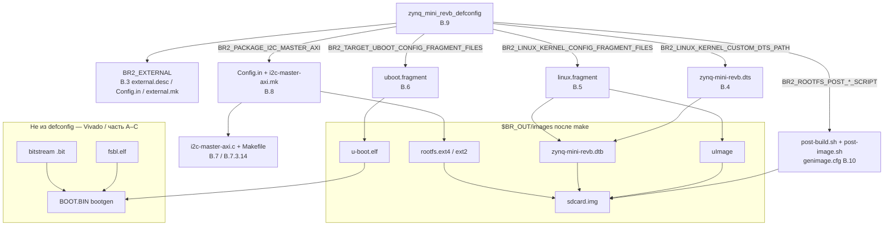
```mermaid
flowchart TB
    DEF["zynq_mini_revb_defconfig<br/>B.9"]

    B3["BR2_EXTERNAL<br/>B.3 external.desc / Config.in / external.mk"]
    B4["zynq-mini-revb.dts<br/>B.4"]
    B5["linux.fragment<br/>B.5"]
    B6["uboot.fragment<br/>B.6"]
    B7["i2c-master-axi.c + Makefile<br/>B.7 / B.7.3.14"]
    B8["Config.in + i2c-master-axi.mk<br/>B.8"]
    B10["post-build.sh + post-image.sh<br/>genimage.cfg B.10"]

    DEF --> B3
    DEF -->|"BR2_LINUX_KERNEL_CUSTOM_DTS_PATH"| B4
    DEF -->|"BR2_LINUX_KERNEL_CONFIG_FRAGMENT_FILES"| B5
    DEF -->|"BR2_TARGET_UBOOT_CONFIG_FRAGMENT_FILES"| B6
    DEF -->|"BR2_PACKAGE_I2C_MASTER_AXI"| B8
    B8 --> B7
    DEF -->|"BR2_ROOTFS_POST_*_SCRIPT"| B10

    subgraph out["$BR_OUT/images после make"]
        UI[uImage]
        DTB[zynq-mini-revb.dtb]
        UB[u-boot.elf]
        RFS[rootfs.ext4 / ext2]
        SD[sdcard.img]
    end

    B4 --> DTB
    B5 --> UI
    B5 --> DTB
    B6 --> UB
    B8 --> RFS
    B10 --> SD

    subgraph vivado["Не из defconfig — Vivado / часть A–C"]
        FSBL[fsbl.elf]
        BIT[bitstream .bit]
        BBIN[BOOT.BIN bootgen]
    end

    FSBL --> BBIN
    BIT --> BBIN
    UB --> BBIN
    UI --> SD
    DTB --> SD
    RFS --> SD
```

**Как читать схему.** **`zynq_mini_revb_defconfig`** — единая точка, которая **ссылается** на файлы из предыдущих разделов части B через переменные `BR2_*`. Сам defconfig ничего не «содержит», кроме строк конфигурации; исходники лежат в **`$BR_EXT`**. Пакет **B.8** тянет за собой исходник **B.7**; **B.3** нужен, чтобы Buildroot вообще увидел **`$BR_EXT`**.

Defconfig **не заменяет** FSBL и **bitstream** из Vivado и **не собирает BOOT.BIN** — только Linux-стек (правая нижняя ветка на схеме). Итоговая прошивка SD (часть C) склеивает артефакты из **`$BR_OUT/images/`** с вашим **`fsbl.elf`** и **`.bit`** через **bootgen**.

### B.9.5. Типичные ошибки

- Запуск **`make`** без **`O="$BR_OUT"`** — конфигурация пишется в дерево Buildroot и путается с чужими сборками.
- Забыли **`BR2_EXTERNAL`** — defconfig из **`$BR_EXT`** не подхватывается, пакет **i2c-master-axi** не виден.
- В defconfig **`$(BR2_EXTERNAL...)`** без экранирования при **`cat << EOF`** — пути в `.config` пустые, сборка ищет **`/board/...`** не там.
- Нет **`BR2_PACKAGE_I2C_MASTER_AXI=y`** — на плате нет **`.ko`**, **`probe`** I²C не вызывается.
- Поменяли только DTS, не сделали **`linux-rebuild`** — на SD старый DTB (B.14).

---

## B.10. Скрипты post-build и post-image

Buildroot к концу **`make`** уже собрал toolchain, **uImage**, **DTB**, **U-Boot**, **rootfs** в **`$BR_OUT/target`** и положил бинарники в **`$BR_OUT/images/`**. Этого достаточно для «разрозненных» файлов, но **не** для готовой SD-карты с двумя разделами и не для автозагрузки вашего **`.ko`** на плате. Скрипты в **`$BR_EXT/board/zynq_mini_revb/`** — ваш слой автоматизации: их пути прописаны в defconfig (B.9) как **`BR2_ROOTFS_POST_BUILD_SCRIPT`** и **`BR2_ROOTFS_POST_IMAGE_SCRIPT`**.

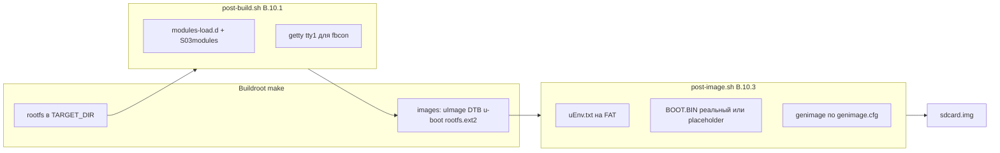
```mermaid
flowchart LR
    subgraph br["Buildroot make"]
        R[rootfs в TARGET_DIR]
        I[images: uImage DTB u-boot rootfs.ext2]
    end
  subgraph pb["post-build.sh B.10.1"]
        M[modules-load.d + S03modules]
        G[getty tty1 для fbcon]
    end
    subgraph pi["post-image.sh B.10.3"]
        U[uEnv.txt на FAT]
        B[BOOT.BIN реальный или placeholder]
        GI[genimage по genimage.cfg]
    end
    SD[sdcard.img]

    R --> pb --> I
    I --> pi --> SD
```

**`post-build.sh`** вызывается **после** сборки rootfs, **до** упаковки образов: правит **`$TARGET_DIR`** (тот же каталог, что станет ext-разделом). **`post-image.sh`** — **после** появления **`images/*`**: собирает **`sdcard.img`** через **genimage** по **`genimage.cfg`**.

---

### B.10.1. `post-build.sh` — донастройка rootfs

Buildroot передаёт один аргумент — путь к целевому rootfs (**`$1`** → **`TARGET`**). Скрипт должен быть исполняемым; в defconfig указан путь **`.../board/zynq_mini_revb/post-build.sh`**.

```bash
cat > "$BR_EXT/board/zynq_mini_revb/post-build.sh" << 'EOF'
#!/usr/bin/env bash
set -euo pipefail
TARGET="${1:?usage: post-build.sh <target-dir>}"

install -d "${TARGET}/etc/modules-load.d"
cat > "${TARGET}/etc/modules-load.d/i2c-master-axi.conf" <<'MOD'
i2c-master-axi
MOD

install -d "${TARGET}/etc/init.d"
cat > "${TARGET}/etc/init.d/S03modules" <<'INIT'
#!/bin/sh
case "$1" in
start|"")
  [ -d /etc/modules-load.d ] || exit 0
  for f in /etc/modules-load.d/*.conf; do
    [ -e "$f" ] || continue
    while IFS= read -r mod; do
      case "$mod" in ""|#*) continue ;; esac
      modprobe "$mod" 2>/dev/null || true
    done < "$f"
  done ;;
stop|restart|reload) : ;;
*) echo "usage: $0 {start|stop|restart|reload}"; exit 1 ;;
esac
exit 0
INIT
chmod 0755 "${TARGET}/etc/init.d/S03modules"

if ! grep -q '^tty1::' "${TARGET}/etc/inittab"; then
  sed -i '/^ttyPS0::/a tty1::respawn:/sbin/getty -L tty1 0 linux' \
    "${TARGET}/etc/inittab"
fi
EOF
chmod +x "$BR_EXT/board/zynq_mini_revb/post-build.sh"
```

**Автозагрузка `i2c-master-axi`.** Пакет Buildroot (B.8) кладёт **`i2c-master-axi.ko`** в **`/lib/modules/...`**, но ядро само модуль не поднимает. Файл **`/etc/modules-load.d/i2c-master-axi.conf`** со строкой **`i2c-master-axi`** — стандартное имя модуля (без `.ko`). На десктопах это читает **systemd**; в образе с **BusyBox init** (B.9) — **нет**. Поэтому добавляется **`/etc/init.d/S03modules`**: при **`start`** обходит все **`*.conf`** в **`modules-load.d`** и вызывает **`modprobe`**. Порядок **`S03`** — рано при загрузке, до пользовательского login, но после базового монтирования rootfs. Только после этого сработает **`probe`** вашего драйвера (B.7.3.11), появится шина I²C и сможет привязаться встроенный **`ssd1307fb`** из **`linux.fragment`**.

**Getty на `tty1`.** Строка в **`/etc/inittab`** запускает **`getty`** на **`tty1`**. Консоль на OLED (**fbcon**, **`bootargs`** в B.4) привязана к виртуальной консоли; с USB-клавиатурой (host, B.9) login на **`tty1`** даёт оболочку «на экране» платы. **`ttyPS0`** остаётся UART-консолью для отладки.

В **репозитории** и в эталонном **`post-build.sh`** дополнительно: **`/etc/network/interfaces`**, **`/etc/eth0-mac`**, **`S39set-eth0-mac`**, **`oled-console`** + **`S45oled-console`**, баннер **`/etc/issue`**, **`profile.d`**. Подробно — **B.10.6**.

---

### B.10.2. `genimage.cfg` — разметка SD

**genimage** — host-утилита (в defconfig включены **`BR2_PACKAGE_HOST_GENIMAGE`** и зависимости). Конфиг описывает **три образа**: FAT с загрузчиками, ext4 с rootfs, и итоговый **`sdcard.img`** с MBR-таблицей.

```bash
cat > "$BR_EXT/board/zynq_mini_revb/genimage.cfg" << 'EOF'
image boot.vfat {
	vfat {
		files = {
			"BOOT.BIN",
			"uImage",
			"zynq-mini-revb.dtb",
			"uEnv.txt",
		}
		extraargs = "-F 32"
		label = "BOOT"
	}
	size = 64M
}

image rootfs.ext4 {
	ext4 { }
	mountpoint = "/"
	size = 256M
}

image sdcard.img {
	hdimage { }
	partition boot {
		partition-type = 0xC
		bootable = "true"
		image = "boot.vfat"
	}
	partition rootfs {
		partition-type = 0x83
		image = "rootfs.ext4"
	}
}
EOF
```

**`image boot.vfat`.** Секция **`files = { ... }`** перечисляет, что попадёт **в корень FAT** из каталога **`BINARIES_DIR`** (не весь rootfs — без **`files`** genimage попытается скопировать всё и упрётся в «Disk full»). Нужны: **`BOOT.BIN`** (FSBL+bitstream+U-Boot, часть C), **`uImage`**, **`zynq-mini-revb.dtb`**, **`uEnv.txt`**.

**`extraargs = "-F 32"`** — критично для Zynq: **BootROM** разбирает первый раздел как **FAT32** (MBR тип **`0x0C`**). По умолчанию **mkfs.fat** на небольшом томе может сделать **FAT16**; тогда BootROM **не найдёт BOOT.BIN**, плата «молчит» **до UART** (даже FSBL не стартует). **`size = 64M`** — запас, чтобы FAT32 с нормальным размером кластера создался без ошибок.

**`image rootfs.ext4`.** Содержимое берётся из **`--rootpath`** (**`TARGET_DIR`** после post-build). Размер **256M** согласован с **`BR2_TARGET_ROOTFS_EXT2_SIZE`** в defconfig. **`root=/dev/mmcblk0p2`** в **`bootargs`** — это второй раздел.

**`image sdcard.img`.** MBR: раздел 1 — загрузочный FAT (**`bootable = true`**), раздел 2 — Linux ext (**`0x83`**).

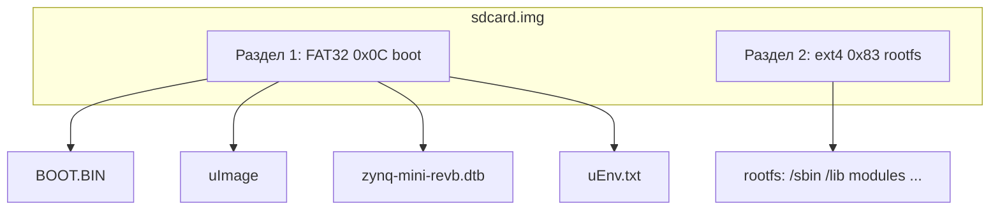
```mermaid
flowchart TB
    subgraph sd["sdcard.img"]
        P1["Раздел 1: FAT32 0x0C boot"]
        P2["Раздел 2: ext4 0x83 rootfs"]
    end
    P1 --> F1[BOOT.BIN]
    P1 --> F2[uImage]
    P1 --> F3[zynq-mini-revb.dtb]
    P1 --> F4[uEnv.txt]
    P2 --> R[rootfs: /sbin /lib modules ...]
```

---

### B.10.3. `uEnv.txt` — переменные U-Boot на FAT

Файл лежит рядом со скриптами; **post-image** копирует его в **`BINARIES_DIR`**, genimage кладёт на FAT. U-Boot из **`uboot.fragment`** (B.6) может **`fatload`** этот файл и выполнить **`uenvcmd`**.

```bash
cat > "$BR_EXT/board/zynq_mini_revb/uEnv.txt" << 'EOF'
bootargs=console=ttyPS0,115200 earlycon fbcon=font:MINI4x6 root=/dev/mmcblk0p2 rootwait rw
ethaddr=00:0a:35:01:02:03
load_dtb_addr=0x2A00000
load_kernel_addr=0x3000000
uenvcmd=mmc rescan; fatload mmc 0 ${load_kernel_addr} uImage; fatload mmc 0 ${load_dtb_addr} zynq-mini-revb.dtb; bootm ${load_kernel_addr} - ${load_dtb_addr}
EOF
```

**`bootargs`** дублирует **`chosen`** в DTS, включая **`fbcon=font:MINI4x6`** (часть **E**). U-Boot подставляет эту строку из FAT и она **перекрывает** DTB — без **`fbcon`** на OLED будет крупный шрифт по умолчанию.

**`ethaddr`** — MAC для U-Boot (должен совпадать с **`local-mac-address`** в DTS и **`/etc/eth0-mac`**, **B.10.6**). **`load_*_addr`** — адреса DDR для **`fatload`**. **`uenvcmd`** — цепочка: SD → **`uImage`** + DTB → **`bootm`** (DTB для **Linux**, не путать с **CONFIG_OF_EMBED** U-Boot из B.6).

---

### B.10.4. `post-image.sh` — сборка `sdcard.img`

Скрипт выполняется в окружении Buildroot: доступны **`BINARIES_DIR`**, **`TARGET_DIR`**, **`BUILD_DIR`**, **`BR2_EXTERNAL_*`**.

```bash
cat > "$BR_EXT/board/zynq_mini_revb/post-image.sh" << 'EOF'
#!/usr/bin/env bash
set -euo pipefail
BOARD_DIR="$(dirname "$0")"
GENIMAGE_CFG="${BOARD_DIR}/genimage.cfg"
GENIMAGE_TMP="${BUILD_DIR}/genimage.tmp"

mkdir -p "${BINARIES_DIR}/boot"
cp -v "${BOARD_DIR}/uEnv.txt" "${BINARIES_DIR}/uEnv.txt"

if [[ ! -f "${BINARIES_DIR}/BOOT.BIN" ]]; then
  echo "NOTE: BOOT.BIN missing — add real BOOT.BIN before boot (Part C)"
  echo "PLACEHOLDER — replace with bootgen output" > "${BINARIES_DIR}/BOOT.BIN"
fi

rm -rf "${GENIMAGE_TMP}"
mkdir -p "${GENIMAGE_TMP}"
genimage \
  --rootpath "${TARGET_DIR}" \
  --tmppath "${GENIMAGE_TMP}" \
  --inputpath "${BINARIES_DIR}" \
  --outputpath "${BINARIES_DIR}" \
  --config "${GENIMAGE_CFG}"

echo "SD image: ${BINARIES_DIR}/sdcard.img"
EOF
chmod +x "$BR_EXT/board/zynq_mini_revb/post-image.sh"
```

**BOOT.BIN и учебный сценарий.** Buildroot **не** собирает **BOOT.BIN**: его делаете **bootgen** из **FSBL** (Vitis), **bitstream** (Vivado) и **`u-boot.elf`** (часть C). Пока реального файла нет, скрипт кладёт **заглушку**, чтобы **genimage** не падал (в **`genimage.cfg`** файл обязателен). **`sdcard.img`** соберётся, но **плата не загрузится**, пока не подставите настоящий **BOOT.BIN** и не перезапустите post-image или не скопируете файл на FAT вручную.

В репозитории I2C_Master_Controller post-image может искать готовый **`BOOT.BIN`** в **`boot/BOOT.BIN`** — удобно после **`make boot-bin`**; в мануале «с нуля» достаточно ручной подстановки на этапе C.

**Вызов genimage.** **`--inputpath "${BINARIES_DIR}"`** — откуда брать **uImage**, DTB, **BOOT.BIN**, **uEnv.txt**. **`--rootpath "${TARGET_DIR}"`** — содержимое ext-раздела (уже с **modules-load.d** после post-build). **`--outputpath`** — сюда пишется **`sdcard.img`**.

---

### B.10.5. Связь с defconfig и проверка

В **B.9** две строки включают эти скрипты:

```text
BR2_ROOTFS_POST_BUILD_SCRIPT=".../post-build.sh"
BR2_ROOTFS_POST_IMAGE_SCRIPT=".../post-image.sh"
```

Без них Buildroot отдаст **`rootfs.ext2`** и отдельные файлы в **`images/`**, но **не** соберёт **`sdcard.img`** и не настроит автозагрузку модуля.

После **`make`**:

```bash
ls -l "$BR_OUT/images/sdcard.img"
# на целевом rootfs (ещё до genimage — в target/):
grep -r i2c-master "$BR_OUT/target/etc/modules-load.d" || true
test -x "$BR_OUT/target/etc/init.d/S03modules" && echo OK
test -x "$BR_OUT/target/etc/init.d/S45oled-console" && echo OK oled
test -x "$BR_OUT/target/etc/init.d/S39set-eth0-mac" && echo OK mac
cat "$BR_OUT/target/etc/eth0-mac"
```

Прошивка SD (часть C / B.12): **`sudo dd if=$BR_OUT/images/sdcard.img of=/dev/sdX bs=4M conv=fsync status=progress`**. Перед этим убедитесь, что на FAT лежит **настоящий** **BOOT.BIN**, а не заглушка.

---

### B.10.6. Автозапуск OLED-консоли и фиксированный MAC (`post-build`)

Две доработки rootfs, которые в репозитории уже в **`buildroot/board/zynq_mini_revb/post-build.sh`**. Если вы ведёте свой **`$BR_EXT`**, **скопируйте** хвост скрипта из репо или повторите блоки ниже.

##### Зачем это нужно

| Задача | Без доработки | С post-build |
|--------|---------------|--------------|
| **login на OLED** после boot | вручную **`oled-console`** (**E.5**) | **`S45oled-console`** при старте |
| **MAC eth0** стабилен | может меняться каждый reboot | **DT + init + uEnv** с одним адресом |
| **SSH / deploy.sh** | новый MAC → путаница в DHCP | тот же **`root@<ip>`** по привычному lease |

##### Три места с одним и тем же MAC

Используйте **один** адрес везде (пример: **`00:0a:35:01:02:03`**, OUI **00:0a:35** — Xilinx; последние 3 октета меняйте **на каждую плату** в своей сети):

| # | Где | Файл |
|---|-----|------|
| 1 | Device Tree | **`local-mac-address = [00 0a 35 01 02 03];`** в **`&gem0`** (**B.4**) |
| 2 | U-Boot env на FAT | **`ethaddr=00:0a:35:01:02:03`** в **`uEnv.txt`** (**B.10.3**) |
| 3 | Init до DHCP | **`/etc/eth0-mac`** + **`S39set-eth0-mac`** (post-build) |

После правки MAC пересоберите **DTB** и rootfs:

```bash
cd "$BR_SRC"
make BR2_EXTERNAL="$BR_EXT" O="$BR_OUT" linux-rebuild all
# uEnv.txt на FAT — cp из board/ или полный make + genimage
```

##### OLED: `oled-console` и `S45oled-console`

**Порядок init** (BusyBox):

```text
S03modules      → modprobe i2c-master-axi → ssd1307fb → /dev/fb0
S39set-eth0-mac → ip link set eth0 address ...
S40network      → ifup eth0 dhcp (Buildroot)
S45oled-console → ждёт /dev/fb0, bind vtcon1, getty tty1
```

**`S45oled-console`** (создаётся post-build):

- до **10 с** ждёт появления **`/dev/fb0`** (модуль + probe OLED);
- вызывает **`/usr/local/bin/oled-console`** (тот же код, что **E.5**);
- при **`stop`** — **`killall oled-clock`**, **`bind=0`** (если переключаетесь на демон **E.13**).

**Отключить автоконсоль** (оставить ручной **E.5**): удалите **`S45oled-console`** из post-build или на плате:

```bash
chmod -x /etc/init.d/S45oled-console
```

##### MAC: `S39set-eth0-mac` и `/etc/eth0-mac`

Файл **`/etc/eth0-mac`** — одна строка:

```text
00:0a:35:01:02:03
```

Init-скрипт **до** **`S40network`**:

```sh
ip link set dev eth0 down
ip link set dev eth0 address "$(cat /etc/eth0-mac)"
ip link set dev eth0 up
```

**Проверка на плате** после reboot:

```bash
cat /sys/class/net/eth0/address
# 00:0a:35:01:02:03

reboot
# снова:
cat /sys/class/net/eth0/address
# тот же MAC
```

**Сменить MAC** на другой экземпляр платы: правьте **все три** места (DTS, **uEnv**, **eth0-mac**), затем **`linux-rebuild`** + **`make all`** (или **`cp`** DTB/uEnv на FAT и правка **eth0-mac** на ext4).

##### Что добавить в свой `post-build.sh`

Скопируйте из репозитория **`buildroot/board/zynq_mini_revb/post-build.sh`** блоки после **`zynq-info.sh`**:

- **`/etc/eth0-mac`**
- **`/etc/init.d/S39set-eth0-mac`**
- **`/usr/local/bin/oled-console`**
- **`/etc/init.d/S45oled-console`**

Либо синхронизируйте весь файл:

```bash
cp /path/to/I2C_Master_Controller/buildroot/board/zynq_mini_revb/post-build.sh \
   "$BR_EXT/board/zynq_mini_revb/post-build.sh"
```

Пересборка только rootfs-хуков:

```bash
make BR2_EXTERNAL="$BR_EXT" O="$BR_OUT" all
```

Проверка в **`target/`** до **dd**:

```bash
test -x "$BR_OUT/target/etc/init.d/S45oled-console" && echo OK oled
test -x "$BR_OUT/target/etc/init.d/S39set-eth0-mac" && echo OK mac
cat "$BR_OUT/target/etc/eth0-mac"
```

##### Конфликт с `oled-clock` (E.13)

**`S45oled-console`** и демон **`oled-clock`** оба используют **`/dev/fb0`**. Для диагностики паттернов:

```bash
/etc/init.d/S45oled-console stop
/usr/local/bin/oled-clock --test A
```

После теста снова **`start`** или reboot.

---

## B.11. Применение defconfig и сборка

К этому шагу у вас уже должны лежать на диске все куски **`$BR_EXT`** (части B.3–B.10): **`external.desc`**, DTS, **`linux.fragment`**, **`uboot.fragment`**, драйвер с **Makefile**, рецепт пакета, **`zynq_mini_revb_defconfig`**, **`post-build.sh`**, **`post-image.sh`**, **`genimage.cfg`**, **`uEnv.txt`**. Исходники **upstream Buildroot** — в **`$BR_SRC`** (B.2), отдельный каталог вывода — **`$BR_OUT`** (B.1). Сейчас вы **впервые** превращаете defconfig в **`.config`** и запускаете полный **`make`**.

### B.11.1. Переменные окружения (напоминание)

В том же терминале, где будете собирать:

```bash
export WORK=~/zynq-mini-linux          # ваш путь
export BR_SRC="$WORK/buildroot-2024.02.7"
export BR_EXT="$WORK/board-support"
export BR_OUT="$WORK/br-output"
```

Дальше **каждая** команда Buildroot должна содержать **`BR2_EXTERNAL="$BR_EXT" O="$BR_OUT"`** — иначе конфигурация и артефакты попадут не туда.

### B.11.2. Шаг 1 — применить defconfig

```bash
cd "$BR_SRC"
make BR2_EXTERNAL="$BR_EXT" O="$BR_OUT" zynq_mini_revb_defconfig
```

Что происходит: Buildroot читает **`$BR_EXT/configs/zynq_mini_revb_defconfig`**, разворачивает сотни опций **`BR2_*`** в файл **`$BR_OUT/.config`** — рабочую конфигурацию **этой** сборки. Исходное дерево **`$BR_SRC`** при этом **не пачкается**; все скачивания и сборки — под **`$BR_OUT`**.

Быстрая проверка, что внешнее дерево и ключевые опции подхватились:

```bash
grep BR2_EXTERNAL "$BR_OUT/.config" | head -3
grep -E 'I2C_MASTER_AXI|LINUX_KERNEL_CUSTOM_DTS|POST_BUILD_SCRIPT|POST_IMAGE' "$BR_OUT/.config"
```

Ожидаемо: **`BR2_PACKAGE_I2C_MASTER_AXI=y`**, путь к DTS, строки **`BR2_ROOTFS_POST_BUILD_SCRIPT`** и **`POST_IMAGE_SCRIPT`** с **`$(BR2_EXTERNAL_ZYNQ_MINI_I2C_PATH)`** (после раскрытия — полный путь к **`board-support`**).

### B.11.3. Шаг 2 — menuconfig (по желанию)

```bash
make BR2_EXTERNAL="$BR_EXT" O="$BR_OUT" menuconfig
```

Полезно один раз пройти путь: **Target packages → ZYNQ MINI Rev B (manual) → `[*] i2c-master-axi`**. Если всё совпадает с defconfig (B.9), ничего менять не нужно — **Save & Exit**. Если что-то включили вручную, сохраните обратно в defconfig BR2_EXTERNAL (см. документацию Buildroot к **`savedefconfig`**) или поправьте **`zynq_mini_revb_defconfig`** текстом.

### B.11.4. Шаг 3 — полная сборка

```bash
make BR2_EXTERNAL="$BR_EXT" O="$BR_OUT" -j"$(nproc)"
```

**Время:** первый прогон обычно **30–90 минут** (интернет, CPU, диск). Повторные сборки быстрее: кэшируются toolchain и распакованные исходники.

**Порядок крупных этапов** (упрощённо):

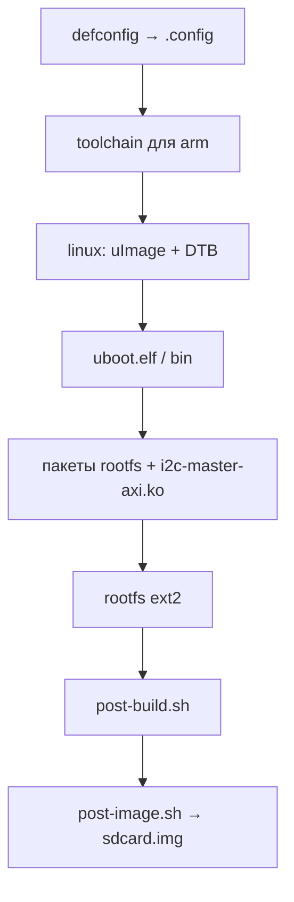
```mermaid
flowchart TB
    D[defconfig → .config]
    T[toolchain для arm]
    K[linux: uImage + DTB]
    U[uboot.elf / bin]
    P[пакеты rootfs + i2c-master-axi.ko]
    R[rootfs ext2]
    PB[post-build.sh]
    PI[post-image.sh → sdcard.img]

    D --> T --> K --> U --> P --> R --> PB --> PI
```

| Этап | Что появляется |
|------|----------------|
| Toolchain | кросс-компилятор в **`$BR_OUT/host`** |
| Linux | **`images/uImage`**, **`images/zynq-mini-revb.dtb`** |
| U-Boot | **`images/u-boot`** (ELF для bootgen) |
| Пакеты | **`target/`** — будущий rootfs, **`i2c-master-axi.ko`** |
| post-build | **`modules-load.d`**, **`S03modules`**, правки **inittab** |
| post-image | **`images/sdcard.img`** (BOOT.BIN может быть заглушкой) |

Buildroot **сам** скачивает tarball'ы ядра, U-Boot, исходники пакетов — отдельный **`apt install linux-source`** не нужен.

### B.11.5. Где смотреть лог при ошибке

Сборка останавливается на первом упавшем пакете. Прокрутите вывод вверх до строки **`ERROR:`** или **`***`**.

| Симптом в логе | Куда смотреть |
|----------------|---------------|
| Ошибка **linux** / **dtc** | DTS (B.4), путь include, **`linux.fragment`** |
| Ошибка **uboot** | **`uboot.fragment`**, OpenSSL/GnuTLS host (B.9) |
| **i2c-master-axi** | **`package/i2c-master-axi/`**, ядро уже собрано? |
| **genext2fs not found** | **`BR2_PACKAGE_HOST_GENEXT2FS=y`** в defconfig |
| **genimage** / FAT | **`genimage.cfg`**, наличие файлов в **`images/`** |

Полный лог последней сборки пакета часто лежит в **`$BR_OUT/build/<package>-<ver>/build.log`** или в выводе терминала чуть выше **ERROR**.

После исправления не обязательно начинать с нуля: для точечных правок — **B.14** (`linux-rebuild`, `i2c-master-axi-rebuild`, …). Полный **`make clean`** в **`$BR_OUT`** — только если запуталась конфигурация.

### B.11.6. После успешного `make`

Сразу проверьте артефакты — **B.12**:

```bash
ls -l "$BR_OUT/images/uImage" "$BR_OUT/images/zynq-mini-revb.dtb"
ls -l "$BR_OUT/images/u-boot" "$BR_OUT/images/sdcard.img"
find "$BR_OUT/target" -name 'i2c-master-axi.ko'
```

**`sdcard.img`** можно записать на карту, но **загрузка с платы** заработает только когда на FAT окажется **настоящий** **BOOT.BIN** (часть **C**), а не заглушка из **post-image** (B.10.4). **`uImage`**, **DTB**, **U-Boot ELF** из части B уже готовы для **bootgen**.

Дальше по мануалу: **часть C** (BOOT.BIN) → прошивка SD → включение платы → **B.13** (цепочка загрузки) → **часть E** (fbcon на OLED).

### B.11.7. Типичные ошибки именно на этом шаге

- **`make` без `O="$BR_OUT"`** — `.config` в **`$BR_SRC`**, ломает чужие сборки и путает пути.
- **`make` без `BR2_EXTERNAL`** — defconfig платы не подхватывается, нет **i2c-master-axi**.
- Запуск **`make`** не из **`$BR_SRC`** — используйте **`cd "$BR_SRC"`** или **`make -C "$BR_SRC" ...`**.
- Неполный **`$BR_EXT`** (забыли **post-image.sh**) — сборка падает в конце или нет **`sdcard.img`**.
- Прервали **`make`** и запустили снова — обычно продолжит; при странных ошибках удалите **`$BR_OUT`** и повторите **defconfig + make**.

---

## B.12. Проверка артефактов

```bash
ls -l "$BR_OUT/images/uImage"
ls -l "$BR_OUT/images/zynq-mini-revb.dtb"
ls -l "$BR_OUT/images/u-boot"
ls -l "$BR_OUT/images/sdcard.img"
```

| Файл | Ожидание |
|------|----------|
| `u-boot` | ELF, несколько МБ |
| `zynq-mini-revb.dtb` | несколько KiB |
| `sdcard.img` | сотни МБ |
| `BOOT.BIN` в images/ | может быть **заглушка** до части C |

Модуль в rootfs:

```bash
find "$BR_OUT/target" -name 'i2c-master-axi.ko'
```

---

## B.13. Что происходит при загрузке (связь с частями C–E)

Часть **B** собрала **Linux-стек**: **uImage**, **DTB**, **U-Boot ELF**, **rootfs** с модулем и скриптами, черновик **sdcard.img**. Сама по себе плата с SD из одной части B **ещё не обязана загрузиться**: на FAT нужен настоящий **BOOT.BIN** (**часть C**), карту нужно записать (**часть D**), а картинка на OLED — это отдельный шаг **fbcon** (**часть E**). Ниже — одна сквозная история «от питания до символов на дисплее», с привязкой к разделам мануала.

Общая схема по времени (детали BootROM/FSBL — **§3**):

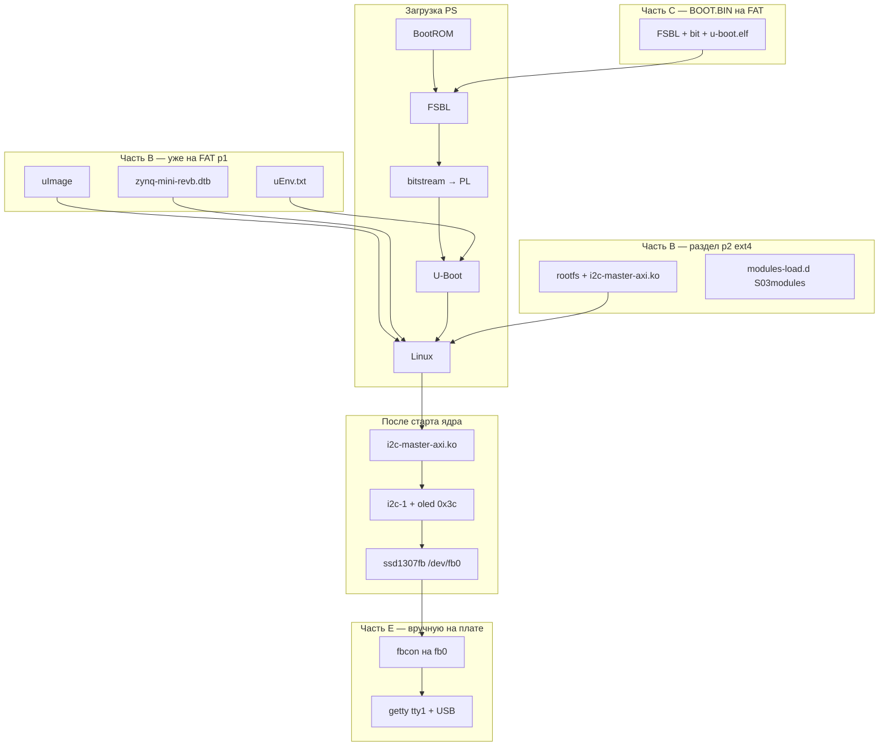
```mermaid
flowchart TB
    subgraph C["Часть C — BOOT.BIN на FAT"]
        C1[FSBL + bit + u-boot.elf]
    end
    subgraph Bfat["Часть B — уже на FAT p1"]
        B1[uImage]
        B2[zynq-mini-revb.dtb]
        B3[uEnv.txt]
    end
    subgraph Broot["Часть B — раздел p2 ext4"]
        B4[rootfs + i2c-master-axi.ko]
        B5[modules-load.d S03modules]
    end
    subgraph boot["Загрузка PS"]
        ROM[BootROM]
        FSBL[FSBL]
        PL[bitstream → PL]
        UB[U-Boot]
        LN[Linux]
    end
    subgraph sw["После старта ядра"]
        MOD[i2c-master-axi.ko]
        I2C[i2c-1 + oled 0x3c]
        FB[ssd1307fb /dev/fb0]
    end
    subgraph E["Часть E — вручную на плате"]
        FC[fbcon на fb0]
        GT[getty tty1 + USB]
    end

  ROM --> FSBL
    C1 --> FSBL
    FSBL --> PL --> UB
    B3 --> UB
    B1 --> LN
    B2 --> LN
    UB --> LN
    B4 --> LN
    LN --> MOD --> I2C --> FB
    FB --> FC --> GT
```

---

### B.13.1. Что даёт каждая часть мануала

**Часть A (Vitis FSBL)** и **Vivado (bitstream)** — не повторяются здесь подробно: без **fsbl.elf** и **`.bit`** нет инициализации DDR и вашего **i2c_master_axi** в PL. **Часть C** только **упаковывает** их вместе с **U-Boot** в **BOOT.BIN** и кладёт на FAT.

**Часть B** подготовила всё для **U-Boot и Linux после FSBL**:

| Артефакт B | Где на SD | Кто использует |
|------------|-----------|----------------|
| **uImage** | FAT **p1** | U-Boot → `bootm` → ядро |
| **zynq-mini-revb.dtb** | FAT **p1** | U-Boot передаёт в Linux (не DTB U-Boot из **OF_EMBED**, см. B.6) |
| **uEnv.txt** | FAT **p1** | U-Boot: `bootargs`, `uenvcmd` |
| **rootfs** | **p2** ext4 | Linux: `root=/dev/mmcblk0p2` |
| **i2c-master-axi.ko** | внутри **p2** | init → `modprobe` |
| **post-build** | внутри **p2** | **S03modules**, getty **tty1** |

**Часть D** — физическая запись **sdcard.img** и первый UART-лог; **часть E** — привязка **fbcon** к **`/dev/fb0`** и login на OLED.

---

### B.13.2. От включения питания до U-Boot (части A + C)

1. **BootROM** читает **BOOT.BIN** с FAT (**p1**). Если там заглушка из **post-image** (B.10) — плата не дойдёт до UART; нужен реальный **BOOT.BIN** после **bootgen** (C).
2. **FSBL** из **BOOT.BIN** выполняет **ps7_init** (из XSA), поднимает DDR.
3. **Bitstream** конфигурирует PL: появляется AXI-слейв **0x43C00000**, линии I²C к OLED (пины — **XDC**, не DTS).
4. **U-Boot** стартует, поднимает SD, может прочитать **uEnv.txt** с FAT и выполнить **`uenvcmd`**: загрузить **uImage** и **zynq-mini-revb.dtb** в DDR, **`bootm`**.

На UART в этой фазе: баннер **U-Boot**, сообщения **mmc**, **Loading uImage** / **fdt**. DTB для **Linux** — файл с FAT, не «вшитый» DT U-Boot.

---

### B.13.3. Старт Linux (артефакты B на FAT и p2)

Ядро из **uImage** распаковывается, подхватывает **DTB** с адреса, который передал U-Boot. В **DTB** (B.4) уже описаны:

- **memory**, **uart**, **mmc**, **usb**, **gem** — периферия PS;
- **`i2c@43c00000`** с **`compatible = "user,i2c-master-axi-1.0"`** — хост I²C в PL;
- дочерний **`oled@3c`** — OLED для **`ssd1307fb`**.

В **`chosen/bootargs`** (и дублирующем **uEnv.txt**) заданы **`console=ttyPS0`**, **`root=/dev/mmcblk0p2`**, **`rootwait`**, часто **`fbcon=font:MINI4x6`** (мелкий шрифт, B.4 / B.5).

Ядро монтирует **ext4** второго раздела как **/** и запускает **BusyBox init** (B.9).

---

### B.13.4. Ранний userspace: модуль I²C (B.7 + B.10)

Пока вы смотрите только UART, на плате уже идёт init:

1. Скрипт **`/etc/init.d/S03modules`** (post-build, B.10.1) читает **`/etc/modules-load.d/i2c-master-axi.conf`**.
2. **`modprobe i2c-master-axi`** загружает **`.ko`** (B.8). Срабатывает **`module_platform_driver`** → **`probe`** (B.7.3.11): **ioremap** **0x43C00000**, **PRESCALE**, **`i2c_add_adapter`**.
3. В **`dmesg`** появляется строка вроде:  
   `i2c-master-axi 43c00000.i2c: input=50000000 Hz, bus=100000 Hz, prescale=124, irq=...`
4. В **`/sys/bus/i2c/devices/`** — **`i2c-1`** (номер может отличаться).

Без этого шага узел **`oled@3c`** в DT есть, но **шины нет** — встроенный драйвер OLED не к чему привязаться.

---

### B.13.5. Framebuffer OLED (B.5 + B.4, без части E)

Когда шина **i2c-*** зарегистрирована, ядро сопоставляет дочерний узел **`oled@3c`** с встроенным **`ssd1307fb`** (**`CONFIG_FB_SSD1307`** в **linux.fragment**).

1. **`ssd1307fb`** делает **I²C-транзакции** через **`i2c-core`** → ваш **`axi_master_xfer`** → IP в PL → провода **SDA/SCL**.
2. Создаётся **`/dev/fb0`** (framebuffer 128×64).
3. Если в **bootargs** есть **`fbcon=font:MINI4x6`**, подсистема **fbcon** *может* начать вывод ядра на framebuffer — но **login на OLED** и удобный ввод обычно требуют **части E**.

На UART: **`ls /dev/fb0`**, **`i2cdetect -y 1`** → **`3c`** или **`UU`**.

---

### B.13.6. Часть E — что добавляет пользователь

**Часть B** уже подготовила **getty на tty1** в **inittab** (post-build). **Часть E** на **работающей** плате:

- привязывает виртуальную консоль к **`/dev/fb0`** (`vtcon`, см. часть E);
- запускает **`getty`** на **tty1**, если ещё не запущен;
- использует **USB-клавиатуру** (host, B.9) для ввода.

Итог: на OLED — **login:** и shell, на UART — по-прежнему **`ttyPS0`** для отладки. Две консоли независимы.

---

### B.13.7. Сводная хронология «кто за что отвечает»

| Момент | Активная часть мануала | Результат |
|--------|------------------------|-----------|
| Сборка образа | **B** | **sdcard.img**, модули, DTB |
| **bootgen** | **C** | рабочий **BOOT.BIN** на FAT |
| **dd** на SD | **D** | карта вставлена в плату |
| Питание → FSBL | **A + C** | DDR, PL, U-Boot |
| U-Boot → kernel | **B** (FAT) | Linux running |
| `modprobe` / S03 | **B** (rootfs + post-build) | **i2c-1** |
| OLED framebuffer | **B** (linux.fragment + DTS) | **/dev/fb0** |
| Текст на дисплее | **E** | fbcon + login на OLED |

---

### B.13.8. Если что-то из цепочки не сработало

Симптомы привязаны к **самому раннему** сломанному звену:

- **Нет UART вообще** — **BOOT.BIN**, FAT32 (**genimage -F 32**), boot mode SD (§3, D).
- **U-Boot есть, kernel panic** — **uImage**, **DTB**, **`root=`** / разметка **p2**.
- **Linux есть, нет `i2c-1`** — **`.ko`**, **S03modules**, **compatible**, bitstream / адрес PL.
- **`i2c-1` есть, нет `3c`** — проводка OLED, питание, **XDC**/bitstream.
- **`/dev/fb0` есть, OLED пустой** — **часть E**, **fbcon**, **`oled-console`** / bind vtcon.

Подробные команды диагностики — **D.4**, отладка драйвера — **B.7.3.13**, пересборка — **B.14**.

---

## B.14. Пересборка после правок

Полный **`make -j$(nproc)`** (B.11) нужен **один раз** — toolchain, скачивание исходников, первая сборка всего дерева. Дальше при правках в **`$BR_EXT`** разумно пересобирать **только затронутый пакет**: Buildroot предоставляет цели **`<имя-пакета>-rebuild`**. Это экономит минуты и часы по сравнению с нулевой сборкой.

**Общий шаблон** (всегда из **`$BR_SRC`**, всегда с **`BR2_EXTERNAL`** и **`O`**):

```bash
cd "$BR_SRC"
make BR2_EXTERNAL="$BR_EXT" O="$BR_OUT" <цель>-rebuild all
```

Суффикс **`all`** в конце доводит зависимые образы (например, переустановка в **`target/`**, пересборка **rootfs**, вызов **post-build** / **post-image**, если они в графе зависимостей).

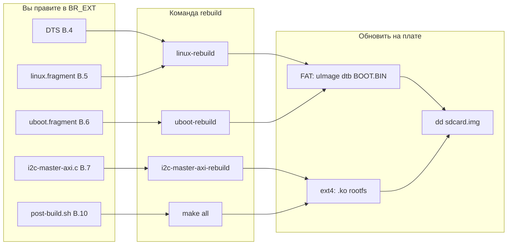
```mermaid
flowchart LR
    subgraph edit["Вы правите в BR_EXT"]
        DTS[DTS B.4]
        LF[linux.fragment B.5]
        UF[uboot.fragment B.6]
        DRV[i2c-master-axi.c B.7]
        PB[post-build.sh B.10]
    end
    subgraph cmd["Команда rebuild"]
        LR[linux-rebuild]
        UR[uboot-rebuild]
        IR[i2c-master-axi-rebuild]
        MK[make all]
    end
    subgraph sd["Обновить на плате"]
        FAT[FAT: uImage dtb BOOT.BIN]
        RFS[ext4: .ko rootfs]
        DD[dd sdcard.img]
    end

    DTS --> LR
    LF --> LR
    UF --> UR
    DRV --> IR
    PB --> MK
    LR --> FAT
    UR --> FAT
    IR --> RFS
    MK --> RFS
    FAT --> DD
    RFS --> DD
```

---

### B.14.1. Что пересобирать при правке конкретного файла

| Изменили | Команда Buildroot | Что обновить на SD |
|----------|-------------------|-------------------|
| **`zynq-mini-revb.dts`** (B.4) | `linux-rebuild all` | **p1:** `zynq-mini-revb.dtb`; при смене узлов I²C/OLED — часто достаточно DTB + перезагрузка |
| **`linux.fragment`** (B.5) | `linux-rebuild all` | **p1:** `uImage`; если менялись опции, влияющие на модули — ещё **B.14.3** |
| **`uboot.fragment`** (B.6) | `uboot-rebuild all` | **p1:** новый **U-Boot** в составе **BOOT.BIN** (часть **C**), иногда **uEnv** не трогали |
| **`i2c-master-axi.c`** или **Makefile** модуля | `i2c-master-axi-rebuild all` | **p2:** новый **`.ko`** в rootfs; проще всего — новый **`sdcard.img`** или `modprobe` после копирования модуля |
| **`post-build.sh`**, **inittab**, **modules-load.d** | `make all` (без полного clean) | **p2:** rootfs; нужен новый **ext-раздел** или точечная правка на смонтированной **p2** |
| **`genimage.cfg`**, **`post-image.sh`**, **`uEnv.txt`** | `make all` или вручную **C.3** | **`sdcard.img`** целиком |
| Только **`BOOT.BIN`** (новый bitstream / FSBL, часть C) | **C.3** (genimage), не обязательно весь Buildroot | **p1:** **BOOT.BIN**; можно **`cp`** на смонтированную FAT вместо полного **dd** |
| **`zynq_mini_revb_defconfig`** | `zynq_mini_revb_defconfig` затем `make all` | Зависит от того, какие **BR2_*** изменили |

**Правило:** пересобирайте **минимальный** пакет, но на SD кладите **тот файл, который реально изменился**. После **`linux-rebuild`** проверьте даты:

```bash
ls -l "$BR_OUT/images/uImage" "$BR_OUT/images/zynq-mini-revb.dtb"
```

---

### B.14.2. Ядро и DTB (`linux-rebuild`)

```bash
make BR2_EXTERNAL="$BR_EXT" O="$BR_OUT" linux-rebuild all
```

Buildroot заново собирает ядро с **`multi_v7_defconfig` + linux.fragment**, копирует ваш DTS из **`BR2_LINUX_KERNEL_CUSTOM_DTS_PATH`**, выпускает **`uImage`** и **`zynq-mini-revb.dtb`** в **`$BR_OUT/images/`**.

Когда этого достаточно:

- правки **memory**, **bootargs**, **OLED**, **i2c@43c00000** в DTS;
- добавление/удаление **`CONFIG_*`** в **linux.fragment** (драйвер **ssd1307fb**, шрифты **fbcon**, USB, …).

**Важно про модуль:** **`i2c-master-axi.ko`** привязан к **vermagic** ядра. После **`linux-rebuild`** (даже без смены версии, при смене **CONFIG** ядра) безопасно выполнить:

```bash
make BR2_EXTERNAL="$BR_EXT" O="$BR_OUT" i2c-master-axi-rebuild all
```

Иначе на плате: **`modprobe: invalid module format`**.

---

### B.14.3. Out-of-tree модуль (`i2c-master-axi-rebuild`)

```bash
make BR2_EXTERNAL="$BR_EXT" O="$BR_OUT" i2c-master-axi-rebuild all
```

Пересобирается только **`.ko`** против **текущего** **`$BR_OUT/build/linux-*`**. Ядро **не** трогается — быстрая итерация при отладке **probe**, **xfer**, IRQ, sysfs **`bus_hz`** (B.7.3.15).

Проверка:

```bash
find "$BR_OUT/target" -name 'i2c-master-axi.ko' -ls
```

На плате без перепрошивки всей карты (если есть сеть или USB mass storage — редко): можно скопировать **`.ko`** в **`/lib/modules/$(uname -r)/`** и **`depmod`**, но для учебного SD-проще пересобрать образ или смонтировать **p2** на ПК и заменить файл.

---

### B.14.4. U-Boot (`uboot-rebuild`)

```bash
make BR2_EXTERNAL="$BR_EXT" O="$BR_OUT" uboot-rebuild all
```

Обновляется **`$BR_OUT/images/u-boot`** (ELF). Для загрузки Zynq это **не** отдельный файл на FAT — U-Boot сидит **внутри BOOT.BIN**. После **`uboot-rebuild`** нужно:

1. Заново **bootgen** (часть **C.2**) с новым **`$BR_OUT/images/u-boot`**.
2. Положить **BOOT.BIN** в **`$BR_OUT/images/`**.
3. Пересобрать **sdcard.img** (**C.3** или **`make all`**, если сработает post-image).

Если меняли только **`uEnv.txt`** на FAT — достаточно скопировать файл на **p1** без пересборки U-Boot.

---

### B.14.5. Rootfs и post-скрипты (без `-rebuild` пакета)

Для **`post-build.sh`**, новых строк в defconfig (**пакеты userspace**), **`post-image.sh`** отдельной цели **`post-build-rebuild`** в Buildroot обычно **нет**. Запускайте:

```bash
make BR2_EXTERNAL="$BR_EXT" O="$BR_OUT" all
```

Buildroot пересоберёт то, что устарело (часто **rootfs** и затем **post-build** / **post-image**). Если изменения **только** в **post-build** и долго ждать не хотите — иногда достаточно удалить штамп rootfs и пересобрать образ (зависит от версии Buildroot); для учебного сценария приемлем **`make all`** после правки скрипта.

---

### B.14.6. Только SD-образ после нового BOOT.BIN

Если **Linux-артефакты** не менялись, а появился настоящий **BOOT.BIN** (часть C):

```bash
cp -v "$WORK/boot/BOOT.BIN" "$BR_OUT/images/BOOT.BIN"
# далее — как C.3: genimage → sdcard.img
```

Или замените **BOOT.BIN** на уже смонтированной FAT-разделе карты (**p1**) без полного **`dd`** — быстрее для отладки PL/FSBL.

---

### B.14.7. Как обновить карту: целиком или выборочно

| Способ | Когда |
|--------|--------|
| **`sudo dd ... sdcard.img`** | После **`make all`**, когда менялось многое (rootfs + FAT) |
| Копирование на смонтированные **p1** / **p2** | Поменяли один **uImage**, **dtb**, **.ko**, **BOOT.BIN** |
| Только перезагрузка платы | Поменяли **bootargs** в **uEnv** на FAT (если U-Boot читает uEnv) |

После **`dd`** снова проверьте UART (**D.2–D.4**) и цепочку **B.13**.

---

### B.14.8. Когда нужен «чистый» каталог `$BR_OUT`

Полное удаление **`$BR_OUT`** и повтор **defconfig + make** — крайняя мера:

- перепутали **`make`** без **`O=`** и испортили конфигурацию;
- сменили версию Buildroot / defconfig радикально;
- необъяснимые ошибки штампов пакетов.

```bash
rm -rf "$BR_OUT"
mkdir -p "$BR_OUT"
make BR2_EXTERNAL="$BR_EXT" O="$BR_OUT" zynq_mini_revb_defconfig
make BR2_EXTERNAL="$BR_EXT" O="$BR_OUT" -j"$(nproc)"
```

Обычная отладка драйвера **не требует** wipe **`$BR_OUT`**.

---

## B.15. Типичные ошибки части B

| Симптом | Причина | Действие |
|---------|---------|----------|
| `genext2fs: not found` | Не включён host-genext2fs | Добавьте `BR2_PACKAGE_HOST_GENEXT2FS=y` в defconfig |
| U-Boot link: `EVP_*` undefined | Нет OpenSSL для host-tools | `BR2_TARGET_UBOOT_NEEDS_OPENSSL=y` |
| Нет `i2c-1` на плате | Модуль не в rootfs / неверный `compatible` | Проверьте `.ko`, DTS `0x43c00000` |
| Kernel panic: unable to mount root | Неверный `root=` | `root=/dev/mmcblk0p2` в DTS и `uEnv.txt` |
| DTB compile error | Путь include | Используйте `xilinx/zynq-7000.dtsi` (Linux 6.5+) |

---
# Часть C. Сборка BOOT.BIN (bootgen)

Часть **B** собрала **Linux для Zynq**: **uImage**, **DTB**, **U-Boot ELF**, rootfs, **`sdcard.img`**. Но **BootROM** при включении питания **не читает** `uImage` с FAT — он ищет на первом разделе SD файл с именем **`BOOT.BIN`**. Внутри этого одного файла упакованы три компонента ранней загрузки: **FSBL**, **bitstream PL** и **U-Boot**. Утилита **bootgen** (из состава **Vitis**) собирает их по описанию **`boot.bif`**.

Теория формата образа, BootROM и поведения FSBL — **§3.2–3.5**; здесь — **практика**: какие пути подставить, какие команды выполнить, как положить результат на FAT.

```mermaid
flowchart TB
    subgraph in["Входы — уже должны существовать"]
        A["fsbl.elf<br/>часть A Vitis"]
        V["zynq_mini_oled_top.bit<br/>Vivado §17–18"]
        B["u-boot ELF<br/>$BR_OUT/images"]
    end
    subgraph c["Часть C"]
        BIF[boot_linux.bif]
        BG[bootgen -arch zynq]
        BIN[BOOT.BIN]
    end
    subgraph sd["SD p1 FAT32"]
        FAT[BOOT.BIN + uImage + dtb + uEnv]
    end
    A --> BIF
    V --> BIF
    B --> BIF
    BIF --> BG --> BIN --> FAT
```

**Что не входит в BOOT.BIN в нашем мануале:** **`uImage`**, **`zynq-mini-revb.dtb`** — они лежат **рядом** на FAT; U-Boot загружает их по **`uenvcmd`** (B.6, B.10). Это упрощает итерации: меняете ядро или DTS — пересобираете Buildroot (**B.14**), **BOOT.BIN** трогаете только при смене FSBL, bitstream или U-Boot.

---

### C.0. Что должно быть готово до части C

| Компонент | Файл | Откуда | Проверка |
|-----------|------|--------|----------|
| **FSBL** | `fsbl.elf` | **Часть A** — Platform из **XSA**, сборка `zynq_fsbl` | ненулевой размер, ELF |
| **Bitstream** | `*_top.bit` | **Vivado** — Implementation → bitstream (§17–18 [Vivado-мануал](GUIDE_VIVADO_VITIS_FROM_SCRATCH.md)) | после смены PL обязательно новый `.bit` |
| **U-Boot** | `$BR_OUT/images/u-boot` | **Часть B** — `uboot-rebuild` / полный `make` | ELF, не только `.bin` |

Все три артефакта должны относиться к **одной** конфигурации платы: **ps7_init** в FSBL из того же **XSA**, что и Address Editor; **bitstream** из того же проекта, где **M_AXI_GP0** и **i2c@43c00000**; **U-Boot** — для Zynq-7000 с вашим **uboot.fragment**.

**Заглушка** из **post-image** (B.10) — текстовый файл-заглушка, чтобы **genimage** не падал. **Плата с ней не загрузится.** Часть C заменяет заглушку на настоящий **BOOT.BIN**.

---

### C.1. Окружение: Vitis и `bootgen`

`bootgen` поставляется с **Vitis** (или полным Vivado+SDK). Перед вызовом:

```bash
source /opt/Xilinx/Vitis/2025.2/settings64.sh
# или settings64.sh из вашей установки Xilinx
which bootgen
bootgen -version
```

Без этого в PATH команда **`bootgen: not found`**.

Рабочие переменные (подставьте свои пути):

```bash
export WORK=~/zynq-mini-linux
export BR_OUT="$WORK/br-output"
export BR_EXT="$WORK/board-support"
export VIVADO_PROJ=/path/to/vivado/zynq_mini_oled   # каталог с .xpr
```

---

### C.2. Файл `boot.bif` — манифест для bootgen

**BIF** (*Boot Image Format*) — текстовый список: что положить в **BOOT.BIN** и в каком порядке. Для Zynq SD-загрузки типичная тройка:

```text
the_ROM_image:
{
    [bootloader]  fsbl.elf      ← BootROM копирует в OCM только это
    design.bit                  ← FSBL → PCAP → PL
    u-boot.elf                  ← FSBL → DDR → handoff в U-Boot
}
```

Создайте каталог и файл (пути к **вашим** файлам):

```bash
mkdir -p "$WORK/boot"

# Подставьте реальные пути:
FSBL_ELF=/path/to/vitis/workspace_linux/zynq_mini_oled_platform/zynq_fsbl/build/fsbl.elf
BIT="$VIVADO_PROJ/zynq_mini_oled.runs/impl_1/zynq_mini_oled_top.bit"
UBOOT="$BR_OUT/images/u-boot"

ls -l "$FSBL_ELF" "$BIT" "$UBOOT"

cat > "$WORK/boot/boot_linux.bif" << EOF
the_ROM_image:
{
    [bootloader] ${FSBL_ELF}
    ${BIT}
    ${UBOOT}
}
EOF
```

**Почему порядок важен**

1. **`[bootloader]`** — единственная partition, которую **BootROM** ищет по флагу bootloader и копирует в **OCM** (§3.2.3).
2. **`.bit`** — FSBL после **ps7_init** и инициализации DDR загружает конфигурацию в PL (**ваш I²C IP** появляется только после этого шага).
3. **`u-boot`** — FSBL копирует в DDR и передаёт управление (**handoff**); дальше U-Boot читает **uImage** с FAT.

Атрибут **`[bootloader]`** обязателен ровно на **одной** строке (у нас — FSBL).

**Типичные ошибки в BIF:** неверный путь (пробелы в пути — возьмите в кавычки в BIF); `.bit` от другого проекта; **`u-boot`** вместо **`u-boot.elf`** (нужен ELF из **`BR2_TARGET_UBOOT_FORMAT_ELF=y`**, B.9); забыли пересобрать FSBL после смены **XSA**.

---

### C.3. Запуск bootgen

```bash
bootgen -arch zynq -image "$WORK/boot/boot_linux.bif" -o "$WORK/boot/BOOT.BIN" -w on
ls -l "$WORK/boot/BOOT.BIN"
file "$WORK/boot/BOOT.BIN"
```

| Параметр | Смысл |
|----------|--------|
| **`-arch zynq`** | Zynq-7000 (не Versal, не ZynqMP) |
| **`-image ...bif`** | входной манифест |
| **`-o ...BOOT.BIN`** | выходной образ |
| **`-w on`** | перезаписать выходной файл без вопросов |

**Ожидаемый результат:** бинарный файл **нескольких МБ** (зависит от размера bitstream). **`file`** должен показать **data**, не **ASCII text**. Если внутри читается «PLACEHOLDER» — это не эта команда, а старый файл с SD.

При ошибках bootgen печатает, какой вход не найден — исправьте путь в **`.bif`** и проверьте **`ls -l`**.

**Когда пересобирать BOOT.BIN заново**

| Изменили | Нужен новый bootgen? |
|----------|----------------------|
| Vivado → новый **.bit** (адрес IP, пины) | **да** |
| Vitis → новый **fsbl.elf** (XSA, ps7_init) | **да** |
| Buildroot → **`uboot-rebuild`** | **да** (новый ELF в BIF) |
| Только **uImage** / **DTB** / **.ko** / rootfs | **нет** |
| Только **linux.fragment** | **нет** (U-Boot грузит ядро с FAT) |

---

### C.4. Положить BOOT.BIN на FAT и пересобрать `sdcard.img`

Buildroot при **post-image** (B.10) ожидает **`BOOT.BIN`** в **`$BR_OUT/images/`** рядом с **uImage** и DTB. Скопируйте свежий образ:

```bash
cp -v "$WORK/boot/BOOT.BIN" "$BR_OUT/images/BOOT.BIN"
```

Убедитесь, что рядом лежат и остальные файлы для FAT (из части B):

```bash
ls -l "$BR_OUT/images/"BOOT.BIN "$BR_OUT/images/uImage" \
      "$BR_OUT/images/zynq-mini-revb.dtb" "$BR_EXT/board/zynq_mini_revb/uEnv.txt"
```

**Пересборка SD-образа** — тот же **genimage**, что в **B.10.3** / **post-image.sh**:

```bash
BOARD="$BR_EXT/board/zynq_mini_revb"
export PATH="$BR_OUT/host/bin:$BR_OUT/host/sbin:$PATH"
GENIMAGE_TMP="$BR_OUT/build/genimage.tmp"

cp -v "$BOARD/uEnv.txt" "$BR_OUT/images/uEnv.txt"

rm -rf "$GENIMAGE_TMP"
mkdir -p "$GENIMAGE_TMP"

genimage \
  --rootpath "$BR_OUT/target" \
  --tmppath "$GENIMAGE_TMP" \
  --inputpath "$BR_OUT/images" \
  --outputpath "$BR_OUT/images" \
  --config "$BOARD/genimage.cfg"

ls -l "$BR_OUT/images/sdcard.img"
```

Полная пересборка Buildroot (**`make all`**) нужна только если меняли **rootfs** или сами скрипты post-image; для замены **BOOT.BIN** достаточно **cp** + **genimage** (или **C.4** + **dd**, часть D).

**Быстрая альтернатива без полного `sdcard.img`:** смонтировать **p1** карты на ПК и заменить только **`BOOT.BIN`** в корне FAT — удобно при отладке bitstream.

---

### C.5. Проверка перед включением платы

| Проверка | Команда / действие |
|----------|-------------------|
| BOOT.BIN не текст | `file $WORK/boot/BOOT.BIN` |
| На образе SD есть файл | после **dd** или mount p1: `ls -l BOOT.BIN` |
| FAT32 | **genimage** `extraargs = "-F 32"` (B.10.2) |
| Boot mode SD | перемычки платы (§3.2.2) |
| UART подключён | 115200 **ttyPS0** (D.2) |

После **dd** (**часть D**) на UART ожидаются: сообщения **Xilinx**, баннер **U-Boot**, затем **Starting kernel** (B.13). Если **тишина** — проблема **до** Linux: **BOOT.BIN**, FAT, boot mode, а не **i2c-master-axi**.

---

### C.6. Типичные ошибки части C

| Симптом | Вероятная причина | Действие |
|---------|------------------|----------|
| Нет UART, LED «мёртвый» | заглушка BOOT.BIN, не FAT32, неверный boot mode | настоящий **bootgen**, **-F 32**, MODE=SD |
| FSBL есть, зависание | bitstream не тот / не загрузился | новый **.bit** в BIF, проверка PCAP в FSBL log |
| U-Boot есть, нет Linux | не те **uImage**/DTB на FAT | B.14, **uEnv.txt** |
| `bootgen: command not found` | нет Vitis в PATH | **settings64.sh** |
| Handoff failed / DDR | FSBL не от этого XSA | пересобрать FSBL из Platform (A) |
| Работал bare-metal, Linux нет | в BIF старый U-Boot или нет **u-boot** ELF | **uboot-rebuild**, новый bootgen |

После успешной части C цепочка загрузки замыкается с **B.13**: **BOOT.BIN** → FSBL → PL → U-Boot → **uImage**+DTB → Linux → модуль I²C → OLED.

---

# Часть D. Запись SD и первый запуск

Части **B** и **C** подготовили **`sdcard.img`** на ПК: разметку **MBR**, **FAT32** с загрузчиками и **ext4** с rootfs. **Часть D** — перенос этого образа на **физическую MicroSD**, подключение **UART**, включение **ZYNQ MINI Rev B** и проверка, что цепочка **BOOT.BIN → U-Boot → Linux → I²C → OLED** дошла до рабочего userspace. Текст на дисплее и **login на OLED** — уже **часть E**; здесь главный канал отладки — **UART** (`ttyPS0`, 115200).

Сквозная логика загрузки описана в **B.13**; ранние стадии BootROM/FSBL — **§3**. Ниже — практика «записал карту → увидел приглашение `login:` на UART».

```mermaid
flowchart LR
    subgraph pc["ПК"]
        IMG[sdcard.img]
        DD[dd на /dev/sdX]
    end
    subgraph card["MicroSD в плате"]
        P1[p1 FAT32]
        P2[p2 ext4]
    end
    subgraph board["ZYNQ MINI Rev B"]
        UART[USB-UART ttyPS0]
        PL[PL + OLED]
    end
    IMG --> DD --> card
    P1 --> board
    P2 --> board
    board --> UART
    board --> PL
```

---

### D.0. Что должно быть готово

| Проверка | Где смотреть |
|----------|----------------|
| **`sdcard.img`** собран | **`ls -l "$BR_OUT/images/sdcard.img"`** (B.11, B.12) |
| На FAT **настоящий** **BOOT.BIN** | не заглушка из post-image — **часть C** (`file` → data) |
| **uImage**, **zynq-mini-revb.dtb**, **uEnv.txt** в образе | после **genimage** / **C.4** |
| **fsbl + bit + u-boot** в **BOOT.BIN** | **bootgen** прошёл без ошибок |
| Плата, SD ≥ 4 ГБ, USB-UART | **§2.1** |
| **picocom** (или аналог) на хосте | **§2.3** |
| OLED на **CAM1**, питание 3.3 V | **§2.1**, схема платы |

Если записать **`sdcard.img`** с **заглушкой** BOOT.BIN, **dd** отработает, но на UART будет **тишина** или обрыв до U-Boot — вернитесь к **C.3–C.4**, затем снова **D.1**.

---

### D.1. Подготовка хоста: найти SD и снять монтирование

**Никогда не угадывайте** букву устройства. Вставьте карту, выполните:

```bash
lsblk -o NAME,SIZE,TYPE,FSTYPE,MOUNTPOINT,MODEL
```

Типичный вид: новое устройство **`/dev/sdb`** (или **`mmcblk0`** на ноутбуке со встроенным ридером) с двумя разделами после прошивки — **FAT** и **ext4**. **До** `dd` разделы могут отсутствовать (сырая карта) — это нормально.

Снимите автомонтирование, если ОС примонтировала разделы:

```bash
sudo umount /dev/sdX* 2>/dev/null || true
```

Замените **`sdX`** на букву **вашей** карты (`sdb`, `mmcblk0`, …). Ошибка «записали не туда» уничтожит диск на ПК.

**Переменные** (как в частях B/C):

```bash
export WORK=~/zynq-mini-linux
export BR_OUT="$WORK/br-output"
```

---

### D.2. Запись `sdcard.img` утилитой `dd`

Образ — **сырой дамп** всей карты: MBR, FAT, ext4. Записывается на **устройство целиком**, не на раздел `sdX1`:

```bash
ls -l "$BR_OUT/images/sdcard.img"

sudo dd if="$BR_OUT/images/sdcard.img" of=/dev/sdX bs=4M conv=fsync status=progress
sync
```

| Параметр | Зачем |
|----------|--------|
| **`of=/dev/sdX`** | целое устройство (без номера раздела) |
| **`bs=4M`** | быстрее на больших картах |
| **`conv=fsync`** | дождаться сброса буферов на носитель |
| **`status=progress`** | индикатор (если `dd` из GNU coreutils) |

После **`sync`** извлеките и снова вставьте карту (или перепроверьте **`lsblk`**): должны появиться **p1** (vfat) и **p2** (ext4).

**Опциональная проверка на ПК** (карта смонтирована только для чтения):

```bash
sudo mkdir -p /mnt/zynq-boot
sudo mount /dev/sdX1 /mnt/zynq-boot
ls -l /mnt/zynq-boot/
file /mnt/zynq-boot/BOOT.BIN
sudo umount /mnt/zynq-boot
```

На **p1** ожидаются: **`BOOT.BIN`**, **`uImage`**, **`zynq-mini-revb.dtb`**, **`uEnv.txt`**. **`BOOT.BIN`** — бинарные данные, не текст «PLACEHOLDER».

---

### D.3. Плата перед включением

| # | Действие |
|---|----------|
| 1 | **MicroSD** вставлена до щелчка (слот TF на плате) |
| 2 | **BOOT-перемычки** — режим загрузки с **SD/TF** (§2.1, §3.2.2). Неверный режим → BootROM ищет QSPI/JTAG, на UART тишина |
| 3 | **USB-UART** (FT2232 или отдельный адаптер) к **UART PS**, не путать с **USB device/JTAG** только для отладки без моста на `ttyPS0` |
| 4 | **OLED** на разъёме **CAM1** (SDA/SCL, 3.3 V, GND) — для проверки **i2cdetect** и **/dev/fb0**; без OLED Linux всё равно может загрузиться |
| 5 | Питание **Type-C**; для первого раза **USB host с клавиатурой не обязателен** (клавиатура — часть E) |

```mermaid
sequenceDiagram
    participant PC as ПК picocom
    participant UART as USB-UART
    participant PS as Zynq PS
    participant SD as MicroSD

    PC->>UART: 115200 8N1
    UART->>PS: MIO UART1 ttyPS0
    Note over PS,SD: Питание ON
    PS->>SD: BootROM читает BOOT.BIN p1
    PS-->>UART: FSBL / U-Boot / Linux лог
    PC-->>PC: Оператор видит login:
```

---

### D.4. Терминал UART на ПК

Порт чаще всего **`/dev/ttyUSB0`** или **`/dev/ttyACM0`**:

```bash
ls -l /dev/ttyUSB* /dev/ttyACM* 2>/dev/null
groups    # при «Permission denied» добавьте пользователя в dialout и перелогиньтесь
```

**picocom** (из §2.3):

```bash
picocom -b 115200 /dev/ttyUSB0
```

Параметры: **115200**, **8 data bits**, **no parity**, **1 stop** — как в DTS **`console=ttyPS0,115200`** и **uEnv.txt**.

Выход из picocom: **Ctrl+A**, затем **Ctrl+X** (не закрывайте терминал «крестиком», пока отлаживаете — иначе пропустите ранний лог).

Альтернативы: **`minicom -D /dev/ttyUSB0 -b 115200`**, **`screen /dev/ttyUSB0 115200`**.

**Сохранить лог первого включения** (рекомендуется):

```bash
script -f boot-first.log
picocom -b 115200 /dev/ttyUSB0
# после сессии: exit из script
```

Или в picocom: **Ctrl+A**, **Ctrl+L** — запись в файл, если настроено.

Откройте UART **до** подачи питания на плату, иначе потеряете строки FSBL/U-Boot в начале.

---

### D.5. Первое включение: что должно появиться на UART

1. Подайте питание на плату (переключатель/Type-C).
2. Следите за логом без перезагрузки ПК.

**Фазы** (подробнее **B.13.2–B.13.5**):

| Фаза | Типичные строки | Если пусто |
|------|-----------------|------------|
| BootROM → FSBL | тишина или баннер FSBL при **FSBL_DEBUG_INFO** (A.4) | **BOOT.BIN**, boot mode, FAT32 |
| FSBL | DDR init, SD, PCAP / bitstream | XSA/FSBL, **.bit** в BIF |
| U-Boot | `U-Boot 2024...`, `Zynq`, `mmc`, `Loading Environment` | **u-boot** в BOOT.BIN |
| Загрузка ядра | `Loading uImage`, `Starting kernel ...` | **uImage**, **uEnv.txt**, FAT |
| Linux | `Booting Linux on physical CPU`, `mmcblk0`, `EXT4-fs` | **DTB**, **`root=/dev/mmcblk0p2`** |
| Модуль PL | `i2c-master-axi 43c00000.i2c: ... prescale=124` | **S03modules**, **.ko**, bitstream |
| OLED fb | `ssd1307fb` (может быть короче) | шина **i2c-1**, узел **0x3c** |
| Login | `zynq-mini login:` или баннер из **/etc/issue** | rootfs **p2** |

Пример **сокращённого** успешного хвоста (точные версии U-Boot/ядра зависят от сборки):

```text
U-Boot 2024.xx (May 16 2026 - ...)
Hit any key to stop autoboot:  0
Loading uImage ...
## Booting kernel from Legacy Image at 03000000 ...
Starting kernel ...

[    1.xxx] i2c-master-axi 43c00000.i2c: input=50000000 Hz, bus=100000 Hz, prescale=124
[    2.xxx] ssd1307fb 1-003c: ...

Welcome to Buildroot
...
  ZYNQ MINI Rev B  -  I2C_Master_Controller demo
  ----------------------------------------------
  login: root  (no password)

zynq-mini login:
```

**Автозагрузка:** в **uboot.fragment** (B.6) задан **`bootcmd`**, который подхватывает **uEnv.txt** с FAT и выполняет **`uenvcmd`** — загрузка **uImage** и **zynq-mini-revb.dtb** без ручных команд в U-Boot prompt. Если остановились в **`=>`**, проверьте наличие **uEnv.txt** на **p1** и **`mmc rescan`**.

---

### D.6. Первый вход в систему

На приглашении **`login:`** введите:

```text
root
```

В типичной конфигурации Buildroot для учебного образа пароль **пустой** (просто Enter) или **`root`** — смотрите, что задано в вашем defconfig (**`BR2_TARGET_GENERIC_ROOT_PASSWD`**).

После входа shell на **`ttyPS0`** — это **UART-консоль**. **OLED** на этом шаге может оставаться пустым или с артефактами ядра: **fbcon** и **login на дисплее** настраиваются в **части E**.

Полезно сразу:

```bash
uname -a
cat /proc/device-tree/model
mount | grep mmcblk0
```

Ожидается корень на **`/dev/mmcblk0p2`**, как в **bootargs** и **uEnv.txt**.

---

### D.7. Диагностика после загрузки (UART)

Выполните на плате **по порядку** — каждый шаг проверяет одно звено цепочки **B.13**.

**1. Сообщения ядра про I²C и PL**

```bash
dmesg | grep -E 'i2c-master|ssd1307|43c00000'
```

Ожидание: строка **probe** с **prescale=124** (50 MHz / 100 kHz), без **`failed to map`** / **`probe failed`**.

**2. Шина I²C**

```bash
ls /sys/bus/i2c/devices/
```

Должен быть каталог **`i2c-1`** (номер **1** в нашем DTS; если другой — подставьте в **`i2cdetect -y N`**).

**3. Сканирование шины (OLED 0x3C)**

```bash
i2cdetect -y 1
```

В таблице на пересечении **`3c`**: **`3c`** или **`UU`** (устройство занято драйвером). Пустая ячейка — проводка, питание OLED, bitstream/пины PL.

**4. Framebuffer**

```bash
ls -l /dev/fb0
cat /sys/class/graphics/fb0/name
```

Ожидание: **`ssd1307fb`**, устройство **`/dev/fb0`**.

Дальше — **тестовые паттерны** и вывод системной информации на дисплей (**E.13**), затем консоль **fbcon** (**E.5**).

**5. Модуль вручную** (если **`i2c-1`** нет)

```bash
modprobe i2c-master-axi
dmesg | tail -20
lsmod | grep i2c
```

Если **`modprobe`** помогает, но после reboot снова нет шины — проверьте **`/etc/init.d/S03modules`** и **`/etc/modules-load.d/i2c-master-axi.conf`** (B.10.1, post-build).

**6. Сеть (опционально)**

```bash
ip link
udhcpc -i eth0
```

Ethernet не обязателен для OLED-демо; **interfaces** с **dhcp** на **eth0** кладёт post-build.

---

### D.8. Интерпретация: где обрыв цепочки

Симптом → **самое раннее** сломанное звено (детали **B.13.8**, **C.6**):

| Симптом на UART | Вероятная причина | Куда смотреть |
|-----------------|-------------------|---------------|
| Полная тишина | нет BOOT.BIN / не SD mode / не тот UART | **C**, **D.3**, §3.2 |
| FSBL, нет U-Boot | handoff, DDR, неверный u-boot в BIF | **C.2**, **A** |
| U-Boot, нет `Starting kernel` | нет **uImage**/DTB/**uEnv** на FAT | **B.14**, **C.4** |
| Kernel panic: VFS | нет **p2** / неверный **`root=`** | **genimage.cfg**, DTS, **uEnv** |
| Linux OK, нет **`i2c-1`** | модуль, bitstream, **compatible** | **B.7**, **B.10**, Vivado |
| **`i2c-1`**, нет **0x3c** | OLED, CAM1, питание | схема, **XDC** |
| **`/dev/fb0` есть**, дисплей пустой | ещё не **часть E** | **E.1–E.3** |

Для «молчащего» FSBL включите **FSBL_DEBUG_INFO** (**A.4**) и пересоберите **BOOT.BIN** (**C.3**).

---

### D.9. Обновление SD без полного `dd`

Не каждая правка требует перезаписи всей карты.

| Изменили | Достаточно |
|----------|------------|
| Только **BOOT.BIN** | Скопировать на **p1** (`cp` / mount) |
| **uImage**, **DTB**, **uEnv.txt** | Заменить файлы на **p1** (**B.14**) |
| Пакеты rootfs, **.ko**, init-скрипты | Новый **`sdcard.img`** или **`dd`** только **p2** (сложнее) — проще полный **`dd`** |
| **genimage** после **`make all`** | Полный **`dd`** из **`$BR_OUT/images/sdcard.img`** |

Быстрая замена загрузочных файлов на ПК:

```bash
sudo mount /dev/sdX1 /mnt/zynq-boot
sudo cp -v "$BR_OUT/images/uImage" \
           "$BR_OUT/images/zynq-mini-revb.dtb" \
           "$WORK/boot/BOOT.BIN" \
           /mnt/zynq-boot/
sync
sudo umount /mnt/zynq-boot
```

На плате достаточно **reset** или power-cycle; **U-Boot** снова прочитает FAT.

---

### D.10. Чеклист «первый запуск успешен»

- [ ] **`dd`** завершился без ошибок, **`lsblk`** показывает **p1** + **p2**
- [ ] На **p1** **BOOT.BIN** — бинарник (**`file`** → data)
- [ ] UART: есть **U-Boot** и **`Starting kernel`**
- [ ] **`login:`** на UART, вход **root**
- [ ] **`dmesg`**: **i2c-master-axi**, **prescale=124**
- [ ] **`i2cdetect -y 1`**: **0x3c**
- [ ] **`/dev/fb0`**, имя **ssd1307fb**

Дальше — **часть E**: привязка **fbcon**, **getty** на **tty1**, USB-клавиатура для ввода на OLED.

---

### D.11. Типичные ошибки части D

| Ошибка | Последствие | Исправление |
|--------|-------------|-------------|
| **`dd of=/dev/sda`** вместо SD | потеря данных на диске ПК | всегда **`lsblk`** до и после вставки карты |
| Запись на **`sdX1`** вместо **`sdX`** | битая разметка | только **целое устройство** |
| UART после питания | пропущен ранний лог | picocom **до** power-on |
| JTAG-USB вместо UART-моста | «тишина» при живой плате | кабель/порт из §2.1 |
| Карта без **BOOT.BIN** после C | BootROM не стартует | **C.4** + повтор **D.2** |
| Ждут текст на OLED сразу | разочарование | **D** = UART; **E** = дисплей |

---


# Часть E. Системная консоль на SSD1306

**Часть D** подтвердила, что Linux живёт: на UART есть **`login:`**, **`i2c-1`**, **`/dev/fb0`**. **Часть E** переносит **интерактивную** консоль на **OLED 128×64**: символы ядра и shell, приглашение **`login:`**, ввод с **USB-клавиатуры**. UART (**`ttyPS0`**) остаётся запасным каналом отладки — две консоли независимы.

Это не отдельная прошивка: вы настраиваете уже собранный стек (**B.4**, **B.5**, **B.10**) несколькими командами **на работающей плате** (или дописываете **uEnv.txt** / init, если хотите автоматизировать).

```mermaid
flowchart TB
    subgraph hw["Железо"]
        KB[USB keyboard host]
        OLED[SSD1306 128x64]
        PL[i2c-master-axi PL]
    end
    subgraph kernel["Ядро Linux"]
        MOD[i2c-master-axi.ko]
        FB[ssd1307fb /dev/fb0]
        FBC[fbcon + MINI4x6]
        VT[виртуальная консоль tty1]
        HID[usbhid input]
    end
    subgraph user["Userspace BusyBox"]
        GT[getty tty1]
        SH[shell после login]
    end
    KB --> HID --> VT
    PL --> MOD --> FB --> FBC --> OLED
    FBC --> VT
    GT --> VT
    VT --> SH
```

---

### E.0. Предусловия (после части D)

| Проверка | Команда | Ожидание |
|----------|---------|----------|
| Framebuffer | `ls -l /dev/fb0` | устройство существует |
| Драйвер OLED | `cat /sys/class/graphics/fb0/name` | **`ssd1307fb`** |
| Шина PL | `i2cdetect -y 1` | **`3c`** или **`UU`** |
| Модуль | `lsmod \| grep i2c-master` | **`i2c_master_axi`** (или сработал **S03modules**) |
| UART login | вход **root** на **ttyPS0** | отладка с ПК |

Если **`/dev/fb0`** нет — сначала **D.7**, **B.13.5**, **H.4**; часть E не поможет.

---

### E.1. Две консоли: UART и OLED

| Виртуальная консоль | Устройство | Куда идёт вывод | Ввод |
|---------------------|------------|-----------------|------|
| основная (serial) | **`ttyPS0`** | USB-UART на ПК | терминал **picocom** |
| вторая (fb) | **`tty1`** | **OLED** через **fbcon** → **`/dev/fb0`** | **USB-клавиатура** на **host**-порту платы |

**Buildroot** (B.9, **post-build**) уже добавил в **`/etc/inittab`**:

```text
ttyPS0::respawn:/sbin/getty -L ttyPS0 115200 vt100
tty1::respawn:/sbin/getty -L tty1 0 linux
```

**Getty на `tty1`** может уже работать, но **без привязки fbcon к `fb0`** на дисплее пусто или «мусор». **Часть E** делает **`bind`** виртуальной консоли framebuffer.

---

### E.2. Что уже подготовила часть B (и зачем это важно)

Цепочка от I²C до пикселей описана в **B.13.4–B.13.5**. Для консоли на OLED критичны:

**1. Device Tree — узел `oled@3c` (B.4)**  
**`compatible = "solomon,ssd1306fb-i2c"`**, **`reg = <0x3c>`**, размер 128×64, **`solomon,com-invdir`** и precharge — чтобы **`ssd1307fb`** корректно рисовал глифы (см. комментарии в DTS).

**2. `linux.fragment` (B.5)**  
**`CONFIG_FB_SSD1307=y`**, **`CONFIG_FONT_MINI_4x6=y`** — встроенный framebuffer-драйвер и компактный шрифт.

**3. Параметр ядра `fbcon=font:MINI4x6`**  
В **`chosen/bootargs`** DTS (B.4) задано:

```text
fbcon=font:MINI4x6
```

На панели **128×64** это даёт порядка **32×10** символов (4×6 пикселей на глиф + межстрочный зазор fbcon).

**Важно про `uEnv.txt` (B.6):** в учебном файле на FAT **`bootargs`** **без** **`fbcon=font:MINI4x6`**. U-Boot при **`env import`** подставляет **`bootargs`** из **uEnv.txt**, и они **могут перекрыть** строку из DTB. Тогда fbcon возьмёт шрифт по умолчанию (крупнее, меньше символов на экране).

**Рекомендация** — дописать в **`$BR_EXT/board/zynq_mini_revb/uEnv.txt`** (на ПК, затем скопировать на FAT или пересобрать образ):

```text
bootargs=console=ttyPS0,115200 earlycon fbcon=font:MINI4x6 root=/dev/mmcblk0p2 rootwait rw
```

Проверка **на плате** после boot:

```bash
cat /proc/cmdline
```

В строке должно быть **`fbcon=font:MINI4x6`**. Если нет — правьте **uEnv.txt** на **p1** (**D.9**) и сделайте reset.

**4. post-build (B.10.1)**  
**`S03modules`** → **`i2c-master-axi`** до login; **getty** на **tty1** — см. **E.1**.

---

### E.3. Слои: fbcon, vtcon, getty

| Слой | Суть |
|------|------|
| **`ssd1307fb`** | драйвер рисует framebuffer **`/dev/fb0`** (1 bpp, 128×64) |
| **fbcon** | подсистема ядра: текст виртуальных консолей → пиксели на fb |
| **vtcon** | «мост» между VT и конкретным fb; **`bind=1`** включает вывод на **`fb0`** |
| **getty** | userspace: **`login:`** и сессия на **`tty1`** |
| **USB HID** | события клавиш → **`tty1`** |

**vtcon** в sysfs:

```bash
ls -la /sys/class/vtconsole/
for d in /sys/class/vtconsole/vtcon*; do
    echo -n "$d: "
    cat "$d/name" 2>/dev/null; cat "$d/bind" 2>/dev/null
done
```

Обычно **`vtcon0`** — dummy/VGA, **`vtcon1`** — **frame buffer device**. В скрипте ниже используется **`vtcon1`**; если у вас fb привязан к другому номеру, подставьте его в путь **`.../bind`**.

**Почему bind вручную:** на встраиваемых образах fbcon не всегда автоматически цепляется к единственному **`fb0`** при boot; явный **`echo 1 > bind`** — надёжный учебный шаг.

---

### E.4. USB-клавиатура (host, не UART)

1. Подключите **обычную USB-клавиатуру** к **USB host** разъёму платы (ULPI **USB3320**, **B.5** / **linux.fragment**: **CONFIG_USB_CHIPIDEA_HOST**).
2. **Не** путайте с кабелем **USB-UART** на ПК — он не даёт ввода в **`tty1`**.

На UART после вставки клавиатуры:

```bash
dmesg | tail -30
dmesg | grep -iE 'usb|hid|input'
ls /dev/input/
```

Ожидание: сообщения **new USB device**, **`hid-generic`**, устройства **`event0`**, **`input0`**. Если USB молчит — проверьте питание host-порта, кабель, что плата полностью загружена.

Проверка, что **`getty`** слушает **tty1**:

```bash
ps | grep getty
```

Должна быть строка с **`tty1`** (добавлена post-build).

---

### E.5. Скрипт `oled-console` (создать на плате вручную)

По правилу мануала файл **не копируют** из репозитория — создаёте на плате через UART:

```bash
cat > /usr/local/bin/oled-console << 'EOF'
#!/bin/sh
# Включить вывод виртуальной консоли на /dev/fb0 (OLED).
VTCON=/sys/class/vtconsole/vtcon1/bind
killall -q oled-clock 2>/dev/null
sleep 0.2
if [ -w "$VTCON" ]; then
    echo 1 > "$VTCON"
else
    echo "oled-console: cannot write $VTCON" >&2
    exit 1
fi
# Getty на tty1 для login на OLED (если inittab ещё не поднял).
if ! ps | grep -v grep | grep -E '[g]etty[^/]*tty1' >/dev/null; then
    setsid /sbin/getty -L tty1 0 linux </dev/null >/dev/null 2>&1 &
fi
echo "OLED console ready — login on tty1 (USB keyboard)"
EOF
chmod +x /usr/local/bin/oled-console
```

Запуск:

```bash
/usr/local/bin/oled-console
```

**Ожидаемый результат на OLED:** баннер ядра / **Buildroot**, строка **`login:`** (или приглашение после частичного вывода **getty**). Введите **`root`** **на USB-клавиатуре** (не в picocom).

Строка **`killall oled-clock`** безвредна, если демона нет: она освобождает **`/dev/fb0`**, если вы позже запускали свой userspace-демон на framebuffer.

**Сохранность:** файл в **`/usr/local/bin`** на **ext4** **p2** **пропадёт** при полном **`dd`** нового **`sdcard.img`** — скрипт нужно создать снова или добавить в **post-build** (см. **E.9**).

---

### E.6. Те же шаги без скрипта

```bash
# 1) Привязать fbcon к OLED
echo 1 > /sys/class/vtconsole/vtcon1/bind

# 2) Убедиться, что getty на tty1 запущен
ps | grep 'getty.*tty1' || /sbin/getty -L tty1 0 linux &

# 3) Подсказка на UART
echo "Смотрите OLED: login на tty1, ввод с USB keyboard"
```

Если **`bind`** пишет **Permission denied** — вы не **root**. Если **No such file** — проверьте номер **vtcon** (**E.3**).

---

### E.7. Проверка сессии на OLED

После **login** на **tty1** (клавиатура):

```bash
tty
# ожидание: /dev/tty1

uname -a
echo hello_oled
```

Короткие строки видны на дисплее; длинный вывод **прокручивается** и обрезается по **~32** символам в строке (шрифт **MINI4x6**).

**Прямой тест framebuffer** (без fbcon), если установлен **fbv** (B.9):

```bash
fbset -i
```

Основной сценарий мануала — **текстовая консоль**, не графическое приложение.

**Переключение фокуса:** ввод с клавиатуры идёт в **активную** VT. Для одной консоли на **tty1** достаточно одного **getty**. Не путайте окно **picocom** (это **ttyPS0**) с OLED.

---

### E.8. Отключить вывод на OLED (оставить только UART)

```bash
echo 0 > /sys/class/vtconsole/vtcon1/bind
```

**Login** на **`ttyPS0`** через **picocom** по-прежнему работает. **Getty** на **tty1** может оставаться в процессах — он просто не будет рисовать на fb, пока **bind=0**.

---

### E.9. Автозапуск OLED-консоли при загрузке

**В образе из репозитория** (и после **B.10.6**) это уже сделано в **`post-build.sh`**:

| Файл на rootfs | Назначение |
|----------------|------------|
| **`/usr/local/bin/oled-console`** | bind **vtcon1**, **getty** на **tty1** (**E.5**) |
| **`/etc/init.d/S45oled-console`** | вызов после **S03modules**, ожидание **`/dev/fb0`** |

После прошивки SD и reboot на OLED через ~10 с должны появиться **`login:`** (при подключённой USB-клавиатуре). UART (**ttyPS0**) не отключается.

**Проверка на плате:**

```bash
ls -l /usr/local/bin/oled-console /etc/init.d/S45oled-console
/etc/init.d/S45oled-console start   # вручную, если отключали
cat /sys/class/vtconsole/vtcon1/bind
# 1
```

**Временно отключить** (например, перед **`oled-clock --test`**, **E.13**):

```bash
/etc/init.d/S45oled-console stop
```

**Если собираете rootfs «с нуля» без хвоста post-build** — один раз на работающей плате (как раньше):

```bash
# скрипт oled-console — см. E.5 (heredoc в /usr/local/bin/oled-console)
cat > /etc/init.d/S45oled-console << 'EOF'
#!/bin/sh
case "$1" in
  start|"")
    i=0
    while [ ! -c /dev/fb0 ] && [ "$i" -lt 40 ]; do sleep 0.25; i=$((i+1)); done
    [ -x /usr/local/bin/oled-console ] && /usr/local/bin/oled-console
    ;;
  stop)
    killall -q oled-clock 2>/dev/null || true
    [ -w /sys/class/vtconsole/vtcon1/bind ] && echo 0 > /sys/class/vtconsole/vtcon1/bind 2>/dev/null || true
    ;;
  restart) "$0" stop; "$0" start ;;
  *) echo "usage: $0 {start|stop|restart}"; exit 1 ;;
esac
exit 0
EOF
chmod 0755 /etc/init.d/S45oled-console
```

Чтобы не терять после **`dd`**, перенесите те же файлы в **`post-build.sh`** (**B.10.6**) и выполните **`make all`**.

---

### E.9.1. Фиксированный MAC Ethernet (не меняется после reboot)

Случайный MAC мешает **DHCP-reservation**, **SSH** с ПК (**`deploy.sh`**, **E.13.6**) и отладке «где моя плата».

**Закрепление в три слоя** (подробно **B.10.6**):

1. **DTB** — **`local-mac-address`** в **`&gem0`** (**B.4**).
2. **FAT** — **`ethaddr=...`** в **`uEnv.txt`** (**B.10.3**).
3. **rootfs** — **`/etc/eth0-mac`** + **`S39set-eth0-mac`** (post-build, **до** DHCP).

**Проверка:**

```bash
cat /sys/class/net/eth0/address
ip link show eth0
```

Перезагрузите плату — адрес должен **совпасть**. Смените последние октеты в **трёх** файлах, если в сети несколько плат **ZYNQ MINI**.

**Только на уже загруженной системе** (без пересборки), до следующего reboot:

```bash
ip link set dev eth0 down
ip link set dev eth0 address 00:0a:35:01:02:03
ip link set dev eth0 up
udhcpc -i eth0
```

Для постоянства всё равно нужны **DTB** + **post-build** (или правка **eth0-mac** на ext4-разделе SD).

---

### E.10. Сводка: кто за что отвечает

| Задача | Часть мануала |
|--------|----------------|
| IP I²C в PL, провода OLED | Vivado + bitstream (**C**) |
| Шина **`i2c-1`** | **B.7** модуль + **B.10** **S03modules** |
| **`/dev/fb0`** | **B.4** DTS + **B.5** **CONFIG_FB_SSD1307** |
| Мелкий шрифт | **B.5** **FONT_MINI_4x6** + **`fbcon=font:MINI4x6`** в cmdline (**E.2**) |
| **`login:`** на OLED | **E.5–E.6** **bind** + **getty tty1** |
| Ввод | USB host + HID (**E.4**) |
| Отладка | UART **D.4–D.7** |

---

### E.11. Чеклист «консоль на OLED работает»

- [ ] **`/proc/cmdline`** содержит **`fbcon=font:MINI4x6`**
- [ ] **`echo 1 > .../vtcon1/bind`** без ошибки
- [ ] На OLED виден текст / **`login:`**
- [ ] **`dmesg`**: USB keyboard / **hid**
- [ ] Вход **root** с **USB-клавиатуры**, **`tty`** → **`/dev/tty1`**
- [ ] **`echo hello_oled`** отображается на дисплее
- [ ] UART-login по-прежнему доступен

---

### E.12. Типичные проблемы части E

| Симптом | Вероятная причина | Действие |
|---------|-------------------|----------|
| OLED пустой, **`fb0` есть** | не сделан **bind** | **E.5** / **E.6** |
| Крупный шрифт, 2–3 слова на экране | нет **MINI4x6** в cmdline | **E.2**, правка **uEnv.txt** |
| **`login:`** на UART, на OLED нет | **getty** только на **ttyPS0** | **bind** + **tty1** |
| **`login:`** на OLED, клавиатура молчит | не host USB / нет HID | **E.4**, **H.6** |
| Искажённые строки / «рваный» текст | неверные **solomon,*** в DTS | **B.4**, **linux-rebuild** |
| **`bind: No such file`** | другой **vtcon** | **E.3**, перебор **vtcon*** |
| После **`dd`** скрипт пропал | rootfs перезаписан | **post-build** (**B.10.6**), не только ручной **E.5** |
| MAC другой после reboot | нет **local-mac-address** / **S39** | **B.10.6**, **E.9.1** |

Подробнее по цепочке загрузки — **B.13.8**, **H.5–H.6**.

---

### E.13. Первичная диагностика: тестовые паттерны и системная информация на OLED

После **части D** вы уже проверили **`i2c-1`**, **`/dev/fb0`** и **`ssd1307fb`** по UART. Следующий шаг первичной отладки — **увидеть картинку на дисплее** и убедиться, что запись в framebuffer доходит до SSD1306 с правильной геометрией и порядком бит. Затем — вывести **живую системную сводку** (время, uptime, температуру PS XADC, напряжения).

В репозитории проекта для этого есть каталог **`linux/userspace/oled-clock/`** (эталон для сверки). В учебном сценарии мануала вы **собираете бинарник на ПК** и **доставляете на плату** вручную — по сети или через FAT/ext4 на SD. Скрипт **`deploy.sh`** из того же каталога — удобная обёртка поверх **SSH**, если Ethernet уже поднят; его разбор — в **E.13.6**.

```mermaid
flowchart TB
    subgraph check["Проверка после части D"]
        D1["i2cdetect 3c"]
        D2["/dev/fb0"]
    end
    subgraph diag["E.13 диагностика"]
        I[oled-clock --info]
        P[--test Z G A D F T ...]
        S[демон: время T uptime Vi Va]
    end
    subgraph next["Дальше"]
        C[часть E: fbcon + login]
    end
    D1 --> D2 --> I --> P --> S --> C
```

---

#### E.13.1. Два инструмента: когда какой использовать

| Инструмент | Где лежит в репо | Нужно на плате | Назначение |
|------------|------------------|----------------|------------|
| **`fb_test.sh`** | `linux/userspace/oled-clock/fb_test.sh` | **`python3`** (в типовом Buildroot-образе B.9 **нет** — ставьте отдельно или не используйте) | Быстрые «сырые» заливки 1024 байт в **`/dev/fb0`** без сборки C |
| **`oled-clock`** | `oled-clock.c` + **Makefile** | только **glibc** + **`/dev/fb0`** | Полная диагностика: **ioctl** fb, паттерны, **sysinfo**, XADC, шрифты 6×8 / 8×16 |

**Рекомендуемый маршрут:** собрать **`oled-clock`** кросс-компилятором Buildroot (**E.13.4**) и гонять паттерны через **`--test`**. **`fb_test.sh`** — запасной вариант, если на плату уже поставлен Python.

Перед любым тестом **остановите** конкурирующие процессы:

```bash
killall -q oled-clock 2>/dev/null
# если включали fbcon на OLED:
echo 0 > /sys/class/vtconsole/vtcon1/bind 2>/dev/null
```

Иначе **fbcon** или демон часов перетрут кадр.

---

#### E.13.2. Таблица тестовых паттернов (`oled-clock --test`)

Команда на плате:

```bash
/usr/local/bin/oled-clock --test NAME
```

Опции (см. **E.13.5**): **`--msb`** (порядок бит в байте), **`--no-mmap`** (только **`write()`**), **`--no-detach`** (не отключать fbcon).

| Имя | Что рисуется | Зачем смотреть |
|-----|--------------|----------------|
| **Z** | весь экран чёрный | базовая «очистка», проверка что дисплей жив |
| **G** | весь экран белый | контраст, питание, заливка всех страниц |
| **A** | один пиксель **(0,0)** | LSB-first: точка в **верхнем левом** углу |
| **D** | вертикальная линия **x=0** | ориентация «столбец слева» |
| **F** | горизонтальные полосы через строку | page-boundary SSD1306 (шаг 8 px по Y) |
| **T** | углы + диагональ | геометрия 128×64, нет зеркалирования |
| **R** | текст **`ABC`** 6×8 | шрифт и кодировка символов |
| **H** | **`HELLO`** по центру | выравнивание строки |
| **L** | L-образный угол + точка | маркеры для ручной проверки координат |
| **B** | рамка по периметру | все четыре края видны |
| **8** | цифра **`0`** шрифтом 8×16 | крупный глиф, две страницы по Y |
| **9** | **`00:00`** 8×16 | ширина времени (как в демоне) |
| **P** | 8 точек **(i×8, i×8)** | шаг 8 px по диагонали |
| **Q** | точки на **y = 0,8,…,56** | границы **page** SSD1306 |

**Типичная последовательность первого включения OLED:**

```bash
/usr/local/bin/oled-clock --test Z    # чёрный
sleep 1
/usr/local/bin/oled-clock --test G    # белый
sleep 1
/usr/local/bin/oled-clock --test A    # пиксель (0,0)
sleep 1
/usr/local/bin/oled-clock --test F    # полосы
sleep 1
/usr/local/bin/oled-clock --test T    # углы + диагональ
```

Если **A** даёт точку не в том углу — попробуйте **`--msb`** или проверьте свойства **`solomon,*`** в DTS (**B.4**).

**Паттерны `fb_test.sh`** (если есть **python3**):

```bash
sh /usr/local/bin/fb_test.sh Z   # чёрный
sh /usr/local/bin/fb_test.sh G   # белый
sh /usr/local/bin/fb_test.sh A   # byte[0]=0x01 — один бит LSB
sh /usr/local/bin/fb_test.sh B   # byte[0]=0x80 — MSB того же байта
sh /usr/local/bin/fb_test.sh C   # первая «строка» 16 байт = 0xFF
sh /usr/local/bin/fb_test.sh D   # колонка 0, LSB в каждой строке
sh /usr/local/bin/fb_test.sh E   # колонка 0, MSB
sh /usr/local/bin/fb_test.sh F   # горизонтальные полосы (чётные y)
```

Скрипт пишет **ровно 1024 байта** в **`/dev/fb0`** через **`python3`** — это проверка «сырого» пути без отрисовки шрифтов. Содержимое **`case`** в **`fb_test.sh`**:

```bash
# A: только младший бит первого байта кадра
python3 -c "import sys; b=bytearray(1024); b[0]=0x01; sys.stdout.buffer.write(bytes(b))" > /dev/fb0
```

---

#### E.13.3. Системная информация на дисплее (режим демона)

Без аргумента **`--test`** **`oled-clock`** — бесконечный цикл **раз в секунду**: очищает виртуальный кадр **128×64**, рисует текст шрифтами **6×8** и **8×16**, сбрасывает буфер в **`/dev/fb0`**.

**Макет экрана** (выровнен по **8-пиксельным страницам** SSD1306 — см. комментарии в начале **`oled-clock.c`**):

| Строки Y | Шрифт | Содержимое |
|----------|-------|------------|
| 0–7 | 6×8 | `zynq mini rev. b` (по центру) |
| 8–23 | 8×16 | время **`HH:MM:SS`** |
| 24–31 | 6×8 | дата **`YYYY-MM-DD`** |
| 32–47 | 8×16 + 6×8 | **`T=`** + температура **`XX.X`** + **`C`** (PS **XADC**) |
| 48–55 | 6×8 | **`Vi=`** / **`Va=`** — Vccpint и Vccpaux |
| 56–63 | 6×8 | **`up HhMMmSSs`** из **`sysinfo(2)`** |

**Откуда берутся данные:**

| Поле | Источник в Linux |
|------|------------------|
| Время / дата | **`localtime_r()`** |
| Uptime | **`struct sysinfo`** → **`si.uptime`** |
| Температура | **`/sys/bus/iio/devices/iio:device0/in_temp0_*`** (XADC Zynq) |
| Напряжения | **`in_voltage3_vccpint_*`**, **`in_voltage4_vccpaux_*`** |

Если XADC в DT не включён, вместо цифр будет **`T = N/A`** / **`PS XADC`** — сам OLED и I²C при этом могут быть исправны.

**Запуск демона на плате:**

```bash
killall -q oled-clock 2>/dev/null
echo 0 > /sys/class/vtconsole/vtcon1/bind 2>/dev/null
nohup /usr/local/bin/oled-clock >/tmp/oled.log 2>&1 &
sleep 1
tail -5 /tmp/oled.log
pgrep -a oled-clock
```

Остановка:

```bash
killall oled-clock
/usr/local/bin/oled-clock --test Z    # по желанию — погасить экран
```

**Скрипт-обёртка** (как в репозитории **`oled-clock-start.sh`** — можно создать на плате):

```bash
cat > /usr/local/bin/oled-clock-start << 'EOF'
#!/bin/sh
VTCON=/sys/class/vtconsole/vtcon1/bind
LOG=/tmp/oled.log
ps | grep -v grep | grep -E '[g]etty[^/]*tty1' | awk '{print $1}' | xargs -r kill 2>/dev/null
sleep 0.2
[ -w "$VTCON" ] && echo 0 > "$VTCON"
if ! pidof oled-clock >/dev/null 2>&1; then
    nohup /usr/local/bin/oled-clock >"$LOG" 2>&1 &
    sleep 0.5
fi
echo "OLED clock running (log: $LOG)"
pidof oled-clock
EOF
chmod +x /usr/local/bin/oled-clock-start
```

Перед **частью E** (консоль на OLED) демон нужно **остановить** — иначе он держит **`fb0`** и отключает **fbcon**.

---

#### E.13.4. Сборка `oled-clock` на ПК (кросс-компиляция)

Исходник — один файл **`oled-clock.c`**, **Makefile** в репозитории. Используйте **тот же toolchain**, что собрал rootfs (**`$BR_OUT/host/bin`**):

```bash
export WORK=~/zynq-mini-linux
export BR_OUT="$WORK/br-output"
export PATH="$BR_OUT/host/bin:$PATH"

REPO=/path/to/I2C_Master_Controller
cd "$REPO/linux/userspace/oled-clock"

# префикс из имени компилятора Buildroot, например arm-buildroot-linux-gnueabihf-
TC=$(basename "$(ls "$BR_OUT/host/bin/"*-gcc | head -1)" gcc)
make clean
make CROSS_COMPILE="${TC}"

file oled-clock
# ожидание: ARM 32-bit LSB executable
```

Артефакт **`oled-clock`** (~десятки KiB после **strip**) копируете на плату (**E.13.5**).

---

#### E.13.5. Как доставить файлы на плату

**Способ 1 — SD-карта на ПК (без сети)**

Раздел **p2** (ext4) rootfs:

```bash
sudo mkdir -p /mnt/zynq-root
sudo mount /dev/sdX2 /mnt/zynq-root
sudo install -m 0755 oled-clock /mnt/zynq-root/usr/local/bin/
sudo install -m 0755 fb_test.sh oled-console.sh oled-clock-start.sh \
    /mnt/zynq-root/usr/local/bin/ 2>/dev/null || true
sync
sudo umount /mnt/zynq-root
```

Раздел **p1** (FAT) — только если хотите хранить бинарник там и копировать после boot:

```bash
sudo mount /dev/sdX1 /mnt/zynq-boot
sudo cp oled-clock /mnt/zynq-boot/
sync
sudo umount /mnt/zynq-boot
# на плате:
cp /run/media/mmcblk0p1/oled-clock /usr/local/bin/   # путь зависит от mount
chmod +x /usr/local/bin/oled-clock
```

**Способ 2 — SCP по Ethernet (после DHCP)**

На плате (UART):

```bash
udhcpc -i eth0
ip addr show eth0
```

На ПК (**подставьте IP платы**):

```bash
scp oled-clock root@192.168.x.x:/usr/local/bin/
ssh root@192.168.x.x 'chmod +x /usr/local/bin/oled-clock'
```

Пароль по умолчанию в учебном образе часто пустой или **`root`**.

**Способ 3 — вставка скрипта через UART (без сети и без пересборки SD)**

Для небольших **`.sh`** — heredoc, как в **E.5** (`oled-console`). Бинарник **`oled-clock`** так не передать; для него нужны **SCP**, **SD** или **`base64`** по UART (громоздко, не рекомендуется).

**Способ 4 — `nc` (если на плате есть `nc` и сеть)**

На плате: `nc -l -p 5000 | dd of=/usr/local/bin/oled-clock`  
На ПК: `nc 192.168.x.x 5000 < oled-clock`

---

#### E.13.6. `deploy.sh` с хоста (опционально, эталон из репозитория)

Если плата в сети и на ПК установлены **`sshpass`**, **`ssh`**, **`scp`**:

```bash
cd /path/to/I2C_Master_Controller/linux/userspace/oled-clock
make CROSS_COMPILE=...   # см. E.13.4

export OLED_HOST=root@192.168.2.145   # IP вашей платы
export OLED_PASS=root

bash deploy.sh info              # FBIOGET_* на stderr
bash deploy.sh test A            # паттерн A
bash deploy.sh test F --msb      # полосы, MSB-first
bash deploy.sh stop              # kill oled-clock
bash deploy.sh clock             # запуск демона (oled-clock-start)
bash deploy.sh console           # oled-console → fbcon
bash deploy.sh shell 'i2cdetect -y 1'
```

**`deploy.sh`** внутри: **`ssh_cmd`** / **`copy_to_remote`** (через **`sshpass`**), **`ensure_module_and_bin`** (**`modprobe i2c-master-axi`**, заливка **`/usr/local/bin/oled-clock`**), подкоманды **`test`**, **`info`**, **`run`**, **`console`**, **`clock`**.

Это **не** часть «сборки с нуля» по правилу мануала, а готовый инструмент отладки после того, как Linux уже работает.

---

#### E.13.7. Разбор кода: как кадр попадает на дисплей

Исходник — **`linux/userspace/oled-clock/oled-clock.c`**. Ниже — путь **одного кадра** от **`main()`** до мигания пикселей на SSD1306. Это помогает понять, почему **`cat > /dev/fb0`** часто «молчит», а **`oled-clock --test A`** — нет, и как это связано с **B.7** (I²C в PL) и **ssd1307fb**.

##### E.13.7.1. Общая схема (userspace → ядро → I²C → OLED)

```mermaid
flowchart TB
    subgraph app["oled-clock userspace"]
        PIX["pix 64x128 bool"]
        PACK["pack_buf → 1024 B"]
        FL["flush_to_fb mmap + write"]
    end
    subgraph kern["Ядро Linux"]
        FB["ssd1307fb screen_buffer"]
        DEF["fb_deferred_io"]
        I2C["i2c-core"]
    end
    subgraph pl["PL + панель"]
        AXI["i2c-master-axi 0x43C00000"]
        OLED["SSD1306 0x3C"]
    end
    PIX --> PACK --> FL --> FB
    FB --> DEF --> I2C --> AXI --> OLED
```

**Важно:** приложение **не** вызывает **`i2c_transfer`** напрямую. Оно пишет только в **`/dev/fb0`**. Драйвер **`ssd1307fb`** (встроенный, **B.5**) переводит framebuffer в команды контроллера SSD1306 и ходит на шину **`i2c-1`**, которую обслуживает ваш **`i2c-master-axi.ko`** (**B.7**).

##### E.13.7.2. Точка входа `main()` — ветвление режимов

После разбора аргументов (**`--info`**, **`--test`**, **`--msb`**, **`--no-mmap`**, **`--no-detach`**) программа открывает framebuffer:

```c
int fb_fd = open(fb_path, O_RDWR);   /* по умолчанию "/dev/fb0" */
```

| Ветка | Условие | Действие |
|-------|---------|----------|
| Справка | **`--info`** | **`print_fb_info`**, **`close`**, выход |
| Паттерн | **`--test NAME`** | **`fill_test_pattern`** → **`flush_to_fb`** → выход |
| Демон | иначе | бесконечный цикл: отрисовка → **`flush_to_fb`** → **`nanosleep`** |

Общие шаги **до** рисования (кроме чистого **`--info`**):

1. **`sensors_init()`** — один раз читает scale/offset XADC из sysfs (для строки температуры и напряжений).
2. **`detach_fbcon()`** — отключает вывод консоли ядра на **`fb0`** (см. **E.13.7.8**).
3. **`fb_setup(fb_fd)`** — **`mmap`** буфера драйвера (если не **`--no-mmap`**).

##### E.13.7.3. Слой отрисовки: `pix[][]` и шрифты

В userspace кадр хранится **не** в формате SSD1306 «page mode», а в удобной для программиста сетке:

```c
static uint8_t pix[H][W];   /* H=64, W=128; 1 = белый пиксель */

static inline void set_px(int x, int y) {
    if ((unsigned)x < W && (unsigned)y < H)
        pix[y][x] = 1;
}
```

**Координаты:** **`x`** — 0…127 слева направо, **`y`** — 0…63 сверху вниз. Это совпадает с тем, как вы подбирали **`solomon,com-invdir`** в DTS (**B.4**): визуальный верх экрана — малые **`y`**.

**Шрифты** — таблицы **`FONT6x8`** и **`FONT8x16`** (формат **ssd1306xled**: один байт = 8 вертикальных пикселей в столбце, bit 0 — верх):

- **`draw_6x8` / `text_6x8`** — символы 6×8; **`y` должен быть кратен 8**, иначе глиф «разрезается» границей **page** SSD1306 (8 строк DRAM контроллера).
- **`draw_8x16` / `text_8x16`** — цифры, `:`, `.`, `-` для времени и температуры; **`y` кратен 8**, для целого глифа 8×16 лучше **кратен 16** (строки 8–23 в демоне — ровно две страницы).

**`fill_test_pattern(name)`** не трогает **`/dev/fb0`** — только **`clear_fb()`** и вызовы **`set_px`** / **`text_*`**. Например, паттерн **A**:

```c
} else if (!strcmp(name, "A")) {
    set_px(0, 0);   /* один белый пиксель в левом верхнем углу */
}
```

Если на экране точка не в **(0,0)** — проблема на этапе **упаковки** или в драйвере, а не в «логике паттерна».

##### E.13.7.4. Упаковка `pack_buf`: из `pix[][]` в байты framebuffer

Драйвер **`ssd1307fb`** в mainline для MONO хранит буфер **row-major**: строка **`y`**, байты по **`x/8`**, внутри байта биты — столбец из 8 пикселей. В комментарии к **`oled-clock.c`**:

```text
pixel(x,y) = (vmem[y * line_length + x/8] >> (x % 8)) & 1   /* LSB-first */
```

**`pack_buf`** обходит все **`y`**, **`x`** и собирает локальный массив **`buf[stride * H]`** (обычно **`stride == 16`**, **`H == 64`** → 1024 байта):

```c
for (int y = 0; y < H; y++) {
    for (int X = 0; X < W / 8; X++) {
        uint8_t byte = 0;
        for (int b = 0; b < 8; b++)
            if (pix[y][X * 8 + b])
                byte |= (1u << b);    /* LSB-first: b=0 — верх столбца */
        row[X] = byte;
    }
}
```

Флаг **`--msb`** меняет на **`byte |= (0x80u >> b)`** — нужен только если при **A** точка оказывается не в том углу при заведомо верном DTS.

**Почему 1024 байта:** 128×64 монохром → 8192 бита → 1024 байта. Размер совпадает с кадром SSD1306 (64 страницы × 128 колонок в терминах контроллера драйвер пересчитывает сам).

##### E.13.7.5. `flush_to_fb`: почему два способа записи

```c
static void flush_to_fb(int fd)
{
    uint8_t buf[FB_BYTES];
    pack_buf(buf, stride);

    if (g_fbmem) {
        memset(g_fbmem, 0, g_fbsize);
        memcpy(g_fbmem, buf, (size_t)stride * H);
        msync(g_fbmem, g_fbsize, MS_SYNC | MS_INVALIDATE);
    }

    lseek(fd, 0, SEEK_SET);
    while (left > 0)
        write(fd, buf + off, left);
}
```

| Механизм | Что делает | Зачем |
|----------|------------|--------|
| **`mmap` + `memcpy` + `msync`** | пишет в отображённый **`screen_buffer`** ядра | «грязнит» страницы; с **deferred_io** помечает область для отложенной отправки |
| **`write()` с начала fd** | полная перезапись 1024 байт | вызывает **`fb_sys_write`** / **`fb_deferred_io`** — **надёжный** триггер «кадр изменился» |

**`ssd1307fb`** использует **отложенный I/O**: не каждый байт сразу уходит в I²C. Поэтому:

- **`echo -n $'\x01' > /dev/fb0`** — может не обновить дисплей (мало данных, нет полного damage);
- **`oled-clock`** всегда шлёт **весь кадр** и дублирует **`write`** — панель обновляется стабильно.

**`fb_setup`** перед этим читает **`FBIOGET_FSCREENINFO`** → **`line_length`** (часто 16) и **`mmap`** ровно **`line_length * yres_virtual`** байт.

##### E.13.7.6. Что происходит в ядре после `write` (кратко)

Цепочка (без чтения исходников ядра наизусть):

1. **`ssd1307fb`** получает обновление **`screen_buffer`**.
2. Подсистема **fbdev** ставит задачу **deferred_io** (типично ~20–40 ms задержка или по **`msync`**).
3. Функция обновления дисплея формирует последовательность **I²C write** к адресу **0x3C** (из DT **`oled@3c`**).
4. **`i2c_transfer`** на адаптере **`i2c-1`** → **`axi_master_xfer`** в **`i2c-master-axi.ko`** → регистры **0x43C00000** в PL → линии **SDA/SCL** на CAM1.

Если **`i2cdetect`** видит **`3c`**, а **`write` в fb0** не даёт картинки — смотрите **userspace** (**`flush_to_fb`**, **`killall oled-clock`**, **fbcon bind**). Если **`i2cdetect`** пуст — сначала PL/bitstream/модуль (**D.7**, **B.7**).

##### E.13.7.7. Режим `--info`: что проверять в выводе

```c
ioctl(fd, FBIOGET_VSCREENINFO, &v);  /* переменная геометрия */
ioctl(fd, FBIOGET_FSCREENINFO, &f);  /* фиксированные поля */
```

Типичный успешный вывод (числа могут слегка отличаться):

```text
var: xres=128 yres=64 ... bpp=1 ... grayscale=1
fix: id=SSD1307 ... line_length=16 smem_len=1024
```

| Поле | Ожидание | Если не так |
|------|----------|-------------|
| **`xres` / `yres`** | 128 / 64 | неверный DT или не тот **`/dev/fb0`** |
| **`bpp`** | 1 | не monochrome fb |
| **`line_length`** | ≥ 16 | **`pack_buf`** использует **`stride`** из ядра |
| **`id`** | SSD1307 / подобное | драйвер не prob'ился |

В режиме **`--test`** **`print_fb_info`** вызывается **перед** отрисовкой — удобно сохранить в лог (**E.13.8**).

##### E.13.7.8. `detach_fbcon` и борьба за один `fb0`

```c
static void detach_fbcon(void) {
    for (int i = 0; i < 8; i++) {
        snprintf(path, "/sys/class/vtconsole/vtcon%d/bind", i);
        write(fd, "0", 1);   /* отвязать VT от framebuffer */
    }
}
```

**fbcon** (консоль ядра на **fb0**, **часть E**) и **oled-clock** используют **один** физический буфер. Если **fbcon** привязан (**`bind=1`**), ядро может **перерисовывать** экран после вашего кадра — «мигание», артефакты, «паттерн не тот».

| Режим | **`vtcon1/bind`** | Кто владеет **`fb0`** |
|-------|-------------------|------------------------|
| Диагностика / часы | **0** (`detach`) | **oled-clock** |
| Linux console OLED | **1** (**`oled-console`**) | **fbcon** + **getty tty1** |

Поэтому перед **`--test`** и демоном — **`killall oled-clock`** и при необходимости **`echo 0 > .../bind`**.

##### E.13.7.9. Демон: сбор данных и кадр раз в секунду

Цикл в **`main`** (упрощённо):

```c
while (1) {
    localtime_r(&now, &tm);
    sysinfo(&si);

    clear_fb();
    center_6x8("zynq mini rev. b", 0);
    snprintf(line, "%02d:%02d:%02d", ...);
    center_8x16(line, 8);
    /* дата, temp_celsius(), vint_volts(), vaux_volts(), uptime ... */

    flush_to_fb(fb_fd);

    /* nanosleep до начала следующей секунды — без накопления дрейфа */
    clock_gettime(CLOCK_REALTIME, &ts);
    nanosleep(..., 1e9 - ts.tv_nsec);
}
```

**Источники строки на экране:**

| UI | Функция / API |
|----|----------------|
| Время, дата | **`localtime_r`** |
| Uptime | **`sysinfo().uptime`** |
| Температура | **`/sys/.../in_temp0_raw`** + scale/offset |
| Vi, Va | **`in_voltage3_vccpint_*`**, **`in_voltage4_vccpaux_*`** |

**`sensors_init()`** один раз кэширует scale/offset; если файлов нет — на экране **`T = N/A`** / **`PS XADC`**, но **паттерны Z/G/A** всё равно работают.

##### E.13.7.10. Проследить один кадр: `--test A` по шагам

| Шаг | Где | Что происходит |
|-----|-----|----------------|
| 1 | **`main`** | **`open("/dev/fb0")`**, **`detach_fbcon`**, **`fb_setup`** |
| 2 | **`fill_test_pattern("A")`** | **`pix[0][0]=1`**, остальные 0 |
| 3 | **`pack_buf`** | **`buf[0]=0x01`**, остальные байты 0 |
| 4 | **`flush_to_fb`** | **`msync`** + **`write(1024)`** |
| 5 | ядро | **deferred_io** → I²C транзакции на **0x3C** |
| 6 | PL | **axi_master_xfer** → START/данные/STOP на CAM1 |
| 7 | OLED | один включённый пиксель в углу |

В stderr: **`pattern 'A' drawn (mmap=1 msb=0)`** — подтверждение ветки userspace.

##### E.13.7.11. Связь с отладкой из мануала

| Симптом | Слой для проверки |
|---------|-------------------|
| **`open(/dev/fb0): No such file`** | **ssd1307fb** / **i2c-1** / модуль (**D.7**) |
| **`--info`** не 128×64 | DT **`solomon,width/height`**, probe |
| Паттерн **A** не в углу | **`pack_buf`**, **`--msb`**, DTS COM scan |
| Кадр есть, потом исчезает | **fbcon** / второй процесс на **fb0** |
| **`write` есть, I²C тишина в логе** | **`i2cdetect`**, bitstream, проводка |

Полный исходник с комментариями по страницам SSD1306 — в начале файла **`oled-clock.c`** (блок **Layout жёстко выровнен по 8-пиксельным страницам**).

---

#### E.13.8. Диагностика по UART параллельно с OLED

Пока на дисплее идут тесты, на **picocom** удобно держать:

```bash
dmesg -w | grep -E 'i2c|ssd1307|fb0'
# в другом окне SSH/UART:
/usr/local/bin/oled-clock --info 2>&1 | tee /tmp/fb-info.txt
```

**Чеклист «OLED прошёл первичную диагностику»:**

- [ ] **`--info`**: 128×64, grayscale / 1 bpp
- [ ] **Z** → **G** → **A** → **F** → **T** выглядят ожидаемо
- [ ] демон показывает время и **uptime**, температура не **N/A** (если XADC в DT)
- [ ] **`killall oled-clock`**; можно переходить к **E.5** (**fbcon** + login)

---

# Часть F. Сводный чек-лист «всё сделано своими руками»

| # | Этап | Артефакт / признак |
|---|------|-------------------|
| 1 | Vivado-мануал §18 | `vivado/zynq_mini_oled.xsa` |
| 2 | Vivado-мануал §17 | `.../zynq_mini_oled_top.bit` |
| 3 | Часть A | `fsbl.elf` после Build platform |
| 4 | Часть B | `$BR_OUT/images/uImage`, `.dtb`, `u-boot` |
| 5 | Часть C | `$WORK/boot/BOOT.BIN` (бинарный) |
| 6 | Часть C | `$BR_OUT/images/sdcard.img` после genimage |
| 7 | Часть D | Linux login на UART |
| 8 | Часть E.13 | Паттерны **Z/G/A/…** и демон **oled-clock** на OLED |
| 9 | Часть E / B.10.6 | `login:` на OLED (авто **S45oled-console**) + USB keyboard |
| 10 | B.10.6 / E.9.1 | MAC **eth0** стабилен после reboot |

---

# Часть G. Обновление после изменений

| Изменили | Что переделать |
|----------|----------------|
| PL / bitstream | Vivado-мануал §15–18 → часть A → C (genimage) |
| Только XSA / PS7 | Export XSA → часть A → C |
| DTS / драйвер | Часть B.14 (`linux-rebuild` / `i2c-master-axi-rebuild`) |
| Только `BOOT.BIN` | Часть C.3 (genimage) |

---

# Часть H. Решение проблем

### H.1. Нет UART / тишина до U-Boot

- 115200, `/dev/ttyUSB0`
- BOOT с SD, `dd` выполнен
- `BOOT.BIN` — бинарный, не placeholder
- Включите **`FSBL_DEBUG_INFO`** в `zynq_fsbl` (§A.4.1) — по умолчанию FSBL **молчит** на UART

### H.2. Kernel не стартует

- PS7 без DDR в BD — **§7.3** Vivado-мануала
- FSBL не из **того же** XSA, что и bitstream

### H.3. Нет `i2c-1` / `3c`

- Bitstream в `BOOT.BIN` совпадает с экспортом
- Проводка OLED, питание 3.3 V
- `modprobe i2c-master-axi`

### H.4. Нет `/dev/fb0`

- `dmesg | grep ssd1306`
- Адрес **0x3c** vs **0x3d** в DTS (правка → B.4, пересборка B.14)

### H.5. fb0 есть, консоли на OLED нет

- `echo 1 > /sys/class/vtconsole/vtcon1/bind`
- Запущен `/usr/local/bin/oled-console` или getty на tty1
- USB-клавиатура в host-порту

### H.6. `login:` есть, клавиатура молчит

- Проверьте `dmesg` при вставке USB
- Пробуйте login на UART (`ttyPS0`)

---

# Заключение

В этом мануале пройден полный путь от **готового bitstream и XSA** (после [GUIDE_VIVADO_VITIS_FROM_SCRATCH.md](GUIDE_VIVADO_VITIS_FROM_SCRATCH.md)) до **работающего Linux** на **ZYNQ MINI Rev B** с **системной консолью на OLED SSD1306** 128×64. Итог — не «чёрный ящик» готового образа, а **прозрачная цепочка артефактов**, которую вы собираете сами и можете менять по частям.

## Что в итоге работает на плате

После выполнения частей **A–E** плата при загрузке с MicroSD:

1. **BootROM** читает **BOOT.BIN** с FAT и запускает **FSBL** из вашего Vitis Platform (тот же **XSA**, что и Vivado).
2. **FSBL** инициализирует **DDR**, загружает **bitstream** в PL — в логике появляется **AXI I²C master** по адресу **0x43C00000**.
3. **U-Boot** с FAT подхватывает **uImage**, **DTB** и **uEnv.txt**, передаёт управление ядру.
4. **Linux** монтирует **ext4** rootfs, автоматически поднимает модуль **`i2c-master-axi`**, регистрирует шину **`i2c-1`**, привязывает **`ssd1307fb`** к OLED на **0x3C** → **`/dev/fb0`**.
5. На **UART** (`ttyPS0`, 115200) доступны отладка и **login**; на **OLED** после **`oled-console`** — **fbcon** с шрифтом **MINI4x6** и **login** на **tty1** с **USB-клавиатуры**.

Так замыкается замысел проекта **I2C_Master_Controller**: пользовательский **I²C master в PL** становится полноценной шиной ядра Linux, а дисплей — обычным **framebuffer** с текстовой консолью, а не отдельным bare-metal демо.

```mermaid
flowchart LR
    subgraph done["Результат на ZYNQ MINI Rev B"]
        HW[PL: i2c_master_axi + OLED]
        SW[Linux: модуль + ssd1307fb + fbcon]
        UX[UART + OLED login]
    end
    HW --> SW --> UX
```

## Из чего складывается результат (по частям мануала)

| Часть | Вклад в итог |
|-------|----------------|
| **A** | **FSBL** и **ps7_init** из вашего **XSA** — без этого нет DDR и handoff в U-Boot |
| **B** | **Buildroot**: DTS, **out-of-tree** драйвер, **uImage**, rootfs, **U-Boot**, **sdcard.img** |
| **C** | **BOOT.BIN** = FSBL + bitstream + U-Boot (**bootgen**) |
| **D** | Запись SD, первый boot, проверка **i2c-1**, **fb0** |
| **E** | **fbcon** на OLED, **getty** на **tty1**, ввод с USB |

Ключевая идея согласованности: **FSBL**, **bitstream**, **DTS** (`0x43C00000`, IRQ, такты) и **драйвер** (`compatible`, **PRESCALE** для 100 kHz) описывают **одну и ту же** конфигурацию железа. Расхождение любого звена (чужой **.bit**, старый FSBL, неверный **compatible**) ломает цепочку на самом раннем из затронутых уровней — от тишины на UART до пустого **i2cdetect**.

## Чему учит такой маршрут

- **Zynq-7000** как система: разделение **BootROM → FSBL → U-Boot → kernel**, роль **BOOT.BIN** и FAT-раздела отдельно от **rootfs**.
- **Device Tree** как контракт между PL и ядром: не только PS (UART, MMC, USB), но и **кастомный IP** с дочерним I²C-устройством.
- **Out-of-tree** модуль и **Buildroot BR2_EXTERNAL** — как встроить свой RTL в промышленный Linux-образ без форка ядра.
- **Framebuffer + fbcon** на крошечном дисплее: шрифт в **cmdline**, **vtcon bind**, вторая виртуальная консоль рядом с serial.

Документ намеренно ведёт через **ручное создание** файлов в **`~/zynq-mini-linux`**, чтобы при отладке было ясно, *откуда* взялся каждый байт на SD. Эталоны в репозитории (`buildroot/board/`, `linux/drivers/`) служат сверке, а не замене шагов.

## Практический итог для статьи

**Тема:** Linux на Zynq с **собственным I²C master в PL** и **консолью на SSD1306**.

**Результат эксперимента:** на учебной плате **ZYNQ MINI Rev B** получена воспроизводимая сборка: загрузка с SD, сеть периферии PS, **шина I²C через AXI-IP**, framebuffer **128×64**, две независимые консоли (UART и OLED). Время полной первой сборки Buildroot на ПК — часы; последующие итерации (**`linux-rebuild`**, замена **uImage** на FAT, пересборка только **BOOT.BIN**) — минуты.

**Ограничения, которые стоит помнить:** OLED — **текстовая** консоль (~32×10 символов), не GUI; демон **`oled-clock`** и **`S45oled-console`** не должны работать одновременно (**E.13**). Bare-metal **oled_demo** из Vivado-мануала для Linux **не нужен** — его роль заменяют драйвер ядра и **fbcon**.

В эталонном **`post-build.sh`** репозитория уже включены **автозапуск OLED-консоли** (**E.9**, **B.10.6**) и **фиксированный MAC** (**E.9.1**).

## Куда двигаться дальше

Логичные продолжения без смены платформы:

- добавить userspace-утилиты поверх **`/dev/i2c-1`** (сенсоры, EEPROM на второй шине платы);
- использовать **Ethernet** и **SSH** для разработки без постоянного UART;
- при смене IP в Vivado — только **bitstream + FSBL + BOOT.BIN**; при смене только софта — **B.14** без touch PL.

Если все пункты чек-листа **части F** отмечены, цель мануала достигнута: **Linux на Zynq загружается с вашей SD, I²C master в PL виден ядру, на SSD1306 можно войти в систему и работать в shell** — с клавиатуры на дисплее и с терминала на ПК параллельно.

---

# Приложение. Соответствие шагам Vivado-мануала

| Vivado-мануал | Этот документ |
|---------------|---------------|
| §1–18 | **Вход** (обязательно) |
| §19 Open Workspace | A.2 |
| §20 Platform из XSA | A.3–A.4 |
| §21–25 bare-metal `oled_demo` | **Не требуется** для Linux |
| — | B (Buildroot с нуля) – H, **Заключение** |
