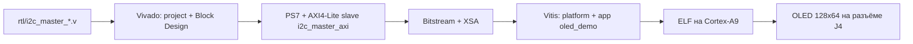

# Сборка PS+PL для ZYNQ MINI Rev B (Vivado 2025.2 + Vitis 2025.2)

Скриптовая, полностью автоматическая сборка от Verilog до ELF на ARM-ядре.
Никаких кликов в GUI — все шаги выполняются через `make` и Tcl/Python-скрипты.

## Что собирается



Результат:

- **Vivado:** `vivado/proj/zynq_mini_oled.runs/impl_1/zynq_mini_oled_top.bit`
- **XSA для Vitis:** `vivado/zynq_mini_oled.xsa`
- **Vitis:** `vitis/workspace/oled_demo/build/oled_demo.elf`

## Как запустить

```bash
# 1. Battle-test: сборка bitstream + XSA (≈ 5–10 минут)
make vivado-build                              # XC7Z010 (по умолчанию)
make vivado-build PART=xc7z020clg400-1         # XC7Z020 — та же плата ZYNQ MINI с другим чипом

# 2. Прошивка PL по JTAG (плата подключена USB-кабелем)
make vivado-program        # ищет на JTAG любой xc7z010_* / xc7z020_*

# 3. Сборка bare-metal ELF под Cortex-A9
make vitis-build

# 4. Запуск ELF на плате (PL уже прошита из шага 2)
make vitis-run
```

Переменные окружения:
- **`XILINX_ROOT`** — путь до установки (по умолчанию `/opt/xilinx/2025.2`).
- **`PART`** / **`VIVADO_PART`** — целевой кристалл (`xc7z010clg400-1` или `xc7z020clg400-1`).

## Состав файлов проекта

| Файл | Что внутри |
|------|------------|
| `vivado/build.tcl` | Создание проекта Vivado, Block Design (PS7 + i2c_master_axi через Module Reference, AXI4-Lite на 0x43C00000), tri-state IOBUF на SDA/SCL, prescaler по умолчанию = 124 (100 кГц при FCLK0=50 МГц), запуск синтеза/импла/битстрима, экспорт XSA |
| `vivado/program.tcl` | Открытие Hardware Manager, поиск `xc7z010_*`, прошивка |
| `vivado/pins.xdc` | Пины: SDA = **T20**, SCL = **P20** (BANK 34, выведены на 40-pin GPIO-разъём `CAM1`), LED (T12/U12/V12/W13), кнопки (M19/M20). Все стандарты — `LVCMOS33`, `PULLUP TRUE` для I2C |
| `vitis/build.py` | Vitis Unified CLI: создание workspace, импорт XSA, генерация platform `standalone_ps7_cortexa9_0`, application `oled_demo`, добавление исходников, сборка ELF |
| `vitis/run.py` | Заливка bit + ELF, запуск через debug-сессию |
| `vitis/src/i2c_master.{c,h}` | Низкоуровневый драйвер регистровой карты `i2c_master_axi` |
| `vitis/src/ssd1306.{c,h}` | Init-последовательность SSD1306, передача 1024-байтового кадра, демо-паттерн |
| `vitis/src/main.c` | Точка входа: `i2c_init` → `ssd1306_init` → бесконечный цикл «pattern / clear» |

## Адресация в системе

| Объект | Адрес | Размер |
|--------|-------|--------|
| `i2c_master_axi` | `0x43C00000` | 4 KiB |
| UART1 | `0xE0001000` (PS) | стандартное |

В `main.c` адрес берётся из `XPAR_I2C_BASEADDR` (если BSP его сгенерировал) или из жёсткого `0x43C00000`.

## Расчёт `PRESCALE`

Формула из `doc/DESIGN.md`:
\[
\mathrm{PRESCALE} = \frac{f_{\mathrm{FCLK0}}}{4 \cdot f_{\mathrm{SCL}}} - 1
\]

| FCLK0 | SCL | PRESCALE |
|-------|-----|----------|
| 50 МГц | 100 кГц | **124** |
| 50 МГц | 400 кГц | 30 |
| 100 МГц | 100 кГц | 249 |
| 100 МГц | 400 кГц | 62 |

Чтобы поменять: правите `fclk0_mhz` в `vivado/build.tcl` и/или `I2C_SCL_HZ` в `vitis/src/main.c` — Vitis пересчитает `I2C_PRESCALE` сам, Vivado переустановит `DEFAULT_PRESCALE` параметра модуля.

## Что нужно проверить перед первым запуском

1. **Лицензия Vivado.** При первом старте Vivado попросит лицензию — Zynq-7000 покрывается **бесплатной WebPack/ML Standard**.
2. **Cable Drivers.** Один раз: `sudo $XILINX_ROOT/Vivado/data/xicom/cable_drivers/lin64/install_script/install_drivers/install_drivers`.
3. **Питание модуля OLED.** Замерьте мультиметром `J4 → VCC` и `J4 → GND` — должно быть 3.3 В после прошивки.
4. **Перемычки на OLED-модуле.** Должны быть в положении **I2C**, не SPI.

## Как поменять адрес слейва SSD1306

Некоторые платки используют 0x3D вместо 0x3C — поправьте в `vitis/src/ssd1306.h`:

```c
#define SSD1306_I2C_ADDR  0x3D
```

И пересоберите Vitis: `make vitis-clean vitis-build vitis-run`.

## Пере-сборка после правок RTL

```bash
make vivado-clean   # убрать старый proj/
make vivado-build   # синтез заново (~5-10 мин)
make vivado-program # перепрошить
# ELF останется тем же если адрес AXI не менялся
```

Если поменяли только bare-metal код:

```bash
make vitis-clean
make vitis-build
make vitis-run
```

## Возможные грабли

| Симптом | Вероятная причина | Решение |
|---------|-------------------|---------|
| `ERROR: cable not connected` | Драйверы JTAG не установлены | Установить cable drivers (см. выше) |
| `WARNING: PROGRAM file not found` | `vivado-program` запущен до `vivado-build` | Сначала собрать |
| `XSA not found` при `vitis-build` | Нет `vivado/zynq_mini_oled.xsa` | `make vivado-build` |
| Дисплей чёрный | Не включён `0x8D 0x14` (charge pump) или нет 3.3В на VCC модуля | Проверить питание, init-последовательность |
| Только верхняя половина дисплея | `0xA8 0x3F` (multiplex 64) не отправлен | Должен быть в `ssd1306_init_seq` (он там есть) |
| `HW arbitration lost` при первом обращении | Подтяжка SDA/SCL отсутствует на модуле | `PULLUP TRUE` уже стоит в pins.xdc; для надёжности — внешний 4.7к |
| `Synthesis failed: ‘i2c_master_axi’ undefined` | Файл не добавлен в проект | Проверить `add_files` в `build.tcl` |
| Bitstream собирается, но Vitis не видит i2c в `xparameters.h` | Базовый адрес назначен неправильно | В `build.tcl` явно прописан `0x43C00000`; если меняли — обновите `vitis/src/main.c` |

## Расширения

- **Прерывания.** `i2c_master_axi/irq_o` уже подключён к `IRQ_F2P[0]`. В Vitis включите GIC и регистрируйте обработчик через `XScuGic_Connect` — обрабатывайте `DONE`/`AL` неблокирующе.
- **Linux PetaLinux.** XSA из `vivado/` импортируется в PetaLinux: `petalinux-create -t project -s zynq_mini_oled.xsa`. Драйвер в device-tree:
  ```dts
  i2c_master_axi: i2c@43c00000 {
      compatible = "generic-uio";
      reg = <0x43c00000 0x1000>;
      interrupts = <0 29 4>;
  };
  ```
- **Замена UART1 на UART0.** В `build.tcl` поменять `PCW_UART1_*` на `PCW_UART0_*` и MIO-пины 14/15.
