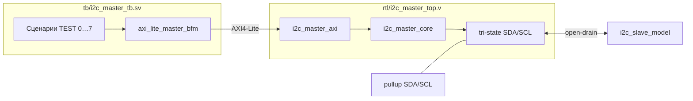

# Сквозной мануал: Vivado 2025.2 + Vitis 2025.2 на ZYNQ MINI Rev B (PS + PL, bare-metal)

Этот документ — пошаговая инструкция «от пустого Vivado до картинки на OLED-дисплее», написанная так, чтобы её мог пройти **студент-первокурсник**, открывающий Vivado первый раз. Никаких «вы и так знаете, как кликнуть» — каждое окно и каждое поле объясняется.

Финальный результат:

- В программируемой логике (PL) живёт наш Verilog-модуль `i2c_master_axi` — это I²C-мастер, регистровая карта которого выставлена наружу как **AXI4-Lite slave**.
- Процессорная система Zynq (PS, ARM Cortex-A9) общается с ним по AXI, инициализирует SSD1306-дисплей через I²C и рисует тестовый паттерн.
- Это запускается **без операционной системы** — программа на C загружается JTAG-ом прямо в OCM (256 КБ внутренней SRAM) и стартует.

Когда всё это будет работать — переходить к Linux несложно (см. `doc/GUIDE_PS_PL_BUILD.md` и `doc/GUIDE_BUILDROOT.md`). Bare-metal — это «фундамент»: если он работает, значит и аппаратура корректна, и BSP/драйверы есть с чего собирать.

> Tcl-скрипт, который автоматизирует ВСЁ описанное ниже, есть в `vivado/build.tcl`. Он разобран в самом конце — Приложение A. Сначала проходим путь руками, чтобы понять, что каждая Tcl-команда делает.

---

## 0. Что должно быть «в столе» перед началом

| # | Что нужно | Зачем |
|---|-----------|-------|
| 0.1 | **Xilinx Vivado 2025.2** (Standard/ML Edition — обе подходят; WebPACK покрывает Zynq-7000 бесплатно) | Создаём проект, синтезируем PL, генерируем битстрим |
| 0.2 | **Xilinx Vitis 2025.2 (Unified IDE)** — ставится тем же инсталлятором, галочка «Vitis» | Собираем bare-metal программу для ARM, прошиваем по JTAG |
| 0.3 | **Cable Drivers** — ставятся из инсталлятора Vivado: при первом запуске выйдет напоминание, или вручную `sudo $XILINX_ROOT/Vivado/data/xicom/cable_drivers/lin64/install_script/install_drivers/install_drivers` | Без них Vivado не увидит плату по USB-JTAG |
| 0.4 | Плата **ZYNQ MINI Rev B** с **XC7Z020-CLG400** (или XC7Z010 — у нас по умолчанию `xc7z020clg400-1`) | Цель прошивки |
| 0.5 | **OLED-модуль 128×64 на контроллере SSD1306**, подключённый в режиме I²C к разъёму `CAM1` платы: **SDA на пин T20, SCL на пин P20**, питание 3.3 В и общая земля | Дисплей, на котором проверяем работу |
| 0.6 | USB-кабель Type-C (JTAG/UART идут через один разъём — `CH340E` на плате) | JTAG-прошивка и UART-терминал |
| 0.7 | Эта папка репозитория — нужны файлы `rtl/i2c_master_core.v`, `rtl/i2c_master_axi.v`, `vivado/pins.xdc` и каталог `vitis/workspace/oled_demo/src/` | Готовый RTL и bare-metal код |
| 0.8 | Терминальная программа: `minicom`, `picocom`, `screen` или PuTTY — настройка 115200 8N1 | Смотрим `xil_printf` из bare-metal |

> Если у вас ZYNQ MINI с распайкой `XC7Z010` — описанное ниже всё равно работает, нужно только в шаге 1.4 выбрать `xc7z010clg400-1` вместо `xc7z020clg400-1`. Битстрим у этих чипов несовместим, но шаги те же.

---

## 1. Понятия, без которых дальше будет неясно

### 1.1 PS и PL

Чип XC7Z020 — это **двухкомпонентный SoC**:

- **PS (Processing System)** — обычный двухъядерный ARM Cortex-A9 с собственными контроллерами DDR3, USB, Ethernet, UART, SD, QSPI и т.д. Всё это управляется «магическими» MIO-пинами 0..53.
- **PL (Programmable Logic)** — собственно FPGA: матрица из LUT/FF/BRAM, на которой мы описываем схему на Verilog/VHDL.

Между PS и PL идут шины:

- **AXI4 / AXI4-Lite** — главная транспортная шина. PS — мастер, PL — slave (или наоборот).
- **FCLK_CLK0..3** — тактовые линии, выдаваемые PS в PL (мы будем использовать FCLK_CLK0 = 50 МГц).
- **IRQ_F2P** — линия прерываний от PL к контроллеру прерываний GIC внутри PS.

### 1.2 Block Design (BD) и IP Integrator

Block Design — это **графическое представление верхнего уровня дизайна**, где IP-блоки (включая нашу Verilog-обёртку) соединяются как «кубики» проводами и шинами. Vivado автоматически генерирует под капотом нужный Verilog/VHDL.

### 1.3 IP-ядро (IP core)

«IP» здесь — это переиспользуемый блок. Бывают:

- **Из IP Catalog** (поставляются Xilinx): `Processing System 7`, `AXI Interconnect`, `Processor System Reset`, `Concat`, `Constant`, `Utility Buffer` и т.д.
- **Module Reference**: любой ваш Verilog-модуль, добавленный в проект, можно «вставить» в BD как IP-блок. Vivado сам прочитает порты модуля и предложит соединения. Имена сигналов вида `s_axi_*` распознаются как **AXI4-Lite slave** автоматически.
- **Packaged IP** (свой собственный IP, упакованный через IP Packager): нам не нужен.

В этом проекте мы используем **Module Reference для `i2c_master_axi`** — это самый простой способ «привязать» Verilog к BD без упаковки.

### 1.4 AXI4-Lite — что это для нас на практике

#### Что такое AXI4-Lite и зачем он нужен

**AXI4-Lite** — это **упрощённый профиль** протокола **AXI4** из семейства шин **AMBA** (Arm). Он задаёт правила **memory-mapped** доступа: мастер выставляет **адрес** и (при записи) **данные**, slave принимает транзакцию и возвращает ответ или слово данных при чтении. Для программиста это выглядит как обычные **store/load** по фиксированным адресам — то же представление, что у регистров UART, таймера или GPIO в техническом описании процессора.

**Роль в Zynq.** Процессор в **PS** выходит в PL через порты **AXI GP** (general-purpose master). Vivado собирает между PS и вашими IP цепочку **AXI Interconnect / SmartConnect**: на одном конце — мастер ARM, на другом — **slave** с интерфейсом вида `s_axi_*`. Именно **Lite** достаточно для типичной «регистровой» периферии: управление, статус, IRQ — без высокоскоростных потоковых burst.

#### Из чего состоит транзакция (каналы и фазы)

Полный **AXI4** разносит обмен по **раздельным каналам**, чтобы запись и чтение могли идти параллельно. У каждого канала свой поток **`…valid` / `…ready`** — это стандартное **рукопожатие** AXI.

**Запись (write)** состоит из трёх логических частей:

1. **AW** (*address write*) — адрес цели и тип доступа (в Lite формат упрощён).
2. **W** (*write data*) — данные и строб байтов **`wstrb`** (для 32-битного слова показывает, какие байты слова действительно записываются).
3. **B** (*write response*) — короткий ответ slave о том, принята ли запись (в простых регистровых блоках почти всегда OK).

**Чтение (read)** состоит из двух частей:

1. **AR** (*address read*) — адрес.
2. **R** (*read data*) — прочитанное слово и код ответа **`rresp`** (у успешной транзакции — OKAY). В Lite за одно чтение возвращается **ровно одно** слово данных.

На практике в slave-модуле вы видите порты вроде `s_axi_awaddr`, `s_axi_wdata`, `s_axi_araddr`, `s_axi_rdata` — это и есть эти каналы (конкретный набор зависит от того, как Vivado/IP описали интерфейс; наш **`i2c_master_axi`** использует минимальный набор без **`rlast`**, потому что поток данных всегда однотактный).

#### Чем Lite отличается от «полного» AXI4

В **AXI4-Lite**:

- За одну транзакцию передаётся **ровно одно** адресное слово и **одно** данное (нет **burst**: нельзя одним AR вычитать целую линию кэша).
- Нет **идентификаторов транзакций** **`AWID`/`ARID`** и связанной переупорядочиваемости — модель проще.
- Лимиты на размер данных фиксируются конфигурацией IP (у нашего контроллера это **32 бита** на слово).

Это сознательный обмен: простота RTL slave, предсказуемые задержки, достаточная пропускная способность для программной подстройки регистров и небольших FIFO.

#### Как работает рукопожатие VALID / READY

Передача по каналу считается **состоявшейся в такте \(t\)**, если в этом такте активны **и** **`valid`, и `ready`**. Пока **`ready`** от приёмника не выставлен, источник **обязан удерживать** стабильные адрес, данные и вспомогательные поля (**`wstrb`** и т.д.). Так slave может отвечать за один такт (как в минималистичных регистровых обёртках) или тратить несколько тактов на внутреннюю логику — протокол это допускает.

#### Связка с нашим I²C-модулем

Модуль **`i2c_master_axi`** — это как раз **slave AXI4-Lite**: записи ARM в **CTRL**, **CMD**, **TX_DATA** попадают в регистры и запускают секвенсер; чтения **STATUS**, **RX_DATA**, **ISR** отдают состояние обратно по каналу **R**. На стороне софта это остаётся «запись по адресу base+смещение»; семантика ниже — уже **регистровая карта** периферии, а не детали AXI.

Наш контроллер выставляет на шину **семь** 32-битных регистров (адресный шаг **4 байта**). При разработке обёртки эту карту **явно фиксируют** (смещения, R/W, биты) и **дублируют комментарием в заголовке** `rtl/i2c_master_axi.v`, чтобы RTL, bare-metal и Linux-драйвер ссылались на один контракт — практический порядок шагов см. §5.2.1.

**Сводная таблица** (все адреса — смещение от базового адреса slave на GP0):

| Смещение | Имя | Доступ | Смысл после сброса |
|----------|-----|--------|---------------------|
| `0x00` | CTRL | R/W | `0x00000000` |
| `0x04` | STATUS | R | только чтение |
| `0x08` | CMD | W | регистр по смыслу «запись-only» |
| `0x0C` | TX_DATA | R/W | `0x00000000` |
| `0x10` | RX_DATA | R | `0x00000000` |
| `0x14` | PRESCALE | R/W | начальное значение задаётся параметром **`DEFAULT_PRESCALE`** в RTL (часто `249`, т.е. `0x00F9`, если так подобрано под целевую SCL) |
| `0x18` | ISR | R / W1C | `0x00000000` |

**CTRL (`0x00`)** — управление:

| Биты | Поле | Сброс | Описание |
|------|------|-------|----------|
| `31:2` | — | `0` | зарезервированы |
| `1` | IEN | `0` | разрешение прерываний: при `1` линия **`irq_o`** может подниматься по флагам ISR |
| `0` | EN | `0` | включение контроллера: при `0` ядро не двигает SCL/SDA, линии отпущены (как задаёт open-drain-логика) |

Замечания по использованию: **PRESCALE** меняйте только при **`EN = 0`**. Переход **`EN`** из `1` в `0` обрывает текущую транзакцию.

**STATUS (`0x04`)** — статус (только чтение):

| Биты | Поле | Описание |
|------|------|----------|
| `31:4` | — | нули |
| `3` | AL | потеря арбитража (арбитраж на шине) |
| `2` | BUSY | шина занята (между условиями START и STOP в логике ядра) |
| `1` | RXACK | последний принятый бит ACK/NACK: **`0` = ACK** от слейва, **`1` = NACK** |
| `0` | TIP | *transfer in progress* — секвенсер обрабатывает команду; для поллинга обычно ждут **`TIP = 0`** |

**CMD (`0x08`)** — команда (запись слова; актуальны младшие 5 бит). Несколько битов можно сочетать в **одной** записи — секвенсер развернёт это в цепочку атомарных обращений к `i2c_master_core`:

| Бит | Поле | Роль |
|-----|------|------|
| `0` | STA | сгенерировать **START**; если шина уже занята, подаётся **RESTART** |
| `1` | STO | после передачи байта выполнить **STOP** |
| `2` | RD | принять байт в **RX_DATA** |
| `3` | WR | выдать байт из **TX_DATA** |
| `4` | NACK | при **чтении** на 9-м бите ответить **NACK** вместо ACK |

Типовые комбинации (как удобно задавать в софте):

| Состав команды | Hex | Когда использовать |
|----------------|-----|---------------------|
| STA + WR | `0x09` | START и первый байт (часто 7-битный адрес с битом R/W) |
| WR | `0x08` | очередной байт записи |
| WR + STO | `0x0A` | байт записи и завершение STOP |
| RD | `0x04` | чтение байта с ACK |
| RD + NACK + STO | `0x16` | последний байт чтения: NACK и STOP |
| STO | `0x02` | только STOP |

**TX_DATA (`0x0C`)** — байт для выдачи на шину (`[7:0]`), включая **адресный байт** в формате `TX_DATA = {slave_addr[6:0], R/W}`: **`R/W = 0`** — режим записи мастера, **`R/W = 1`** — режим чтения.

**RX_DATA (`0x10`)** — последний принятый байт (`[7:0]`), только чтение.

**PRESCALE (`0x14`)** — делитель такта **`ena_i`** для ядра (`[15:0]`). Связь с частотой SCL:

\[
f_{\mathrm{SCL}} = \frac{f_{\mathrm{clk}}}{4 \cdot (\mathrm{PRESCALE}+1)}
\]

где \(f_{\mathrm{clk}}\) — это **`s_axi_aclk`** у обёртки. Пример для **`f_{\mathrm{clk}} = 100\,\mathrm{МГц}`**:

| Режим | Целевая SCL | PRESCALE |
|-------|-------------|----------|
| Standard | 100 кГц | 249 (`0x00F9`) |
| Fast | 400 кГц | 62 (`0x003E`) |
| Fast Mode Plus | 1 МГц | 24 (`0x0018`) |

**ISR (`0x18`)** и **`irq_o`:**

| Биты | Поле | Доступ | Описание |
|------|------|--------|----------|
| `31:2` | — | — | зарезервированы |
| `1` | AL_IRQ | R/W1C | событие по потере арбитража |
| `0` | DONE_IRQ | R/W1C | событие завершения транзакции (после работы секвенсера) |

**W1C:** запись **`1`** в данный бит сбрасывает его; запись **`0`** не меняет остальные флаги. Активный уровень на **`irq_o`** (упрощённо): **`IEN & (DONE_IRQ | AL_IRQ)`** — см. точную реализацию в RTL.

**Минимальный сценарий на софте** (без привязки к конкретному API): выставить **PRESCALE** и **`EN`**, при необходимости **IEN**; для записи положить байт в **TX_DATA**, затем записать **CMD**; крутиться в ожидании **`TIP = 0`** и проверять **RXACK**; для чтения — **CMD** с **RD**, забрать байт из **RX_DATA**. Разбор того, как это сделано в Verilog обёртки, — в §5.2.2.

Базовый адрес мы зафиксируем равным **`0x43C00000`** — это «AXI GP0 user peripheral space» Zynq.

### 1.5 IOBUF и tri-state

I²C — это **open-drain** шина: мастер может либо «отпустить» линию (на ней появится `1` благодаря подтяжке к VCC), либо «прижать» к земле (`0`). На стороне FPGA это реализуется **трёхстабильным буфером IOBUF**, у которого есть:

- `I` — что мы хотим выдать (всегда `0` для open-drain),
- `T` — tri-state enable: `1` = отпустить линию, `0` = тянуть `I` наружу,
- `O` — что мы читаем с линии,
- `IO` — собственно внешний контакт.

Наш `i2c_master_axi` выводит три сигнала на каждую линию: `*_pad_o` (мы зафиксируем = 0 внутри модуля), `*_padoen_o` (это `T`), `*_pad_i` (это `O`). Из BD они выходят наружу как обычные нетрехстабильные сигналы, а **IOBUF мы поставим вручную в RTL-обёртке `zynq_mini_oled_top.v`** — Block Design плохо работает с `inout`-портами напрямую.

### 1.6 Прерывания (IRQ_F2P)

Контроллер прерываний Cortex-A9 (GIC) принимает с PL до 16 линий через шину `IRQ_F2P`. Нумерация в GIC: первый из них — `Shared Peripheral Interrupt #61`, второй — #62 и т.д. Для bare-metal-демо мы прерывание не используем (опрашиваем `TIP` спин-петлёй), но провод между `i2c/irq_o` и `ps7/IRQ_F2P[0]` всё равно проложим — Linux-драйвер уже на него опирается.

### 1.7 Что такое XSA

После того как PL собрана, нужно «передать» Vitis'у описание платформы: какой процессор, какая периферия, по каким адресам сидят IP, какие частоты. Это упаковано в файл **`*.xsa` (Xilinx Support Archive)**. Внутри — XML с описанием и сам битстрим.

---

## 2. План работы — что мы сейчас делаем

**Где мы сейчас по «большой дорожной карте».** После создания пустого Vivado-проекта первый содержательный этап — **интеграция RTL из этого репозитория в Vivado**: те же проверенные Verilog-источники, что использовались в цепочке Intel Quartus (ядро I²C и логика регистров), но для Zynq вы подключаете **AXI-обёртку** `i2c_master_axi.v`, а не Avalon/Qsys-сборку. Это не «импорт проекта Quartus» и не перенос `.sof` — это **повторное использование общего ядра** `i2c_master_core.v` и файла **`rtl/i2c_master_axi.v`**, написанного под шину ARM в PS. Подробно этот этап разобран в **разделе 5 (Шаг 3)**.

```mermaid
flowchart TB
    A[Создать проект Vivado<br/>xc7z020clg400-1] --> Q[Этап интеграции RTL:<br/>ядро + AXI-обёртка<br/>из репозитория]
    Q --> B[Добавить в Vivado<br/>i2c_master_core.v<br/>i2c_master_axi.v]
    B --> C[Создать Block Design 'system']
    C --> D[Добавить Zynq7 Processing System<br/>и настроить под плату]
    D --> E[Добавить i2c_master_axi<br/>как Module Reference]
    E --> F[Make External:<br/>SDA/SCL pad_i/o/oen + irq]
    F --> G[Run Connection Automation:<br/>AXI4 → подключит Interconnect и reset]
    G --> H[Подключить irq_o к IRQ_F2P]
    H --> I[Address Editor: 0x43C00000]
    I --> J[Validate Design]
    J --> K[Create HDL Wrapper<br/>и top-RTL с IOBUF]
    K --> L[XDC constraints: pin location]
    L --> M[Synthesis → Implementation<br/>→ Generate Bitstream]
    M --> N[Export Hardware → XSA]
    N --> O[Vitis: создать Platform<br/>из XSA]
    O --> P[Vitis: создать Application<br/>oled_demo]
    P --> U[Импортировать src/:<br/>i2c_master.c, ssd1306.c, main.c]
    U --> R[Build ELF]
    R --> S[Program FPGA + Run ELF<br/>через JTAG]
    S --> T[OLED показывает шахматный паттерн]
```



Узел **«Этап интеграции RTL»** — это как раз то место, где вы **синхронизируете наработки из ветки Quartus с деревом исходников Vivado**: копируете или (лучше) **добавляете по ссылке** два файла из каталога `rtl/`, чтобы Vivado увидел иерархию «`i2c_master_axi` → `i2c_master_core`». Дальше Block Design подключит уже **готовый модуль** к PS по AXI — см. разделы 6–8.

---

## 3. Шаг 1. Запускаем Vivado и создаём проект

### 3.1. Запуск среды

В Linux:

```bash
source /opt/xilinx/2025.2/Vivado/settings64.sh
vivado &
```

В Windows: ярлык «Vivado 2025.2» в меню Пуск.

Откроется **Welcome screen**. В колонке **Quick Start** нажмите **Create Project**. Откроется мастер.

### 3.2. New Project (стр. 1 мастера)

Прочитайте вступление. **Next**.

### 3.3. Project Name

- **Project name:** `zynq_mini_oled` (латиница, без пробелов и кириллицы — иначе Tcl потом будет ругаться на пути)
- **Project location:** короткий путь, например `/home/user/fpga/` или `D:\fpga\`. Слишком длинные пути в Windows ломают `make_wrapper`.
- ✅ **Create project subdirectory** — должна быть включена.
- **Next**.

### 3.4. Project Type

- ⚫ **RTL Project** — это значит «проект для проектирования на Verilog/VHDL».
- ✅ **Do not specify sources at this time** — оставляем включённым. Файлы добавим вручную позже, нагляднее.
- **Next**.

### 3.5. Default Part — самый важный экран мастера

Эта вкладка говорит Vivado, какой именно кристалл стоит на плате.

1. Сверху диалога переключитесь на вкладку **Parts** (НЕ Boards — нашей китайской платы в каталоге Vivado нет).
2. Раскройте **Filters** справа:
   - **Family:** `Zynq-7000`
   - **Package:** `clg400`
   - **Speed grade:** `-1` (если на корпусе вашего чипа напечатано `-2`/`-3` — поставьте ту же)
3. В таблице ниже найдите **`xc7z020clg400-1`** и кликните по строке.
4. **Next** → **Finish**.

Vivado создаст проект и откроет главное окно — **Project Manager**.

> Если у вашей платы XC7Z010 — выбирайте `xc7z010clg400-1`. Дальнейшие шаги такие же; разные у этих чипов только bitstream и количество доступной логики, IP и MIO-пины одинаковы.

---

## 4. Шаг 2. Изучаем интерфейс Vivado

После создания проекта откройте окно и запомните **четыре ключевых места**:

| Панель | Где | Зачем |
|--------|-----|-------|
| **Flow Navigator** | слева, длинный список | Все «большие кнопки»: Add Sources, Create Block Design, Run Synthesis, Generate Bitstream, Open Hardware Manager |
| **Sources** | в центре сверху | Дерево файлов: Design Sources (RTL), Constraints (XDC), Simulation Sources |
| **Tcl Console** | внизу | Vivado туда пишет КАЖДОЕ ваше действие как Tcl-команду. Очень полезно — все шаги ниже можно повторить через копи-паст из этой консоли |
| **Messages** | внизу, отдельная вкладка | Ошибки и предупреждения. После каждого шага сюда заглядывайте |

---

## 5. Шаг 3. Добавляем RTL-исходники (этап интеграции наработок Quartus в Vivado)

Этот раздел — **отдельный этап общего плана** (см. узел *«Этап интеграции RTL»* в разделе 2): вы переносите в Vivado **не проект Quartus целиком**, а **совместимый набор Verilog-файлов** из корня репозитория. Ниже сначала объясняется *что именно* переносится с пути Intel/Quartus на путь Xilinx/Vivado и *как устроен* модуль `rtl/i2c_master_axi.v`, затем — пошаговые действия в GUI Vivado.

### 5.1. Что переносится из «мира Quartus» и что нет

В каталогах `quartus/` и `quartus_ssd1306/` лежат проекты **Intel Cyclone IV**: настройки `.qsf`/`.qpf`, привязка пинов под другой корпус, иногда подключение к **Nios II** через **Avalon-MM** (`rtl/i2c_master_avalon.v`, обёртки вроде `i2c_master_top_c4.v`). **Ни один из этих артефактов Vivado не открывает и не импортирует** — между средами нет кнопки «Import Qsys into Vivado».

Что **действительно общее** между цепочкой Quartus и нашей цепочкой Zynq:

| Что переносится | Где в репозитории | Зачем это важно |
|-----------------|-------------------|-----------------|
| **Одно и то же ядро I²C** | `rtl/i2c_master_core.v` | Низкоуровневый FSM шины, команды START/STOP, бит-уровень SDA/SCL — **единый эталон**, проверенный и в симуляции, и на железе Cyclone. |
| **Та же идея регистровой карты** (CTRL, STATUS, CMD, TX/RX, PRESCALE, IRQ) | Реализована в **разных обёртках** под разные шины | Софт (bare-metal / драйвер) опирается на **одинаковую семантику** регистров; отличается только **шинный протокол** доступа к ним (Avalon vs AXI). |
| Документация и тайминг прескалера | `doc/DESIGN.md`, §1.4 здесь | Формула \(f_{\mathrm{SCL}} = f_{\mathrm{clk}} / (4 \cdot (\mathrm{PRESCALE}+1))\) та же; меняется только частота `s_axi_aclk` в PL (у нас типично 50–100 МГц от FCLK). |

Что **не переносится** в Vivado (и не должно):

- файлы **bitstream** Quartus (`.sof`, `.jic`) и отчёты компиляции;
- **Platform Designer (Qsys)** — топология interconnect, адреса Avalon;
- готовый **Pin Planner / SDC** под Cyclone — в Zynq свои пины PL (у нас CAM1: SDA `T20`, SCL `P20` в `vivado/pins.xdc`);
- обёртка **`i2c_master_avalon.v`** — в PS Zynq нет Avalon; вместо неё в проект добавляется **`i2c_master_axi.v`**.

**Итог:** «интеграция наработок Quartus» = вы осознанно берёте **общее ядро** `i2c_master_core.v` и **AXI-обёртку** `i2c_master_axi.v` из того же репозитория, в котором лежат и quartus-проекты. Вы не копируете проект из Quartus — вы **стыкуете уже согласованный RTL** с экосистемой Xilinx.

### 5.2. Назначение файла `rtl/i2c_master_axi.v`

Модуль **`i2c_master_axi`** — это **slave AXI4-Lite**: с точки зрения ARM в PS он выглядит как набор 32-битных регистров по шине, описанной в разделе 1.4. Внутри модуля:

1. **Интерфейс AXI4-Lite** — стандартные порты `s_axi_*` (`aw`, `w`, `b`, `ar`, `r`), такт `s_axi_aclk`, сброс `s_axi_aresetn`. Именно префикс `s_axi_` позже заставит Vivado в Block Design распознать **готовый AXI4-Lite slave** и предложить *Connection Automation* к `M_AXI_GP0`.
2. **Регистровый файл и секвенсер** — запись в `CMD` разворачивается в цепочку атомарных команд для ядра; чтения/записи идут по карте из заголовка файла и совпадают со спецификацией §1.4.
3. **Экземпляр `i2c_master_core`** — всё «низкоуровневое» I²C сосредоточено в ядре; обёртка только подаёт `ena_i`, команды и забирает статусы.
4. **Синхронизаторы** на входах `scl_pad_i` / `sda_pad_i` — асинхронные линии шины попадают в домен `s_axi_aclk` двумя регистрами (метастабильность).
5. **Открытый коллектор наружу** — не `inout`, а три сигнала на линию: `*_pad_o` (в коде всегда `0`), `*_padoen_o` (1 = отпустить линию / Hi-Z, 0 = тянуть вниз), `*_pad_i` (чтение линии). Для Zynq top-level с `inout` собирается уже **в Verilog-обёртке с примитивами IOBUF** (см. раздел 1.5 и шаг с `zynq_mini_oled_top.v`).
6. **`irq_o`** — линия к GIC (в мануале мы её позже ведём на `IRQ_F2P`).

**Поток данных в двух словах (как это «склеено» внутри):** ARM в PS выполняет запись/чтение **32-битных слов** по AXI — это попадает в регистры обёртки и (для **CMD**) запускает секвенсер. Секвенсер переводит «человеческую» команду (STA+WR+STO и т.д.) в **последовательность** обращений к **`i2c_master_core`**, а ядро, получая импульсы **`ena_i`** от прескалера, реально двигает **SCL/SDA** через open-drain. Обратный путь: ядро отдаёт **RX-байт** и биты статуса → они собираются в **STATUS** и **RX_DATA** при чтении AXI; события «передача закончена» и «арбитраж потерян» попадают в **ISR** и на **`irq_o`**.

Ниже — **логическое продолжение** в **хронологическом порядке**: сначала **подключаем два `.v` к проекту Vivado** (§5.2.1, подпункт про *Add Sources*), затем — **в какой инженерной последовательности вообще появляется** такой RTL (таблица ниже), **разбор исходника по фрагментам** (§5.2.2), и **верификация в симуляции** (§5.7) — до Block Design.

#### 5.2.1. Полный процесс пошаговой разработки всего необходимого для интеграции

**Сначала в Vivado: добавить `i2c_master_core.v` и `i2c_master_axi.v` в проект**

Имеется в виду реальный **следующий шаг после создания проекта** (§3): пока файлов нет в **Design Sources**, Vivado не построит иерархию и не подставит **Module Reference** в Block Design; поэтому в этом мануале **сначала добавление, потом** разбор того, как устроен `i2c_master_axi.v`.

1. **Flow Navigator → Project Manager → Add Sources** (или **Alt+A**).
2. ⚫ **Add or create design sources** → **Next**.
3. **Add Files…** → в каталоге `rtl/` репозитория выделите **оба** файла: `i2c_master_core.v`, `i2c_master_axi.v` → **Open**.
4. Снимите **Copy sources into project**, чтобы Vivado держал **ссылку** на файлы в git, а не копию в каталог проекта.
5. Каталог `rtl/` целиком **не** добавляйте — в нём лежат и другие обёртки (Avalon/top), в этот проект нужны только эти два файла.
6. **Finish**.

В **Sources → Design Sources** должна появиться иерархия `i2c_master_axi` → `i2c_master_core`. При сомнениях выполните в **Tcl Console**: `update_compile_order -fileset sources_1` (как в `vivado/build.tcl`, строки **62–66**). Подробнее про проверку дерева — в **§5.5**.

Эквивалент в Tcl (подставьте свой путь к репозиторию):

```tcl
add_files -norecurse {/path/to/repo/rtl/i2c_master_core.v /path/to/repo/rtl/i2c_master_axi.v}
update_compile_order -fileset sources_1
```

**Затем: инженерная последовательность, в которой появляется `i2c_master_axi.v`**

Таблица ниже описывает **не** порядок кликов в GUI (добавление RTL — уже выше), а типичный **путь разработки RTL** «от контракта ядра до синтеза»: как мысленно или по шагам в команде получают конечный файл обёртки.

| Шаг | Что делают | Зачем это нужно для Zynq/Vivado |
|-----|------------|----------------------------------|
| **1** | Утверждают **контракт** модуля `i2c_master_core`: такт, сброс, `ena_i`, команды `cmd_i`, handshake `cmd_valid_i`/`ready_o`, биты шины, open-drain через `*_oen_o`. | Ядро — общий слой для Quartus и Xilinx; обёртка только **подключает** его, не переписывает I²C. |
| **2** | Фиксируют **регистровую карту** периферии (адреса, R/W, смысл битов) — в этом мануале она сведена в **§1.4** — и дублируют её комментарием **в заголовке** `rtl/i2c_master_axi.v`. | ARM будет ходить по AXI **в байтовых смещениях**; несогласованная карта = нерабочий софт. |
| **3** | Разделяют **доступ по шине** на два канала AXI4-Lite: **запись** (`AW`+`W` → `B`) и **чтение** (`AR` → `R`). Рисуют на бумаге рукопожатия: когда поднимать `xready`, когда `bvalid`/`rvalid`. | См. соответствующие `always`-блоки в §5.2.2 (каналы записи и чтения). |
| **4** | Реализуют **хранение** `CTRL`, `TX_DATA`, `PRESCALE`, полей `CMD`, флагов `ISR` в регистрах `*_r`, плюс внутренние флаги `aw_done_r`/`w_done_r`, `cmd_write_strobe`. | Регистры — это то, что «видит» процессор; стробы — связка между шиной и секвенсером. |
| **5** | Вводят **прескалер** (`prescale_cnt_r`, `core_ena_r`): счёт от `prescale_r` до нуля, один такт `ena` на ядро. | Ядро шагает только при `ena_i`; частота SCL задаётся формулой из заголовка файла. |
| **6** | Пишут **секвенсер** (FSM `seq_state_r`): из одной записи в `CMD` строится цепочка `START`/`RESTART`/`WRITE`/`READ`/`STOP`. | Программа пишет «составную» команду; ядро принимает только атомарные команды — см. локпарамы `CMD_C_*` и состояния `SEQ_*`. |
| **7** | Добавляют **синхронизаторы** на линии с пинов и **маскирование** выходов при `!ctrl_en_r` (линии в отпущенном состоянии, пока контроллер выключен). | Метастабильность с внешней шины; безопасное поведение до `EN=1`. |
| **8** | Реализуют **IRQ**: задержка `tip_r`/`core_arb_lost` для фронтов, флаги `isr_*_r`, `assign irq_o`, запись в ISR и W1C-сброс. | Согласование с GIC в BD; софт может опрашивать STATUS вместо IRQ — оба пути допустимы. |
| **9** | **Инстанцируют** `i2c_master_core` и связывают проводами все сигналы; задают `arb_lost_clear_i` от строба записи в `CMD`. | Точка сборки: после этого модуль — законченное RTL-целое. |
| **10** | Прогоняют **симуляцию** (`make sim-axi`, см. **§5.7**), затем **синтез** в Vivado, правят тайминг/warnings. | Только после **PASS** в тестбенче имеет смысл подключать к Block Design и XDC. |

Связь с репозиторием: шаги **1–2** уже «закрыты» ядром и документацией; **`i2c_master_axi.v`** — результат шагов **3–9** именно для шины AXI4-Lite (параллельно в репозитории существует `i2c_master_avalon.v` — тот же смысл регистров, другой транспорт для Nios).

**Дополнительно, как обычно проходят шаги 3–9 на практике.** Сначала делают **минимально живой AXI-slave**: отвечает OKAY, читает/пишет пару «пустышек», чтобы проверить адресное декодирование из PS. Затем подключают **прескалер** и смотрят на осциллографе/в симуляции, что **`ena_i`** щёлкает с нужным периодом. После этого вешают **секвенсер** и проверяют один сценарий (например только **WRITE** без **STA**), потом составные команды. **Синхронизаторы** на SCL/SDA вносят уже когда не страшно «уронить» шину не туда: до этого можно симулировать с идеальными входами. **IRQ** часто добавляют последними — bare-metal-демо в этом репозитории обходится опросом **TIP**, но линия **IRQ** в BD всё равно прокладывается «на вырост» под Linux. Шаг **10** обязателен: AXI легко написать «почти правильно»; без симуляции/синтеза всплывут гонки на `awready`/`wready` или неучтённый `wstrb`. **Подробный процесс верификации** (команды, сценарии, разбор осциллограмм) — в **§5.7**.

#### 5.2.2. Разбор исходника `rtl/i2c_master_axi.v` — вставки кода и пояснения

Идём сверху вниз, как в файле: после каждого блока — что он делает. Заголовки вида `1:21:rtl/i2c_master_axi.v` задают диапазон строк в **текущем** репозитории.

**Заголовок файла, параметры модуля**

```1:21:rtl/i2c_master_axi.v
`timescale 1ns / 1ps
// ---------------------------------------------------------------------------
// I2C Master — AXI4-Lite slave wrapper
//
// Contains: register file, prescaler, command sequencer, interrupt logic,
//           2-stage synchronisers for SDA/SCL inputs, i2c_master_core instance.
//
// Register map  (32-bit data, byte-address step = 4):
//   0x00  CTRL      R/W   [1:0] = {IEN, EN}
//   0x04  STATUS    R     [3:0] = {AL, BUSY, RXACK, TIP}
//   0x08  CMD       W     [4:0] = {NACK, WR, RD, STO, STA}
//   0x0C  TX_DATA   R/W   [7:0]
//   0x10  RX_DATA   R     [7:0]
//   0x14  PRESCALE  R/W   [15:0]   SCL = clk / (4*(PRESCALE+1))
//   0x18  ISR       R/W1C [1:0] = {AL_IRQ, DONE_IRQ}
// ---------------------------------------------------------------------------
module i2c_master_axi #(
    parameter C_S_AXI_DATA_WIDTH = 32,
    parameter C_S_AXI_ADDR_WIDTH = 5,
    parameter DEFAULT_PRESCALE   = 16'd249   // 100 MHz → 100 kHz
)(
```

Директива `` `timescale `` задаёт дискрет времени и точность задержек **для симулятора** (на поведение синтезированной схемы в FPGA не влияет). Блочный комментарий — это «контракт» с программистом: здесь же перечислены смещения; софт и bare-metal в Vitis опираются на те же числа, иначе «сдвинутый на 4 байта» адрес даст тихую порчу регистров. Параметр **`C_S_AXI_DATA_WIDTH=32`** соответствует стандарту AXI4-Lite (одно слово за транзакцию). **`C_S_AXI_ADDR_WIDTH=5`**: в Zynq на слайве обычно приходят младшие биты полного адресного пространства GP — для нашей карты нужны адреса `0x00…0x18`; 5 бит с запасом. **`DEFAULT_PRESCALE`**: при сбросе регистр **PRESCALE** (см. ниже) инициализируется этим значением; комментарий «100 MHz → 100 kHz» ориентирует на типичный **`s_axi_aclk`** из PL — при другой частоте пересчитайте **PRESCALE**, чтобы получить нужную **SCL** по формуле в шапке файла.

**Порты: AXI4-Lite, IRQ, I²C**

```22:58:rtl/i2c_master_axi.v
    // AXI4-Lite slave interface
    input  wire                              s_axi_aclk,
    input  wire                              s_axi_aresetn,

    input  wire [C_S_AXI_ADDR_WIDTH-1:0]     s_axi_awaddr,
    input  wire                              s_axi_awvalid,
    output reg                               s_axi_awready,

    input  wire [C_S_AXI_DATA_WIDTH-1:0]     s_axi_wdata,
    input  wire [C_S_AXI_DATA_WIDTH/8-1:0]   s_axi_wstrb,
    input  wire                              s_axi_wvalid,
    output reg                               s_axi_wready,

    output reg  [1:0]                        s_axi_bresp,
    output reg                               s_axi_bvalid,
    input  wire                              s_axi_bready,

    input  wire [C_S_AXI_ADDR_WIDTH-1:0]     s_axi_araddr,
    input  wire                              s_axi_arvalid,
    output reg                               s_axi_arready,

    output reg  [C_S_AXI_DATA_WIDTH-1:0]     s_axi_rdata,
    output reg  [1:0]                        s_axi_rresp,
    output reg                               s_axi_rvalid,
    input  wire                              s_axi_rready,

    // Interrupt (directly to GIC / concat)
    output wire                              irq_o,

    // I2C pads (active-low open-drain, directly to tri-state buffers)
    input  wire                              scl_pad_i,
    output wire                              scl_pad_o,
    output wire                              scl_padoen_o,  // 1=tristate, 0=drive low
    input  wire                              sda_pad_i,
    output wire                              sda_pad_o,
    output wire                              sda_padoen_o   // 1=tristate, 0=drive low
);
```

Имена **`s_axi_*`** — осознанный выбор: **IP Integrator** в Vivado по соглашению Xilinx распознаёт такой префикс и при добавлении **Module Reference** собирает из портов **один интерфейс** AXI4-Lite, что упрощает *Run Connection Automation*.

- **Запись:** цепочка **AW** (адрес) + **W** (данные и `wstrb`) не обязана прийти в одном такте с точки зрения протокола; ответ **B** подтверждает приём. `bresp=OKAY` — единственный код, который мы реально выставляем (ошибки AXI здесь не кодируются).
- **Чтение:** **AR** задаёт адрес, в том же или следующем такте выдаётся **R** с `rdata`; для Lite достаточно одной фазы данных на транзакцию.
- **`wstrb`:** при записи 32-битного слова позволяет менять только младший байт (что важно для **TX_DATA**, **CTRL**, полей **ISR**) или оба байта **PRESCALE** по отдельности.
- **`irq_o`:** уровень/событие для GIC; активность **по ИТОГОВОМУ** смыслу задаётся ниже через **IEN** и флаги ISR.
- **Пады I²C:** наружу вынесены именно **разобщённые** «вход с пина», «выход данных» и «разрешение выхода» — так проще стыковать с **IOBUF** в top-level (§1.5), чем тащить `inout` через Block Design.

**Псевдонимы такта/сброса, «ноль» на выходе данных линии, синхронизаторы SCL/SDA**

```60:87:rtl/i2c_master_axi.v
    // ---------------------------------------------------------------
    // Local wires / aliases
    // ---------------------------------------------------------------
    wire clk   = s_axi_aclk;
    wire rst_n = s_axi_aresetn;

    // Constant low output (open-drain drives 0 when enabled)
    assign scl_pad_o = 1'b0;
    assign sda_pad_o = 1'b0;

    // ---------------------------------------------------------------
    // 2-stage synchronisers for SDA and SCL inputs
    // ---------------------------------------------------------------
    reg [1:0] scl_sync_r;
    reg [1:0] sda_sync_r;

    always @(posedge clk or negedge rst_n) begin
        if (!rst_n) begin
            scl_sync_r <= 2'b11;
            sda_sync_r <= 2'b11;
        end else begin
            scl_sync_r <= {scl_sync_r[0], scl_pad_i};
            sda_sync_r <= {sda_sync_r[0], sda_pad_i};
        end
    end

    wire scl_sync = scl_sync_r[1];
    wire sda_sync = sda_sync_r[1];
```

`clk`/`rst_n` — сокращения, чтобы ниже не затирать текст префиксом `s_axi_`. **`scl_pad_o`/`sda_pad_o` вечно ноль:** на реальной линии I²C «единица» по уровню получается не активным драйвером high, а **высоким импедансом** и внешним подтягивающим резистором; мы кодируем это как «тянуть вниз через буфер ИЛИ отпустить». Поэтому когда **`padoen=0`**, выход тянет **GND**; когда **`padoen=1`**, выход отключён и на линии — логическая «1» от резистора.

**Синхронизаторы:** `scl_pad_i` и `sda_pad_i` приходят с «внешнего мира» и не обязаны меняться ровно на фронте `clk`; прямой ввод в большой конечный автомат без синхронизации рискует **метастабильностью**. Два регистра подряд — типовой компромисс: первый может поймать неопределённость, второй уже выдаёт **устойчивый** бит в домене `clk`. Сброс в **`11`** соответствует отпущенным линиям (idle на шине). **`scl_sync`/`sda_sync`** — это уже «чистый» вход для `i2c_master_core`.

**Адреса регистров и регистровая память**

```89:115:rtl/i2c_master_axi.v
    // ---------------------------------------------------------------
    // Register addresses
    // ---------------------------------------------------------------
    localparam [C_S_AXI_ADDR_WIDTH-1:0]
        ADDR_CTRL     = 5'h00,
        ADDR_STATUS   = 5'h04,
        ADDR_CMD      = 5'h08,
        ADDR_TX_DATA  = 5'h0C,
        ADDR_RX_DATA  = 5'h10,
        ADDR_PRESCALE = 5'h14,
        ADDR_ISR      = 5'h18;

    // ---------------------------------------------------------------
    // Software-writable registers
    // ---------------------------------------------------------------
    reg        ctrl_en_r;        // CTRL[0]
    reg        ctrl_ien_r;       // CTRL[1]
    reg [15:0] prescale_r;       // PRESCALE
    reg [7:0]  tx_data_r;        // TX_DATA

    // Command register (latched on write, consumed by sequencer)
    reg        cmd_sta_r, cmd_sto_r, cmd_rd_r, cmd_wr_r, cmd_nack_r;
    reg        cmd_write_strobe;

    // Interrupt status (W1C)
    reg        isr_done_r;       // ISR[0]
    reg        isr_al_r;         // ISR[1]
```

**`localparam` адресов** совпадает с таблицей вверху файла: они сравниваются с **`aw_addr_r`** и с **`s_axi_araddr`** (при чтении). Важно: в AXI адрес **байтовый**, а в карте шаг **`0x04`** между соседними 32-битными словами — это нормальная арифметика Cortex-A9 при доступе к периферии.

Регистры **`ctrl_*`**, **`prescale_r`**, **`tx_data_r`** — то, что сохраняется между транзакциями. Поля **`cmd_*_r`** — не «живая шина CMD», а **защёлка последней записи** в слово CMD из AXI; **настоящую команду** в нужный такт запускает строб **`cmd_write_strobe`** (он же подаётся в секвенсер). Так разделены **хранение битов** и **событие «выполни команду»**. **`isr_done_r`/`isr_al_r`** — липкие флаги до программного сброса (W1C) или до обработки по правилам ниже.

**Провода от ядра и маскирование `padoen` при выключенном EN**

```117:129:rtl/i2c_master_axi.v
    // ---------------------------------------------------------------
    // Core outputs
    // ---------------------------------------------------------------
    wire [7:0] core_dout;
    wire       core_rx_ack;
    wire       core_ready;
    wire       core_arb_lost;
    wire       core_busy;
    wire       core_scl_oen;
    wire       core_sda_oen;

    assign scl_padoen_o = ctrl_en_r ? core_scl_oen : 1'b1;
    assign sda_padoen_o = ctrl_en_r ? core_sda_oen : 1'b1;
```

Здесь объявлены **все наблюдаемые сигналы ядра**, кроме тех что идут только внутрь (команда и т.д., см. инстанс). **`core_rx_ack`** попадёт в **STATUS** как **RXACK**; **`ready`** — busy/ready handshake атомарных команд; **`arb_lost`/`busy`** — арбитраж и занятость шины; **`oen`** — как ядро хочет отпускать или тянуть линии.

**Маска на наружный `padoen`:** пока **`ctrl_en_r=0`**, к пинам подмешивается **1** («всегда Hi-Z на выходе драйвера»). Это защищает электрически соседей на шине в момент после сброса или до инициализации: I²C не «дергается» ядром, пока софт явно не выставил **EN**.

**Прескалер**

```131:151:rtl/i2c_master_axi.v
    // ---------------------------------------------------------------
    // Prescaler — generate clock enable for core
    // ---------------------------------------------------------------
    reg [15:0] prescale_cnt_r;
    reg        core_ena_r;

    always @(posedge clk or negedge rst_n) begin
        if (!rst_n) begin
            prescale_cnt_r <= 16'd0;
            core_ena_r     <= 1'b0;
        end else if (!ctrl_en_r) begin
            prescale_cnt_r <= prescale_r;
            core_ena_r     <= 1'b0;
        end else if (prescale_cnt_r == 16'd0) begin
            prescale_cnt_r <= prescale_r;
            core_ena_r     <= 1'b1;
        end else begin
            prescale_cnt_r <= prescale_cnt_r - 16'd1;
            core_ena_r     <= 1'b0;
        end
    end
```

Ядро **не тактируется отдельной** «медленной» частотой: вся логика `i2c_master_core` синхронна `clk`, а «медленность» I²C достигается тем, что FSM ядра продвигается **только когда `ena_i=1`**. Этот блок генерирует **`core_ena_r`**: из **циклов системного `clk`** вырезается один такт раз в \((\texttt{prescale\_r}+1)\) отсчётов счётчика **перед** обнулением.

- **Сброс / EN=0:** счётчик не крутится для реального деления; **`core_ena_r=0`**, чтобы ядро «мёртво» стояло.
- **Работа:** `prescale_cnt_r` считает вниз; когда дошёл до нуля — на **один такт** выставляется **`core_ena_r`**, счётчик перезагружается из **`prescale_r`**. Доля тактов с **`ena=1`** определяет скорость, с которой ядро проходит **четверть периода SCL**, откуда и формула в заголовке файла.

**Секвенсер: константы, регистры FSM, `core_arb_lost_clear`, задержка `core_ready`**

```160:188:rtl/i2c_master_axi.v
    localparam [2:0] CMD_C_NOP     = 3'd0,
                     CMD_C_START   = 3'd1,
                     CMD_C_WRITE   = 3'd2,
                     CMD_C_READ    = 3'd3,
                     CMD_C_STOP    = 3'd4,
                     CMD_C_RESTART = 3'd5;

    localparam [2:0] SEQ_IDLE  = 3'd0,
                     SEQ_START = 3'd1,
                     SEQ_WRITE = 3'd2,
                     SEQ_READ  = 3'd3,
                     SEQ_STOP  = 3'd4;

    reg [2:0]  seq_state_r;
    reg        seq_sto_r, seq_wr_r, seq_rd_r, seq_nack_r;
    reg        core_cmd_valid_r;
    reg [2:0]  core_cmd_r;
    reg [7:0]  core_din_r;
    reg        tip_r;
    reg        sub_cmd_sent_r;      // 0=waiting acceptance, 1=waiting completion

    wire       core_arb_lost_clear = cmd_write_strobe;

    // Track previous core_ready for edge detection (used for interrupt)
    reg        core_ready_d_r;
    always @(posedge clk or negedge rst_n) begin
        if (!rst_n) core_ready_d_r <= 1'b1;
        else        core_ready_d_r <= core_ready;
    end
```

**`CMD_C_*`** — числовые коды команд, которые понимает `i2c_master_core` (см. его `cmd_i`): одна **атомарная** операция за раз. **`SEQ_*`** — **состояния обёртки**, которые превращают одну запись в регистр **CMD** (возможно с несколькими битами STA/WR/RD/STO) в **цепочку** таких атомарных шагов.

- **`core_cmd_valid_r`**: «есть валидная команда для ядра»; протокол ядра обычно таков: поднял valid, ждёшь готовности приёма.
- **`core_cmd_r` / `core_din_r`**: что именно выполнить и с каким байтом/битом NACK для READ.
- **`tip_r`:** *transfer in progress* — держится высоким, пока секвенсер «крутит» составную операцию; используется в **STATUS[3]** и в логике IRQ (спад TIP = завершение).
- **`sub_cmd_sent_r`:** внутренняя фаза **handshake** с `core_ready`: сначала ждём момент, когда ядро **приняло** команду (типично `ready` падает), затем — когда ядро **завершило** атомарный шаг (`ready` снова 1). Именно поэтому в `SEQ_START`/`SEQ_WRITE`/… два уровня вложенности `if`.

**`core_arb_lost_clear = cmd_write_strobe`:** при **новой** записи в CMD мы одновременно просим ядро сбросить sticky-флаг потери арбитража (см. документацию ядра) — это согласуется с тем, что софт «начал новую попытку».

**`core_ready_d_r`:** задержка `ready` на такт — в данной реализации используется в общей логике отслеживания (комментарий в RTL); основная детекция IRQ опирается на **`tip_r`** и **`core_arb_lost`** ниже.

**Секвенсер: основной `always` (FSM)**

```190:336:rtl/i2c_master_axi.v
    always @(posedge clk or negedge rst_n) begin
        if (!rst_n) begin
            seq_state_r      <= SEQ_IDLE;
            core_cmd_valid_r <= 1'b0;
            core_cmd_r       <= CMD_C_NOP;
            core_din_r       <= 8'd0;
            tip_r            <= 1'b0;
            sub_cmd_sent_r   <= 1'b0;
            seq_sto_r        <= 1'b0;
            seq_wr_r         <= 1'b0;
            seq_rd_r         <= 1'b0;
            seq_nack_r       <= 1'b0;
        end else if (!ctrl_en_r) begin
            seq_state_r      <= SEQ_IDLE;
            core_cmd_valid_r <= 1'b0;
            tip_r            <= 1'b0;
            sub_cmd_sent_r   <= 1'b0;
        end else if (core_arb_lost) begin
            seq_state_r      <= SEQ_IDLE;
            core_cmd_valid_r <= 1'b0;
            tip_r            <= 1'b0;
            sub_cmd_sent_r   <= 1'b0;
        end else begin
            case (seq_state_r)

            SEQ_IDLE: begin
                core_cmd_valid_r <= 1'b0;
                sub_cmd_sent_r   <= 1'b0;
                if (cmd_write_strobe) begin
                    tip_r      <= 1'b1;
                    seq_sto_r  <= cmd_sto_r;
                    seq_wr_r   <= cmd_wr_r;
                    seq_rd_r   <= cmd_rd_r;
                    seq_nack_r <= cmd_nack_r;

                    if (cmd_sta_r) begin
                        core_cmd_r       <= core_busy ? CMD_C_RESTART : CMD_C_START;
                        core_cmd_valid_r <= 1'b1;
                        seq_state_r      <= SEQ_START;
                    end else if (cmd_wr_r) begin
                        core_cmd_r       <= CMD_C_WRITE;
                        core_din_r       <= tx_data_r;
                        core_cmd_valid_r <= 1'b1;
                        seq_state_r      <= SEQ_WRITE;
                    end else if (cmd_rd_r) begin
                        core_cmd_r       <= CMD_C_READ;
                        core_din_r       <= {7'd0, cmd_nack_r};
                        core_cmd_valid_r <= 1'b1;
                        seq_state_r      <= SEQ_READ;
                    end else if (cmd_sto_r) begin
                        core_cmd_r       <= CMD_C_STOP;
                        core_cmd_valid_r <= 1'b1;
                        seq_state_r      <= SEQ_STOP;
                    end else begin
                        tip_r <= 1'b0;
                    end
                end
            end

            SEQ_START: begin
                if (!sub_cmd_sent_r) begin
                    if (!core_ready) begin
                        core_cmd_valid_r <= 1'b0;
                        sub_cmd_sent_r   <= 1'b1;
                    end
                end else begin
                    if (core_ready) begin
                        sub_cmd_sent_r <= 1'b0;
                        if (seq_wr_r) begin
                            core_cmd_r       <= CMD_C_WRITE;
                            core_din_r       <= tx_data_r;
                            core_cmd_valid_r <= 1'b1;
                            seq_state_r      <= SEQ_WRITE;
                        end else if (seq_rd_r) begin
                            core_cmd_r       <= CMD_C_READ;
                            core_din_r       <= {7'd0, seq_nack_r};
                            core_cmd_valid_r <= 1'b1;
                            seq_state_r      <= SEQ_READ;
                        end else begin
                            tip_r       <= 1'b0;
                            seq_state_r <= SEQ_IDLE;
                        end
                    end
                end
            end

            SEQ_WRITE: begin
                if (!sub_cmd_sent_r) begin
                    if (!core_ready) begin
                        core_cmd_valid_r <= 1'b0;
                        sub_cmd_sent_r   <= 1'b1;
                    end
                end else begin
                    if (core_ready) begin
                        sub_cmd_sent_r <= 1'b0;
                        if (seq_sto_r) begin
                            core_cmd_r       <= CMD_C_STOP;
                            core_cmd_valid_r <= 1'b1;
                            seq_state_r      <= SEQ_STOP;
                        end else begin
                            tip_r       <= 1'b0;
                            seq_state_r <= SEQ_IDLE;
                        end
                    end
                end
            end

            SEQ_READ: begin
                if (!sub_cmd_sent_r) begin
                    if (!core_ready) begin
                        core_cmd_valid_r <= 1'b0;
                        sub_cmd_sent_r   <= 1'b1;
                    end
                end else begin
                    if (core_ready) begin
                        sub_cmd_sent_r <= 1'b0;
                        if (seq_sto_r) begin
                            core_cmd_r       <= CMD_C_STOP;
                            core_cmd_valid_r <= 1'b1;
                            seq_state_r      <= SEQ_STOP;
                        end else begin
                            tip_r       <= 1'b0;
                            seq_state_r <= SEQ_IDLE;
                        end
                    end
                end
            end

            SEQ_STOP: begin
                if (!sub_cmd_sent_r) begin
                    if (!core_ready) begin
                        core_cmd_valid_r <= 1'b0;
                        sub_cmd_sent_r   <= 1'b1;
                    end
                end else begin
                    if (core_ready) begin
                        sub_cmd_sent_r <= 1'b0;
                        tip_r          <= 1'b0;
                        seq_state_r    <= SEQ_IDLE;
                    end
                end
            end

            default: seq_state_r <= SEQ_IDLE;
            endcase
        end
    end
```

**Сброс и «выключено»:** при аппаратном сбросе или **`EN=0`** автомат возвращается в **IDLE**, команды к ядру гасятся, **TIP** и internal state сбрасываются — иначе после `i2cinit` софт мог бы увидеть «зависший» TIP. То же при **`core_arb_lost`:** потеря арбитража — аварийная для текущей транзакции ситуация; FSM прекращает выдачу и ждёт новой команды от софта.

**`SEQ_IDLE` + `cmd_write_strobe`:** строб приходит **из AXI-записи в ADDR_CMD** (см. ниже). В этот момент в **`seq_*`** копируются **задержанные** ранее поля `cmd_*_r` (они обновились в том же такте записью в CMD) — дальше по ним строится сценарий. Поднимаем **`tip_r`**. Если запрошен **STA** и шина уже **busy**, подаётся **RESTART**, иначе **START**; если STA нет, можно сразу дать **WRITE**/**READ**/**STOP** в зависимости от битов. **Пустая** команда (все нули) — **TIP** сразу гасится (нечего делать).

**`SEQ_START`:** после START/RESTART автомат часто переходит к первому байту (WR/RD) — см. ветки **`seq_wr_r`/`seq_rd_r`**. Handshake через **`sub_cmd_sent_r`** повторяется в **WRITE/READ/STOP**: универсальная схема «команда принята → команда закончилась».

**`SEQ_WRITE` / `SEQ_READ`:** по завершении байта, если в составе команды был **STO**, запускается **STOP** и состояние **SEQ_STOP**; иначе **TIP** опускается и возврат в **IDLE** (передача одного байта без сессии).

**`SEQ_STOP`:** после STOP снимаем **TIP** и в **IDLE** — шина в состоянии покоя с точки зрения нашего мастера.

**Прерывания и `irq_o`**

```338:358:rtl/i2c_master_axi.v
    // ---------------------------------------------------------------
    // Interrupt logic
    // ---------------------------------------------------------------
    // DONE fires on tip falling edge, AL fires on core_arb_lost rising edge
    reg tip_d_r;
    reg core_al_d_r;

    always @(posedge clk or negedge rst_n) begin
        if (!rst_n) begin
            tip_d_r     <= 1'b0;
            core_al_d_r <= 1'b0;
        end else begin
            tip_d_r     <= tip_r;
            core_al_d_r <= core_arb_lost;
        end
    end

    wire tip_fall = tip_d_r & ~tip_r;
    wire al_rise  = core_arb_lost & ~core_al_d_r;

    assign irq_o = ctrl_ien_r & (isr_done_r | isr_al_r);
```

**`tip_d_r` и `core_al_d_r`** — классические **задержки на один такт**, чтобы в чисто комбинационной форме получить **фронт/спад**:  
`tip_fall = было_1 и стало_0` — «передача по составной команде закончилась»;  
`al_rise` — **появилась** потеря арбитража (ровно на этом такте).

**`assign irq_o`:** линия **не** дублирует «сырой» факт события — она **активна только при** **`ctrl_ien_r`** = 1 (бит **IEN** в **CTRL**). Сами флаги **`isr_done_r`/`isr_al_r`** поднимаются в **блоке записи AXI** при `tip_fall`/`al_rise`, поэтому даже при **IEN=0** событие можно отследить **опросом ISR** позже (обработчик включил IEN и прочитал «что случилось»).

**AXI: буферы для канала записи**

```363:366:rtl/i2c_master_axi.v
    reg aw_done_r, w_done_r;
    reg [C_S_AXI_ADDR_WIDTH-1:0] aw_addr_r;
    reg [C_S_AXI_DATA_WIDTH-1:0] w_data_r;
    reg [C_S_AXI_DATA_WIDTH/8-1:0] w_strb_r;
```

Интерфейс записи AXI4-Lite **разделяет** адрес и данные: для одной транзакции нужны **обе** части. Регистры **`aw_done_r`** и **`w_done_r`** запоминают факт принятия соответственно **AW** и **W**; пока оба не «1», нельзя формировать ответ **B** и модифицировать регистры периферии по записи.

**AXI: канал записи**

```368:461:rtl/i2c_master_axi.v
    always @(posedge clk or negedge rst_n) begin
        if (!rst_n) begin
            s_axi_awready <= 1'b0;
            s_axi_wready  <= 1'b0;
            s_axi_bvalid  <= 1'b0;
            s_axi_bresp   <= 2'b00;
            aw_done_r     <= 1'b0;
            w_done_r      <= 1'b0;
            aw_addr_r     <= {C_S_AXI_ADDR_WIDTH{1'b0}};
            w_data_r      <= {C_S_AXI_DATA_WIDTH{1'b0}};
            w_strb_r      <= {(C_S_AXI_DATA_WIDTH/8){1'b0}};
            ctrl_en_r     <= 1'b0;
            ctrl_ien_r    <= 1'b0;
            prescale_r    <= DEFAULT_PRESCALE;
            tx_data_r     <= 8'd0;
            cmd_sta_r     <= 1'b0;
            cmd_sto_r     <= 1'b0;
            cmd_rd_r      <= 1'b0;
            cmd_wr_r      <= 1'b0;
            cmd_nack_r    <= 1'b0;
            cmd_write_strobe <= 1'b0;
            isr_done_r    <= 1'b0;
            isr_al_r      <= 1'b0;
        end else begin
            // Defaults
            s_axi_awready    <= 1'b0;
            s_axi_wready     <= 1'b0;
            cmd_write_strobe <= 1'b0;

            // ISR set events
            if (tip_fall) isr_done_r <= 1'b1;
            if (al_rise)  isr_al_r   <= 1'b1;

            // Accept write address
            if (s_axi_awvalid && !aw_done_r) begin
                s_axi_awready <= 1'b1;
                aw_addr_r     <= s_axi_awaddr;
                aw_done_r     <= 1'b1;
            end

            // Accept write data
            if (s_axi_wvalid && !w_done_r) begin
                s_axi_wready <= 1'b1;
                w_data_r     <= s_axi_wdata;
                w_strb_r     <= s_axi_wstrb;
                w_done_r     <= 1'b1;
            end

            // Both address and data received — perform write
            if (aw_done_r && w_done_r && !s_axi_bvalid) begin
                s_axi_bvalid <= 1'b1;
                s_axi_bresp  <= 2'b00;    // OKAY
                aw_done_r    <= 1'b0;
                w_done_r     <= 1'b0;

                case (aw_addr_r)
                    ADDR_CTRL: begin
                        if (w_strb_r[0]) begin
                            ctrl_en_r  <= w_data_r[0];
                            ctrl_ien_r <= w_data_r[1];
                        end
                    end
                    ADDR_CMD: begin
                        if (w_strb_r[0]) begin
                            cmd_sta_r  <= w_data_r[0];
                            cmd_sto_r  <= w_data_r[1];
                            cmd_rd_r   <= w_data_r[2];
                            cmd_wr_r   <= w_data_r[3];
                            cmd_nack_r <= w_data_r[4];
                            cmd_write_strobe <= 1'b1;
                        end
                    end
                    ADDR_TX_DATA: begin
                        if (w_strb_r[0]) tx_data_r <= w_data_r[7:0];
                    end
                    ADDR_PRESCALE: begin
                        if (w_strb_r[0]) prescale_r[7:0]  <= w_data_r[7:0];
                        if (w_strb_r[1]) prescale_r[15:8]  <= w_data_r[15:8];
                    end
                    ADDR_ISR: begin
                        if (w_strb_r[0]) begin
                            if (w_data_r[0]) isr_done_r <= 1'b0;
                            if (w_data_r[1]) isr_al_r   <= 1'b0;
                        end
                    end
                    default: ;
                endcase
            end

            // Write response handshake
            if (s_axi_bvalid && s_axi_bready)
                s_axi_bvalid <= 1'b0;
        end
    end
```

**Сброс:** все выходы AXI и внутренние флаги в известное состояние; **PRESCALE** берётся из **`DEFAULT_PRESCALE`**; периферия выключена (**`ctrl_en_r=0`**), команды и ISR — нули.

**Каждый такт по умолчанию** снимаются **`awready`/`wready`** и **`cmd_write_strobe`**. Так реализуется **короткий импульс ready** (один такт), что упрощает протокол относительно варианта «держать ready до снятия valid».

**Линии 397–399:** если за этот такт был **спад TIP** или **фронт AL**, соответствующий бит **ISR** устанавливается в **1** (липкий до W1C или до маскировки внешней логикой).

**Приём AW и W:** классическая схема «если valid пришёл и ещё не защёлкнут соответствующий кусок». **Выполнение записи** происходит только когда **оба** защёлкнуты и **ещё не выставлен `bvalid`** — тогда поднимается **`bvalid`** и одновременно в **`case(aw_addr_r)`** обновляются регистры.

- **CTRL:** учитывается **`wstrb[0]`** — только младший байт 32-битного слова (остальное игнорируется, что нормально для bare-metal).
- **CMD:** побайтово те же биты, что ожидает секвенсер; **`cmd_write_strobe`** выставляется здесь же — это **единая точка**, где «команда поехала».
- **TX_DATA:** 8 бит в младшем байте слова.
- **PRESCALE:** два байта независимо — удобно править только MSB или только LSB тулчейном.
- **ISR:** запись **1** в бит i выполняет **W1C** для этого бита (сброс флага); запись **0** не трогает — стандартный приём статусных регистров.

**Завершение транзакции:** при **`bready`** снимается **`bvalid`**.

**AXI: канал чтения**

```466:496:rtl/i2c_master_axi.v
    always @(posedge clk or negedge rst_n) begin
        if (!rst_n) begin
            s_axi_arready <= 1'b0;
            s_axi_rvalid  <= 1'b0;
            s_axi_rdata   <= {C_S_AXI_DATA_WIDTH{1'b0}};
            s_axi_rresp   <= 2'b00;
        end else begin
            s_axi_arready <= 1'b0;

            if (s_axi_arvalid && !s_axi_rvalid) begin
                s_axi_arready <= 1'b1;
                s_axi_rvalid  <= 1'b1;
                s_axi_rresp   <= 2'b00;
                s_axi_rdata   <= {C_S_AXI_DATA_WIDTH{1'b0}};

                case (s_axi_araddr)
                    ADDR_CTRL:     s_axi_rdata[1:0]  <= {ctrl_ien_r, ctrl_en_r};
                    ADDR_STATUS:   s_axi_rdata[3:0]  <= {core_arb_lost, core_busy, core_rx_ack, tip_r};
                    ADDR_CMD:      s_axi_rdata        <= {C_S_AXI_DATA_WIDTH{1'b0}};
                    ADDR_TX_DATA:  s_axi_rdata[7:0]  <= tx_data_r;
                    ADDR_RX_DATA:  s_axi_rdata[7:0]  <= core_dout;
                    ADDR_PRESCALE: s_axi_rdata[15:0] <= prescale_r;
                    ADDR_ISR:      s_axi_rdata[1:0]  <= {isr_al_r, isr_done_r};
                    default:       s_axi_rdata        <= {C_S_AXI_DATA_WIDTH{1'b0}};
                endcase
            end

            if (s_axi_rvalid && s_axi_rready)
                s_axi_rvalid <= 1'b0;
        end
    end
```

Реализация **минималистична и AXI-Lite-типична:** при **валидном `arvalid`** если ответ ещё не отдан (**`!rvalid`**) — в **том же такте** поднимаются **`arready` и `rvalid`** и заполняется **`rdata`**. Поэтому это **не** отдельная фаза ожидания для read channel, как в полном AXI4, — этого достаточно для регистровой периферии на GP-порту Zynq.

**Сборка `STATUS`:** `{AL, BUSY, RXACK, TIP}` — старшие три бита идут с ядра (**`core_arb_lost`**, **`core_busy`**, **`core_rx_ack`**), младший **TIP** — с секвенсера (**`tip_r`**). Так софт видит и **низкоуровневую** картину шины, и то, **идёт ли ещё составная команда**.

**CMD** при чтении нулится — регистр по смыслу **записи-only**; фактические биты команды всё равно лежат в **`cmd_*_r`** как тень последней записи (их не обязательно читать, обычно смотрят **STATUS/TIP**).

**Снятие `rvalid`:** по **`rready`** от мастера.

**Инстанцирование `i2c_master_core`**

```501:524:rtl/i2c_master_axi.v
    i2c_master_core u_core (
        .clk_i            (clk),
        .rstn_i           (rst_n),
        .ena_i            (core_ena_r),

        .cmd_valid_i      (core_cmd_valid_r),
        .cmd_i            (core_cmd_r),
        .din_i            (core_din_r),

        .dout_o           (core_dout),
        .rx_ack_o         (core_rx_ack),
        .ready_o          (core_ready),

        .arb_lost_o       (core_arb_lost),
        .arb_lost_clear_i (core_arb_lost_clear),
        .busy_o           (core_busy),

        .scl_i            (scl_sync),
        .scl_oen_o        (core_scl_oen),
        .sda_i            (sda_sync),
        .sda_oen_o        (core_sda_oen)
    );

endmodule
```

**Тактирование и сброс** совпадают с обёрткой — единый домен с AXI. **`ena_i`** — **разрешение микрошага** от прескалера: без этого ядро не двигает состояние I²C, даже если команда «висит» на входе.

**Интерфейс команд:** `cmd_valid_i` + `cmd_i` + `din_i` стыкуются с секвенсером; **`ready_o`** закрывает внутренний протокол «команда принята/исполнена».

**Данные и статус:** `dout_o`/`rx_ack_o` уходят в **RX_DATA** и **STATUS** при чтении AXI. **Арбитраж:** `arb_lost_o` + **`arb_lost_clear_i`**, который мы завели от **того же строба**, что и **новая CMD** — новая попытка обмена сбрасывает «залипание».

**Линии шины:** к ядру идут уже **синхронизированные** `scl_sync`/`sda_sync`; выходы **`oen`** ядра проходят через маску **EN** на уровне присваиваний **`padoen`** выше. **`endmodule`** закрывает обёртку — дальше в проекте Vivado этот модуль только **подключают** к PS и IOBUF.

### 5.3. Как это «встраивается» в проект Vivado (логика, не клики)

После добавления файлов Vivado:

- строит **иерархию**: верхний из добавленных модулей сейчас будет **`i2c_master_axi`**, внутри — **`i2c_master_core`**;
- при **синтезе** оба файла попадут в один design sources;
- на этапе **Block Design** вы добавите ячейку **Module Reference** с именем модуля `i2c_master_axi`: Vivado прочитает порты из уже проиндексированного `i2c_master_axi.v` и нарисует блок с интерфейсом **AXI** и отдельными пинами I²C/IRQ.

То есть интеграция в Vivado = **файлы в Sources** + **ссылка из BD на модуль** + далее XDC на пины PL. Никакого отдельного «IP-ядра Xilinx» для нашего I²C не требуется, если не упаковывать свой IP вручную.

### 5.4. Пошагово в Vivado: Add Sources (краткое напоминание)

Если вы читаете раздел **5** сверху вниз, **подробные шаги Add Sources уже в §5.2.1** («Сначала в Vivado: добавить …»). Здесь — тот же чек-лист для тех, кто листает только заголовки **§5.4**:

- **Add Sources** → design sources → **Add Files…** → `rtl/i2c_master_core.v` + `rtl/i2c_master_axi.v` → без **Copy sources into project** → **Finish** → при необходимости `update_compile_order -fileset sources_1`.

Проверка дерева Sources — **§5.5**. Tcl и `build.tcl` — **§5.6**.

### 5.5. Проверка результата в окне Sources (структура проекта, не функциональные тесты)

Раздел **§5.5** отвечает только на вопрос «Vivado **увидел** оба файла и собрал иерархию?». Это **не** замена симуляции: корректность AXI, секвенсера и формы сигналов SCL/SDA проверяются в **§5.7**.

В дереве **Sources → Design Sources** должно появиться:

```
i2c_master_axi (i2c_master_axi.v)
  └── i2c_master_core_inst : i2c_master_core (i2c_master_core.v)
```

- **`i2c_master_axi`** временно станет **top-модулем** в списке (значок «вершина иерархии»). Это нормально до появления обёртки Block Design и `zynq_mini_oled_top.v`.
- Если ядро не подцепилось, в **Messages** будут ошибки «неизвестный модуль `i2c_master_core`» — проверьте, что в **§5.2.1** (добавление RTL) указаны **оба** файла и выполнен **Update Compile Order** (ниже, Tcl).

При желании в **Tcl Console** выполните для явного обновления порядка анализа:

```tcl
update_compile_order -fileset sources_1
```

(то же делает `vivado/build.tcl` сразу после `add_files`).

### 5.6. Связь с автоматизацией (`vivado/build.tcl`)

Те же действия в консоли выглядят так:

```tcl
add_files -norecurse {/path/to/repo/rtl/i2c_master_core.v /path/to/repo/rtl/i2c_master_axi.v}
update_compile_order -fileset sources_1
```

В репозитории это соответствует фрагменту `vivado/build.tcl` (добавление RTL, строки **62–66**).

### 5.7. Верификация `i2c_master_axi` в симуляции

После добавления RTL в Vivado (§5.2.1) и разбора логики (§5.2.2) следующий обязательный шаг инженерного цикла — **поведенческая проверка** до Block Design и до прошивки платы. Цель: убедиться, что обёртка **корректно говорит по AXI4-Lite**, секвенсер **правильно разворачивает CMD**, ядро **формирует валидные START/STOP и биты данных** на линиях SDA/SCL, а статусные биты (**TIP**, **RXACK**, **ISR**) согласованы с тем, что увидит софт на Zynq.

В репозитории для этого уже есть **самопроверяющийся** (self-checking) тестбенч: он эмулирует процессор, модель слейва на шине и выдаёт в консоль `PASS`/`FAIL` по каждому сценарию.

#### 5.7.1. Зачем симулировать именно до Vivado BD

| Что ловит симуляция | Почему это важно до интеграции в Zynq |
|---------------------|----------------------------------------|
| Ошибки рукопожатия AXI (`awready`/`wready`/`bvalid`, `arready`/`rvalid`) | На GP-порту PS ошибка в slave часто проявляется как «зависший» доступ или порча соседних регистров — отладка на железе долгая. |
| Неверное декодирование адресов регистров | Софт (bare-metal, Linux) опирается на смещения из §1.4; сдвиг на 4 байта даст «тихий» баг. |
| Секвенсер CMD (STA+WR+STO, repeated START при чтении) | Одна запись в **CMD** должна породить **несколько** атомарных шагов ядра — это главная логика `i2c_master_axi.v`. |
| Форма SCL/SDA, ACK/NACK, open-drain | Осциллограф на плате подключат позже; в симуляции видно каждый бит и фазу FSM. |
| **TIP**, **RXACK**, **ISR**, **irq_o** | Проверяется связка «закончилась транзакция → можно читать RX / сбросить IRQ». |

Симуляция **не заменяет** синтез и тайминг в Vivado, но отсекает **функциональные** ошибки RTL за минуты на ПК.

#### 5.7.2. Состав тестового окружения



| Компонент | Файл | Роль |
|-----------|------|------|
| **DUT (верх)** | `rtl/i2c_master_top.v` | Обёртка с **inout** `sda_io`/`scl_io` (как на плате с IOBUF); внутри инстанс **`i2c_master_axi`**. В Vivado BD вы позже можете инстанцировать **`i2c_master_axi` напрямую** — для симуляции удобнее top с tri-state. |
| **Обёртка (цель проверки)** | `rtl/i2c_master_axi.v` | Регистры, AXI, секвенсер, IRQ, синхронизаторы. |
| **Ядро** | `rtl/i2c_master_core.v` | Низкоуровневый I²C; в волнах смотрят `state_r`, `phase_r`, `ena_i`. |
| **AXI master BFM** | `tb/axi_lite_master_bfm.sv` | Задачи `axi_write` / `axi_read` — аналог записи/чтения регистров с ARM. |
| **Модель слейва** | `tb/i2c_slave_model.sv` | Поведенческий EEPROM-like slave: 256 байт RAM, адрес **0x50**, ACK/NACK, byte write/read. |
| **Тестбенч** | `tb/i2c_master_tb.sv` | Часы, сброс, pull-up, сценарии, счётчики `test_pass`/`test_fail`, watchdog. |

Иерархия в симуляторе (для путей в GTKWave / Questa):

```
i2c_master_tb
├── dut (i2c_master_top)
│   └── u_axi (i2c_master_axi)    ← ваш модуль
│       └── u_core (i2c_master_core)
├── slave (i2c_slave_model)
└── bfm (axi_lite_master_bfm)
```

#### 5.7.3. Параметры прогона (ускорение времени)

В `tb/i2c_master_tb.sv` заданы параметры, **намеренно отличающиеся** от боевых 100 кГц на плате — иначе одна транзакция заняла бы слишком много тактов симуляции:

| Параметр | Значение в TB | Смысл |
|----------|---------------|--------|
| `CLK_PERIOD` | 10 нс | 100 МГц на `s_axi_aclk` (как типичный FCLK в PL). |
| `PRESCALE_VAL` / `DEFAULT_PRESCALE` | **4** | Укороченный делитель: SCL в симуляции **намного быстрее**, чем 100 кГц, но **та же формула** \(f_{\mathrm{SCL}} = f_{\mathrm{clk}} / (4(\mathrm{PRESCALE}+1))\). |
| `SLAVE_ADDR` | `7'h50` | Должен совпадать с `I2C_ADDR` в slave-модели. |
| Watchdog | 50 мс сим-времени | Если **TIP** не сбрасывается — `$fatal` (защита от вечного цикла). |

Подтяжки на шине:

```verilog
pullup (sda);
pullup (scl);
```

Без них open-drain линии «висели» бы в `Z` и модель слейва/мастера работала бы неверно.

#### 5.7.4. Запуск: Icarus Verilog (основной путь)

**Требования:** [Icarus Verilog](http://iverilog.icarus.com/) ≥ 12.0 (`iverilog`, `vvp`); для статической проверки — [Verilator](https://www.veripool.org/verilator/) ≥ 5.0.

Из корня репозитория:

```bash
cd /path/to/I2C_Master_Controller

# Только AXI-вариант (Zynq) — то, что вас интересует
make sim-axi

# Lint RTL (без симуляции времени)
make lint-axi

# Оба варианта (AXI + Avalon) — опционально
make sim
```

Цель `sim-axi` компилирует:

- `rtl/i2c_master_core.v`
- `rtl/i2c_master_axi.v`
- `rtl/i2c_master_top.v`
- `tb/i2c_slave_model.sv`, `tb/axi_lite_master_bfm.sv`, `tb/i2c_master_tb.sv`

и запускает `vvp` с дампом **VCD** в каталог `sim/` (`sim/i2c_master_tb.vcd`).

**Успешный прогон** заканчивается примерно так:

```
============================================
  TEST SUMMARY:  PASS=10  FAIL=0
============================================

All tests PASSED
```

Любой сбой печатает `$error(...)` с контекстом; при `test_fail > 0` — `$fatal(1, "Some tests FAILED")`.

**Ручной запуск** (если нет `make`):

```bash
mkdir -p sim
iverilog -g2012 -Wall -o sim/i2c_master_tb.vvp \
    rtl/i2c_master_core.v \
    rtl/i2c_master_axi.v \
    rtl/i2c_master_top.v \
    tb/i2c_slave_model.sv \
    tb/axi_lite_master_bfm.sv \
    tb/i2c_master_tb.sv
cd sim && vvp i2c_master_tb.vvp -vcd
```

Флаг **`-g2012`** нужен из‑за SystemVerilog-конструкций в testbench (tasks, `disable` и т.д.).

#### 5.7.5. Запуск в Questa / ModelSim (GUI и волны)

В каталоге `sim/questa/` лежат скрипты `compile.do`, `run_batch.do`, `run_gui.do` и готовая раскладка сигналов **`wave.do`** (группы System, I2C Bus, AXI Write/Read, Core FSM, Sequencer, Slave).

```bash
make questa-gui    # компиляция + GUI + wave.do
# или
make questa        # batch без GUI
```

Пути в `wave.do` заточены под иерархию `i2c_master_tb/dut/u_axi/...` — удобно для отладки секвенсера и ядра после правок в `i2c_master_axi.v`.

#### 5.7.6. Сценарии TEST 0 … TEST 7 — что именно проверяется

Тестбенч реализует **восемь** независимых проверок. Ниже — цель, шаги и **какие сигналы** имеет смысл смотреть при ручной отладке.

---

**TEST 0 — read-back PRESCALE после сброса**

- **Цель:** AXI **чтение** и сбросовое значение **`DEFAULT_PRESCALE`** (в TB = 4).
- **Шаги:** `axi_read(REG_PRESCALE)` → сравнение с `PRESCALE_VAL`.
- **Волны:** канал **AR/R**; внутри DUT — `prescale_r`.
- **Типичная ошибка:** неверный `case` в read channel или сброс не обнуляет/не инициализирует `prescale_r`.

---

**TEST 1 — запись одного байта и чтение (0xA5 @ mem 0x10)**

- **Цель:** сквозной путь **AXI → CMD → I²C → slave → RX_DATA**.
- **Шаги:** `CTRL = 0x03` (EN+IEN); задача `i2c_write_byte(0x50, 0x10, 0xA5)`; затем `i2c_read_byte` с проверкой данных.
- **На шине:** START → адрес **0xA0** (write) → байт указателя **0x10** → STOP; затем repeated START → **0xA1** (read) → один байт с **NACK+STOP**.
- **Волны:** группа **I2C Bus**; **Sequencer** `seq_state_r`; **Core FSM**; после чтения — `RX_DATA` по AXI.
- **Типичные ошибки:** секвенсер не выдаёт STOP; **TIP** не падает; неверный порядок STA/WR при чтении.

---

**TEST 2 — несколько байт подряд (0xDE @ 0x20, 0xAD @ 0x21)**

- **Цель:** несколько **отдельных** транзакций записи без «залипания» BUSY/TIP.
- **Критерий:** оба адреса в памяти slave читаются обратно верно.

---

**TEST 3 — NACK на неверный адрес слейва (0x3F)**

- **Цель:** реакция на отсутствующий slave: **STATUS.RXACK = 1** (NACK).
- **Шаги:** START+WR с адресом **0x3F**; проверка `rd_data[1]` после `REG_STATUS`; затем **CMD = STO** для освобождения шины.
- **Волны:** на 9-м бите адресного байта slave **не тянет SDA вниз** → мастер видит NACK.
- **Типичная ошибка:** `RXACK` не обновляется или не сбрасывается между транзакциями.

---

**TEST 4 — флаги ISR (W1C) и DONE после записи**

- **Цель:** логика **`ISR`**, связь с завершением транзакции, линия **`irq_o`** (косвенно — через флаги при `IEN=1`).
- **Шаги:** запись `ISR = 0x03` (сброс обоих бит); проверка нулей; `i2c_write_byte`; чтение **ISR[0]** (DONE_IRQ).
- **Волны:** `tip_r`, спад **TIP** → установка `isr_done_r`; запись W1C в **ISR**.

---

**TEST 5 — back-to-back write + read без длинной паузы**

- **Цель:** секвенсер и ядро корректно завершают одну транзакцию и **сразу** начинают следующую (0x55 @ 0x40).

---

**TEST 6 — сброс `s_axi_aresetn` и восстановление**

- **Цель:** после аппаратного сброса контроллер снова принимает команды (повторная инициализация **CTRL**, запись/чтение 0xBB @ 0x50).
- **Волны:** `rst_n` в 0 на 10 тактов; регистры и FSM должны уйти в известное состояние.

---

**TEST 7 — смена PRESCALE «на лету» (с EN=0)**

- **Цель:** правило из §1.4 — **PRESCALE** меняют при **EN=0**; после нового делителя обмен всё ещё работает (запись/чтение 0xCC @ 0x60).
- **Шаги:** `CTRL=0` → `PRESCALE=2` → `CTRL=0x03` → I²C транзакция.
- **Волны:** период импульсов **`core_ena_r`** / тактов SCL должен **сократиться** относительно TEST 1.

---

Вспомогательная задача **`wait_tip_clear`** (используется во всех I²C-сценариях): в цикле читает **STATUS** и ждёт **`TIP=0`** с таймаутом 5000 итераций — это тот же паттерн, что в bare-metal («опрос статуса»), описанный в §1.4.

#### 5.7.7. Как читать осциллограмму (проверка «правильности сигналов»)

После `make sim-axi` откройте дамп:

```bash
gtkwave sim/i2c_master_tb.vcd
```

Рекомендуемый порядок анализа одной транзакции записи байта:

1. **AXI Write** — пара транзакций: сначала запись в **TX_DATA** (`awaddr=0x0C`), затем в **CMD** (`awaddr=0x08`). Убедитесь, что для каждой записи завершились **AW+W** и пришёл **BVALID** (`bresp=OKAY`).
2. **AXI Regs / Sequencer** — после записи **CMD** растёт **`tip_r`**, **`seq_state_r`** проходит START → WRITE → (STOP при WR+STO), **`core_cmd_valid_r`** пульсирует на каждую атомарную команду ядра.
3. **Core FSM** — `state_r` переходит `IDLE→START→DATA→…`; **`ena_i`** (через прескалер) двигает **phase_r** 0…3 на каждый бит.
4. **I2C Bus** — на **SCL** видны такты; **SDA** меняется только при низком SCL (кроме START/STOP); между транзакциями обе линии высокие (pull-up).
5. **Slave** — `state` слейва следует за адресным и data-байтами; **`mem_ptr`** указывает на ячейку EEPROM.
6. **Завершение** — **`tip_r`** падает; при включённом IEN можно увидеть **`isr_done_r`** и **DONE** в **ISR** (TEST 4).

Если используете Questa, те же группы уже собраны в `sim/questa/wave.do` — достаточно `make questa-gui` и прокрутить к метке времени из `$display` в логе (`[%0t] I2C WRITE: ...`).

**Минимальный чеклист «сигналы здоровы»:**

| Сигнал / группа | Ожидание |
|-----------------|----------|
| `s_axi_aclk` | Стабильный меандр 100 МГц в TB. |
| `s_axi_aresetn` | Активный низкий сброс в начале и в TEST 6. |
| `awready`/`wready` | Принимают запись BFM без зависания. |
| `arready`/`rvalid` | Чтение STATUS/RX_DATA возвращает данные за 1–2 такта (как в RTL). |
| `tip_r` | 1 на время секвенсера, 0 в idle между командами. |
| SCL/SDA | Нет «залипшего» нуля на SCL при EN=1; STOP отпускает шину. |
| `irq` | Может кратковременно вспыхивать при DONE (при IEN=1). |

#### 5.7.8. Что делать при падении теста

| Симптом в логе | Куда смотреть в RTL / волнах |
|----------------|------------------------------|
| `PRESCALE mismatch` | Сброс, read mux для `REG_PRESCALE`, параметр `DEFAULT_PRESCALE`. |
| `TIMEOUT: TIP did not clear` | Секвенсер застрял в `seq_state_r`; ядро не даёт `ready_o`; нет `ena_i` (prescale/EN). |
| `NACK on slave address` (не в TEST 3) | Рассинхрон адреса TB и `I2C_ADDR` slave; бит R/W в **TX_DATA**. |
| `read != expected` | Цепочка READ+RESTART в `i2c_read_byte`; **RX_DATA** mux; slave mem. |
| `DONE interrupt not set` | Логика спада **TIP** → `isr_done_r`; маска **IEN**. |
| `WATCHDOG: simulation timeout` | Бесконечный цикл в FSM или AXI handshake. |

После правок в `i2c_master_axi.v` достаточно снова выполнить **`make sim-axi`**; Vivado-проект пересобирать не обязательно, пока вы не меняли только testbench.

#### 5.7.9. Границы покрытия (что симуляция пока не проверяет)

Репозиторий честно фиксирует пробелы в `doc/TESTPLAN.md`:

| Сценарий | Статус |
|----------|--------|
| Clock stretching слейва | не в текущем TB |
| Потеря арбитража (два мастера) | не в текущем TB |
| Multimaster / bus error recovery | не в текущем TB |
| Stress (1000+ транзакций) | не в текущем TB |

Для углублённого разбора тестбенча, BFM и пошагового «как передать одну команду» см. также **`doc/GUIDE_TESTING.md`** и таблицу сценариев в **`doc/TESTPLAN.md`**. Отдельно от обёртки AXI можно прогнать **`make sim-core`** — только `i2c_master_core` без регистров (изоляция низкого уровня).

#### 5.7.10. Связь с дальнейшими шагами мануала

Рекомендуемый порядок:

1. **§5.2.1** — RTL в Vivado Sources.  
2. **§5.7** — `make sim-axi` → **All tests PASSED**.  
3. **§6+** — Block Design, адрес **`0x43C00000`**, XDC, синтез, Vitis.

Если симуляция зелёная, а на плате I²C молчит — искать уже **пины PL**, **IOBUF**, **PRESCALE под реальный FCLK**, питание и подтяжки; не переписывать секвенсер «вслепую» без повторного прогона TB.

---

## 6. Шаг 4. Создаём Block Design

1. **Flow Navigator → IP Integrator → Create Block Design**.
2. В диалоге:
   - **Design name:** `system`
   - **Directory:** оставить `<Local to Project>`
3. **OK**.

Откроется пустой холст **Diagram** с маленьким баннером сверху: *«This design is empty. Press the **+** button to add IP.»*

Слева на новой вкладке появилось дерево **BLOCK DESIGN** — там видно:
```
Design Sources
  └─ Block Diagram (system)
```

---

## 7. Шаг 5. Добавляем Zynq7 Processing System (PS7)

Это «коробка ARM-процессора и всей периферии». Без него Cortex-A9 не работает.

### 7.1. Добавление IP-блока

1. На холсте нажмите **+** (или Ctrl+I) — откроется окошко **Add IP**.
2. В строке поиска наберите `Zynq7 Processing System`. Появится **ZYNQ7 Processing System** (зелёная иконка).
3. Двойной клик по нему — Vivado поставит блок на холст.

На холсте появится большой розовый прямоугольник `processing_system7_0` с кучей групп пинов (DDR, FIXED_IO, IRQ_F2P, M_AXI_GP0, FCLK_CLK0 …).

Переименуем блок для удобства:

1. Правой кнопкой по блоку → **Rename block** → имя `ps7` → **OK**.

### 7.2. Run Block Automation — вытаскиваем DDR и FIXED_IO наружу

Сразу после добавления PS7 Vivado показывает зелёную полосу сверху:

> *Designer Assistance available. Run Block Automation*

Кликните по ссылке **Run Block Automation**.

Откроется диалог. Слева — список «правил автоматизации», нам нужен только один — `processing_system7_0`. Справа — параметры:

- **Make External:** `FIXED_IO, DDR` ✅ (по умолчанию)
- **Apply Board Preset:** ❌ (выберите пустоту — нашей платы в каталоге нет)
- **Cross Trigger In/Out:** Disable

**OK**.

После этого:

- Vivado создаст **внешние интерфейсы `FIXED_IO` и `DDR`** прямо на холсте — это будут «толстые» зелёные/жёлтые интерфейс-стрелки до края диаграммы. На синтезе их подключат к реальным шарикам корпуса (это вшитые в Zynq контакты, перечислять их в XDC не нужно).
- Внутри PS7 Vivado настроит дефолт по группам, но для нашей платы дефолт не подходит — настройку сделаем дальше вручную.

### 7.3. Customize IP — детально настраиваем PS7 под ZYNQ MINI Rev B

Двойной клик по блоку `ps7`. Откроется окно **Re-customize IP** с длинной вертикальной панелью разделов слева.

Нам нужно настроить **семь групп параметров**: bank voltages, тактирование (PLL/clocks), DDR, MIO-пины периферии, FCLK_CLK0, AXI GP0, прерывания. Параметры здесь буквально 1-в-1 совпадают с тем, что записано в `vivado/build.tcl` лист 116–203 — оттуда я взял проверенные значения из заводского preset'а `~/devel/xilinx/configs/ZynqMini.tcl`.

> Можно ли просто загрузить tcl-фрагмент? Да, в самом окне сверху есть кнопка **Presets → Apply Configuration**. Но для понимания мы пройдёмся по группам вручную.

#### 7.3.1. Bank voltages (важно для уровней SD/Ethernet/USB)

Раздел **Peripheral I/O Pins → MIO Configuration** в верхней части ставит:

- **Bank 0 (MIO 0..15) Voltage:** `LVCMOS 3.3V`
- **Bank 1 (MIO 16..53) Voltage:** `LVCMOS 1.8V`

> ⚠️ Это критично. В Tcl-скрипте это `PCW_PRESET_BANK0_VOLTAGE` и `PCW_PRESET_BANK1_VOLTAGE`. Если ошибётесь — SD/USB/Ethernet перестанут работать (high-уровень 1.8V не будет распознаваться как `1` при threshold для 3.3V).

#### 7.3.2. Кварц PS

Раздел **Clock Configuration → Basic Clocking**:

- **Input Frequency (PS_CLK):** `33.333333` МГц (это кварц X2 на плате; в схеме помечен `33.3333MHz`).

#### 7.3.3. PLL (этот пункт можно пропустить, если делаете preset)

В разделе **Clock Configuration → Advanced Clocking** будут видны вычисленные параметры PLL:

- **ARM PLL FBDIV:** 40 → CPU PLL = 1333.333 МГц → CPU = 666.666 МГц
- **IO PLL FBDIV:** 54 → IO PLL = 1800 МГц
- **DDR PLL FBDIV:** 32 → DDR PLL = 1066.667 МГц → DDR clk = 533.333 МГц

Это значения для DDR3-1066. Они появятся автоматически после настройки DDR (следующий пункт). Если хотите проверить вручную — сравните с `CONFIG.PCW_*_PLL_*` в `build.tcl` 143–151.

#### 7.3.4. DDR — заводские параметры под чип U1 MT41J256M16RE-125

Раздел **DDR Configuration**:

| Параметр | Значение | Откуда |
|----------|----------|--------|
| DDR Controller | ✅ Enabled | базовое |
| DDR Memory Part | `MT41J256M16 RE-125` | надпись на чипе U1 |
| DDR Bus Width | `16 Bit` | single chip, 16 dq lines |
| DRAM Width | `16 Bits` | один чип = 16 bit data |
| Device Capacity | `4096 MBits` | 512 MByte = 4096 Mbit |
| Speed Bin | `DDR3_1066F` | -125 = 1066 MT/s |
| CL (CAS Latency) | `7` | datasheet MT41J256M16 |
| CWL | `6` | datasheet |
| t_RCD | `7` нс | datasheet |
| t_RP | `7` нс | datasheet |
| t_RC | `48.91` нс | datasheet |
| t_RAS_min | `35.0` нс | datasheet |
| t_FAW | `40.0` нс | datasheet |
| ECC | `Disabled` | плата без ECC-чипа |
| Internal VREF | ❌ (0) | внешний VREF на плате |
| Bank Addr Count | `3` | datasheet |
| Row Addr Count | `15` | datasheet |
| Col Addr Count | `10` | datasheet |
| DDR Memory High Addr | `0x1FFFFFFF` | 512 МБ → последний адрес 0x1FFF_FFFF |

> Если оставить дефолтные значения — DDR не инициализируется, FSBL зависнет ДО открытия UART, и в терминале не будет ничего. На этом «грабле» сидели почти все.

#### 7.3.5. MIO-пины периферии

Раздел **Peripheral I/O Pins** — большая таблица 0..53 пинов. Для нашей платы выставляем:

| Периферия | MIO-пины | Скриншот-эквивалент |
|-----------|----------|--------------------|
| **QSPI (Quad SPI flash W25Q128)** | single-SS: MIO 1..6 + feedback на MIO 8 | в строке «Quad SPI Flash» выбрать I/O: `MIO 1..6`, Single Slave Select; Feedback clock: `MIO 8`. Это режим single-SS. |
| **SD0 (microSD)** | MIO 40..45 | в строке «SD0»: I/O = `MIO 40..45`; **БЕЗ** CD/WP/Power-enable (у нас этих линий нет) |
| **ENET 0 (RTL8211E PHY)** | MIO 16..27 + MDIO MIO 52..53 | I/O = `MIO 16..27`; MDIO = `MIO 52..53`; speed 1000 Mbps; reset OFF |
| **USB 0 (USB3320C ULPI PHY)** | MIO 28..39 + reset MIO 7 | I/O = `MIO 28..39`; Reset = `MIO 7` |
| **UART 1 (CH340E USB-UART)** | MIO 48 = TX, MIO 49 = RX | I/O = `MIO 48..49`; Baud = 115200 |
| **GPIO MIO** | enabled | для прочих общих сигналов; EMIO GPIO выключен |

После выставления все эти строки покрасятся в зелёный/синий цвет в зависимости от bank-а (0 или 1).

#### 7.3.6. FCLK_CLK0 — тактирование PL

Раздел **Clock Configuration → PL Fabric Clocks**:

- ✅ **FCLK_CLK0** — Enable
- **Frequency:** `50 MHz` ← это даст наш `i2c_master_axi` системный такт
- **FCLK_CLK1..3:** Disable

> Почему 50 МГц? Для I²C 100 кГц прескалер тогда = `50_000_000/(4·100_000) - 1 = 124`. Это аккуратное круглое значение. Если поднимем FCLK0 до 100 МГц — придётся ставить PRESCALE = 249.

#### 7.3.7. AXI Non Secure Enablement → GP Master AXI Interface

Раздел **PS-PL Configuration → AXI Non Secure Enablement → GP Master AXI Interface**:

- ✅ **M_AXI_GP0 interface** — Enable.

После этого справа на блоке `ps7` появится интерфейс **`M_AXI_GP0`** — это та самая шина, через которую CPU будет ходить в наши регистры I²C.

#### 7.3.8. Прерывания PL→PS

Раздел **PS-PL Configuration → General → Interrupts → Fabric Interrupts**:

- ✅ **Enable Fabric Interrupts**
- В подкатегории **PL-PS Interrupt Ports**:
  - ✅ **IRQ_F2P** (количество источников оставляем `1` — нам нужна одна линия от `i2c_master_axi/irq_o`).

После этого на левой стороне блока `ps7` появится вход `IRQ_F2P[0:0]`.

#### 7.3.9. Закрываем окно

**OK** — диалог закроется, на холсте применятся все изменения. Vivado автоматически пересчитает PLL/clocks.

> Если в этот момент Vivado показывает красные значки около `ps7` — откройте `ps7` ещё раз и проверьте, что DDR-параметры и MIO-пины не наложились друг на друга (например, кто-то поставил USB на MIO 16..27, а Ethernet на тех же).

---

## 8. Шаг 6. Добавляем i2c_master_axi через Module Reference

1. На холсте кликните **+** (или Ctrl+I).
2. В строке поиска наберите `i2c_master_axi`. В результатах появится строка **«i2c_master_axi» — Module** (с пометкой Module Reference, не IP).
3. Двойной клик. Блок появится на холсте.
4. Переименуйте его: правый клик → **Rename block** → `i2c` → **OK**.

> Vivado, прочитав файл `i2c_master_axi.v`, распознал в нём префикс `s_axi_*` и сам сгруппировал эти сигналы в интерфейс `s_axi` типа **AXI4-Lite slave**. Вы это увидите по характерному «толстому» жёлтому коннектору-стрелке.

### 8.1. Настройка параметра DEFAULT_PRESCALE

`i2c_master_axi` имеет `parameter DEFAULT_PRESCALE` — это значение, которое попадает в регистр PRESCALE после reset (до того, как CPU его перепишет программно). Удобно, чтобы при первом же обращении SCL уже была сконфигурирована правильно.

1. Двойной клик по блоку `i2c`.
2. В диалоге **Re-customize IP** — увидите три параметра: `C_S_AXI_DATA_WIDTH`, `C_S_AXI_ADDR_WIDTH`, `DEFAULT_PRESCALE`.
3. Поставьте **`DEFAULT_PRESCALE = 124`** (для 50 МГц → 100 кГц).
4. **OK**.

---

## 9. Шаг 7. Выводим SDA/SCL и IRQ наружу — Make External

В Block Design нельзя напрямую вывести `inout`-порт (требуется IOBUF, а IOBUF мы поставим в RTL-обёртке снаружи BD). Поэтому мы выведем наружу **отдельно вход и выход**, и логику open-drain соберём вручную в `zynq_mini_oled_top.v`.

На блоке `i2c` есть пины:

```
scl_pad_i      ← вход (мы туда подадим O от IOBUF)
scl_pad_o      → выход (всегда 0, но всё равно подключим)
scl_padoen_o   → tristate enable (это T для IOBUF)
sda_pad_i
sda_pad_o
sda_padoen_o
irq_o          → прерывание для CPU
```

Делаем каждому **Make External**:

1. Правый клик по пину `scl_pad_i` → **Make External** (или сочетание **Ctrl+T**).
2. На холсте появится **внешний порт** в виде вытянутого шестигранника, соединённый с пином. Имя по умолчанию `scl_pad_i_0`.
3. Повторите для `scl_pad_o`, `scl_padoen_o`, `sda_pad_i`, `sda_pad_o`, `sda_padoen_o`, `irq_o`.

Получится 7 внешних портов. Имена с суффиксом `_0` неудобны. Переименуем:

1. Кликните по порту `scl_pad_i_0` → в правой панели **External Port Properties** → поле **Name** → введите `scl_i_ext` → Enter.
2. По аналогии:
   - `scl_pad_o_0` → `scl_o_ext`
   - `scl_padoen_o_0` → `scl_oen_ext`
   - `sda_pad_i_0` → `sda_i_ext`
   - `sda_pad_o_0` → `sda_o_ext`
   - `sda_padoen_o_0` → `sda_oen_ext`
   - `irq_o_0` → `i2c_irq_ext`

> Эти имена потом появятся как порты на сгенерированном BD-wrapper'е и попадут в наш top-RTL.

---

## 10. Шаг 8. Connection Automation — соединяем AXI

В блоке `i2c` интерфейс `s_axi` пока висит без подключения. Внутри `ps7` есть `M_AXI_GP0` (мастер). Между ними должна быть AXI Interconnect и Processor System Reset.

Vivado сделает это сам:

1. Сверху появится зелёная полоса **«Run Connection Automation»** (если её нет — нажмите **Window → Designer Assistance** или просто кликните по интерфейсу `i2c/s_axi`, и Vivado снова покажет полосу).
2. **Run Connection Automation** → откроется диалог. Слева — список «требующих соединения» интерфейсов; нас интересует `i2c/s_axi`.
3. Параметры (справа):
   - **Master:** `/ps7/M_AXI_GP0`
   - **Slave:** `/i2c/s_axi` (уже выбран)
   - **Clock master/slave/xbar:** `Auto`
   - **intc IP:** `New AXI Interconnect`
4. **OK**.

Vivado автоматически:

- Создаст блок `ps7_axi_periph` — это **AXI Interconnect**, который перенаправляет транзакции от мастера к одному или нескольким слейвам.
- Создаст блок `rst_ps7_50M` — это **Processor System Reset**, который из `FCLK_RESET0_N` от `ps7` делает синхронный с FCLK0 сброс `peripheral_aresetn` для slave-устройств.
- Свяжет тактовые линии: `ps7/FCLK_CLK0` → `Interconnect.ACLK` → `i2c/s_axi_aclk`.
- Свяжет ресет: `ps7/FCLK_RESET0_N` → `rst_ps7_50M.ext_reset_in`; `rst_ps7_50M.peripheral_aresetn` → `i2c/s_axi_aresetn`.

Диаграмма заметно усложнится — но не пугайтесь, это нормально. Vivado сделал всё за вас.

---

## 11. Шаг 9. Подключаем прерывание i2c → IRQ_F2P

`i2c/irq_o` сейчас выведен наружу как `i2c_irq_ext` (нам это понадобится для индикации на LED), но также его надо завести в PS:

1. На холсте найдите пин `i2c/irq_o` (на правой грани блока `i2c`).
2. Зажмите ЛКМ и протащите линию до входа `ps7/IRQ_F2P[0:0]`. Когда курсор окажется на этом пине — отпустите.
3. Линия нарисуется.

> Если IRQ_F2P — векторный (`[0:0]` или шире), а наш `irq_o` — однобитный, Vivado может попросить вставить **`xlconcat`** для согласования. Соглашайтесь — Vivado сам поставит конкатенатор. В нашей конфигурации (1 источник) этого не нужно: `[0:0]` это тот же 1 бит, прямое соединение работает.

---

## 12. Шаг 10. Address Editor — задаём 0x43C00000

Слейв `i2c/s_axi` пока не имеет адреса в адресном пространстве PS — нужно его «прописать на карту».

1. Сверху над холстом найдите вкладку **Address Editor** (если её нет — **Window → Address Editor**).
2. В дереве будет узел `ps7 (1 address space)` → `Data`. Под ним — список всех слейвов; среди них `i2c/s_axi`.
3. Кликните правой кнопкой по `i2c/s_axi` (или на верхнем уровне) → **Assign Address**. Vivado автоматически назначит свободный адрес из диапазона GP0.
4. **Проверьте/исправьте поля**:
   - **Offset Address:** `0x43C00000`
   - **Range:** `4K`

Колонка **Slave Segment** должна показать что-то вроде `i2c/s_axi/reg0`.

> Почему `0x43C00000`? Это «GP0 General-Purpose Slave 0» в Zynq-7000 — кусок памяти 64 МБ, который AXI Interconnect маршрутизирует на M_AXI_GP0. По адресам `0x43C00000..0x7FFFFFFF` живёт пользовательская периферия PL.

---

## 13. Шаг 11. Validate Design

Нажмите **F6** (или Window → Validate Design). Vivado проверит:

- Все ли тактовые линии корректно проложены.
- Совпадают ли разрядности шин.
- Нет ли неподключенных интерфейсов.

Если всё хорошо — внизу диалог:
> **Validation successful. There are no errors or critical warnings in this design.**

**OK**.

Warnings (жёлтые треугольники) могут быть — например, про несинхронизированные клоки между ps7 и FCLK_CLK0. Их можно игнорировать.

---

## 14. Шаг 12. Сохраняем BD и создаём wrapper

1. **File → Save Block Design** (или **Ctrl+S**) — сохраняет `system.bd` в проекте.
2. В **Sources** правый клик по `system.bd` (он лежит в **Design Sources → system.bd**) → **Create HDL Wrapper…**
3. В диалоге выберите ⚫ **Let Vivado manage wrapper and auto-update** → **OK**.

Vivado сгенерирует `system_wrapper.v` — это Verilog-обёртка вокруг BD, со всеми портами, которые мы вывели наружу (DDR + FIXED_IO + наши `scl_*_ext` / `sda_*_ext` / `i2c_irq_ext`).

> До этого момента top-уровнем в проекте был `i2c_master_axi`. После создания wrapper'а Vivado автоматически сделает top-уровнем `system_wrapper`. Дальше мы сделаем ещё один уровень — `zynq_mini_oled_top.v` — и он станет окончательным top.

---

## 15. Шаг 13. Top-RTL с IOBUF — соединяем BD с физическими пинами

`system_wrapper.v` выводит `scl_i_ext` (вход), `scl_o_ext` (выход — всегда 0), `scl_oen_ext` (tristate) и аналогично для SDA. Нам нужны **физические `inout`-порты `oled_sda_io`, `oled_scl_io`** — соберём их через явные IOBUF'ы.

### 15.1. Создаём файл `zynq_mini_oled_top.v`

1. **Flow Navigator → Add Sources → Add or create design sources** → **Next**.
2. **Create File** → **File type:** Verilog, **File name:** `zynq_mini_oled_top.v` → **OK** → **Finish**.
3. В появившемся окне **Define Module** — НЕ заполняйте порты (это сэкономит время), просто **OK** → подтверждение «Do you want to use these values?» → **Yes**.

В **Sources → Design Sources** появится `zynq_mini_oled_top`. Двойной клик — откроется пустой редактор.

### 15.2. Содержимое файла

Замените всё содержимое на это (текст 1-в-1 из `build.tcl` 268–343 — отчуждаемый, проверенный):

```verilog
`timescale 1ns / 1ps
// Top-уровень: BD-обёртка + IOBUF + индикация состояния
module zynq_mini_oled_top (
    inout  wire        oled_sda_io,
    inout  wire        oled_scl_io,
    output wire [3:0]  led_o,
    input  wire        key1_n_i,
    input  wire        key2_n_i,
    inout  wire [14:0] DDR_addr,
    inout  wire [2:0]  DDR_ba,
    inout  wire        DDR_cas_n,
    inout  wire        DDR_ck_n,
    inout  wire        DDR_ck_p,
    inout  wire        DDR_cke,
    inout  wire        DDR_cs_n,
    inout  wire [3:0]  DDR_dm,
    inout  wire [31:0] DDR_dq,
    inout  wire [3:0]  DDR_dqs_n,
    inout  wire [3:0]  DDR_dqs_p,
    inout  wire        DDR_odt,
    inout  wire        DDR_ras_n,
    inout  wire        DDR_reset_n,
    inout  wire        DDR_we_n,
    inout  wire        FIXED_IO_ddr_vrn,
    inout  wire        FIXED_IO_ddr_vrp,
    inout  wire [53:0] FIXED_IO_mio,
    inout  wire        FIXED_IO_ps_clk,
    inout  wire        FIXED_IO_ps_porb,
    inout  wire        FIXED_IO_ps_srstb
);

    wire scl_i, scl_o, scl_oen;
    wire sda_i, sda_o, sda_oen;
    wire i2c_irq;

    IOBUF iobuf_scl (.O(scl_i), .IO(oled_scl_io), .I(scl_o), .T(scl_oen));
    IOBUF iobuf_sda (.O(sda_i), .IO(oled_sda_io), .I(sda_o), .T(sda_oen));

    system_wrapper u_bd (
        .DDR_addr      (DDR_addr),
        .DDR_ba        (DDR_ba),
        .DDR_cas_n     (DDR_cas_n),
        .DDR_ck_n      (DDR_ck_n),
        .DDR_ck_p      (DDR_ck_p),
        .DDR_cke       (DDR_cke),
        .DDR_cs_n      (DDR_cs_n),
        .DDR_dm        (DDR_dm),
        .DDR_dq        (DDR_dq),
        .DDR_dqs_n     (DDR_dqs_n),
        .DDR_dqs_p     (DDR_dqs_p),
        .DDR_odt       (DDR_odt),
        .DDR_ras_n     (DDR_ras_n),
        .DDR_reset_n   (DDR_reset_n),
        .DDR_we_n      (DDR_we_n),
        .FIXED_IO_ddr_vrn  (FIXED_IO_ddr_vrn),
        .FIXED_IO_ddr_vrp  (FIXED_IO_ddr_vrp),
        .FIXED_IO_mio      (FIXED_IO_mio),
        .FIXED_IO_ps_clk   (FIXED_IO_ps_clk),
        .FIXED_IO_ps_porb  (FIXED_IO_ps_porb),
        .FIXED_IO_ps_srstb (FIXED_IO_ps_srstb),
        .scl_i_ext     (scl_i),
        .scl_o_ext     (scl_o),
        .scl_oen_ext   (scl_oen),
        .sda_i_ext     (sda_i),
        .sda_o_ext     (sda_o),
        .sda_oen_ext   (sda_oen),
        .i2c_irq_ext   (i2c_irq)
    );

    // LED-индикация: статус IRQ + кнопки
    assign led_o = {key2_n_i, key1_n_i, i2c_irq, ~i2c_irq};

endmodule
```

Сохраните файл (**Ctrl+S**).

### 15.3. Делаем его верхним

В **Sources → Design Sources** правый клик по `zynq_mini_oled_top` → **Set as Top**. Иконка должна стать «треугольник с шапкой» — это обозначение top-модуля.

В дереве должна получиться такая иерархия:

```
zynq_mini_oled_top         ← TOP
  u_bd : system_wrapper
    system_i : system
      ps7 : processing_system7_0
      i2c : i2c_master_axi
        u_core : i2c_master_core
      ps7_axi_periph : axi_interconnect
      rst_ps7_50M : proc_sys_reset
  iobuf_scl : IOBUF
  iobuf_sda : IOBUF
```

---

## 16. Шаг 14. XDC — констрейнты на физические пины

Создаём файл ограничений (тоже из репо: `vivado/pins.xdc` готов и проверен).

### 16.1. Добавление XDC

1. **Flow Navigator → Add Sources → Add or create constraints** → **Next**.
2. **Add Files…** → выберите `vivado/pins.xdc` → **Open**. Не копировать в проект.
3. **Finish**.

### 16.2. Что в нём

Откройте `pins.xdc` (двойной клик в **Constraints**). Самое важное:

```tcl
# SDA → пин T20, SCL → пин P20 (BANK 34, 3.3 V, выведены на 40-pin GPIO-разъём CAM1)
set_property PACKAGE_PIN T20 [get_ports oled_sda_io]
set_property PACKAGE_PIN P20 [get_ports oled_scl_io]
set_property IOSTANDARD LVCMOS33 [get_ports oled_sda_io]
set_property IOSTANDARD LVCMOS33 [get_ports oled_scl_io]
set_property PULLUP TRUE [get_ports oled_sda_io]
set_property PULLUP TRUE [get_ports oled_scl_io]

# LED1..4 (BANK 34)
set_property PACKAGE_PIN T12 [get_ports {led_o[0]}]
set_property PACKAGE_PIN U12 [get_ports {led_o[1]}]
set_property PACKAGE_PIN V12 [get_ports {led_o[2]}]
set_property PACKAGE_PIN W13 [get_ports {led_o[3]}]
set_property IOSTANDARD LVCMOS33 [get_ports {led_o[*]}]

# KEY1/KEY2 (BANK 35), активный уровень — низкий
set_property PACKAGE_PIN M20 [get_ports key1_n_i]
set_property PACKAGE_PIN M19 [get_ports key2_n_i]
set_property IOSTANDARD LVCMOS33 [get_ports {key1_n_i key2_n_i}]
set_property PULLUP TRUE [get_ports {key1_n_i key2_n_i}]
```

> Заметьте, для DDR_*/FIXED_IO_* пинов мы НИЧЕГО не констрейним — это пины «жёсткой» части кристалла Zynq, привязанные к PS. Vivado знает их сам.

### 16.3. Что делает каждая строка

| Конструкция | Что значит |
|-------------|------------|
| `set_property PACKAGE_PIN T20 [get_ports oled_sda_io]` | «логический порт `oled_sda_io` сидит на физическом шарике `T20`» |
| `set_property IOSTANDARD LVCMOS33 [get_ports …]` | стандарт ввода-вывода 3,3 В CMOS — совпадает с напряжением банка 34 на нашей плате |
| `set_property PULLUP TRUE …` | включает внутреннюю подтяжку к VCC (резистор ~50 кОм). Для I²C полезно как страховка; на модуле OLED обычно стоят свои 10 кОм |

> ⚠️ Если в `zynq_mini_oled_top.v` вы вдруг переименуете порт `oled_sda_io` → `i2c_sda_io`, надо обновить и XDC. Имена должны совпадать буква-в-букву.

---

## 17. Шаг 15. Synthesis

**Синтез** превращает Verilog в граф из примитивов FPGA (LUT, FF, IOBUF и т.д.).

1. **Flow Navigator → Synthesis → Run Synthesis**.
2. Диалог *Launch Runs* — оставьте всё по умолчанию (Number of jobs = столько ядер CPU, сколько у вас) → **OK**.
3. В правом верхнем углу появится бегущая полоса. Время — **1..3 минуты** на современном CPU.
4. По окончании — диалог:
   > Synthesis Completed.
   > [Open Synthesized Design] [Run Implementation] [View Reports]
   Выберите **Open Synthesized Design**.

### 17.1. Что смотреть в Reports

В Flow Navigator появится узел **Synthesized Design**. Открыли — теперь:

- **Reports → Report Utilization** — сколько ресурсов использовано. Для нашей схемы: ~500 LUT, ~600 FF, 0 BRAM, 0 DSP. Это меньше 1% от XC7Z020.
- **Messages** — внизу. Не должно быть красных ошибок. Жёлтые WARNING могут быть про unused pins или неоптимальные структуры — не страшно.

### 17.2. Что если синтез упал

Чаще всего ошибки:

- **`ERROR: [Synth 8-439] module 'i2c_master_axi' not found`** — забыли добавить `i2c_master_axi.v` (см. шаг 5).
- **`ERROR: [Synth 8-2576] port 'oled_sda_io' not found`** — рассогласование имени между `zynq_mini_oled_top.v` и `pins.xdc`.
- **`ERROR: [Place 30-574]`** — пин XDC ссылается на шарик, которого нет в выбранной упаковке (например, поставили xc7z010clg400, а в XDC пин в bank 35 на варианте xc7z020).

---

## 18. Шаг 16. Implementation + Timing

**Implementation** — размещение и трассировка. Vivado физически кладёт LUT в конкретные ячейки кристалла и прокладывает между ними проводники.

1. **Flow Navigator → Implementation → Run Implementation** → **OK**.
2. Время — **2..5 минут**.
3. По окончании — **Open Implemented Design**.

Откройте отчёт **Reports → Timing → Report Timing Summary**:

- **WNS (Worst Negative Slack):** должен быть **положительным** (≥ 0 нс).
- **WHS (Worst Hold Slack):** тоже ≥ 0.
- **Setup / Hold / Pulse Width violations:** все по 0.

Для нашей схемы (50 МГц, минимум логики) WNS обычно > 10 нс — огромный запас.

> *WNS — это «запас по времени»*. Положительный — поезд приехал на станцию раньше расписания, всё ОК. Отрицательный — опоздал, сигнал не успел дойти, дизайн не работает.

---

## 19. Шаг 17. Generate Bitstream

**Bitstream** (`*.bit`) — двоичный файл, который заливается в конфигурационную память FPGA.

1. **Flow Navigator → Program and Debug → Generate Bitstream** → **OK**. Vivado спросит, не хотите ли сначала пересинтезить — отвечайте «нет», у нас всё свежее.
2. Время — **меньше минуты**.
3. По окончании — **Open Implemented Design** (если ещё закрыто).

Файл лежит в `vivado/proj/zynq_mini_oled.runs/impl_1/zynq_mini_oled_top.bit`.

---

## 20. Шаг 18. Export Hardware → XSA для Vitis

Чтобы Vitis узнал про нашу конфигурацию (DDR/UART/IRQ/i2c@0x43C00000) — экспортируем платформу.

1. **File → Export → Export Hardware…**
2. В диалоге:
   - ⚫ **Include bitstream** — обязательно отметьте! Без битстрима внутри XSA Vitis потом не сможет автоматически прошить PL.
   - **Export to:** `<repo>/vivado/zynq_mini_oled.xsa`
3. **OK**.

Vivado создаст `zynq_mini_oled.xsa` (~5 МБ). Внутри — XML-описание PS + битстрим PL.

---

## 21. Шаг 19. Запускаем Vitis 2025.2 Unified IDE

> ⚠️ В 2025.2 «классический» Vitis ушёл; есть только **Vitis Unified IDE** (наследник Eclipse-IDE, но переписанный с нуля). Команда запуска — `vitis &` после `source $XILINX_ROOT/Vitis/settings64.sh`.

1. Откройте Vitis Unified IDE.
2. На стартовой странице нажмите **Open Workspace**.
3. Создайте папку `<repo>/vitis/workspace/` (можно прямо в диалоге), выберите её → **Open**.
4. Vitis запомнит workspace и откроет пустое рабочее пространство.

---

## 22. Шаг 20. Создаём Platform Component из XSA

«Platform» в Vitis — это контейнер, который содержит описание hardware (XSA) и BSP — Board Support Package с драйверами под `xparameters.h`, `xil_io.h`, `xil_printf.h`.

1. В Vitis сверху: **File → New Component → Platform**.
2. В мастере:
   - **Component Name:** `zynq_mini_oled_platform`
   - **Component Location:** оставить `Workspace`
3. **Next**.
4. **Flow:** ⚫ **Create platform from hardware specification (XSA)**.
5. **Hardware Design:** Browse → выберите `<repo>/vivado/zynq_mini_oled.xsa`.
6. **Next**. На следующей странице:
   - **OS:** `standalone`
   - **CPU:** `ps7_cortexa9_0` (первое ядро ARM)
   - **Domain Name:** оставьте автогенерированное `standalone_ps7_cortexa9_0`
7. **Next** → **Finish**.

Vitis создаст компонент `zynq_mini_oled_platform`. В **Components** (слева) появится узел.

### 22.1. Build platform

В дереве правый клик по `zynq_mini_oled_platform` → **Build**. Vitis сгенерирует BSP-исходники, скомпилирует libxil.a, xilstandalone, xiltimer. Время — **30..60 секунд**.

После сборки появится файл `<workspace>/zynq_mini_oled_platform/export/zynq_mini_oled_platform/zynq_mini_oled_platform.xpfm` — это «expand» платформы для применения в приложениях.

---

## 23. Шаг 21. Создаём Application Component oled_demo

1. **File → New Component → Application**.
2. **Component Name:** `oled_demo`. **Next**.
3. **Platform:** выберите `zynq_mini_oled_platform` (Vitis покажет уже встроенный путь до `.xpfm`).
4. **Domain:** `standalone_ps7_cortexa9_0`. **Next**.
5. **Template:** **`Empty Application (C)`** — пустой шаблон, без `helloworld.c`. **Next** → **Finish**.

В **Components** появится `oled_demo`. Внутри будут:

- `src/` — пустая папка под наши исходники.
- `Empty_application.cmake` — конфигурация CMake.
- `lscript.ld` — дефолтный линкер-скрипт (он DDR-only, нам не подходит; ниже заменим).

---

## 24. Шаг 22. Импортируем исходники из репозитория

В репозитории уже лежат готовые файлы `<repo>/vitis/workspace/oled_demo/src/`:

- `main.c` — точка входа: init → infinite loop с паттерном.
- `i2c_master.c`, `i2c_master.h` — драйвер регистровой карты `i2c_master_axi`.
- `ssd1306.c`, `ssd1306.h` — init-последовательность SSD1306 + send_frame + demo_pattern.
- `lscript.ld` — наш линкер-скрипт (укладывает программу в OCM, чтобы можно было запускать ДО инициализации DDR).

Способ 1 (рекомендуемый — Vitis Unified IDE):

1. В **Components → oled_demo → src** правый клик → **Import Files…**
2. Откроется файловый диалог. Перейдите в `<repo>/vitis/workspace/oled_demo/src/` (если репо — ваш workspace, файлы уже там; Vitis их обнаружит без импорта). Выделите все 6 файлов (main.c, i2c_master.c, i2c_master.h, ssd1306.c, ssd1306.h, lscript.ld).
3. **Open**.

Способ 2 (если import не помог): просто скопируйте файлы из `<repo>/vitis/workspace/oled_demo/src/` в папку `<workspace>/oled_demo/src/` через Nautilus/Explorer/cp. Vitis подхватит их автоматически (CMake пересоберёт).

> Тонкость с `lscript.ld`: дефолтный линкер кладёт program text в DDR. Это работает только после того, как DDR проинициализирован (FSBL это делает; голый JTAG-run — нет). Наш `lscript.ld` укладывает всё в OCM (256 КБ внутренней SRAM, доступной всегда). Поэтому Run в JTAG-режиме сработает без FSBL.

### 24.1. Чек по содержимому main.c

Откройте `main.c` — увидите примерно следующее:

```c
#include "xparameters.h"
#include "xil_printf.h"
#include "sleep.h"
#include "i2c_master.h"
#include "ssd1306.h"

#ifdef XPAR_I2C_BASEADDR
#  define I2C_BASE XPAR_I2C_BASEADDR
#else
#  define I2C_BASE 0x43C00000u
#endif

#define FCLK0_HZ      50000000u
#define I2C_SCL_HZ    100000u
#define I2C_PRESCALE  ((FCLK0_HZ / (4u * I2C_SCL_HZ)) - 1u)

int main(void) {
    xil_printf("\r\n=== ZYNQ MINI OLED demo (PS+PL build) ===\r\n");
    xil_printf("I2C base = 0x%08x, PRESCALE = %d\r\n", I2C_BASE, I2C_PRESCALE);

    i2c_init(I2C_BASE, I2C_PRESCALE);
    if (!ssd1306_init(I2C_BASE))   { xil_printf("ERROR: SSD1306 init failed\r\n"); return -1; }
    if (!ssd1306_clear(I2C_BASE))  { xil_printf("ERROR: OLED clear failed\r\n");   return -1; }

    while (1) {
        ssd1306_demo_pattern(I2C_BASE);  sleep(1);
        ssd1306_clear(I2C_BASE);         sleep(1);
    }
}
```

Логика: инициализируем I²C-мастер (выставляем PRESCALE = 124, включаем EN), инициализируем SSD1306 init-последовательностью, очищаем экран, и в цикле раз в секунду рисуем шахматный паттерн / стираем.

### 24.2. Build application

Правый клик по `oled_demo` → **Build**. Время — **20..40 секунд**. Без ошибок результат:

```
<workspace>/oled_demo/build/oled_demo.elf      (~50 КБ)
```

> Если получили ошибки про «XPAR_I2C_BASEADDR not defined» — это нормально, `xparameters.h` нашу IP-инстанцию назвал, например, `XPAR_I2C_MASTER_AXI_0_BASEADDR`. В `main.c` уже есть fallback на жёсткий `0x43C00000`, поэтому сборка пройдёт.

---

## 25. Шаг 23. Подключаем плату — JTAG + UART

ZYNQ MINI Rev B имеет ОДИН Type-C разъём, в нём совмещены питание, JTAG-USB и USB-UART (через CH340E). Подключите его к компьютеру.

Проверьте:

```bash
ls /dev/ttyUSB*     # обычно появится /dev/ttyUSB0 — это UART1
# Linux JTAG: hw_server (запускается Vitis автоматически)
```

Откройте терминал на UART:

```bash
# выбираем любое из:
sudo picocom -b 115200 /dev/ttyUSB0
sudo minicom -b 115200 -D /dev/ttyUSB0
sudo screen /dev/ttyUSB0 115200
```

> *Подсказка:* чтобы не нужен был `sudo`, добавьте пользователя в группу `dialout`:
> ```bash
> sudo usermod -aG dialout $USER && newgrp dialout
> ```

---

## 26. Шаг 24. Прошиваем PL + загружаем ELF — один клик в Vitis

В Vitis Unified IDE прямо рядом с приложением есть Run/Debug configuration. Сделаем «Run As → On Hardware».

1. В дереве правый клик по `oled_demo` → **Run As → Launch on Hardware (Single Application Debug)…**
   - В диалоге убедитесь:
     - **Platform:** `zynq_mini_oled_platform`
     - ✅ **Program FPGA** (Vitis возьмёт битстрим из XSA и зальёт)
     - ✅ **Initialize Processor / Run ps7_init** (берётся из BSP)
     - **Application:** `oled_demo` (ELF)
   - **Run**.

Vitis под капотом сделает следующую последовательность (через `xsdb`/`hw_server`):

1. Соединится с JTAG-кабелем (`connect`).
2. Прошьёт PL: `fpga -file zynq_mini_oled_top.bit`.
3. Остановит CPU: `targets -set -filter {name =~ "*Cortex-A9 #0"}` → `rst -processor`.
4. Запустит `ps7_init` (инициализация DDR, PLL, UART, GIC).
5. Загрузит ELF: `dow oled_demo.elf`.
6. Стартует: `con`.

Если всё прошло — в терминале UART увидите:

```
=== ZYNQ MINI OLED demo (PS+PL build) ===
I2C base = 0x43c00000, PRESCALE = 124
```

И через 0.5 секунды на дисплее побежит шахматный паттерн → пауза 1 сек → очистка → 1 сек → снова.

---

## 27. Шаг 25. Что должно быть видно

| Где | Что |
|-----|-----|
| **UART (115200 8N1)** | два сообщения о старте + (опционально) «OLED init OK» |
| **LED1..LED4 на плате** | LED4 и LED3 показывают `~i2c_irq` и `i2c_irq` (когда нет операций — оба разные); LED2/LED1 = состояние кнопок KEY1/KEY2 (горят, пока не нажаты — потому что активный уровень низкий) |
| **OLED 128×64** | каждую секунду чередуется шахматный паттерн `cell_x ^ cell_y` (8x8 пиксельных клеток) и чёрный экран |

---

## 28. Решение проблем

| Симптом | Вероятная причина | Решение |
|---------|-------------------|---------|
| `cable not connected` в Vitis | Драйверы JTAG не установлены | Установить cable drivers (см. п. 0.3) |
| Тишина в UART, нет «=== ZYNQ MINI…» | Не подан Initialize Processor / ps7_init | В Run config поставить галочку **Initialize Processor** |
| `ERROR: Failed to download bitstream` | PL уже прошита от прошлого запуска, JTAG залип | В Vivado **Hardware Manager** → **Disconnect**; перезагрузить плату; запустить Vitis Run заново |
| `ERROR: SSD1306 init failed (NACK?)` | Дисплей не отвечает | Проверьте: подача 3.3 В на VCC, GND общая, перемычки модуля стоят на I²C-режим (BS0/BS1/BS2 в положении, указанном даташитом модуля), правильный slave-адрес `0x3C` (некоторые модули — `0x3D`, поправьте в `ssd1306.h`) |
| Только верхняя/нижняя половина экрана | Битый init: команда `0xA8 0x3F` (multiplex 64) или `0xDA 0x12` (COM-pins) | Это уже в нашем `ssd1306_init_seq` — но если правили вручную, верните как есть |
| Дисплей полностью чёрный | Нет команды charge pump `0x8D 0x14`, либо VBAT не подключён | Проверьте схему модуля и наличие подачи |
| WNS отрицательный | На 50 МГц это исключено для такой простой схемы | Проверьте, что в Block Design не подали FCLK_CLK0 = 200 МГц вместо 50; или что неподключенный пин не пошёл в синтез с долгой связью |
| `make_wrapper` молча падает с «filename too long» (Windows) | Слишком длинный путь к проекту | Перенести в `C:\fpga\` |

---

## 29. Что дальше

- **Linux вместо bare-metal:** XSA из шага 18 пригоден для импорта в Buildroot/PetaLinux. В нашем репо это сделано через Buildroot — см. `doc/GUIDE_BUILDROOT.md` и `doc/GUIDE_PS_PL_BUILD.md`.
- **Прерывания вместо опроса:** включите `IEN` в `CTRL`, регистрируйте обработчик через `XScuGic_Connect` на `XPAR_FABRIC_I2C_IRQ_INTR` (имя смотрите в `xparameters.h` после сборки BSP), и обрабатывайте `DONE/AL` в ISR.
- **Дополнительные периферии в PL:** добавьте ещё IP (DMA, GPIO, BRAM) — Connection Automation сама добавит новый порт на AXI Interconnect и распределит адреса. Адресное пространство `0x43C0_xxxx..0x7FFF_FFFF` свободно.
- **Симуляция:** в репо есть `quartus_ssd1306/sim/` с testbench'ами для SSD1306-контроллера. Под Vivado-симуляцию аналогично — `Add Sources → Simulation Sources`, выберите `i2c_master_*_tb.v`.

---

# Приложение A. Tcl-эквивалент: `vivado/build.tcl`

Все шаги 1–18 (Vivado: создание проекта → BD → синтез → bitstream → XSA) автоматизированы в одном скрипте `vivado/build.tcl`. Запуск:

```bash
source /opt/xilinx/2025.2/Vivado/settings64.sh
vivado -mode batch -source vivado/build.tcl
```

Скрипт делает буквально то же самое, что мы прошли руками, но за ~5–10 минут без единого клика. Структура:

## A.0. Если нужен ТОЛЬКО Block Design (без всей сборки)

Если вы создаёте Vivado-проект руками (всё, что описано в Шагах 1–5 этого мануала), но хотите автоматизировать только генерацию Block Design — есть отдельный «чистый» скрипт `vivado/create_bd.tcl`. Он не создаёт проект, не запускает синтез и не делает wrapper — только BD.

```tcl
# В Tcl Console уже открытого Vivado-проекта:

# 1) добавьте RTL i2c-мастера в проект
add_files -norecurse {
    /path/to/repo/rtl/i2c_master_core.v
    /path/to/repo/rtl/i2c_master_axi.v
}
update_compile_order -fileset sources_1

# 2) (необязательно) переопределите параметры
# set ::fclk0_mhz 100
# set ::prescale  249

# 3) source-аем скрипт — он создаст и сохранит block design 'system'
source /path/to/repo/vivado/create_bd.tcl
```

После завершения:

- в `Sources` появится `system.bd` со всеми блоками (PS7 + i2c + AXI Interconnect + Processor System Reset), внешними портами и адресом `0x43C00000`;
- дальше вручную: `Create HDL Wrapper`, добавить `zynq_mini_oled_top.v` (Шаг 13), добавить `vivado/pins.xdc` (Шаг 14), и запускать синтез.

Скрипт принимает три переменные (любая из них может быть переопределена перед `source`):

| Переменная | По умолчанию | Что меняет |
|------------|--------------|------------|
| `::bd_name` | `system` | имя block design (файл `${bd_name}.bd`) |
| `::fclk0_mhz` | `50` | частота `FCLK_CLK0` в МГц |
| `::prescale` | `124` | параметр `DEFAULT_PRESCALE` модуля `i2c_master_axi` |

> ⚠️ Скрипт проверит, что в проекте уже есть `i2c_master_axi.v` (иначе `Module Reference` не сработает), и откажется работать, если BD с таким именем уже существует.

---

| Раздел в `build.tcl` | Что делает | Эквивалент GUI-шагов |
|----------------------|------------|----------------------|
| **0. «Чистый старт»** (lines 47–56) | `file delete` + `create_project` | Шаг 1: New Project |
| **1. Добавление RTL** (60–66) | `add_files` `i2c_master_core.v` + `i2c_master_axi.v` + `update_compile_order` | Шаг 3 |
| **2.1 Zynq PS7** (74–101) | `create_bd_cell ... processing_system7:5.5` + `apply_bd_automation` (Make External: FIXED_IO, DDR) | Шаги 5.1, 5.2 |
| **2.1.A Конфигурация PS7** (116–203) | `set_property -dict [list CONFIG.PCW_*]` — bank voltages, кварц, DDR, PLL, UART1, FCLK0, QSPI, SD0, ENET0, USB0, IRQ_F2P | Шаги 5.3.1 – 5.3.8 |
| **2.2 i2c_master_axi** (205–208) | `create_bd_cell -type module -reference i2c_master_axi i2c` + `set_property CONFIG.DEFAULT_PRESCALE 124` | Шаг 6 |
| **2.3 Make External** (210–229) | `make_bd_pins_external` для 7 пинов + `set_property name` для переименования | Шаг 7 |
| **2.4 AXI Automation** (231–243) | `apply_bd_automation -rule axi4 ...` + `connect_bd_net irq_o → IRQ_F2P` | Шаги 8 и 9 |
| **2.5 Address Editor** (245–249) | `assign_bd_address` + `set_property offset 0x43C00000`, `range 4K` | Шаг 10 |
| **Save + wrapper** (251–256) | `validate_bd_design` + `make_wrapper -top -import` | Шаги 11–12 |
| **3. Top-RTL с IOBUF** (258–347) | Создание `zynq_mini_oled_top.v` через `puts $fh ...` и `add_files` | Шаг 13 |
| **4. Констрейнты** (349–352) | `add_files -fileset constrs_1 vivado/pins.xdc` | Шаг 14 |
| **5. Синтез + Implementation + Bitstream** (354–370) | `launch_runs synth_1` + `launch_runs impl_1 -to_step write_bitstream` | Шаги 15–17 |
| **6. Экспорт XSA** (372–378) | `open_run impl_1` + `write_hw_platform -fixed -include_bit` | Шаг 18 |

## A.1. Параметризация

В шапке `build.tcl` есть две настраиваемые переменные:

| Tcl-переменная | Окружение / Makefile | По умолчанию | Что меняет |
|----------------|-----------------------|--------------|------------|
| `part_id` | `VIVADO_PART` / `make vivado-build PART=...` | `xc7z020clg400-1` | Целевой кристалл (для XC7Z010 берём `xc7z010clg400-1`) |
| `fclk0_mhz` | hard-coded | `50` | Частота FCLK_CLK0 → влияет на расчёт PRESCALE |
| `prescale` | hard-coded | `124` | `DEFAULT_PRESCALE` для регистра PRESCALE (= `fclk0_mhz·1e6/(4·100000) - 1`) |

Все остальные `CONFIG.PCW_*` — это **проверенные значения из заводского preset'а** платы (`~/devel/xilinx/configs/ZynqMini.tcl`), их трогать без необходимости не нужно.

## A.2. Запуск из репозитория

В корне репо есть Makefile, которые оборачивают Tcl-скрипт:

```bash
make vivado-build                              # XC7Z020 (по умолчанию)
make vivado-build PART=xc7z020clg400-2         # тот же чип, биннинг -2
make vivado-build PART=xc7z010clg400-1         # для урезанной платы XC7Z010

make vivado-program        # прошивка PL через JTAG (vivado/program.tcl)
```

## A.3. Эквивалент шагов 19–24 (Vitis) — `vitis/build.py`

Vitis Unified CLI принимает не Tcl, а **Python**. Скрипт `vitis/build.py` делает:

```python
import vitis
client = vitis.create_client()
client.set_workspace(path="vitis/workspace")

# 1. Platform
platform = client.create_platform_component(
    name="zynq_mini_oled_platform",
    hw_design="vivado/zynq_mini_oled.xsa",
    os="standalone",
    cpu="ps7_cortexa9_0",
    domain_name="standalone_ps7_cortexa9_0",
)
platform.build()

# 2. Application
app = client.create_app_component(
    name="oled_demo",
    platform=".../zynq_mini_oled_platform.xpfm",
    domain="standalone_ps7_cortexa9_0",
    template="empty_application",
)
for f in ("main.c","i2c_master.c","i2c_master.h",
          "ssd1306.c","ssd1306.h","lscript.ld"):
    app.import_files(from_loc="vitis/src", files=[f], dest_dir_in_cmp="src")
app.build()
```

Запуск:

```bash
source /opt/xilinx/2025.2/Vitis/settings64.sh
vitis -s vitis/build.py
# Или через Makefile:
make vitis-build
```

А `vitis/run.py` через `xsdb` делает то же, что Run-config в GUI: прошивает PL, инициализирует процессор, грузит ELF, отдаёт `con`.

```bash
make vitis-run
```

## A.4. Итог: что нужно набрать в терминале для сборки «с нуля»

```bash
cd <repo>
source /opt/xilinx/2025.2/Vivado/settings64.sh
make vivado-build      # ~5–10 минут: проект, BD, синтез, bitstream, XSA

source /opt/xilinx/2025.2/Vitis/settings64.sh
make vitis-build       # ~1 минута: platform + oled_demo.elf

# Подключаем плату по Type-C, открываем терминал на /dev/ttyUSB0 @ 115200
make vivado-program    # прошить PL (если не хотим заливать заодно из Vitis)
make vitis-run         # прошить PL + загрузить ELF + запустить
```

В терминале UART появится «=== ZYNQ MINI OLED demo (PS+PL build) ===», на OLED побежит шахматный паттерн. Если всё это работает — у вас есть полноценная PS+PL платформа, на которую можно дальше прикрутить Linux (Buildroot) или развивать bare-metal-приложение (добавить DMA, IRQ-driven I²C, second core, и т.д.).

---

# Приложение B. Минимальный «hello-LED» без PS — для самой первой проверки платы

Если есть подозрение, что вообще-то с платой или установкой Vivado что-то не так, перед всеми сложными шагами PS+PL имеет смысл прошить **простейший** дизайн «мигалка светодиодов» — без Block Design, без Zynq, чисто PL.

```verilog
// rtl/hello_led.v — для пробной прошивки
module hello_led (
    input  wire        clk_50m_i,    // системный 50 МГц (если выведен на PL)
    output wire [3:0]  led_o
);
    reg [25:0] cnt = 0;
    always @(posedge clk_50m_i) cnt <= cnt + 1;
    assign led_o = cnt[25:22];
endmodule
```

Constraints для этого минимального проекта (XDC):

```tcl
# (если кварц действительно разведён на K17 — для нашей платы он там есть)
set_property PACKAGE_PIN K17 [get_ports clk_50m_i]
set_property IOSTANDARD LVCMOS33 [get_ports clk_50m_i]
create_clock -name clk_50m -period 20.000 [get_ports clk_50m_i]

set_property PACKAGE_PIN T12 [get_ports {led_o[0]}]
set_property PACKAGE_PIN U12 [get_ports {led_o[1]}]
set_property PACKAGE_PIN V12 [get_ports {led_o[2]}]
set_property PACKAGE_PIN W13 [get_ports {led_o[3]}]
set_property IOSTANDARD LVCMOS33 [get_ports {led_o[*]}]
```

Прошить через JTAG (тот же шаг 16, без Vitis): после Open Hardware Manager → Auto Connect → Program Device. Если LED начинают мигать — плата и Vivado работают, можно переходить к PS+PL.

---

# Приложение C. Дополнительная документация в репозитории

Регистровая карта **`i2c_master_axi`** с полями и типовыми командами изложена в **§1.4** этого руководства. Архитектура обёртки, ядра и микроциклы SCL/SDA — в `doc/DESIGN.md`. Тест-план симуляции — `doc/TESTPLAN.md`.

Удачной сборки!
