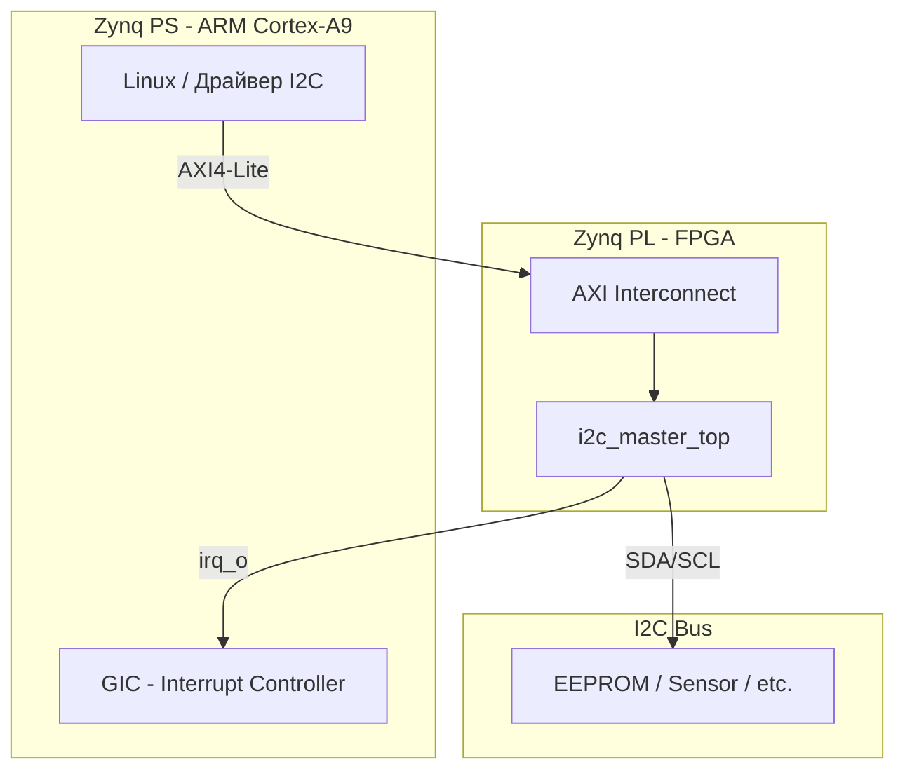

# Интеграция I2C Master Controller в Xilinx Zynq

## Обзор

Данный документ описывает интеграцию IP-ядра `i2c_master_top` в FPGA-часть (PL) Xilinx Zynq SoC и подготовку к написанию Linux-драйвера.

## Архитектура интеграции



## Шаги интеграции в Vivado

### 1. Добавление IP-ядра

1. Создать Vivado проект для целевой платы Zynq
2. Открыть Block Design
3. Добавить RTL-файлы как IP: `rtl/i2c_master_core.v`, `rtl/i2c_master_axi.v`, `rtl/i2c_master_top.v`
4. Либо создать собственный IP через **Tools → Create and Package New IP**

### 2. Подключение в Block Design

```
Zynq PS → AXI Interconnect → i2c_master_axi (или i2c_master_top)
                                    ↓
                              SDA/SCL → IOBUF → Pins
                              irq_o → concat → GIC
```

**При использовании `i2c_master_axi` напрямую (без top-обёртки):**
- Подключить `scl_pad_i`, `scl_pad_o`, `scl_padoen_o` к IOBUF для SCL
- Аналогично для SDA
- Это предпочтительный вариант для Vivado block design

**При использовании `i2c_master_top`:**
- `sda_io` и `scl_io` — порты типа `inout`, подключить напрямую к пинам

### 3. Назначение адреса

В **Address Editor** Vivado назначить базовый адрес AXI-регистрам контроллера. Рекомендуемое пространство: 4 КБ (минимум 32 байта).

Пример:
```
Base Address: 0x43C0_0000
Address Range: 4K
```

### 4. Подключение прерывания

1. Добавить блок **Concat** (xlconcat)
2. Подключить `irq_o` к одному из входов Concat
3. Подключить выход Concat к `IRQ_F2P` порту Zynq PS

### 5. Назначение пинов

В файле ограничений (`.xdc`):

```tcl
# I2C SDA
set_property PACKAGE_PIN <pin> [get_ports sda_io]
set_property IOSTANDARD LVCMOS33 [get_ports sda_io]
set_property PULLUP true [get_ports sda_io]

# I2C SCL
set_property PACKAGE_PIN <pin> [get_ports scl_io]
set_property IOSTANDARD LVCMOS33 [get_ports scl_io]
set_property PULLUP true [get_ports scl_io]
```

**Замечание:** внутренние pull-up FPGA (~50 кОм) могут быть недостаточны для I2C. Рекомендуется использовать внешние pull-up резисторы 2.2–4.7 кОм.

### 6. Параметры модуля

| Параметр | По умолчанию | Описание |
|----------|-------------|----------|
| `C_S_AXI_DATA_WIDTH` | 32 | Ширина данных AXI (не менять) |
| `C_S_AXI_ADDR_WIDTH` | 5 | Ширина адреса AXI (7 регистров × 4 = 28 байт) |
| `DEFAULT_PRESCALE` | 249 | Значение PRESCALE по умолчанию после сброса |

## Подготовка к Linux-драйверу

### Device Tree Overlay

```dts
/dts-v1/;
/plugin/;

/ {
    fragment@0 {
        target-path = "/amba";
        __overlay__ {
            i2c_master: i2c@43c00000 {
                compatible = "custom,i2c-master-axi";
                reg = <0x43c00000 0x1000>;
                interrupts = <0 29 4>;  /* SPI #29, level-high */
                interrupt-parent = <&intc>;
                clocks = <&clkc 15>;    /* FCLK_CLK0 */
                clock-frequency = <100000>;
                #address-cells = <1>;
                #size-cells = <0>;

                /* I2C devices on the bus */
                eeprom@50 {
                    compatible = "atmel,24c02";
                    reg = <0x50>;
                };
            };
        };
    };
};
```

### Структура Linux-драйвера

Рекомендуемая реализация — platform driver, реализующий `struct i2c_adapter`:

```
drivers/i2c/busses/i2c-master-axi.c
```

Основные функции:
1. `probe()` — инициализация: чтение DT, ioremap, настройка прескалера, регистрация adapter
2. `xfer()` — передача I2C сообщений (реализация `i2c_algorithm.master_xfer`)
3. `irq_handler()` — обработка прерываний (DONE, AL)
4. `remove()` — выключение контроллера, освобождение ресурсов

### Доступ из userspace (без драйвера)

Для быстрого тестирования можно использовать `/dev/mem` (требует root):

```c
#include <fcntl.h>
#include <sys/mman.h>

#define BASE 0x43C00000
#define MAP_SIZE 0x1000

int fd = open("/dev/mem", O_RDWR | O_SYNC);
volatile uint32_t *regs = mmap(NULL, MAP_SIZE,
    PROT_READ | PROT_WRITE, MAP_SHARED, fd, BASE);

// Настройка
regs[0x14/4] = 249;   // PRESCALE: 100 кГц
regs[0x00/4] = 0x03;  // EN=1, IEN=1

// Запись в slave 0x50, адрес 0x10, данные 0xAB
regs[0x0C/4] = 0xA0;        // TX_DATA: addr + W
regs[0x08/4] = 0x09;        // CMD: STA + WR
while (regs[0x04/4] & 1);   // Ждём TIP=0

regs[0x0C/4] = 0x10;        // TX_DATA: reg addr
regs[0x08/4] = 0x08;        // CMD: WR
while (regs[0x04/4] & 1);

regs[0x0C/4] = 0xAB;        // TX_DATA: data
regs[0x08/4] = 0x0A;        // CMD: WR + STO
while (regs[0x04/4] & 1);

munmap((void *)regs, MAP_SIZE);
close(fd);
```

## Рекомендации

1. **Pull-up резисторы:** обязательно использовать внешние 2.2–4.7 кОм на SDA и SCL
2. **Уровни напряжения:** убедиться в совместимости LVCMOS3.3/1.8 между FPGA и slave-устройствами
3. **PRESCALE:** настраивать в соответствии с реальной частотой FCLK_CLK0
4. **Прерывания:** номер SPI (Shared Peripheral Interrupt) зависит от подключения к `IRQ_F2P`
5. **Тестирование:** начать с /dev/mem доступа, затем перейти к полноценному Linux-драйверу
