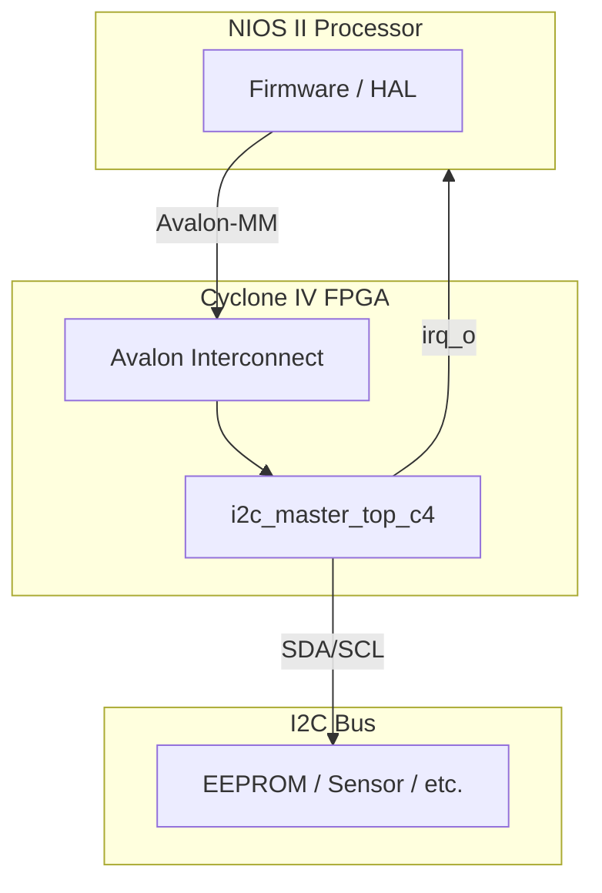

# Интеграция I2C Master Controller в Intel Cyclone IV

## Обзор

Данный документ описывает интеграцию IP-ядра `i2c_master_top_c4` (Avalon-MM вариант) в FPGA Intel Cyclone IV для работы с NIOS II или прямого управления.

## Архитектура интеграции



## Шаги интеграции в Quartus / Platform Designer

### 1. Добавление RTL файлов

Добавить в проект Quartus:
- `rtl/i2c_master_core.v`
- `rtl/i2c_master_avalon.v`
- `rtl/i2c_master_top_c4.v` (опционально, для tri-state на уровне top)

### 2. Создание компонента в Platform Designer (Qsys)

Для интеграции с NIOS II создайте Avalon-MM Slave компонент:

**Интерфейсы:**
| Имя | Тип | Описание |
|-----|-----|----------|
| clock | Clock Input | Тактовый сигнал |
| reset | Reset Input | Активный низкий сброс |
| avalon_slave | Avalon-MM Slave | Регистры управления |
| irq | Interrupt Sender | Прерывание |
| conduit_sda | Conduit | SDA pad (export) |
| conduit_scl | Conduit | SCL pad (export) |

**Параметры Avalon-MM Slave:**
| Параметр | Значение |
|----------|----------|
| Address Width | 3 (word-addressed) |
| Data Width | 32 |
| Read Latency | 0 |
| Wait States | 0 |

**При использовании `i2c_master_avalon` напрямую:**
- Экспортировать `scl_pad_i`, `scl_pad_o`, `scl_padoen_o` как conduit
- Аналогично для SDA
- В top-level подключить к IOBUF/ALT_IOBUF

**При использовании `i2c_master_top_c4`:**
- Экспортировать `sda_io`, `scl_io` как bidirectional conduit

### 3. Назначение пинов

В файле `.qsf` или Pin Planner:

```tcl
set_location_assignment PIN_XX -to sda_io
set_location_assignment PIN_YY -to scl_io

set_instance_assignment -name IO_STANDARD "3.3-V LVCMOS" -to sda_io
set_instance_assignment -name IO_STANDARD "3.3-V LVCMOS" -to scl_io
set_instance_assignment -name WEAK_PULL_UP_RESISTOR ON -to sda_io
set_instance_assignment -name WEAK_PULL_UP_RESISTOR ON -to scl_io
```

**Замечание:** Cyclone IV поддерживает внутренние pull-up (~25 кОм), но для надёжной работы I2C шины рекомендуются внешние pull-up 2.2–4.7 кОм.

### 4. Прескалер для Cyclone IV

Типичные тактовые частоты Cyclone IV:

| Clk | PRESCALE | SCL |
|-----|----------|-----|
| 50 МГц | 124 (0x7C) | 100 кГц |
| 50 МГц | 31 (0x1F) | 400 кГц |
| 100 МГц | 249 (0xF9) | 100 кГц |

Формула: `SCL = clk / (4 × (PRESCALE + 1))`

Параметр `DEFAULT_PRESCALE` в `i2c_master_top_c4` установлен в 124 (100 кГц при 50 МГц).

## Программирование из NIOS II (HAL)

### Определение регистров

```c
#include "system.h"
#include "io.h"

#define I2C_BASE  I2C_MASTER_0_BASE  // Из system.h

#define I2C_CTRL      (I2C_BASE + 0x00)
#define I2C_STATUS    (I2C_BASE + 0x04)
#define I2C_CMD       (I2C_BASE + 0x08)
#define I2C_TX_DATA   (I2C_BASE + 0x0C)
#define I2C_RX_DATA   (I2C_BASE + 0x10)
#define I2C_PRESCALE  (I2C_BASE + 0x14)
#define I2C_ISR       (I2C_BASE + 0x18)

#define CMD_STA   0x01
#define CMD_STO   0x02
#define CMD_RD    0x04
#define CMD_WR    0x08
#define CMD_NACK  0x10

#define STATUS_TIP    0x01
#define STATUS_RXACK  0x02
#define STATUS_BUSY   0x04
#define STATUS_AL     0x08
```

### Инициализация

```c
void i2c_init(int prescale) {
    IOWR_32DIRECT(I2C_CTRL, 0, 0x00);       // Выключить
    IOWR_32DIRECT(I2C_PRESCALE, 0, prescale);
    IOWR_32DIRECT(I2C_CTRL, 0, 0x03);       // EN=1, IEN=1
}
```

### Запись байта

```c
int i2c_write_byte(uint8_t slave_addr, uint8_t reg, uint8_t data) {
    // Адрес slave (write)
    IOWR_32DIRECT(I2C_TX_DATA, 0, (slave_addr << 1) | 0);
    IOWR_32DIRECT(I2C_CMD, 0, CMD_STA | CMD_WR);
    while (IORD_32DIRECT(I2C_STATUS, 0) & STATUS_TIP);
    if (IORD_32DIRECT(I2C_STATUS, 0) & STATUS_RXACK) return -1; // NACK

    // Адрес регистра
    IOWR_32DIRECT(I2C_TX_DATA, 0, reg);
    IOWR_32DIRECT(I2C_CMD, 0, CMD_WR);
    while (IORD_32DIRECT(I2C_STATUS, 0) & STATUS_TIP);

    // Данные + STOP
    IOWR_32DIRECT(I2C_TX_DATA, 0, data);
    IOWR_32DIRECT(I2C_CMD, 0, CMD_WR | CMD_STO);
    while (IORD_32DIRECT(I2C_STATUS, 0) & STATUS_TIP);

    return 0;
}
```

### Чтение байта

```c
int i2c_read_byte(uint8_t slave_addr, uint8_t reg, uint8_t *data) {
    // Адрес slave (write) + регистр
    IOWR_32DIRECT(I2C_TX_DATA, 0, (slave_addr << 1) | 0);
    IOWR_32DIRECT(I2C_CMD, 0, CMD_STA | CMD_WR);
    while (IORD_32DIRECT(I2C_STATUS, 0) & STATUS_TIP);
    if (IORD_32DIRECT(I2C_STATUS, 0) & STATUS_RXACK) return -1;

    IOWR_32DIRECT(I2C_TX_DATA, 0, reg);
    IOWR_32DIRECT(I2C_CMD, 0, CMD_WR);
    while (IORD_32DIRECT(I2C_STATUS, 0) & STATUS_TIP);

    // Repeated START + адрес slave (read)
    IOWR_32DIRECT(I2C_TX_DATA, 0, (slave_addr << 1) | 1);
    IOWR_32DIRECT(I2C_CMD, 0, CMD_STA | CMD_WR);
    while (IORD_32DIRECT(I2C_STATUS, 0) & STATUS_TIP);
    if (IORD_32DIRECT(I2C_STATUS, 0) & STATUS_RXACK) return -1;

    // Чтение + NACK + STOP
    IOWR_32DIRECT(I2C_CMD, 0, CMD_RD | CMD_NACK | CMD_STO);
    while (IORD_32DIRECT(I2C_STATUS, 0) & STATUS_TIP);

    *data = IORD_32DIRECT(I2C_RX_DATA, 0) & 0xFF;
    return 0;
}
```

## Отличия от AXI (Zynq) варианта

| Аспект | Zynq (main) | Cyclone IV (cyclone4) |
|--------|-------------|----------------------|
| Шинный интерфейс | AXI4-Lite | Avalon-MM |
| Top-level | `i2c_master_top.v` | `i2c_master_top_c4.v` |
| Обёртка | `i2c_master_axi.v` | `i2c_master_avalon.v` |
| Адресация | Байтовая (5-bit) | Пословная (3-bit) |
| I2C ядро | `i2c_master_core.v` — **общее** | `i2c_master_core.v` — **общее** |
| Карта регистров | Идентичная | Идентичная |
| Прескалер по умолч. | 249 (100M→100k) | 124 (50M→100k) |
| Процессор | ARM Cortex-A9 | NIOS II |

## Рекомендации

1. **Pull-up:** обязательно внешние 2.2–4.7 кОм на SDA/SCL
2. **Voltage levels:** Cyclone IV поддерживает 3.3V, 2.5V, 1.8V LVCMOS — выбрать совместимый с I2C slave
3. **Clock:** использовать стабильный тактовый сигнал от PLL
4. **NIOS II:** для interrupt-driven подхода настроить IRQ в HAL BSP settings
5. **Тестирование:** начать с polling-режима, затем перейти на прерывания
