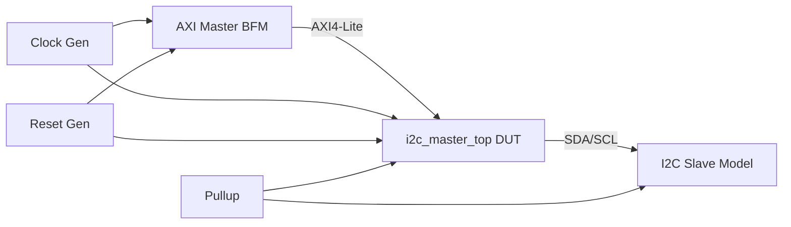

# План тестирования I2C Master Controller

## Тестовое окружение



### Компоненты

| Компонент | Файл | Описание |
|-----------|------|----------|
| DUT | `rtl/i2c_master_top.v` | Тестируемый модуль |
| AXI BFM | `tb/axi_lite_master_bfm.sv` | Эмулятор AXI4-Lite master |
| I2C Slave | `tb/i2c_slave_model.sv` | Модель I2C slave (EEPROM-like, 256 байт) |
| Testbench | `tb/i2c_master_tb.sv` | Главный тестбенч со сценариями |

### Параметры симуляции

| Параметр | Значение | Описание |
|----------|----------|----------|
| CLK_PERIOD | 10 нс | 100 МГц системный тактовый сигнал |
| PRESCALE | 4 | Ускоренный прескалер для симуляции |
| SLAVE_ADDR | 0x50 | 7-битный адрес I2C slave |
| Watchdog | 50 мс | Таймаут на зависание |

## Тестовые сценарии

### TEST 0: Проверка чтения регистров

**Цель:** Убедиться, что AXI4-Lite интерфейс корректно возвращает значения регистров.

**Шаги:**
1. Прочитать PRESCALE после сброса
2. Сравнить с ожидаемым значением DEFAULT_PRESCALE

**Критерий:** PRESCALE read-back совпадает.

### TEST 1: Запись и чтение одного байта

**Цель:** Базовая проверка записи данных в slave и обратного чтения.

**Шаги:**
1. Записать 0xA5 по адресу 0x10 в slave 0x50
2. Прочитать байт из того же адреса
3. Сравнить

**Критерий:** Прочитанное значение == 0xA5.

### TEST 2: Запись и чтение нескольких байт

**Цель:** Убедиться в работе множественных транзакций подряд.

**Шаги:**
1. Записать 0xDE → адрес 0x20
2. Записать 0xAD → адрес 0x21
3. Прочитать оба обратно

**Критерий:** mem[0x20] == 0xDE, mem[0x21] == 0xAD.

### TEST 3: NACK на неверный адрес

**Цель:** Проверка обработки NACK при обращении к несуществующему slave.

**Шаги:**
1. Отправить START + адрес 0x3F (не совпадает с 0x50)
2. Проверить STATUS.RXACK
3. Отправить STOP для освобождения шины

**Критерий:** STATUS.RXACK == 1 (NACK).

### TEST 4: Проверка прерываний

**Цель:** Убедиться в работе флагов ISR.

**Шаги:**
1. Очистить ISR записью 0x03
2. Убедиться ISR == 0
3. Выполнить запись в slave
4. Проверить ISR.DONE_IRQ == 1

**Критерий:** Флаг DONE устанавливается после завершения транзакции.

### TEST 5: Транзакции подряд (back-to-back)

**Цель:** Проверка корректности при отсутствии пауз между транзакциями.

**Шаги:**
1. Записать 0x55 → адрес 0x40 (без паузы)
2. Сразу прочитать из адреса 0x40

**Критерий:** Чтение возвращает 0x55.

### TEST 6: Восстановление после сброса

**Цель:** Убедиться, что контроллер работает после аппаратного сброса.

**Шаги:**
1. Активировать сброс на 10 тактов
2. Снять сброс, заново настроить контроллер
3. Выполнить запись/чтение

**Критерий:** Данные корректно записываются и читаются после сброса.

### TEST 7: Изменение прескалера

**Цель:** Убедиться в работоспособности при разных значениях PRESCALE.

**Шаги:**
1. Выключить контроллер (EN=0)
2. Изменить PRESCALE на 2 (ускоренный)
3. Включить контроллер
4. Выполнить запись/чтение

**Критерий:** Данные корректны при изменённом прескалере.

## Запуск симуляции

### Предварительные требования

- Icarus Verilog >= 12.0 (`iverilog`, `vvp`)
- Verilator >= 5.0 (для lint-проверки)

### Компиляция и запуск

```bash
# Сборка и запуск
make sim

# Lint-проверка
make lint

# Очистка
make clean
```

### Ручной запуск

```bash
mkdir -p sim
iverilog -g2012 -Wall -o sim/i2c_master_tb.vvp \
    rtl/i2c_master_core.v \
    rtl/i2c_master_axi.v \
    rtl/i2c_master_top.v \
    tb/i2c_slave_model.sv \
    tb/axi_lite_master_bfm.sv \
    tb/i2c_master_tb.sv
cd sim && vvp i2c_master_tb.vvp
```

### Просмотр осциллограмм

```bash
gtkwave sim/i2c_master_tb.vcd
```

## Метрики покрытия

| Категория | Охват |
|-----------|-------|
| Базовые операции (Write/Read) | ✅ |
| Multi-byte транзакции | ✅ |
| NACK обработка | ✅ |
| Прерывания (DONE) | ✅ |
| Back-to-back транзакции | ✅ |
| Сброс и восстановление | ✅ |
| Разные значения прескалера | ✅ |
| Clock stretching | ⬜ (планируется) |
| Потеря арбитража | ⬜ (планируется) |
| Multimaster | ⬜ (планируется) |
| Bus error recovery | ⬜ (планируется) |

## Планы расширения тестов

- Тест clock stretching с параметром `CLOCK_STRETCH_EN=1` в slave-модели
- Тест потери арбитража с двумя master-экземплярами
- Тест bus error (неожиданный START/STOP)
- Stress-тест: 1000+ последовательных транзакций
- Тест всех граничных значений PRESCALE (0, 0xFFFF)
